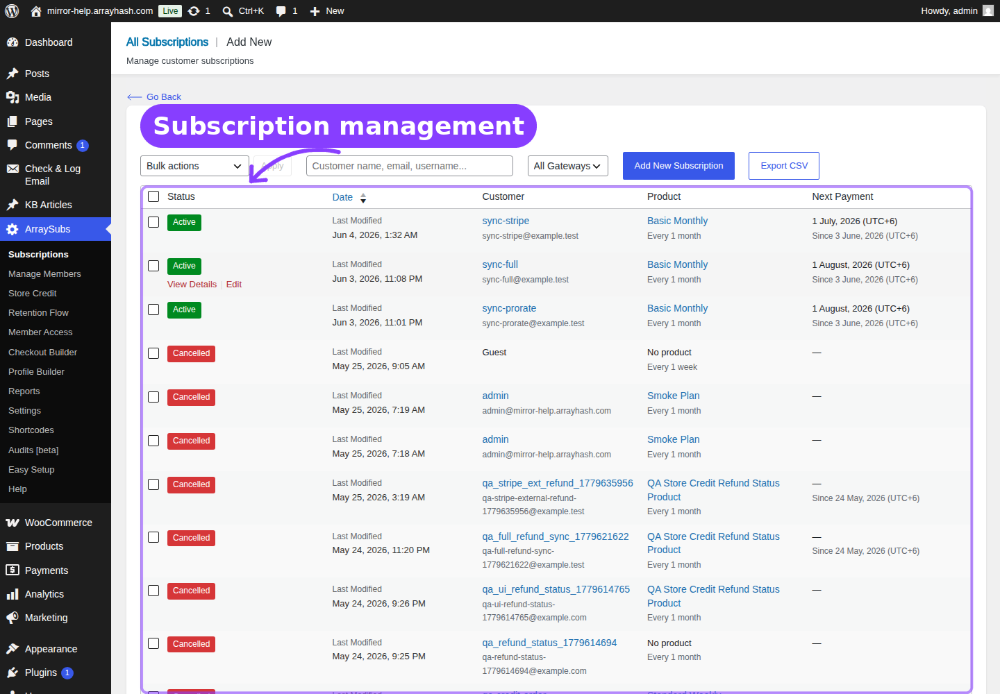

# Info
- Module: User Manual Hub
- Availability: Shared
- Last updated: 2026-04-02

# ArraySubs User Manual

Welcome to the ArraySubs user manual — the complete guide to running a subscription store with WooCommerce.

<section class="docs-support-card" aria-labelledby="homepage-support-title">
  <h2 id="homepage-support-title">Bugs And Feature Requests</h2>
  
If you find a bug or need a feature added, contact me directly at <a href="mailto:emran@arrayhash.com">emran@arrayhash.com</a>. Include the manual page URL, a screenshot if helpful, and what you expected to happen.

  

    <a href="https://arrayhash.com/deals/arraysubs">Product Page</a>
    <a href="https://arrayhash.com/deals/arraysubs/use-cases">Use Cases</a>
    <a href="https://arrayhash.com/deals/arraysubs/features">Features</a>
    <a href="https://arrayhash.com/deals/arraysubs/alternatives">Alternatives</a>
  

</section>

## Start Here

- **New store setup:** [Before You Launch](getting-started/before-you-launch.md) → [Easy Setup Wizard](getting-started/easy-setup-wizard.md) → [First-Time Setup](getting-started/first-time-setup.md)
- **Daily admin work:** [Subscription Operations](manage-subscriptions/subscription-operations.md) → [Subscription Detail Cards](manage-subscriptions/subscription-detail-cards.md) → [Lifecycle Management](manage-subscriptions/lifecycle-management.md)
- **Customer self-service:** [Customer Portal Pages](customer-portal/portal-pages.md) → [Subscription Self-Service Actions](customer-portal/self-service-actions.md)
- **Paid automation:** [Automatic Payments Overview](checkout-and-payments/automatic-payments/README.md) → [Stripe](checkout-and-payments/automatic-payments/stripe.md) → [Gateway Health Dashboard](checkout-and-payments/automatic-payments/gateway-health-dashboard.md)
- **Access and memberships:** [Member Access Overview](member-access/README.md) → [Access Rules](member-access/access-rules.md) → [Feature Manager](feature-manager/README.md) *(Pro)*
- **Toolkit modules:** [Toolkit](toolkit/README.md) → [Admin Dashboard Access](toolkit/admin-dashboard-access.md) → [Login as User](toolkit/login-as-user.md) → [Multi-Login Prevention](toolkit/multi-login-prevention.md) *(Pro)*
- **Troubleshooting:** [Audits, Logs, and Troubleshooting](audits-and-logs/README.md)

## Admin Screen Map

Most ArraySubs work happens in WordPress Admin under **ArraySubs**:

## Page Navigation

- **Manual home:** Start here for the complete ArraySubs and ArraySubsPro documentation map.
- **First setup path:** [Before You Launch](getting-started/before-you-launch.md) -> [Easy Setup Wizard](getting-started/easy-setup-wizard.md) -> [First-Time Setup](getting-started/first-time-setup.md)
- **Daily admin path:** [Subscription Operations](manage-subscriptions/subscription-operations.md) -> [Subscription Detail Cards](manage-subscriptions/subscription-detail-cards.md) -> [Lifecycle Management](manage-subscriptions/lifecycle-management.md)
- **Troubleshooting path:** [Audits, Logs, and Troubleshooting](audits-and-logs/README.md)

| Admin Path | Use It For | Related Guide |
|---|---|---|
| **ArraySubs → Subscriptions** | Search, filter, create, export, edit, and open subscription records | [Subscription Operations](manage-subscriptions/subscription-operations.md) |
| **ArraySubs → Store Credit** *(Pro)* | Manage balances, adjustments, and transaction history | [Store Credit Management](store-credit/store-credit-management.md) |
| **ArraySubs → Retention Flow** | Configure cancellation reasons and save-the-sale offers | [Cancellation Setup](retention-and-refunds/cancellation-setup.md) |
| **ArraySubs → Member Access** | Build role, URL, post type, discount, ecommerce, and download access rules | [Member Access Overview](member-access/README.md) |
| **ArraySubs → Checkout Builder** *(Pro)* | Design custom subscription checkout fields and steps | [Checkout Builder Overview](checkout-and-payments/checkout-builder/README.md) |
| **ArraySubs → Profile Builder** | Configure custom profile fields and My Account navigation | [Profile Builder](profile-builder/README.md) |
| **ArraySubs → Reports** | Review subscription reporting entry points | [Reports Hub](analytics/reports-hub.md) |
| **ArraySubs → Settings** | Configure global subscription, toolkit, plan switching, refund, skip/pause, and feature settings | [General Settings](settings/general-settings.md) |
| **ArraySubs → Settings → Toolkit** | Hide customer-facing WordPress clutter, restrict dashboard access, route login pages, impersonate customers, and limit account sharing | [Toolkit](toolkit/README.md) |
| **ArraySubs → Audits [beta]** *(Pro)* | Diagnose activity, scheduled jobs, gateway events, renewals, portal actions, and access conflicts | [Audits and Logs](audits-and-logs/README.md) |
| **ArraySubs → Easy Setup** | Launch the guided setup wizard or import/export settings | [Easy Setup Wizard](getting-started/easy-setup-wizard.md) |

Each rewritten page starts with **Page Navigation** so you can jump directly to the screen, related setup guide, and next troubleshooting page.

## Getting Started

New to ArraySubs? Start here.

- [Before You Launch](getting-started/before-you-launch.md) — Requirements, core concepts, subscription statuses, and the Free vs Pro feature map.
- [First-Time Setup](getting-started/first-time-setup.md) — Install the plugins, create your first subscription product, place a test order, and verify the customer portal.
- [Essential Daily Workflows](getting-started/essential-daily-workflows.md) — How the subscription lifecycle works, where merchants manage everything, and what to check before going live.

## Settings

Configure store-wide subscription behavior and administration tools.

- [General Settings](settings/general-settings.md) — Subscription cart rules, checkout and trial behavior, grace periods, email reminder timing, customer portal, customer actions, cancellation timing, and automatic-payment controls.
- [Toolkit Settings](settings/toolkit-settings.md) — Field-by-field settings reference for the Toolkit screen.

## Toolkit

Small controls with large operational impact: keep customers out of WordPress admin surfaces, route login traffic through the storefront, support customers by impersonating their session, and reduce credential sharing.

- [Overview](toolkit/README.md) — Toolkit module map, setup order, and multi-screen visual guide.
- [Admin Bar Visibility](toolkit/admin-bar.md) — Hide the WordPress frontend toolbar for customers.
- [Admin Dashboard Access](toolkit/admin-dashboard-access.md) — Redirect unauthorized users away from `/wp-admin`.
- [WordPress Login Page](toolkit/wordpress-login-page.md) — Send customer login traffic to WooCommerce My Account.
- [Login as User](toolkit/login-as-user.md) — Impersonate non-admin customers for support and verification.
- [Multi-Login Prevention](toolkit/multi-login-prevention.md) *(Pro)* — Limit concurrent sessions per account.

## Manage Subscription Products

Create, configure, and manage subscription products in WooCommerce.

- [Overview](subscription-products/README.md) — Section overview and quick reference.
- [Create and Configure Subscription Products](subscription-products/create-and-configure.md) — Simple and variable products, billing periods, trials, signup fees, and different renewal pricing.
- [Plan Switching and Product Relationships](subscription-products/plan-switching-and-relationships.md) — Upgrade, downgrade, and crossgrade paths, auto-downgrade, and Fixed Period Membership *(Pro)*.
- [Product Experience and Display](subscription-products/product-experience.md) — Frontend pricing display, Redirect Product Page *(Pro)*, Feature Manager *(Pro)*, and Subscription Shipping *(Pro)*.
- [Coupon Integration](subscription-products/coupon-integration.md) — Subscription coupons with recurring discounts, cycle limits, and initial-checkout counting.
- [Product Lifecycle and Test Links](subscription-products/product-lifecycle.md) — Product deletion, cached data, and quick checkout test links.

## Manage Subscriptions

View, create, edit, and manage every subscription in your store.

- [Overview](manage-subscriptions/README.md) — Section overview and quick reference.
- [Subscription Operations](manage-subscriptions/subscription-operations.md) — All Subscriptions list, creating and editing subscriptions, the detail screen, and CSV export.
- [Admin Tools and Records](manage-subscriptions/admin-tools-and-records.md) — Subscription notes, feature log *(Pro)*, related orders and refund history, and data export.
- [Subscription Detail Cards](manage-subscriptions/subscription-detail-cards.md) — Cancellation, skip & pause, coupon, gateway *(Pro)*, checkout fields *(Pro)*, and shipping *(Pro)* cards.
- [Lifecycle Management](manage-subscriptions/lifecycle-management.md) — Status transitions, renewal flow, grace periods, cancellation, expiration, trials, and email triggers.

## Customer Portal

Your subscribers' self-service hub in the WooCommerce My Account area.

- [Overview](customer-portal/README.md) — Section overview, quick reference tables, and portal page summary.
- [Customer Portal Pages](customer-portal/portal-pages.md) — My Subscriptions list, View Subscription detail, My Features page *(Pro)*, and Store Credit page *(Pro)*.
- [Subscription Self-Service Actions](customer-portal/self-service-actions.md) — Cancel, undo cancel, retention offers, change plan, skip, pause, resume, and reactivate.
- [Payment and Shipping Actions](customer-portal/payment-and-shipping.md) — Payment methods, card on file *(Pro)*, auto-renew toggle *(Pro)*, and shipping address updates.

## Manage Members *(Pro)*

Look up any customer and view their complete subscription and commerce profile from one dashboard.

- [Overview](manage-members/README.md) — All entry points, page layout summary, and prerequisites.
- [Member Lookup and Profiles](manage-members/member-lookup-and-profiles.md) — Search for members, read the profile card, view stats, and use Login as Customer.
- [Member Commerce Overview](manage-members/member-commerce-overview.md) — Subscription history, purchased products, store credit balance, and addresses.
- [Member Operations](manage-members/member-operations.md) — Quick links to related screens, admin shortcuts across WordPress and WooCommerce, and insight metrics.

## Store Credit *(Pro)*

A complete virtual-wallet system — customers earn credit from refunds, downgrades, promotions, and purchases, then spend it on renewals and new orders.

- [Overview](store-credit/README.md) — How Store Credit works, credit sources, customer experience, and system architecture.
- [Store Credit Management](store-credit/store-credit-management.md) — Search customers, view balances, add or deduct credit, and review transaction histories.
- [Credit History](store-credit/credit-history.md) — Global transaction log with source and type filtering.
- [Store Credit Settings](store-credit/store-credit-settings.md) — Enable/disable, auto-apply rules, expiration periods, and credit purchase limits.
- [Purchase Product](store-credit/purchase-product.md) — Create a WooCommerce product for selling credit with fixed or custom amounts and bonus incentives.
- [Emails](store-credit/emails.md) — Credit Added, Credit Used, Credit Expiring, and Credit Expired notifications.
- [Refund to Credit](store-credit/refund-to-credit.md) — Process refunds as store credit from the WooCommerce order screen.

## Advanced Analytics *(Pro)*

Track subscription revenue, growth, churn, and customer behavior — from a dedicated performance dashboard to subscription-aware WooCommerce reports.

- [Overview](analytics/README.md) — Order type classification, section map, and prerequisites.
- [Subscription Performance Dashboard](analytics/subscription-performance.md) — 10 KPI cards, 6 time-series charts, and 5 leaderboards on the WooCommerce Analytics Overview page.
- [WooCommerce Analytics Extension](analytics/woocommerce-analytics-extension.md) — Type column, type filters, subscription revenue cards, subscription-only filters, and member links across 5 WC Analytics reports.
- [Order List Enhancements](analytics/order-list-enhancements.md) — Type and coupon columns, filter dropdowns, embedded report panel, and order type backfill on the WooCommerce Orders page.

## Emails and Notifications

Automated emails for every subscription lifecycle event — configure, customize, and troubleshoot the full notification system.

- [Email Overview](emails/README.md) — How ArraySubs emails work, WooCommerce integration, placeholder reference, template overrides, and reminder scheduling.
- [Customer Emails](emails/customer-emails.md) — 17 customer-facing emails: new subscription, trials, renewals, payments, status changes, auto-downgrade, retention, card expiry, and gateway verification.
- [Admin Emails](emails/admin-emails.md) — 4 admin notifications: new subscription, payment failed, scheduled cancellation, and subscription cancelled.
- [Store Credit Emails](emails/store-credit-emails.md) *(Pro)* — 4 credit balance emails: added, used, expiring, and expired.

## Profile Builder and My Account Customization

Collect custom profile data, manage avatars, and customize the My Account navigation.

- [Overview](profile-builder/README.md) — What's included, where to find it, and quick start steps.
- [Profile Form](profile-builder/profile-form.md) — Custom profile fields, avatar upload settings, field types, and where data appears on customer and admin screens.
- [My Account Editor](profile-builder/my-account-editor.md) — Reorder, rename, hide menu items, and add custom endpoint pages to the WooCommerce My Account area.

## Shortcodes

Use shortcodes to display login/logout links, personalized greetings, gated content, and store credit purchase forms anywhere on your site.

- [Overview](shortcodes/README.md) — Quick reference for all shortcodes and the admin catalog page.
- [Account Shortcodes](shortcodes/account-shortcodes.md) — `[arraysubs_login]`, `[arraysubs_logout]`, `[arraysubs_user]` for login links and personalized display.
- [Content Gating Shortcodes](shortcodes/content-gating.md) — `[arraysubs_visibility]` and `[arraysubs_restrict]` for login-based and subscription-based content control.
- [Store Credit Shortcode](shortcodes/store-credit-shortcode.md) *(Pro)* — `[arraysubs_buy_credits]` purchase form for store credits.

## Feature Manager *(Pro)*

Define named product entitlements — features, limits, and capabilities — so customers always know what their subscription includes.

- [Overview](feature-manager/README.md) — What Feature Manager does, how it works, prerequisites, and section navigation.
- [Defining Product Features](feature-manager/defining-product-features.md) — Add, edit, reorder, and template features on simple and variable products.
- [Customer and Storefront Display](feature-manager/customer-and-storefront-display.md) — "What's Included" product page section, My Features customer page, admin Feature Log, usage tracking, and aggregation modes.
- [Feature Manager Settings](feature-manager/feature-manager-settings.md) — Every setting: enable/disable, display toggles, usage visibility, aggregation mode, and feature comparison.

## Member Access and Restriction Rules

Control who can access what across your site — gate content, restrict products, assign roles, offer member discounts, manage downloads, and enforce session limits.

- [Overview](member-access/README.md) — How Member Access works, rule types, condition system, and section navigation.
- [Access Rules](member-access/access-rules.md) — Role Mapping, URL Rules, and Post Type (CPT) Rules for controlling page, post, and role access.
- [Commerce and Benefit Rules](member-access/commerce-and-benefit-rules.md) — Discount Rules, Ecommerce Rules, and Download Rules for member pricing, product restrictions, and file access.
- [Content Restriction](member-access/content-restriction.md) — Drip-schedule access, content gating messages, per-post restrictions, defaults, and cache compatibility.
- [Session and Frontend Controls](member-access/session-and-frontend-controls.md) — Login Limit *(Pro)*, `[arraysubs_restrict]` shortcode, `[arraysubs_visibility]` shortcode, and pause-state behavior.
- [Real-World Use Cases](member-access/use-cases.md) — 17 practical examples: course dripping, VIP discounts, wholesale stores, tiered roles, URL gating, streaming limits, and more.

## Checkout and Payments

Everything about how subscriptions are purchased, billed, and collected — from the checkout page through recurring payment processing.

- [Overview](checkout-and-payments/README.md) — Section overview, prerequisites, and quick reference.
- [Subscription Checkout](checkout-and-payments/subscription-checkout.md) — Cart rules, one-click checkout, trial handling, plan switching at checkout, and subscription creation.
- [Automatic Payments Overview](checkout-and-payments/automatic-payments/README.md) *(Pro)* — Gateway architecture, billing models, webhook pipeline, and capability comparison.
- [Stripe](checkout-and-payments/automatic-payments/stripe.md) *(Pro)* — Setup, PaymentIntents, SCA/3DS, card auto-update, and dispute handling.
- [PayPal](checkout-and-payments/automatic-payments/paypal.md) *(Pro)* — Billing Agreements, Smart Payment Buttons, limitations, and webhook setup.
- [Paddle](checkout-and-payments/automatic-payments/paddle.md) *(Pro)* — Merchant of Record, catalog sync, native pause, automatic tax, and webhook setup.
- [Auto-Renew and Manual Fallback](checkout-and-payments/automatic-payments/auto-renew-and-manual-fallback.md) *(Pro)* — Customer toggle, manual invoice collection, and payment method requirements.
- [Gateway Health Dashboard](checkout-and-payments/automatic-payments/gateway-health-dashboard.md) *(Pro)* — Gateway status cards, webhook event log, and troubleshooting.
- [Checkout Builder Overview](checkout-and-payments/checkout-builder/README.md) *(Pro)* — Builder interface, multi-step checkout, sections, design panel, data flow, and settings.
- [Field Types Reference](checkout-and-payments/checkout-builder/field-types.md) *(Pro)* — All 27 field types: standard, advanced, and layout elements.
- [Checkout Builder Use Cases](checkout-and-payments/checkout-builder/use-cases.md) *(Pro)* — 18 real-world examples: subscription boxes, SaaS, gyms, wine clubs, B2B, nonprofits, and more.

## Billing and Renewals

How ArraySubs creates, schedules, and collects recurring payments — from the first invoice to the final renewal.

- [Overview](billing-and-renewals/README.md) — How the billing engine works, background jobs, billing cycle summary, and key concepts.
- [Renewal Operations](billing-and-renewals/renewal-operations.md) — Invoice generation, manual vs automatic payment routing, different renewal pricing, and subscription expiration.
- [Trial Management](billing-and-renewals/trial-management.md) — Trial start, conversion to paid, first renewal calculation, auto-downgrade on trial expiry *(Pro)*, and trial settings.
- [Recovery and Grace Flows](billing-and-renewals/recovery-and-grace-flows.md) — Two-phase grace period, overdue detection, skip and pause interaction with billing, and payment recovery.
- [Renewal Communication](billing-and-renewals/renewal-communication.md) — Renewal reminders, invoice emails, payment confirmations, failure alerts, and on-hold notifications.

## Retention, Cancellation, and Refunds

Reduce churn with targeted retention offers, configure cancellation policies, track retention analytics, and manage refund workflows.

- [Overview](retention-and-refunds/README.md) — How the retention system works, the multi-step cancellation flow, and section navigation.
- [Cancellation Setup](retention-and-refunds/cancellation-setup.md) — Immediate vs end-of-period cancellation, cancellation reasons, and the Retention Flow admin page.
- [Retention Offers](retention-and-refunds/retention-offers.md) — Discount, Pause, Downgrade, and Contact Support offers — configuration, trigger reasons, eligibility, and the customer modal flow.
- [Retention Use Cases](retention-and-refunds/retention-use-cases.md) — 18 real-life scenarios showing how subscription businesses use retention offers to save revenue and reduce churn.
- [Retention Analytics](retention-and-refunds/retention-analytics.md) — Summary of the analytics dashboard and how it connects to your retention configuration. Full guide in the [Analytics section](analytics/retention-analytics.md).
- [Refund Management](retention-and-refunds/refund-management.md) — Refund policies, prorated refunds, gateway refunds, full refund subscription behavior, and refund-to-store-credit *(Pro)*.

## Audits, Logs, and Troubleshooting

Track every subscription action, monitor scheduled jobs and gateway health, and diagnose common problems.

- [Overview](audits-and-logs/README.md) — Section overview and navigation.
- [Activity Audits](audits-and-logs/activity-audits.md) *(Pro)* — Searchable, filterable log of every action across the subscription lifecycle.
- [Scheduled-Job Logs](audits-and-logs/scheduled-job-logs.md) *(Pro)* — Execution history for all Action Scheduler jobs with success/failure status.
- [Gateway Health Dashboard](audits-and-logs/gateway-health-dashboard.md) *(Pro)* — Gateway status cards, subscription counts, capabilities, and webhook event log.
- [Renewal Failures and Billing Issues](audits-and-logs/renewal-failures.md) — Diagnose missing invoices, failed payments, grace period behavior, and automatic cancellation.
- [Portal Action Failures](audits-and-logs/portal-action-failures.md) — Troubleshoot cancellation, pause, skip, plan switch, and reactivation errors.
- [Access-Rule Conflicts](audits-and-logs/access-rule-conflicts.md) — Resolve overlapping membership rules and content restriction problems.
- [Payment Method and Shipping Update Issues](audits-and-logs/payment-and-shipping-issues.md) — Fix auto-renew toggle, card update, gateway detach, and shipping address errors.
