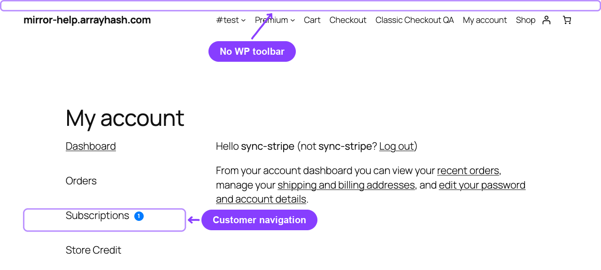
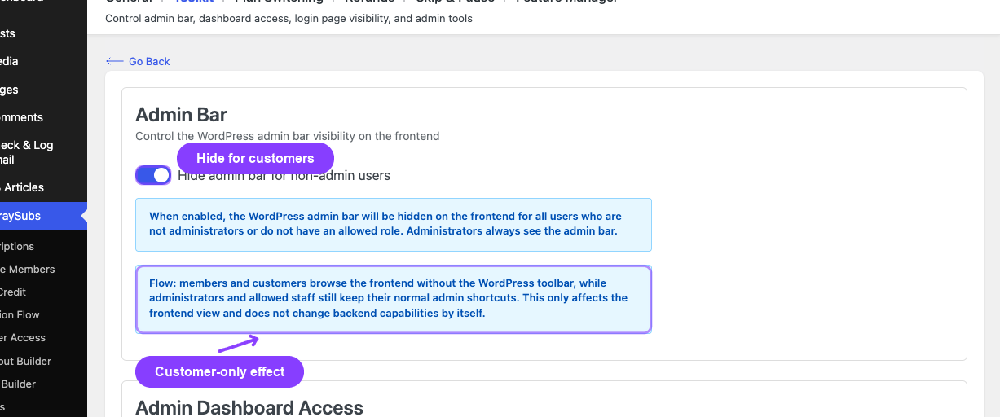
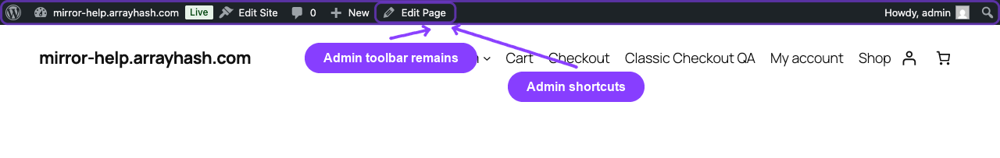

# Info
- Module: Admin Bar Visibility
- Availability: Free
- Last updated: 2026-06-07

# Admin Bar Visibility

> Hide the WordPress frontend toolbar for customers while keeping normal admin shortcuts for administrators.

**Availability:** Free

## Page Navigation

- **Current guide:** Admin Bar Visibility
- **Where to open it:** WordPress Admin -> ArraySubs -> Settings -> Toolkit
- **Direct route:** `/wp-admin/admin.php?page=arraysubs-mainadmin#/settings/toolkit`
- **Section overview:** [Manual Home](../README.md)
- **Previous guide:** [Toolkit Settings](../settings/toolkit-settings.md)
- **Next guide:** [Admin Dashboard Access](../admin-dashboard-access/README.md)
- **Troubleshooting:** [Audits, Logs, and Troubleshooting](../audits-and-logs/README.md)

## What This Tool Does

**Hide admin bar for non-admin users** removes the WordPress toolbar from frontend pages for users who are not administrators. Customers get a cleaner storefront and portal experience, while administrators still see their normal WordPress toolbar.

This is a presentation control, not a permission system. A customer can still try to visit `/wp-admin` directly unless [Admin Dashboard Access](../admin-dashboard-access/README.md) is also configured.

## When to Use This

- Your members see the black WordPress toolbar after logging in.
- Your storefront should look like a branded customer portal, not a WordPress admin session.
- You want support staff and administrators to keep toolbar shortcuts while customers do not see them.

## How to Configure It

1. Go to **ArraySubs -> Settings -> Toolkit**.
2. In **Admin Bar**, turn on **Hide admin bar for non-admin users**.
3. Click **Save Settings**.
4. Open the storefront as a customer and confirm the toolbar is gone.
5. Open the storefront as an administrator and confirm the toolbar still appears.

## Settings Reference

| Setting | Default | Type | Notes |
|---|---|---|---|
| Hide admin bar for non-admin users | Off | Toggle | Applies to frontend pages for non-admin users |

## Important Notes

- Administrators always keep the toolbar.
- This does not block direct `/wp-admin` access.
- This does not change user roles or capabilities.
- Use it with [Admin Dashboard Access](../admin-dashboard-access/README.md) for a complete customer-facing cleanup.

## Related Guides

- [Admin Dashboard Access](../admin-dashboard-access/README.md) — Redirect customers away from `/wp-admin`.
- [WordPress Login Page](../wordpress-login-page/README.md) — Route customer login traffic through WooCommerce My Account.
