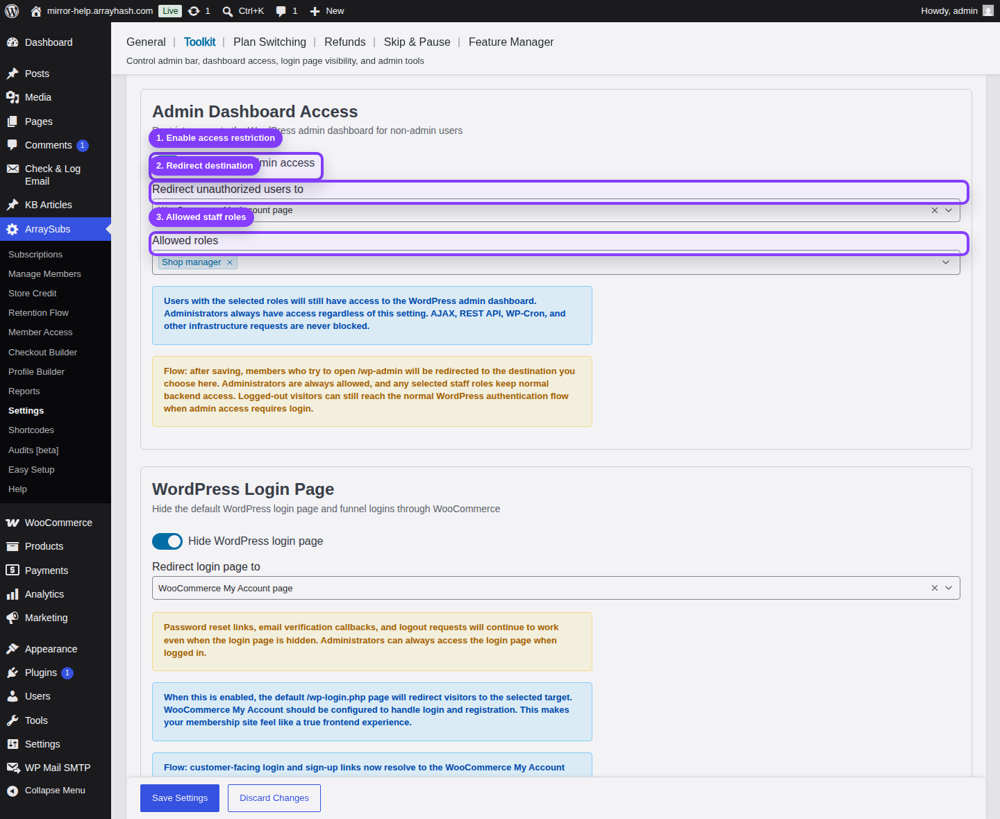

# Info
- Module: Admin Dashboard Access
- Availability: Free
- Last updated: 2026-06-07

# Admin Dashboard Access

> Restrict direct WordPress dashboard access for customers while preserving backend access for administrators and selected staff roles.

**Availability:** Free

## Page Navigation

- **Current guide:** Admin Dashboard Access
- **Where to open it:** WordPress Admin -> ArraySubs -> Settings -> Toolkit
- **Direct route:** `/wp-admin/admin.php?page=arraysubs-mainadmin#/settings/toolkit`
- **Section overview:** [Manual Home](../README.md)
- **Previous guide:** [Admin Bar Visibility](../admin-bar-visibility/README.md)
- **Next guide:** [WordPress Login Page](../wordpress-login-page/README.md)
- **Troubleshooting:** [Audits, Logs, and Troubleshooting](../audits-and-logs/README.md)

## Visual Guide

## What This Tool Does

**Restrict wp-admin access** stops customers and other unauthorized users from browsing the WordPress admin dashboard. When they visit `/wp-admin`, ArraySubs redirects them to your selected destination.

Administrators are always allowed. You can also allow staff roles such as Shop Manager by adding them to **Allowed roles**.

## When to Use This

- Customers can log in successfully but should stay in WooCommerce My Account.
- You want subscribers redirected away from `/wp-admin`.
- Your staff needs backend access, but regular members should not see the dashboard.
- You are building a membership, course, SaaS, community, or digital product site where customers should only use frontend account pages.

## How to Configure It

1. Go to **ArraySubs -> Settings -> Toolkit**.
2. Turn on **Restrict wp-admin access**.
3. Choose **Redirect unauthorized users to**:
   - **WooCommerce My Account page** for a normal customer flow.
   - **404 Not Found page** when you want the admin route to look unavailable.
4. Add any non-admin staff roles to **Allowed roles**.
5. Click **Save Settings**.
6. Test with a customer account in a separate browser session.

## Settings Reference

| Setting | Default | Type | Notes |
|---|---|---|---|
| Restrict wp-admin access | Off | Toggle | Enables the dashboard restriction |
| Redirect unauthorized users to | WooCommerce My Account page | Dropdown | Appears when restriction is on |
| Allowed roles | None | Multi-select | Administrators are always allowed and do not need to be selected |

## What Is Never Blocked

- WordPress AJAX requests.
- REST API calls.
- WP-Cron requests.
- Action Scheduler background processing.
- Administrator access.

## Testing Checklist

1. Log in as a customer.
2. Visit `/wp-admin`.
3. Confirm the browser redirects to the destination you selected.
4. Log in as an administrator.
5. Visit `/wp-admin`.
6. Confirm the dashboard still opens normally.
7. If you selected a staff role, test that role separately.

## Troubleshooting

| Problem | Likely Cause | What to Do |
|---|---|---|
| Customer still reaches `/wp-admin` | The setting is off, or their role is allowed | Check the toggle and the Allowed roles field |
| Shop Manager is blocked | Shop Manager is not selected | Add Shop Manager to Allowed roles and save |
| Redirect lands on the wrong page | Redirect destination is set differently than expected | Reopen Toolkit and check the dropdown |

## Related Guides

- [Admin Bar Visibility](../admin-bar-visibility/README.md) — Hide the frontend toolbar.
- [WordPress Login Page](../wordpress-login-page/README.md) — Redirect default login and registration URLs.
- [Member Access Overview](../member-access/README.md) — Restrict content, products, discounts, and downloads.
