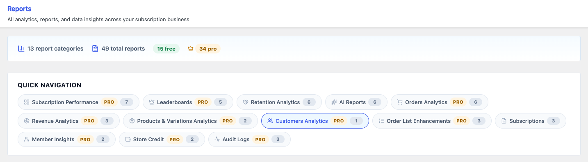
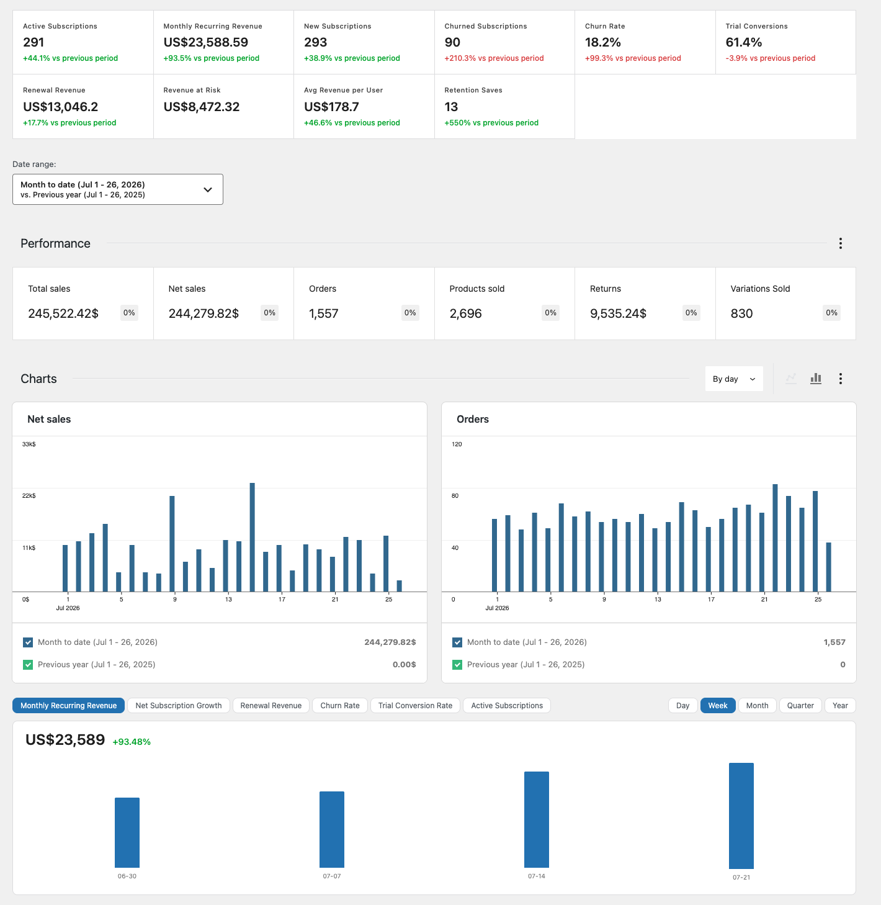
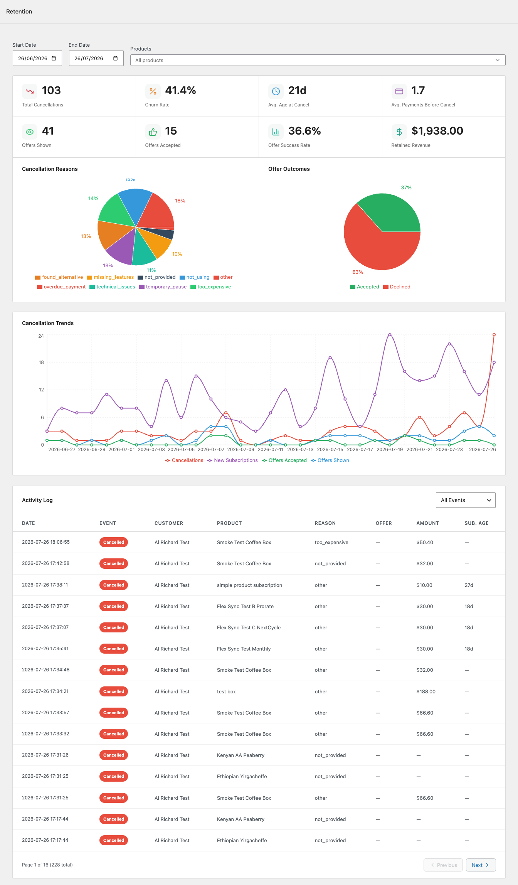
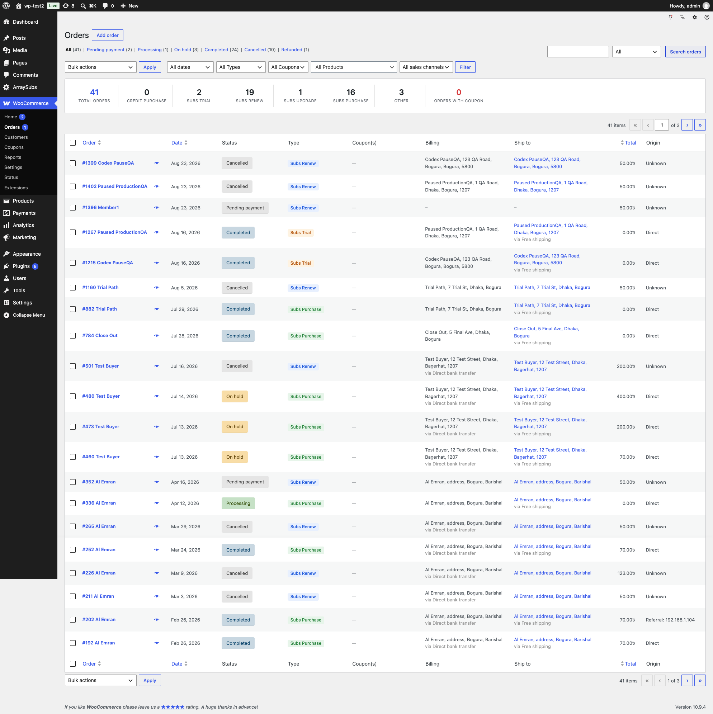

# Info
- Module: Analytics & Reports
- Availability: Shared (Free + Pro)
- Last updated: 2026-08-31

# Analytics & Reports

> Track subscription revenue, growth, churn, retention, and customer behavior across a central Reports hub, two AI-assisted reports, and extended WooCommerce Analytics screens.

## Overview

ArraySubs gives you analytics at three levels:

1. **Reports Hub** (Free) — A central directory page inside the ArraySubs admin that links to the reports and data screens in the ecosystem, organized by category.
2. **AI Reports** (Free) — Two reports under WooCommerce Analytics that score churn risk per subscriber and project recurring revenue forward, each with an optional AI-written analysis layer.
3. **Advanced Analytics** (Pro) — A full subscription performance dashboard and extended WooCommerce Analytics reports with subscription-specific filters, columns, and metrics.

Together they answer the questions every subscription merchant asks daily:

- How much recurring revenue am I earning?
- Are subscriptions growing or shrinking?
- Which products drive the most renewals?
- How many trials convert to paid?
- Where is revenue at risk — and *which* subscribers is it sitting in?
- Why are customers cancelling?
- Are retention offers working?
- Where will recurring revenue be in six, twelve, or twenty-four months?

The analytics ecosystem has seven major surfaces:

| Surface | Where it appears | Availability | What it shows |
|---------|-----------------|-------------|---------------|
| [Reports Hub](reports-hub.md) | ArraySubs → Reports | Free | Central directory of 40+ report links organized into 13 categories |
| [Subscription Performance Dashboard](subscription-performance.md) | WooCommerce → Analytics → Overview | Pro | 10 KPI cards, 6 time-series charts, 5 leaderboards |
| [Retention Analytics](../retention-analytics/README.md) | WooCommerce → Analytics → Retention | Pro | Churn/retention KPIs, reason charts, offer effectiveness, trend analysis |
| [AI Churn Analysis](ai-churn-analysis.md) | WooCommerce → Analytics → Churn Analysis | Free | Per-subscriber churn risk scores and bands, revenue at risk, AI reasons and recommended actions |
| [AI Revenue Forecast](ai-revenue-forecast.md) | WooCommerce → Analytics → Revenue Forecast | Free | MRR/ARR snapshot, 12 months of collected revenue, subscriber movement, billing mix, AI projection |
| [WooCommerce Analytics Extension](woocommerce-analytics-extension.md) | WooCommerce → Analytics → Orders / Revenue / Products / Variations / Customers | Pro | Type column, type filters, subscription revenue cards, subscription-only filters, subscription status column and filter, member links |
| [Order List Enhancements](order-list-enhancements.md) | WooCommerce → Orders | Pro | Type and coupon columns, type/coupon filters, AJAX product search, subscription-only shortcut, embedded report panel, order type backfill |







### Looking Back vs Looking Forward

These three reports under WooCommerce Analytics are designed to be read together (Retention Analytics requires Pro):

| Report | Time frame | Question it answers |
|--------|-----------|--------------------|
| [Retention Analytics](../retention-analytics/README.md) | Past | Who already left, why, and did the save offer work? |
| [AI Churn Analysis](ai-churn-analysis.md) | Present | Who is about to leave, and what should I do about each one? |
| [AI Revenue Forecast](ai-revenue-forecast.md) | Future | Where does recurring revenue land if nothing changes? |

```box class="info-box"
Both AI reports run on the **AI connector built into WordPress** — configure a provider once under **Settings → Connectors** and there is no separate API key setting inside ArraySubs to manage. Every figure on both reports is calculated from your own store data and stays available with no AI provider configured at all; only the written analysis needs one.
```

The Pro analytics surfaces share a unified **order type classification system** that automatically labels every WooCommerce order as one of six subscription-related types.

## Order Type Classification

Every order that passes through the store is automatically classified into one of six types. This classification powers the filters, columns, and metrics across all analytics surfaces.



## Page Navigation

- **Current guide:** Analytics & Reports
- **Where to open it:** WordPress Admin -> ArraySubs -> Reports and WooCommerce -> Analytics
- **Section overview:** [Open overview](../README.md)
- **Previous guide:** [AI Revenue Forecast](./ai-revenue-forecast.md)
- **Next guide:** [Reports Hub](./reports-hub.md)
- **Troubleshooting:** [Audits, Logs, and Troubleshooting](../audits-and-logs/README.md)

| Type | Label | When assigned |
|------|-------|---------------|
| `Credit Purchase` | Credit Purchase | Order contains at least one Store Credit product |
| `Subs Trial` | Subs Trial | Initial subscription order where the subscription has a trial period |
| `Subs Renew` | Subs Renew | Renewal order created by the billing engine |
| `Subs Upgrade` | Subs Upgrade | Plan switch order (upgrade, downgrade, or crossgrade) |
| `Subs Purchase` | Subs Purchase | Initial subscription purchase with no trial |
| `Other` | Other | Regular WooCommerce order with no subscription involvement |

Types are resolved in **priority order** — if an order qualifies as both a credit purchase and a subscription order, `Credit Purchase` wins.

The classification is stored as order meta (`_arraysubs_computed_type`) and recomputed whenever an order is created, updated, or paid. A second flag (`_arraysubs_has_subscription_product`) marks whether the order contains any subscription product, regardless of type. On the WooCommerce Orders page, the searchable **All Products** control can filter by any product or variation, while **Subscription Products Only** uses that flag to select the entire subscription-product group at once.

```box class="info-box"
The **Subs Trial** classification is permanent. Even after a trial converts to an active paid subscription, the original order keeps its Subs Trial label because it uses the immutable `_trial_end_date` meta rather than the subscription's current status.
```

## Prerequisites

- **ArraySubs** (free) for the Reports Hub, AI Churn Analysis, and AI Revenue Forecast
- **ArraySubs Pro** for Retention Analytics, the Subscription Performance Dashboard, WooCommerce Analytics Extension, and Order List Enhancements
- **WooCommerce** 8.0+ with WooCommerce Admin (included by default)
- At least one subscription product and a few orders to populate metrics
- **Optional, for the AI layer on the two AI reports:** an AI provider connector configured under **Settings → Connectors**

## What's in This Section

- [Reports Hub](reports-hub.md) — The central directory page that links to the reports in the ArraySubs ecosystem.
- [Subscription Performance Dashboard](subscription-performance.md) *(Pro)* — The overview page with KPI cards, charts, and leaderboards.
- [Retention Analytics](../retention-analytics/README.md) *(Pro)* — Churn rate, retention effectiveness, cancellation reasons, and trend charts.
- [AI Churn Analysis](ai-churn-analysis.md) — Per-subscriber churn risk scoring, revenue at risk, and AI-written reasons and next steps.
- [AI Revenue Forecast](ai-revenue-forecast.md) — MRR and ARR measurement, revenue and subscriber history, and an AI projection with a conservative-to-optimistic range.
- [WooCommerce Analytics Extension](woocommerce-analytics-extension.md) *(Pro)* — How the Orders, Revenue, Products, Variations, and Customers reports gain subscription data, including the Subscription Status column and filter on Customers.
- [Order List Enhancements](order-list-enhancements.md) *(Pro)* — Columns, type/coupon filters, searchable product filtering, the subscription-only shortcut, and the summary panel on the WooCommerce Orders page.

---

## Related Guides

- [AI Churn Analysis](ai-churn-analysis.md) — Which subscribers are at risk right now and what to do about each one.
- [AI Revenue Forecast](ai-revenue-forecast.md) — Where recurring revenue lands over the next 6, 12, or 24 months.
- [Lifecycle Management](../manage-subscriptions/lifecycle-management.md) — Status transitions that drive churn and renewal metrics.
- [Admin Tools and Records](../manage-subscriptions/admin-tools-and-records.md) — Subscription export and related orders.
- [Store Credit Management](../store-credit/store-credit-management.md) — Credit purchase orders that appear in analytics.
- [Member Lookup and Profiles](../member-insight/member-lookup-and-profiles.md) — The member detail page linked from the Customers report.
- [General Settings](../settings/general-settings.md) — Grace periods and renewal timing that affect billing metrics.
- [Audits & Logs](../audits-and-logs/README.md) — Scheduled job logs, activity audits, and failure diagnostics.

---

## FAQ

### Do I need to do anything to start seeing analytics data?
The **Reports Hub**, **AI Churn Analysis**, and **AI Revenue Forecast** are available immediately with the free plugin — no extra setup required. For the Pro analytics surfaces (Retention Analytics, Performance Dashboard, WC Analytics Extension, Order List Enhancements), the module begins classifying orders as soon as the Pro plugin is activated. For orders that existed before activation, use the **Compute Order Types** backfill tool on the WooCommerce Orders page — see [Order List Enhancements](order-list-enhancements.md).

### Do the AI reports require a paid AI subscription?
No. Every score, tile, chart, and table on both AI reports is calculated from your own store data and works with no AI provider configured. A provider only adds the written analysis — the churn narrative and per-subscriber recommendations, and the forward revenue projection. If no provider is set up, each report explains exactly which step is missing and links to the screen that fixes it.

### Which AI providers are supported?
Any provider with a WordPress connector plugin, including the Anthropic, OpenAI, and Google connectors. Configuration happens once under **Settings → Connectors**; ArraySubs has no separate API key field of its own.

### Is customer data sent to the AI provider?
No. Only anonymised, aggregated figures are sent — statuses, scores, tenure in days, payment counts, normalised monthly values, billing cadences, and monthly totals. Customer names, email addresses, billing addresses, and payment details never leave your store.

### Where is the Reports Hub?
Navigate to **ArraySubs → Reports** in your WordPress admin sidebar. It is a free feature and available without the Pro plugin.

### Does this replace WooCommerce Analytics?
No. It extends the existing WooCommerce Analytics screens. All native WooCommerce report features remain available alongside the subscription additions.

### How often is data refreshed?
Performance cards and chart data are cached for **1 hour**. The cache is automatically invalidated whenever a subscription changes status or an order status changes. WooCommerce Analytics report data (Orders, Revenue, etc.) uses WooCommerce's own data store and updates in near real-time.

### What happens if I deactivate the Pro plugin?
The subscription-specific columns, filters, cards, charts, and leaderboards disappear from the analytics screens. The underlying order meta (`_arraysubs_computed_type`) remains on your orders and will be used again if the Pro plugin is reactivated.
