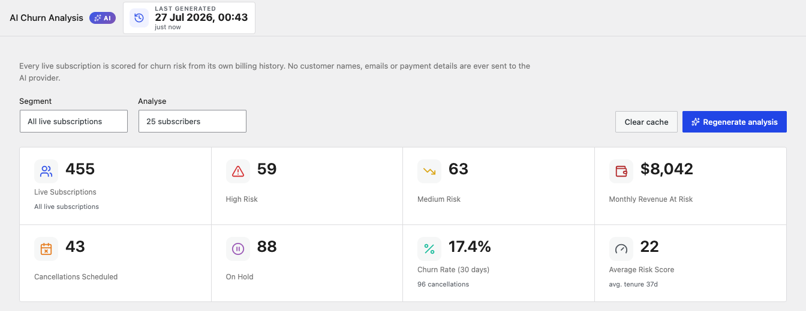
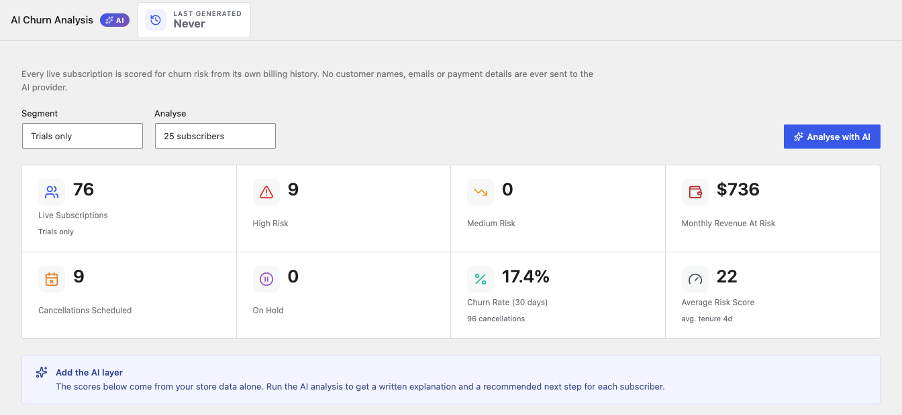
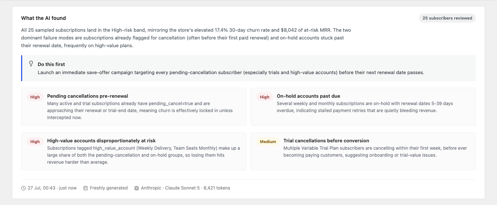
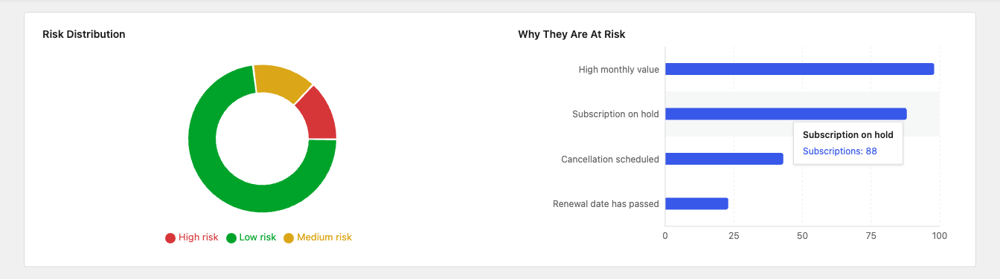
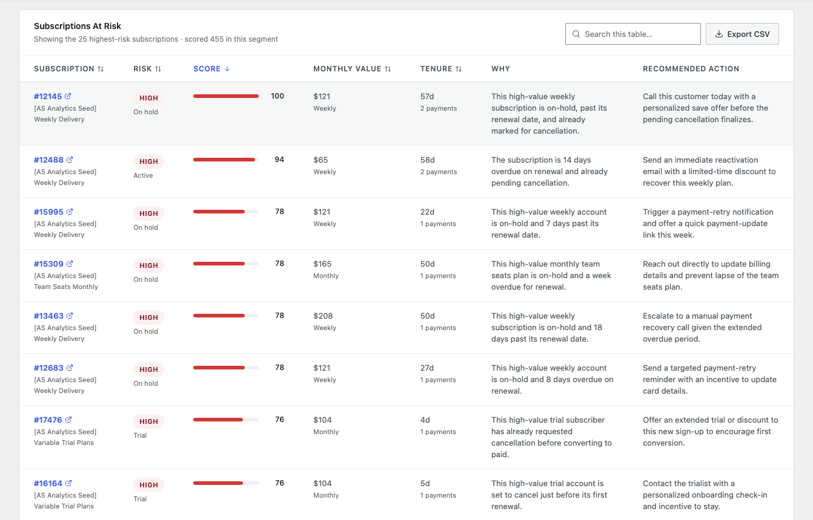
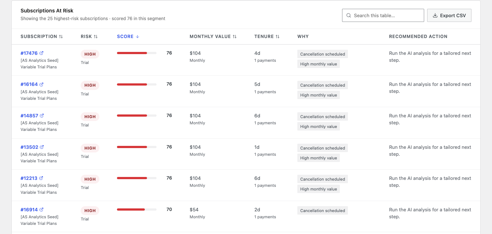
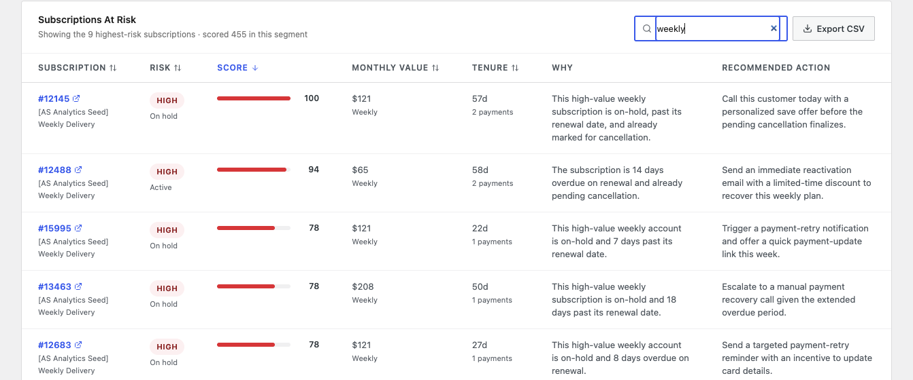
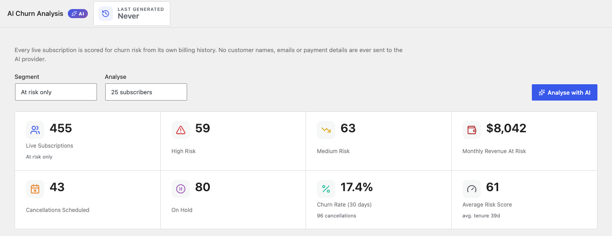
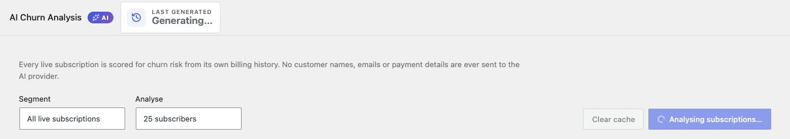
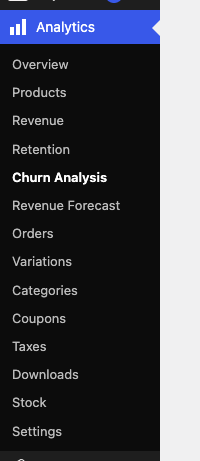

# Info
- Module: AI Churn Analysis
- Availability: Free
- Last updated: 2026-07-27

# AI Churn Analysis

> Score every live subscription for churn risk from its own billing history, then let AI explain why each at-risk subscriber is leaving and what to do about it.

**Availability:** Free

## Page Navigation

- **Current guide:** AI Churn Analysis
- **Where to open it:** WordPress Admin -> WooCommerce -> Analytics -> Churn Analysis, or ArraySubs -> Reports -> AI Reports
- **Direct route:** `/wp-admin/admin.php?page=wc-admin&path=/analytics/arraysubs-ai-churn`
- **Section overview:** [Open overview](./README.md)
- **Previous guide:** [Order List Enhancements](./order-list-enhancements.md)
- **Next guide:** [AI Revenue Forecast](./ai-revenue-forecast.md)
- **Troubleshooting:** [Audits, Logs, and Troubleshooting](../audits-and-logs/README.md)

## Overview

AI Churn Analysis answers a question that raw cancellation counts cannot: **which subscribers are about to leave, and what should I do about each one?**

The report works in two layers:

1. **Risk scoring (always on).** Every live subscription — active, trial, and on-hold — is scored from 0 to 100 using signals drawn from its own billing history: scheduled cancellations, overdue renewals, failed payments, declined save offers, tenure, payment count, and monthly value. This layer needs no AI at all and is calculated entirely from your store's data.
2. **AI explanation (on demand).** When you click **Analyse with AI**, the highest-risk subscriptions are sent to your configured AI provider as anonymised figures. The AI returns a written summary of what is driving churn, the recurring themes it sees, a plain-English reason for each subscriber, and one concrete next step per account.



```box class="info-box"
No customer names, email addresses, or payment details are ever sent to the AI provider. Only anonymised figures — status, score, tenure in days, payment count, monthly value, billing cadence, and the risk signal keys — leave your store.
```

## When to Use This

- Work a save list on Monday morning instead of guessing who to contact.
- Understand *why* churn is rising after a price change, a gateway problem, or a new plan launch.
- Quantify how much monthly revenue is currently sitting in at-risk accounts.
- Hand a support agent a ranked list of accounts with a recommended action already written for each one.
- Sanity-check whether your retention offers are reaching the accounts that actually need them.

## Prerequisites

- **ArraySubs** (free) activated — this report ships in the free plugin.
- **WooCommerce** 8.0+ with WooCommerce Admin.
- At least one live subscription for the scores and tiles to have data.
- **For the AI layer only:** an AI provider connector configured in WordPress. See [Setting Up the AI Provider](#setting-up-the-ai-provider) below.

Everything except the written analysis works with no AI provider configured at all.

## How It Works

### Where the Data Comes From

The report reads directly from your subscription records and their retention event history. It does not depend on any external service, and it does not require the Pro plugin.

The population it scores is every subscription in a **live** status:

| Status | Included | Why |
|--------|----------|-----|
| Active | Yes | The subscribers you can still lose |
| Trial | Yes | The highest-risk group in most stores |
| On hold | Yes | Usually a stalled payment, one step from churn |
| Cancelled / Expired / Pending | No | Already churned or not yet started |

### How the Risk Score Is Built

Every subscription starts at a base score of **12** and each matching signal adds or subtracts points. The result is clamped to 0–100.

**Signals that raise risk:**

| Signal | Points | When it applies |
|--------|-------:|-----------------|
| Cancellation scheduled | +58 | The subscriber has already asked to cancel at period end |
| Subscription on hold | +36 | Status is on-hold, normally a stalled payment |
| Unresolved payment failure | +24 | The last renewal failed and has not been resolved |
| Renewal date has passed | +24 | The next payment date is in the past |
| Trial ending without a payment | +22 | Trial ends within 7 days and no payment has succeeded |
| No successful payment yet | +20 | Older than 30 days, not a trial, still zero payments |
| Payment retries in progress | up to +18 | 6 points per retry attempt |
| Declined a retention offer | up to +22 | 11 points per declined offer |
| Saw a save offer and did not take it | +14 | Offer shown, never accepted or declined |
| Previously scheduled a cancellation | +15 | Cancelled once before and reversed it |
| High monthly value | +6 | Monthly value of 100 or more in store currency |

**Signals that lower risk:**

| Signal | Points | When it applies |
|--------|-------:|-----------------|
| Long payment history | −14 | 6 or more completed payments |
| Billing on schedule | −12 | Active, 2+ payments, no pending cancel, no failure |
| Subscriber for over a year | −10 | Tenure of 365 days or more |
| Reversed an earlier cancellation | −8 | Undid a scheduled cancellation |

A scheduled cancellation on its own is enough to reach the High band. Every other signal has to combine with a second one to get there.

### Risk Bands

| Band | Score | What it means |
|------|-------|---------------|
| **High** | 70–100 | Acting now is the only thing likely to save this subscription |
| **Medium** | 40–69 | Warning signs are present; worth a proactive touch |
| **Low** | 0–39 | Billing normally with no distress signals |

---

## Summary Cards

The tiles across the top summarise the whole selected segment. They are recalculated from live store data on every page load — they are never replayed from a saved analysis.

| Card | What it measures |
|------|-----------------|
| **Live Subscriptions** | Number of subscriptions in the selected segment's statuses, with the segment name underneath |
| **High Risk** | Count scoring 70 or above |
| **Medium Risk** | Count scoring 40–69 |
| **Monthly Revenue At Risk** | Combined monthly value of the High-risk subscriptions |
| **Cancellations Scheduled** | Subscribers who have already asked to cancel at period end |
| **On Hold** | Subscriptions currently in the on-hold status |
| **Churn Rate (30 days)** | Cancellations in the last 30 days as a share of the subscriber base, with the raw cancellation count underneath |
| **Average Risk Score** | Mean score across the segment, with average tenure underneath |

```box class="info-box"
**Monthly Revenue At Risk** normalises every billing cadence to a monthly figure, so a yearly plan contributes one twelfth of its price and a weekly plan contributes roughly four and a third times its price. Lifetime plans contribute nothing, because they generate no recurring revenue to lose.
```

---

## Before Your First Analysis

Until you run an analysis for a segment, the header stamp reads **Never** and a prompt sits where the AI summary will appear. Everything else — tiles, charts, scores, and the ranked table — is already populated from your store data.



---

## What the AI Found

Once an analysis has been generated, a written summary appears above the charts.



The card contains four parts:

| Part | What it gives you |
|------|------------------|
| **Narrative** | A short paragraph describing the shape of churn in this segment |
| **Do this first** | The single highest-leverage action for the whole segment |
| **Themes** | Recurring patterns the AI found, each tagged High, Medium, or Low impact |
| **Footer** | When it ran, whether it was freshly generated or replayed from a saved result, and which provider, model, and token count produced it |

---

## Charts



### Risk Distribution

A donut chart splitting the segment into High (red), Medium (amber), and Low (green) risk. Hover any slice for the exact count and share.

### Why They Are At Risk

A ranked bar chart counting how often each risk-raising signal occurs across the segment. Protective signals are excluded — this chart answers "what is going wrong", not "what is going right". It is the fastest way to see whether your churn is a payments problem, a trial-conversion problem, or a value problem.

---

## Subscriptions At Risk

The table lists the highest-risk subscriptions in the segment, sorted by score.



| Column | What it shows |
|--------|--------------|
| **Subscription** | Subscription number, linking straight to that subscription, with the product name underneath |
| **Risk** | The band as a colour-coded badge, with the current status underneath |
| **Score** | The 0–100 score with a proportional bar |
| **Monthly Value** | Normalised monthly recurring value, with the billing cadence underneath |
| **Tenure** | Days since the subscription started, with the completed payment count underneath |
| **Why** | Plain-English reason this subscriber is at risk |
| **Recommended Action** | One concrete next step for this account |

**Why** and **Recommended Action** are written by the AI. Before you run an analysis, the **Why** column lists the matched risk signals as chips instead, and **Recommended Action** invites you to run the analysis — so the table is fully usable with no provider configured.



### Table Controls

- **Search** — filters the visible rows by subscription number, product, status, or reason text. The row count in the subtitle updates to match.
- **Sort** — click any sortable column header to reorder; the arrow shows the active direction.
- **Export CSV** — downloads exactly what you are looking at, including the AI reasons and actions, ready to hand to a support agent or import into a campaign tool.



---

## Controls

### Segment

Choose which subscriptions to score:

| Option | Scores |
|--------|--------|
| All live subscriptions | Active, trial, and on-hold together (default) |
| Active only | Active subscriptions only |
| Trials only | Trial subscriptions only |
| At risk only | Every live subscription, but the table and AI sample are limited to those already scoring in the Medium or High bands |



```box class="info-box"
**At risk only** filters the table and the AI sample, not the base population. The **Live Subscriptions** tile still counts every live subscription, so you can see the at-risk group in the context of the whole base — the **Average Risk Score** tile is the one that jumps.
```

### Analyse

Chooses how many of the highest-risk subscriptions are sent to the AI: **25**, **50**, or **100**. Scoring always covers the whole segment — this setting only controls the depth of the written analysis. A larger sample costs more tokens and takes longer to generate.

### Analyse with AI / Regenerate analysis

Runs the AI pass. The button label changes to **Regenerate analysis** once a saved result exists. A run typically takes 30–60 seconds; the button and the header stamp both show progress while it works.



### Clear cache

Discards the saved analysis for the current segment and sample size. The tiles, charts, and scores stay — only the written layer is removed.

---

## Saved Analyses and the Last Generated Stamp

Generating an analysis costs time and tokens, so the result is **saved and replayed** rather than regenerated every time you open the page.

- The date and time of the last run appear in bold at the top of the report, with a relative age ("just now", "2 hr ago") underneath.
- Reloading the page, navigating away and back, or returning tomorrow all restore the same written analysis.
- Saved analyses are kept for **6 hours**, then expire on their own.
- Each combination of segment and sample size is saved separately, so switching from *All live subscriptions* to *Trials only* shows that segment's own analysis.
- **Tiles, charts, scores, and the table are always recalculated from current data.** Only the written narrative, themes, reasons, and actions are replayed. This is deliberate — the numbers you see are never stale, even when the prose beside them was written earlier.

```box class="info-box"
Because figures refresh while the narrative is replayed, a saved analysis can quote a slightly different number than the tile beside it if your store data moved since it ran. Click **Regenerate analysis** whenever you want the two to line up exactly.
```

---

## Setting Up the AI Provider

Both AI reports use the **AI connector built into WordPress**, so there is no separate API key field inside ArraySubs to manage. Configure a provider once under **Settings → Connectors** and every AI feature on the site can use it.

If AI is unavailable, the report tells you exactly which step is missing and links straight to the screen that fixes it.


| What the report says | What it means | What to do |
|---------------------|---------------|------------|
| **No AI provider installed** | No connector plugin is present | Install a provider plugin such as the Anthropic, OpenAI, or Google connector |
| **Your AI provider is not active** | The connector plugin is installed but deactivated | Activate it on the Plugins screen |
| **Add your AI provider API key** | The connector is active but has no key | Paste the key under **Settings → Connectors** |
| **AI features are switched off** | AI support is disabled for this site | Re-enable AI support, then reload the report |
| **WordPress is too old for the AI connector** | The bundled AI client is missing | Update WordPress |

Whatever the reason, the notice ends with the same reassurance: every figure on the page is calculated from your own store data and stays available without AI. Only the written analysis needs a connector.

---

## Where to Find It

The report is registered inside the WooCommerce Analytics menu, directly after the Retention report.



It is also listed in the **AI Reports** category of the [Reports Hub](reports-hub.md) at **ArraySubs → Reports**, where the Churn Risk Scoring and AI Churn Narrative & Actions cards both open this report.

---

## Real-Life Use Cases

### Monday Morning Save List

A store owner opens the report, sets the segment to **At risk only**, and exports the CSV. Each row already carries a reason and a recommended action, so a support agent can work down the list making calls without having to open a single subscription record first.

### Diagnosing a Payments Problem

Churn jumps after a gateway update. The **Why They Are At Risk** chart shows "Renewal date has passed" and "Unresolved payment failure" dominating the segment, rather than "Cancellation scheduled". That points at a billing failure, not a value problem — the store owner checks the gateway rather than rewriting the pricing page.

### Protecting Revenue, Not Just Headcount

Two segments have the same High-risk count, but **Monthly Revenue At Risk** is four times higher on one of them. The team works that segment first, because saving ten subscribers there is worth more than saving forty elsewhere.

### Rescuing Trials Before They Lapse

Setting the segment to **Trials only** surfaces trial subscribers whose trial ends within a week with no payment on file. The AI's recommended action for each one is typically a save offer or a payment-method reminder, sent before the trial silently expires.

---

## Edge Cases and Important Notes

- **Scoring is capped at 2,000 subscriptions.** On very large stores the report scores the most recent 2,000 live subscriptions and says so on the page. Tiles and charts describe that scored population.
- **The AI sees a sample, not everyone.** The written layer covers the top 25, 50, or 100 by score. The tiles and charts always describe the whole segment.
- **Signals depend on the data you actually capture.** Declined-offer and offer-shown signals only fire for stores running the [Retention Flow](../retention-and-refunds/cancellation-setup.md). Without it, scoring leans on status, renewal dates, and payment history instead.
- **A high score is not a prediction.** It is a weighted summary of distress signals already present in the record. A subscriber can score 100 and still renew happily.
- **Lifetime plans contribute no monthly value.** They appear in the counts but add nothing to Monthly Revenue At Risk, because there is no recurring revenue to lose.
- **Currency is not converted.** In a multi-currency store, monetary tiles sum the amounts as stored.
- **Regenerating replaces the saved analysis** for that segment and sample size. There is no version history.

---

## Troubleshooting

| Problem | Likely Cause | What to Do |
|---------|--------------|------------|
| The **Analyse with AI** button is greyed out | No AI provider is ready | Follow the setup notice at the top of the report |
| The analysis fails part-way through | The provider rejected the request, or the request timed out | Reduce the **Analyse** sample size and try again; check the key is valid under **Settings → Connectors** |
| The written analysis quotes numbers that differ from the tiles | The analysis was replayed from a saved run while the figures refreshed | Click **Regenerate analysis** |
| Every subscriber scores Low | No distress signals exist in the data — or the retention log is empty | Confirm the Retention Flow is capturing events; a genuinely healthy base really does score Low |
| The table shows signal names instead of written reasons | No analysis has been generated for this segment yet | Click **Analyse with AI** |
| Product names all read "Subscription" | The subscription records have no cached product name and the product was deleted | Nothing to fix on this page; the score and figures are unaffected |

---

## Related Guides

- [AI Revenue Forecast](ai-revenue-forecast.md) — The companion report projecting MRR and ARR forward.
- [Retention Analytics](../retention-analytics/README.md) — What actually happened at cancellation time, including reasons and offer outcomes.
- [Retention Offers](../retention-and-refunds/retention-offers.md) — Configure the save offers this report scores against.
- [Cancellation Setup](../retention-and-refunds/cancellation-setup.md) — Capture the cancellation reasons and events that feed the risk signals.
- [Lifecycle Management](../manage-subscriptions/lifecycle-management.md) — The status transitions behind on-hold and pending-cancel signals.
- [Payment Recovery](../checkout-and-payments/automatic-payments/payment-recovery.md) — Fix the failed renewals this report keeps surfacing.
- [Reports Hub](reports-hub.md) — Central directory of every report in the ecosystem.

---

## FAQ

### Is this a free or Pro feature?
Free. AI Churn Analysis ships in the core ArraySubs plugin — no Pro licence is required.

### Do I need an AI subscription to use this report?
No. Scores, bands, tiles, charts, and the ranked table all work with no AI provider configured. A provider only adds the written explanations and recommended actions.

### What exactly is sent to the AI provider?
Anonymised, aggregated figures only: status, risk score, tenure in days, completed payment count, normalised monthly value, billing cadence, product name, and the matched risk signal keys. Customer names, email addresses, billing addresses, and payment details are never included.

### Which AI providers work?
Any provider with a WordPress connector plugin — Anthropic, OpenAI, and Google connectors are all supported. You configure it once under **Settings → Connectors**, and the report uses whatever is set there.

### Why does the analysis only cover 25 subscribers by default?
To keep runs fast and inexpensive. Raise it to 50 or 100 from the **Analyse** dropdown when you want deeper coverage; the tiles and charts already cover everyone regardless.

### Does the report change my subscriptions in any way?
No. It only reads data. Nothing is cancelled, paused, discounted, or emailed as a result of running an analysis.

### How is the churn rate here different from the Retention report?
This report's churn rate is a rolling 30-day figure over the live subscriber base, shown for quick orientation alongside the risk scores. [Retention Analytics](../retention-analytics/README.md) calculates churn over any date range you choose and breaks it down by reason and offer outcome.

### Can I schedule the analysis to run automatically?
Not currently. Analyses are generated on demand and saved for 6 hours, so opening the report during the day reuses the morning's run rather than re-billing your provider.
