# Info
- Module: AI Revenue Forecast
- Availability: Free
- Last updated: 2026-07-27

# AI Revenue Forecast

> See your current MRR and ARR measured from real orders, then project it forward 6, 12, or 24 months with an AI-written conservative-to-optimistic range, assumptions, risks, and opportunities.

**Availability:** Free

## Page Navigation

- **Current guide:** AI Revenue Forecast
- **Where to open it:** WordPress Admin -> WooCommerce -> Analytics -> Revenue Forecast, or ArraySubs -> Reports -> AI Reports
- **Direct route:** `/wp-admin/admin.php?page=wc-admin&path=/analytics/arraysubs-ai-forecast`
- **Section overview:** [Open overview](./README.md)
- **Previous guide:** [AI Churn Analysis](./ai-churn-analysis.md)
- **Next guide:** [Retention Analytics](../retention-analytics/README.md)
- **Troubleshooting:** [Audits, Logs, and Troubleshooting](../audits-and-logs/README.md)

## Overview

AI Revenue Forecast turns your subscription history into a forward view of recurring revenue. Like [AI Churn Analysis](ai-churn-analysis.md), it works in two layers:

1. **Measurement (always on).** Current MRR and ARR, subscriber counts, twelve months of collected subscription revenue split into renewals and new business, month-by-month subscriber movement, and the billing-cadence mix — all calculated from your own orders and subscriptions.
2. **Projection (on demand).** When you click **Generate forecast**, the anonymised totals are sent to your configured AI provider, which returns a month-by-month projection over your chosen horizon with a conservative-to-optimistic band, a growth outlook, a confidence rating, and written assumptions, risks, and opportunities.

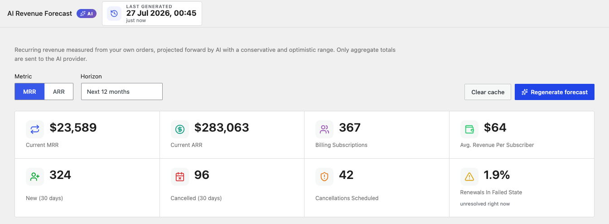

```box class="info-box"
Only aggregate totals are sent to the AI provider — monthly sums, subscriber counts, and cadence splits. No customer names, email addresses, order contents, or payment details ever leave your store.
```

## When to Use This

- Answer "where will recurring revenue be next year if nothing changes?" with a defensible number rather than a guess.
- Set a realistic target before a budget or hiring conversation, using the conservative end of the range rather than the optimistic one.
- Check whether new business is genuinely outpacing churn, month by month.
- See which billing cadences carry your revenue before changing pricing or plan structure.
- Get an outside read on the risks in your own numbers — the AI names what could break the projection.

## Prerequisites

- **ArraySubs** (free) activated — this report ships in the free plugin.
- **WooCommerce** 8.0+ with WooCommerce Admin.
- Some order history for the revenue chart to be meaningful. A store with only a few weeks of data will produce a low-confidence projection, and the report will say so.
- **For the projection only:** an AI provider connector configured in WordPress. See [Setting Up the AI Provider](ai-churn-analysis.md#setting-up-the-ai-provider).

---

## Revenue Snapshot

The tiles summarise where recurring revenue stands right now. They are recalculated on every page load and never replayed from a saved forecast.

| Card | What it measures |
|------|-----------------|
| **Current MRR** | Monthly recurring revenue, with every billing cadence normalised to a monthly figure |
| **Current ARR** | Annual recurring revenue — current MRR multiplied by twelve |
| **Billing Subscriptions** | Subscriptions currently generating recurring revenue — **Active and Trial only** — with a note when lifetime plans are excluded |
| **Avg. Revenue Per Subscriber** | Current MRR divided by billing subscriptions |
| **New (30 days)** | Subscriptions started in the last 30 days |
| **Cancelled (30 days)** | Subscriptions cancelled in the last 30 days |
| **Cancellations Scheduled** | Subscribers who have asked to cancel at period end — revenue already committed to leaving |
| **Renewals In Failed State** | Share of subscriptions sitting on an unresolved renewal failure right now |

```box class="info-box"
**Lifetime plans are excluded from MRR by design.** A one-off lifetime purchase is real revenue, but it is not *recurring* revenue — counting it would inflate MRR permanently and break every projection built on top of it. The Billing Subscriptions card tells you how many lifetime subscribers were left out.
```

```box class="info-box"
**Paused and On Hold subscriptions are excluded from MRR too.** Neither is billing this month, so neither contributes to monthly recurring revenue. They are still counted as live subscribers elsewhere — in the churn denominator and the subscriber movement history — because they have not left. A month with a lot of pausing shows falling MRR without falling subscriber counts, which is exactly the signal you want.
```

### Metric and Horizon

Two controls sit above the tiles:

- **Metric** — switch the projection between **MRR** and **ARR**. The underlying forecast is the same; only the scale changes.
- **Horizon** — project **6**, **12**, or **24** months ahead.

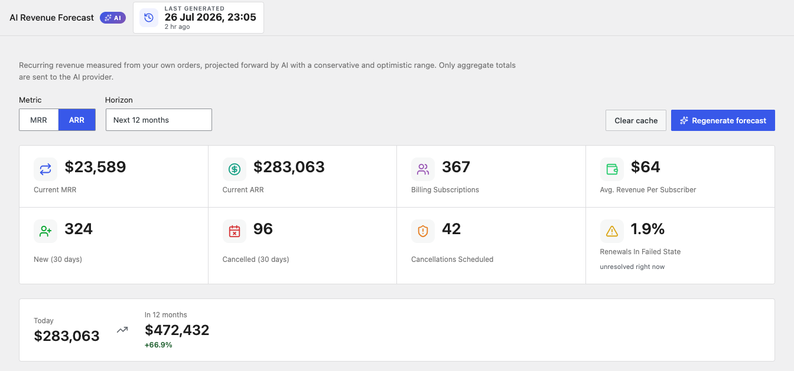

The chart title, legend, and projection strip all follow the metric you pick:

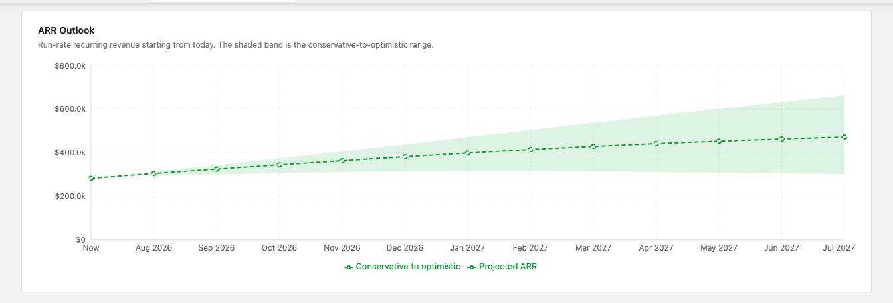

```box class="info-box"
Each **metric and horizon combination is forecast and saved separately.** Switching from MRR to ARR, or from 12 months to 24, shows that combination's own saved projection — or an invitation to generate one if it has never been run.
```

---

## Before Your First Forecast

Until a forecast has been generated for the current metric and horizon, the header stamp reads **Never**, the outlook chart shows *No projection yet*, and a prompt sits below it. Every measured figure — tiles, history charts, and billing mix — is already populated.

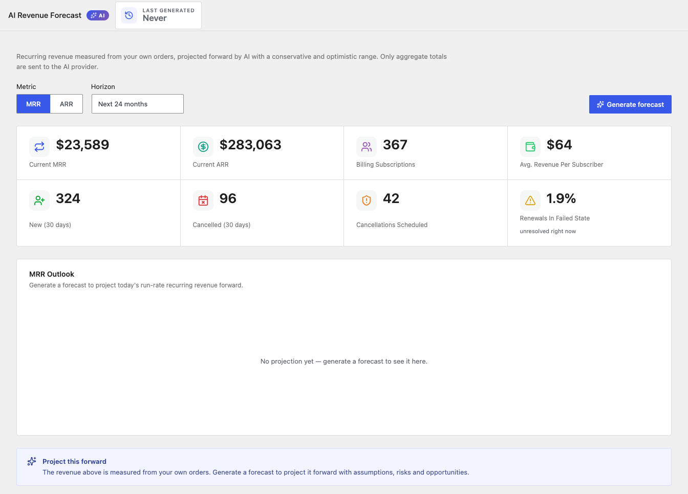

---

## The Projection

Once a forecast has been generated, a summary strip shows where you are today and where the projection lands at the end of the horizon.

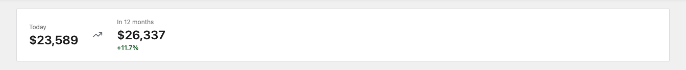

### MRR Outlook Chart

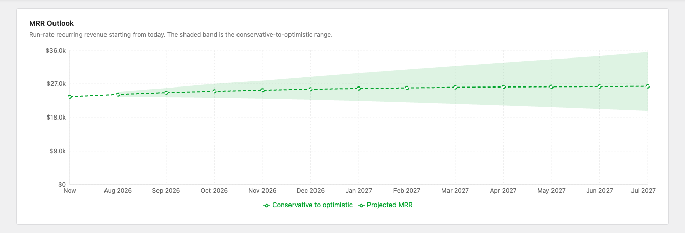

The dashed line is the projected run-rate month by month. The shaded band around it is the **conservative-to-optimistic range** — the AI's own statement of how uncertain it is. A wide band means the data does not support a confident single number; a narrow band means the trend is stable.

The chart starts at **Now**, anchored to today's measured run-rate rather than to the figure that existed when the forecast was generated. That keeps the starting point honest even when you are viewing a saved projection.

```box class="info-box"
Read the conservative end of the band when you are committing to something — a hire, a budget, a loan. Read the optimistic end only when you are sizing an opportunity, never when you are sizing a risk.
```

### What the AI Expects

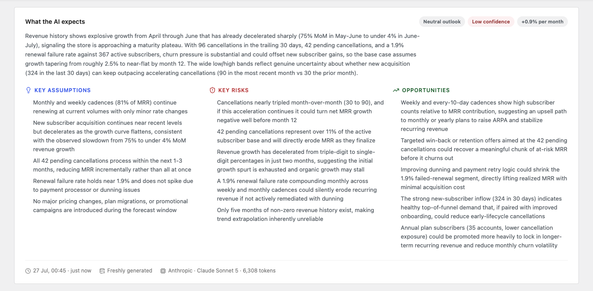

Three badges sit at the top of the card:

| Badge | Values | What it tells you |
|-------|--------|------------------|
| **Outlook** | Positive, Neutral, Negative | The overall direction the AI reads in your numbers |
| **Confidence** | High, Medium, Low | How much the AI trusts the projection — driven mostly by how much history exists |
| **Growth rate** | Percentage per month | The compounding rate underlying the base-case line |

Below the narrative, three columns break the reasoning apart:

- **Key assumptions** — what has to stay true for the projection to hold. Read these first; if one is already false, the number is wrong.
- **Key risks** — what could push you toward the conservative end.
- **Opportunities** — what could push you toward the optimistic end, usually specific to the cadence or cohort mix in your data.

```box class="info-box"
A **Low confidence** badge is not a failure. It usually means your store simply has not accumulated enough months of history yet, and the AI is being honest about that rather than projecting a confident line through noise.
```

---

## History Charts

The two history charts are measured, not projected. They exist to show you what the projection is built on.

### Collected Subscription Revenue

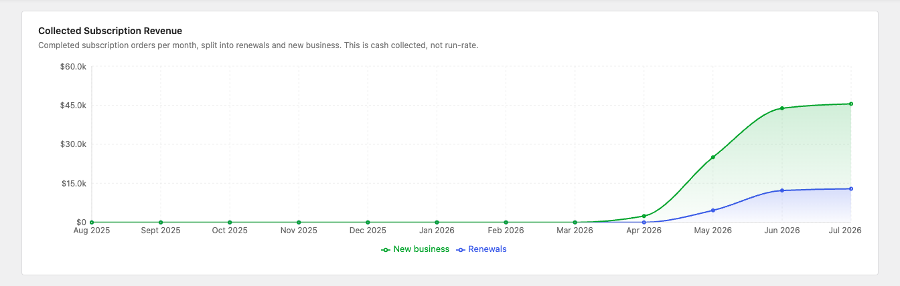

Twelve months of completed subscription orders, split into two series:

| Series | What it counts |
|--------|---------------|
| **Renewals** | Revenue from renewal orders — your recurring base actually converting to cash |
| **New business** | Revenue from first orders on new subscriptions |

This is **cash collected, not run-rate**. It answers "what did we actually bank?" while MRR answers "what are we contracted to bill?". A healthy subscription business shows the renewals series growing steadily even when new business is lumpy.

### Subscriber Movement

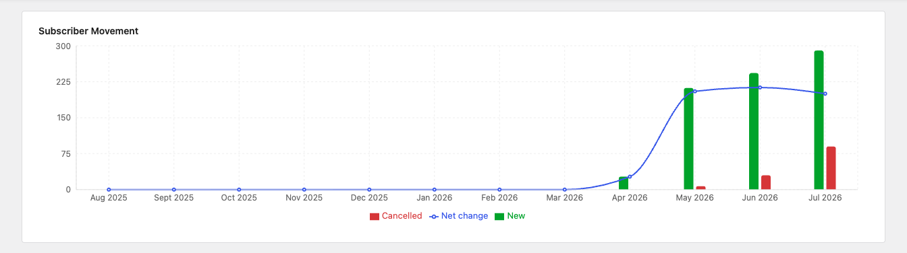

New subscriptions and cancellations per month as bars, with the net change plotted as a line. When the net-change line dips below zero, the base is shrinking regardless of what revenue is doing — usually the earliest warning you will get.

---

## Billing Mix

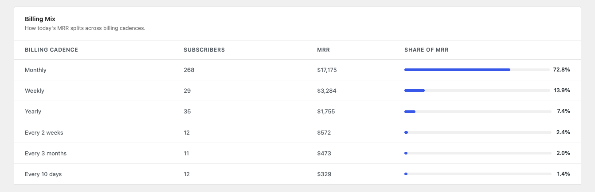

A table showing how today's MRR splits across billing cadences.

| Column | What it shows |
|--------|--------------|
| **Billing cadence** | The billing period and interval, such as Monthly, Weekly, Yearly, or Every 3 months |
| **Subscribers** | How many billing subscriptions use that cadence |
| **MRR** | Normalised monthly contribution from that cadence |
| **Share of MRR** | That cadence's percentage of total MRR, with a proportional bar |

Subscriber count and revenue share often disagree sharply — a small number of yearly plans can outweigh a large number of cheap weekly ones, or the reverse. That gap is usually the most actionable thing on the page.

---

## Generating and Saving Forecasts

### Generate forecast / Regenerate forecast

Runs the AI projection for the current metric and horizon. The button label changes to **Regenerate forecast** once a saved result exists. A run typically takes 40–70 seconds.

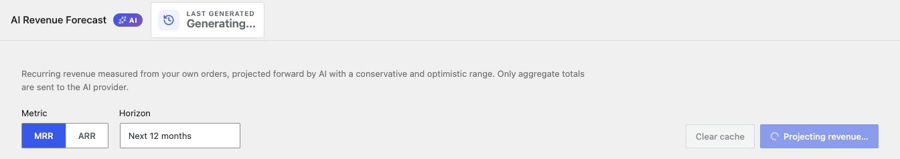

### Clear cache

Discards the saved forecast for the current horizon. The tiles, history charts, and billing mix stay — only the projection and its written analysis are removed.

### Saved Forecasts and the Last Generated Stamp

- The date and time of the last run appear in bold at the top of the report, with a relative age underneath.
- Reloading the page or returning later restores the same projection instead of re-billing your AI provider.
- Saved forecasts are kept for **12 hours**, then expire on their own.
- Each horizon is saved separately, so switching from 12 months to 24 months shows that horizon's own forecast.
- **Tiles, history charts, and the billing mix are always recalculated from current data.** Only the projection and its written analysis are replayed, and the chart's starting point is re-anchored to today's run-rate each time.

---

## Where to Find It

The report is registered inside the WooCommerce Analytics menu, directly after AI Churn Analysis.


It is also listed in the **AI Reports** category of the [Reports Hub](reports-hub.md) at **ArraySubs → Reports**, where the MRR & ARR Outlook, Collected Revenue History, Subscriber Movement, and Billing Mix cards all open this report.

If AI is unavailable, the report explains exactly which setup step is missing and links to the screen that fixes it — see [Setting Up the AI Provider](ai-churn-analysis.md#setting-up-the-ai-provider).

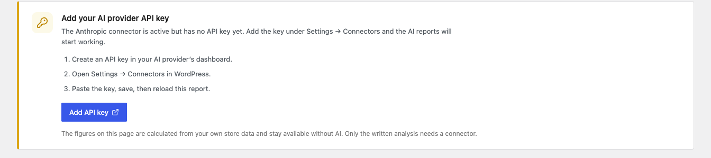

---

## Real-Life Use Cases

### Budgeting With a Range Instead of a Number

A store owner needs to decide whether they can afford a part-time support hire. They generate a 12-month forecast and plan against the **conservative** end of the band, not the base case. If the hire is affordable at the bottom of the range, the decision is safe.

### Catching Silent Shrinkage

Revenue looks flat month over month, so nothing seems wrong. The **Subscriber Movement** chart shows net change turning negative two months ago — the base is shrinking, and flat revenue is only being propped up by a handful of large plans. The team shifts budget to retention before the revenue line follows.

### Repricing the Right Cadence

The **Billing Mix** table shows weekly plans making up a third of subscribers but under 15% of MRR. Rather than a blanket price increase, the store owner tests moving weekly subscribers onto a monthly plan, which the AI had already flagged in the **Opportunities** column.

### Checking Whether Growth Is Real

New business spikes in the collected-revenue chart, but renewals stay flat and cancellations rise alongside it. The forecast comes back **Neutral** with a **Low confidence** rating — the AI naming what the store owner suspected: the spike is acquisition churn, not growth.

---

## Edge Cases and Important Notes

- **MRR is a run-rate, not a bank statement.** It measures what your live subscriptions are contracted to bill per month. Collected revenue in the history chart is what actually cleared. The two will never match exactly.
- **Lifetime plans never enter MRR.** They are counted separately and noted on the Billing Subscriptions card.
- **Refunds and tax are removed** from the collected-revenue history, so the chart reflects net subscription revenue.
- **Multi-currency stores are grouped by currency** in the underlying calculation, but monetary tiles are not converted to a single currency.
- **The projection is a model, not a promise.** It extrapolates from the history and cancellation pressure the AI is shown. A pricing change, a marketing push, or a gateway outage will all invalidate it — that is exactly what the **Key assumptions** column is for.
- **Short history produces low confidence.** Stores with only a few months of data will see a wide band and a Low confidence badge. That is the model working correctly.
- **Regenerating replaces the saved forecast** for that horizon. There is no version history.

---

## Troubleshooting

| Problem | Likely Cause | What to Do |
|---------|--------------|------------|
| The **Generate forecast** button is greyed out | No AI provider is ready | Follow the setup notice at the top of the report |
| MRR looks far lower than expected | Lifetime plans are excluded, and only active and trial subscriptions bill | Check the Billing Subscriptions card for the lifetime count |
| The collected-revenue chart is mostly flat | Historical orders exist but are not linked to subscriptions | Confirm renewal orders are being created by the billing engine, not entered manually |
| The forecast comes back with a very wide band | Not enough history, or highly volatile month-to-month movement | Expected on young stores; revisit after a few more billing cycles |
| The projection quotes a starting MRR that differs from the tile | The forecast was generated earlier and is being replayed | The chart re-anchors "Now" to today automatically; click **Regenerate forecast** to refresh the whole projection |
| The forecast fails part-way through | The provider rejected the request or timed out | Check the key under **Settings → Connectors**, then try again |

---

## Related Guides

- [AI Churn Analysis](ai-churn-analysis.md) — The companion report scoring individual subscribers for churn risk.
- [Retention Analytics](../retention-analytics/README.md) — Why customers cancelled and whether save offers worked.
- [Subscription Performance Dashboard](subscription-performance.md) *(Pro)* — Period-over-period KPI comparison on the Analytics Overview page.
- [Renewal Operations](../billing-and-renewals/renewal-operations.md) — How renewal orders, the source of the renewals series, are generated.
- [Flexible Subscription Duration](../subscription-products/flexible-subscription-duration.md) — Billing cadences behind the billing mix table.
- [Reports Hub](reports-hub.md) — Central directory of every report in the ecosystem.

---

## FAQ

### Is this a free or Pro feature?
Free. AI Revenue Forecast ships in the core ArraySubs plugin — no Pro licence is required.

### Do I need an AI provider to use this report?
No. Every measured figure — MRR, ARR, subscriber counts, revenue history, subscriber movement, and billing mix — works with no provider configured. A provider only adds the forward projection and its written analysis.

### How is MRR calculated?
Every live billing subscription's recurring amount is normalised to a monthly figure: a yearly plan contributes one twelfth of its price, a weekly plan roughly four and a third times, and so on. Lifetime plans contribute nothing. The normalised amounts are then summed.

### Why is ARR just MRR times twelve?
Because it is a run-rate, not a sum of the coming year's invoices. It answers "if today's recurring revenue held for a year, what would that be worth?" — the standard way subscription businesses quote ARR.

### What exactly is sent to the AI provider?
Aggregate totals only: current MRR and ARR, subscriber counts, monthly revenue history split into renewals and new business, monthly new and cancelled counts, cancellation-scheduled and renewal-failure figures, and the billing-cadence mix. No customer or order-level data is included.

### Can I trust the projection enough to plan on it?
Plan on the **conservative** end of the band and read the **Key assumptions** column before you do. The projection is an informed extrapolation of your own history, not a guarantee — treat it the way you would treat a well-argued estimate from a colleague.

### Why did the numbers change when I switched from MRR to ARR?
Only the scale changed. ARR is the same forecast multiplied by twelve.

### Can I export the forecast?
The forecast itself has no export button. The underlying subscription data can be exported from **ArraySubs → Subscriptions** — see [Admin Tools and Records](../manage-subscriptions/admin-tools-and-records.md).
