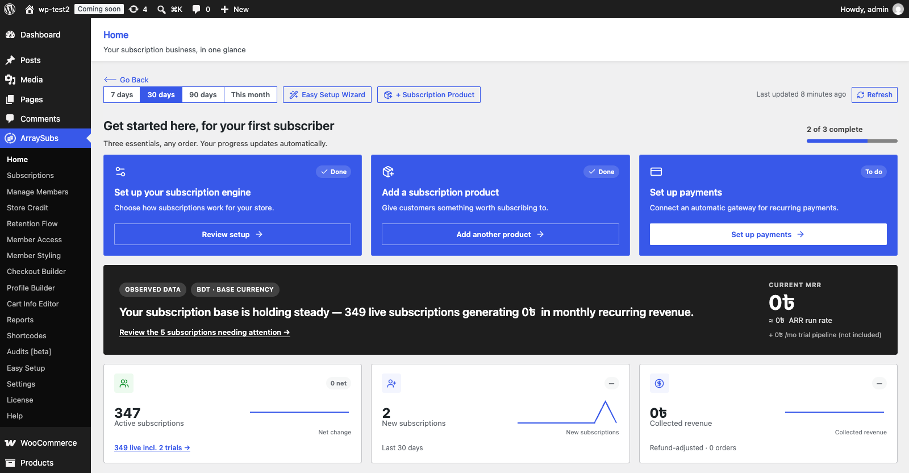
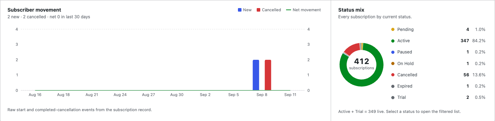
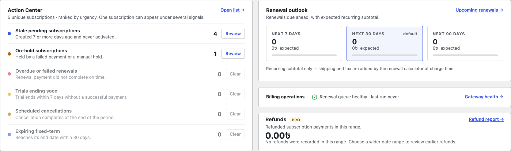
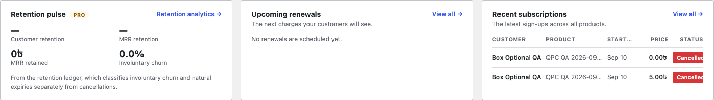
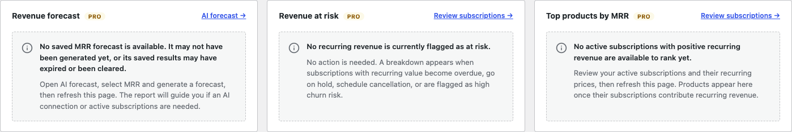
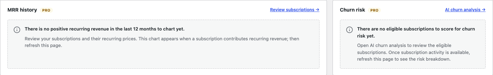

# Info
- Module: Home
- Availability: Shared (Free + Pro)
- Last updated: 2026-09-14

# Home

> Start your store setup, create subscription products, and check recurring revenue, subscriber movement, and subscriptions needing attention from the ArraySubs landing page.

**Availability:** Free (Pro modules add extra widgets inline)

## Page Navigation

- **Current guide:** Home
- **Where to open it:** WordPress Admin -> ArraySubs -> Home
- **Direct route:** `/wp-admin/admin.php?page=arraysubs-mainadmin#/overview`
- **Section overview:** [Open overview](./README.md)
- **Previous guide:** [Analytics & Reports](./README.md)
- **Next guide:** [Reports Hub](./reports-hub.md)
- **Troubleshooting:** [Audits, Logs, and Troubleshooting](../audits-and-logs/README.md)

## Overview

**Home** is the first page you land on when you open **ArraySubs**. It combines a three-part setup checklist with the daily subscription dashboard. New stores can start the setup wizard, add a product, and configure payments here; established stores can review revenue, status changes, and upcoming work.

This is the page previously called **Overview Dashboard**. The menu and page heading now say **Home**; its direct admin route is still `#/overview`.

The dashboard uses your store's subscription and order data. Charts and tables explain when there is no matching activity. With Pro, a saved revenue forecast is shown separately from observed figures, and unavailable reports keep a guidance card explaining the next step.

[View the complete Home page screenshot](home.ASSETS/01-home-full-page-original.png). The focused screenshots below show each section at a readable size.

For the full installation and test-order sequence, start with [Getting Started](../getting-started/README.md) and [First-Time Setup](../getting-started/first-time-setup.md).

## When to Use This

- You want a daily health check before opening anything else.
- You are setting up the store or adding another subscription product.
- You need to know what needs attention right now — failed renewals, held subscriptions, stale sign-ups.
- You want to see how many renewals are coming and roughly what they are worth.
- You want to jump to a filtered subscription list without building the filter by hand.

## Prerequisites

- WooCommerce installed and active
- ArraySubs installed and active
- A user with the **Manage WooCommerce** capability (shop managers and administrators)

## Setup Checklist and Shortcuts

The **Get started here, for your first subscriber** card tracks three essentials. You can complete them in any order, and the progress indicator updates from the store's current setup.

| Task | What the button opens | When it shows Done |
|---|---|---|
| **Set up your subscription engine** | **Start setup** or **Review setup** opens the [Easy Setup Wizard](../getting-started/easy-setup-wizard.md) in a modal | ArraySubs settings have been saved |
| **Add a subscription product** | **Create a product** or **Add another product** opens the quick product creation modal | The store has a subscription product |
| **Set up payments** | WooCommerce payment settings; the label becomes **Manage payments** once complete | An automatic recurring-payment gateway is enabled and configured |

The payment task checks automatic-payment setup. A store using only manual renewal methods can still show **To do** here. Review the [Automatic Payments](../checkout-and-payments/automatic-payments/README.md) guide for supported gateways and setup.

When all three tasks are complete, the heading changes to **Your subscription essentials are ready** and **Dismiss** appears. Dismissing the card hides it permanently for the whole site, including other administrators.

The toolbar shortcuts remain available even after the checklist is dismissed:

- **Easy Setup Wizard** opens the setup wizard. If setup was already completed, it can open the completion screen, where **Start Over** lets you revisit the steps.
- **+ Subscription Product** opens the quick product creation modal. Choose the product type and continue through its fields. The [subscription product guide](../subscription-products/create-and-configure.md) covers the full product editor.
- **Refresh** reloads the dashboard figures and shows **Refreshing…** while it works.

## How It Works

Every subscription-derived figure on the page is produced by a single pass over your subscriptions, so the KPI row, the movement chart, the status donut and the renewal outlook always agree with each other.

The core dashboard and Pro widget results are cached for **15 minutes**. The toolbar shows when the core figures were built, and **Refresh** requests fresh dashboard data. Setup checklist progress is checked separately on each load. After creating a product or completing setup from Home, the page reloads its data.

Two ideas run through the whole page:

1. **Drill-down links open the relevant subscriptions.** Select a status in the donut, **Review** on an attention signal, or a renewal window to open a filtered subscription list.
2. **Money is measured one way everywhere.** A subscription's monthly value is its next renewal amount (quantity included, stepped prices applied) normalised to a month. Lifetime products never renew, so they contribute nothing to MRR.

### Selecting a range

The buttons at the top left — **7 days**, **30 days**, **90 days**, **This month** — control the range-scoped parts of the page: new subscriptions, cancellations, collected revenue, the movement chart, and the Pro retention and refund widgets.

Totals that describe *now* rather than a period — MRR, active subscriptions, the status mix, the renewal outlook — do not change with the range.

## The Health Hero

The dark summary banner beneath the checklist, shown in the setup screenshot above, states the current position in a sentence. More starts than cancellations reads *growing*, more cancellations reads *shrinking*, and a level period reads *holding steady*.

| Element | Meaning |
|---|---|
| **Current MRR** | Monthly recurring revenue from **active** subscriptions |
| **ARR run rate** | Current MRR × 12 |
| **Trial pipeline** | Monthly value of trials, shown separately because they have not paid yet |
| **Bundle children excluded** | Zero-value child subscriptions whose value is carried by their parent |
| **MRR momentum** | The last 12 months of MRR; the small chart appears when there is positive recurring revenue to show |
| **Review the N subscriptions needing attention** | Opens the list filtered to every subscription tripping any attention signal |

## The KPI Row

The three metric cards below the health banner include small trend charts for the selected range.

| Card | What it counts |
|---|---|
| **Active subscriptions** | Subscriptions with the Active status. The badge is net movement (new minus cancelled) for the selected range |
| **New subscriptions** | Subscriptions that started in the range. The badge compares with the previous period of the same length |
| **Collected revenue** | Money actually banked from subscription orders in the range, net of refunds |

A badge shows a percentage only when the comparison period had something to compare against. When the previous period was zero, it shows an em dash rather than an invented percentage. Badges are green when the movement is good and red when it is not.

Renewal counts and expected subtotals appear further down in **Renewal outlook**.

## Subscriber Movement and Status Mix

**Subscriber movement** plots starts and completed cancellations across the range. Bars use the left axis; the net movement line has its **own** axis on the right, so a period that lost subscribers is drawn below zero rather than flattened against the bottom.

**Status mix** breaks every subscription down by its current status. Hovering a slice shows that status in the centre; selecting a status opens the subscriptions list filtered to it. The note beneath confirms how many are live (Active + Trial).

## Action Center

Six signals, most urgent first. **Review** opens the subscriptions list filtered to that exact signal — the number on the dashboard is the number of rows you will see.

| Signal | What it catches |
|---|---|
| **Overdue or failed renewals** | Live subscription whose next payment date has passed |
| **On-hold subscriptions** | Held by a failed payment or a manual hold |
| **Trials ending soon** | Trial ending within 7 days without a successful payment |
| **Scheduled cancellations** | Cancellation set to complete at the end of the period |
| **Stale pending subscriptions** | Created 7 or more days ago and never activated |
| **Expiring fixed-term** | Reaches its end date within 30 days |

One subscription can trip several signals at once — a held subscription is usually overdue too — so the headline count above the list is the number of **unique** subscriptions, not the sum of the six numbers. Signals with nothing to report stay in the list marked *Clear*, so a quiet day is visible rather than blank.

### Renewal outlook

Renewals due in the next 7, 30 and 90 days, with the expected recurring subtotal for each. The windows are cumulative — a renewal due in five days appears in all three — so the bars show each window as a share of the widest one. Selecting a window opens the matching filtered list.

Amounts are the recurring subtotal only; shipping and tax are added by the renewal calculator when the charge is actually made.

### Billing operations

This strip reports renewal-queue health and the last run, or warns about stalled and failed actions. It also shows scheduled renewal counts when present, gateway readiness when gateways are enabled, and a **Gateway health** link. A last run of **never** means no run has been recorded; use the [Cron Job Setup](../getting-started/cron-job-setup.md) guide to configure reliable production scheduling.

## Upcoming Renewals and Recent Subscriptions

These tables appear below the first Pro insight cards and above the movement chart. Each shows up to five rows: the next charges your customers will see, and the latest sign-ups across all products. Selecting a row opens that subscription. **View all** under Upcoming renewals opens subscriptions due within 30 days; **View all** under Recent subscriptions opens the full list.

When there are no matching records, the card says **No renewals are scheduled yet.** or **No subscriptions yet.** With Pro, **Retention pulse** appears alongside these tables.

## Pro Widgets

With ArraySubs Pro active, the **Deeper insights** row below the KPI cards contains **Revenue forecast**, **Revenue at risk**, and **Top products by MRR**. The remaining Pro widgets appear beside the related dashboard sections: **Retention pulse** beside the subscription tables, **MRR history** and **Churn risk** below those tables, and **Refunds** below Billing operations.

Each card keeps its title when data is unavailable. Its message explains whether there is no matching activity, a required module is inactive, or a report could not load, and gives a next step. A missing forecast therefore shows guidance instead of making the Revenue forecast card disappear.

| Widget | Module | What it shows |
|---|---|---|
| **MRR history** | Analytics | The last 12 months of MRR as a full chart, with the year-on-year change |
| **Revenue at risk** | Analytics | Monthly value sitting in at-risk subscriptions, split by category |
| **Top products by MRR** | Analytics | The five products contributing the most recurring revenue |
| **Churn risk** | AI Insights | Subscriptions scored into high, medium and low risk, with the signals driving the score |
| **Revenue forecast** | AI Insights | A previously generated MRR forecast, or guidance to generate one when no saved result is available |
| **Retention pulse** | Retention Analytics | Customer and MRR retention, MRR retained, involuntary churn share, and the top cancellation reasons |
| **Refunds** | Refund Analytics | A compact refunded-amount summary for the range, with a link to the full refund report |

Two details worth knowing:

- **Revenue at risk** counts each subscription once in its headline. The categories beneath it overlap on purpose — a held subscription is usually also overdue — so they will not add up to the headline.
- Opening Home does not generate an AI-written analysis. **Revenue forecast** reads a saved result; generate or refresh it from **AI forecast**. **Churn risk** uses the churn report's available subscription scores. Open **AI churn analysis** for the detailed report and optional AI analysis.

## Without Pro

With the free plugin, Home includes the setup checklist, toolbar shortcuts, health summary, three KPI cards, movement, status mix, Action Center, renewal outlook, billing operations, and both subscription tables. An upgrade panel sits beside the subscription tables in place of Retention pulse. The Pro report cards are not included.

The screenshots in this guide show the local store with Pro active. A free-only store has fewer cards, while the shared setup and monitoring controls work the same way.

## Daily Check Example

A store owner opens **ArraySubs → Home** each morning, selects **30 days**, and checks the health summary. If Action Center lists on-hold subscriptions, they select **Review** to inspect those records. They then review the next 7 days in Renewal outlook and check Billing operations before moving on to orders or customer support. See [Essential Daily Workflows](../getting-started/essential-daily-workflows.md) for the wider routine.

## Edge Cases and Important Notes

- **Historical MRR is reconstructed, not recorded.** The momentum line rebuilds each month from subscription start and cancellation dates using each subscription's *current* price, so a price change is not reflected in earlier months. The most recent point always equals the MRR headline.
- **Paused, on-hold, pending and trial subscriptions are left out of the momentum line.** There is no record of when a subscription entered those states, so including them would invent history.
- **Collected revenue is keyed on the paid date**, not the order date, and subtracts refunds.
- **The status mix counts only ArraySubs subscription statuses.** A record left in another post status is not a subscription and is not counted.
- **Dashboard results are cached for up to 15 minutes.** Use **Refresh** after making a change you expect to see reflected. Linked reports can also have their own caches.

## Troubleshooting

| Symptom | Likely cause | What to do |
|---|---|---|
| Every figure reads zero | No subscriptions yet, or WooCommerce is inactive | Confirm WooCommerce is active and at least one subscription exists |
| "Could not load the dashboard data" | The REST request failed, often an expired login | Select **Try again**; if it repeats, reload the admin page to refresh your session |
| A number looks out of date | Cached dashboard data | Select **Refresh** |
| Movement chart says no events in this range | Nothing started or was cancelled between those dates | Choose a wider range |
| Billing operations reports the queue stalled | Scheduled actions are not running | Check WP-Cron and see [Audits, Logs, and Troubleshooting](../audits-and-logs/README.md) |
| Pro report cards are missing | ArraySubs Pro is inactive | Confirm Pro is active; free Home still includes the shared dashboard |
| A Pro card says its module is inactive | Its report module is not running | Ask the site administrator to enable the named Pro module, then select **Refresh** |
| Revenue forecast says no saved MRR forecast is available | No saved result exists, or it expired or was cleared | Open **AI forecast**, choose MRR, generate a forecast, then refresh Home |
| Setup checklist stays at 2 of 3 | One setup requirement remains incomplete | Review the task marked **To do**; payments requires an enabled, configured automatic gateway |
| Dismiss is missing from the checklist | All three setup tasks are not complete yet | Complete the remaining task; Dismiss only appears at 3 of 3 |
| MRR here differs from a WooCommerce Analytics report | The reports measure recurring value slightly differently | See the FAQ below |

## Related Guides

- [Getting Started](../getting-started/README.md) — where Home fits into the setup process
- [Easy Setup Wizard](../getting-started/easy-setup-wizard.md) — the setup flow opened by Home's wizard shortcuts
- [First-Time Setup](../getting-started/first-time-setup.md) — installation, first product, test order, and customer portal
- [Reports Hub](reports-hub.md) — the directory of every report in the ecosystem
- [Subscription Performance Dashboard](subscription-performance.md) — the full Pro analytics dashboard
- [AI Churn Analysis](ai-churn-analysis.md) — the report behind the churn risk widget
- [AI Revenue Forecast](ai-revenue-forecast.md) — the report behind the forecast widget
- [Retention Analytics](../retention-analytics/README.md) — the report behind the retention pulse
- [Refund Analytics](../refund-analytics/README.md) — the report behind the refunds widget
- [Manage Subscriptions](../manage-subscriptions/README.md) — the list every link on this page opens

## FAQ

**Can I make a different page the ArraySubs landing page?**
Not from the settings screen. Home is the landing page; use the submenu to go straight to another page, and bookmark it if you always start there.

**Why can MRR on Home differ from a WooCommerce Analytics report?**
Home calculates monthly recurring value from subscription prices and quantities and excludes lifetime products. Other reports can use different periods and calculation rules. Compare each report's metric definition and filters before comparing its totals with Home.

**Why does Retention pulse show a different cancellation picture than the movement chart?**
The retention ledger classifies involuntary churn and natural expiries that the movement chart does not count as cancellations. To keep the two from contradicting each other, the widget reports involuntary churn as a share rather than repeating a cancellation count.

**Does opening this page cost an AI call?**
No. Opening Home does not request an AI-written analysis. Generate that separately from the linked AI reports when needed.

**Who can see Home?**
Anyone with the **Manage WooCommerce** capability — administrators and shop managers by default.

**Why is a signal showing zero instead of disappearing?**
Knowing that nothing is overdue is useful. The list keeps its shape so it stays easy to scan, and clear signals are marked *Clear*.
