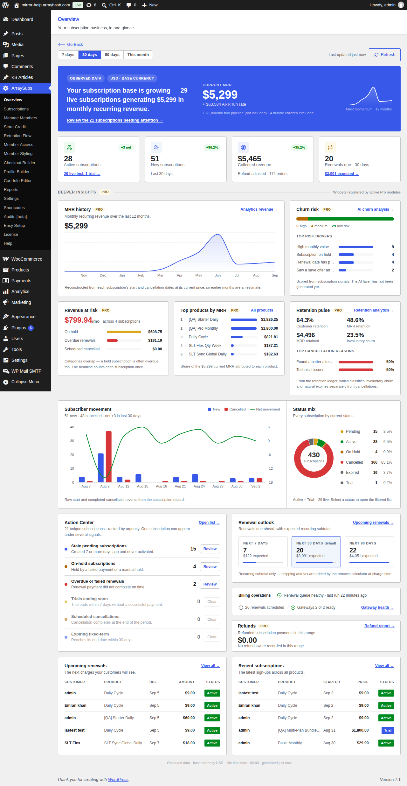
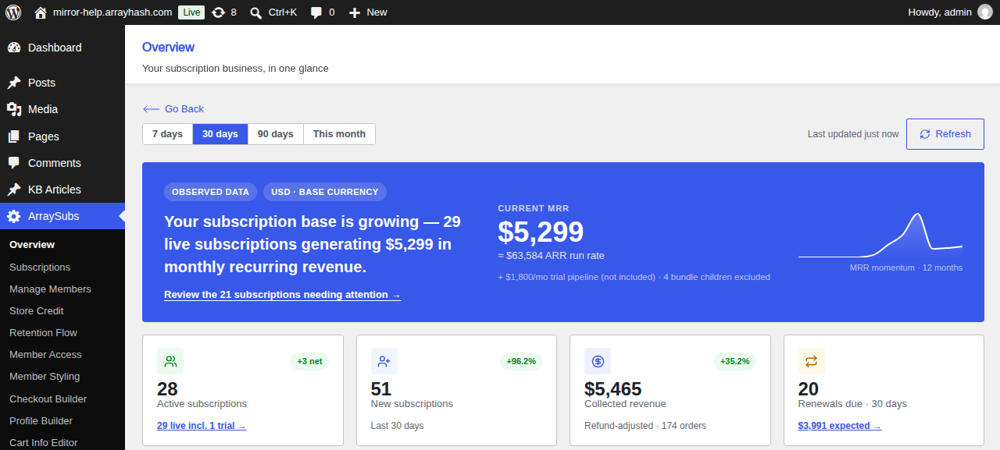
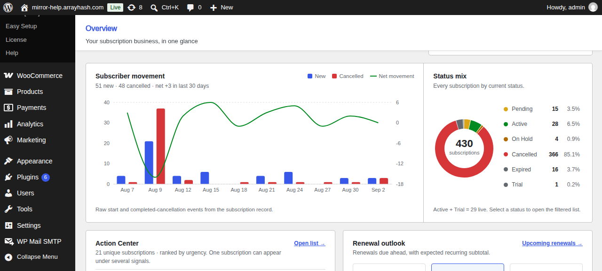
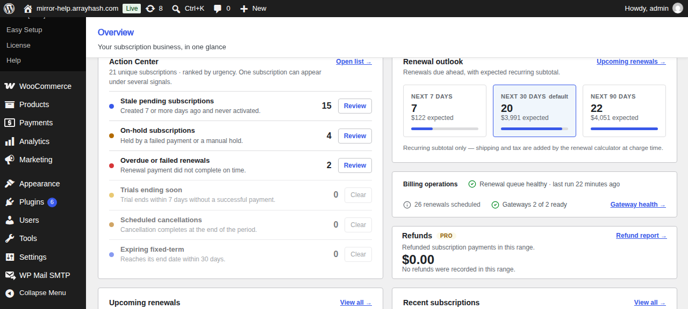
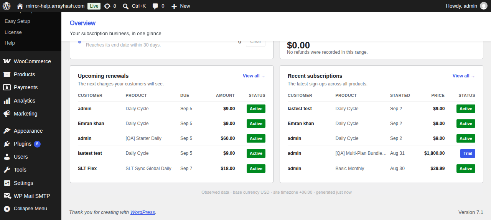
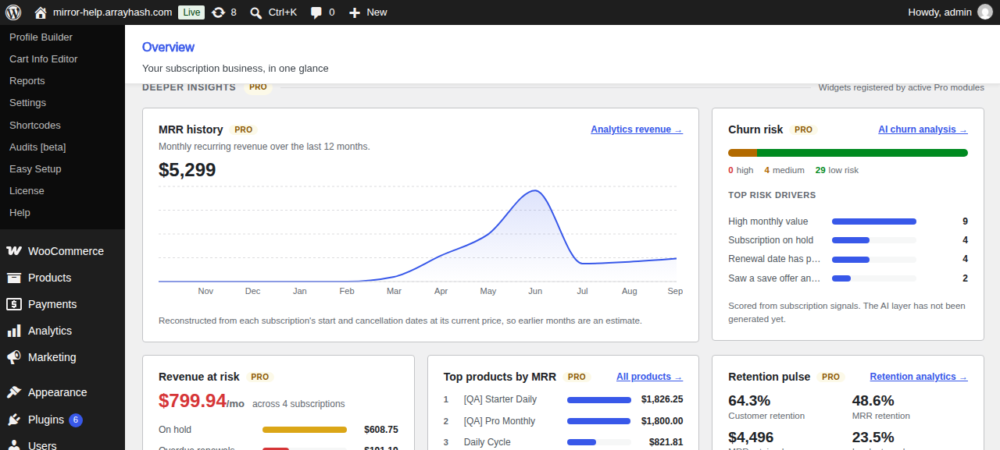
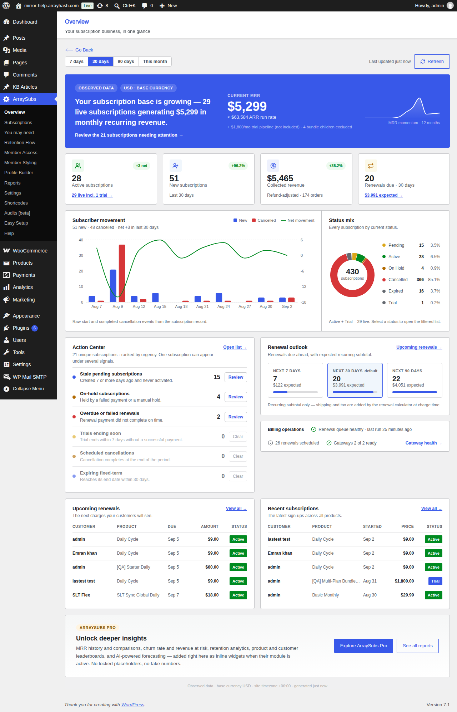

# Info
- Module: Overview Dashboard
- Availability: Shared (Free + Pro)
- Last updated: 2026-09-05

# Overview Dashboard

> The landing page of the ArraySubs admin — recurring revenue, subscriber movement, status mix, and everything currently needing your attention, on one screen that links straight to the subscriptions behind each number.

**Availability:** Free (Pro modules add extra widgets inline)

## Page Navigation

- **Current guide:** Overview Dashboard
- **Where to open it:** WordPress Admin -> ArraySubs -> Overview
- **Direct route:** `/wp-admin/admin.php?page=arraysubs-mainadmin#/overview`
- **Section overview:** [Open overview](./README.md)
- **Previous guide:** [Analytics & Reports](./README.md)
- **Next guide:** [Reports Hub](./reports-hub.md)
- **Troubleshooting:** [Audits, Logs, and Troubleshooting](../audits-and-logs/README.md)

## Overview

Overview is the first page you land on when you open **ArraySubs**. It answers the question you ask every morning — *is the subscription business healthy, and is anything broken?* — without making you open a single report.

Everything on the page describes your live subscription data. Nothing is a sample, a projection, or a placeholder: if a figure has no data behind it, the page shows an empty state instead of a number.

## When to Use This

- You want a daily health check before opening anything else.
- You need to know what needs attention right now — failed renewals, held subscriptions, stale sign-ups.
- You want to see how many renewals are coming and roughly what they are worth.
- You want to jump to a filtered subscription list without building the filter by hand.

## Prerequisites

- WooCommerce installed and active
- ArraySubs installed and active
- A user with the **Manage WooCommerce** capability (shop managers and administrators)

## How It Works

Every subscription-derived figure on the page is produced by a single pass over your subscriptions, so the KPI row, the movement chart, the status donut and the renewal outlook always agree with each other.

The result is cached for **five minutes**. The toolbar shows when it was built and the **Refresh** button rebuilds it immediately.

Two ideas run through the whole page:

1. **Every count links to the rows behind it.** Selecting a status in the donut, or **Review** on an attention signal, opens the subscriptions list filtered to exactly the subscriptions that produced that number.
2. **Money is measured one way everywhere.** A subscription's monthly value is its next renewal amount (quantity included, stepped prices applied) normalised to a month. Lifetime products never renew, so they contribute nothing to MRR.

### Selecting a range

The buttons at the top left — **7 days**, **30 days**, **90 days**, **This month** — control the range-scoped parts of the page: new subscriptions, cancellations, collected revenue, the movement chart, and the Pro retention and refund widgets.

Totals that describe *now* rather than a period — MRR, active subscriptions, the status mix, the renewal outlook — do not change with the range.

## The Health Hero

The banner states the current position in a sentence, and the wording follows the data: a period with more starts than cancellations reads *growing*, a period with more cancellations reads *shrinking*, and a level period reads *holding steady*.

| Element | Meaning |
|---|---|
| **Current MRR** | Monthly recurring revenue from **active** subscriptions |
| **ARR run rate** | Current MRR × 12 |
| **Trial pipeline** | Monthly value of trials, shown separately because they have not paid yet |
| **Bundle children excluded** | Zero-value child subscriptions whose value is carried by their parent |
| **MRR momentum** | The last 12 months of MRR |
| **Review the N subscriptions needing attention** | Opens the list filtered to every subscription tripping any attention signal |

## The KPI Row

| Card | What it counts |
|---|---|
| **Active subscriptions** | Subscriptions with the Active status. The badge is net movement (new minus cancelled) for the selected range |
| **New subscriptions** | Subscriptions that started in the range. The badge compares with the previous period of the same length |
| **Collected revenue** | Money actually banked from subscription orders in the range, net of refunds |
| **Renewals due · 30 days** | Live subscriptions whose next payment falls in the next 30 days, with the expected recurring subtotal |

A badge shows a percentage only when the comparison period had something to compare against. When the previous period was zero, it shows an em dash rather than an invented percentage. Badges are green when the movement is good and red when it is not.

## Subscriber Movement and Status Mix

**Subscriber movement** plots starts and completed cancellations across the range. Bars use the left axis; the net movement line has its **own** axis on the right, so a period that lost subscribers is drawn below zero rather than flattened against the bottom.

**Status mix** breaks every subscription down by its current status. Hovering a slice shows that status in the centre; selecting a status opens the subscriptions list filtered to it. The note beneath confirms how many are live (Active + Trial).

## Action Center

Six signals, most urgent first. **Review** opens the subscriptions list filtered to that exact signal — the number on the dashboard is the number of rows you will see.

| Signal | What it catches |
|---|---|
| **Overdue or failed renewals** | Live subscription whose next payment date has passed |
| **On-hold subscriptions** | Held by a failed payment or a manual hold |
| **Trials ending soon** | Trial ending within 7 days without a successful payment |
| **Scheduled cancellations** | Cancellation set to complete at the end of the period |
| **Stale pending subscriptions** | Created 7 or more days ago and never activated |
| **Expiring fixed-term** | Reaches its end date within 30 days |

One subscription can trip several signals at once — a held subscription is usually overdue too — so the headline count above the list is the number of **unique** subscriptions, not the sum of the six numbers. Signals with nothing to report stay in the list marked *Clear*, so a quiet day is visible rather than blank.

### Renewal outlook

Renewals due in the next 7, 30 and 90 days, with the expected recurring subtotal for each. The windows are cumulative — a renewal due in five days appears in all three — so the bars show each window as a share of the widest one. Selecting a window opens the matching filtered list.

Amounts are the recurring subtotal only; shipping and tax are added by the renewal calculator when the charge is actually made.

### Billing operations

A one-line health check on the machinery behind the numbers: whether the renewal queue is running and when it last ran, how many renewals are scheduled, and how many payment gateways are ready to take a recurring payment. A healthy MRR means very little if the scheduler stopped a week ago, which is what this strip is here to catch.

## Upcoming Renewals and Recent Subscriptions

Two five-row tables: the next charges your customers will see, and the latest sign-ups across all products. Selecting any row opens that subscription; **View all** opens the full list.

## Pro Widgets

With ArraySubs Pro active, a **Deeper insights** section appears between the KPI row and the movement chart. Each widget is supplied by the Pro module that owns its data, so you see exactly the widgets your modules provide — there are no locked cards and no sample numbers.

| Widget | Module | What it shows |
|---|---|---|
| **MRR history** | Analytics | The last 12 months of MRR as a full chart, with the year-on-year change |
| **Revenue at risk** | Analytics | Monthly value sitting in at-risk subscriptions, split by category |
| **Top products by MRR** | Analytics | The five products contributing the most recurring revenue |
| **Churn risk** | AI Insights | Subscriptions scored into high, medium and low risk, with the signals driving the score |
| **Revenue forecast** | AI Insights | Projected MRR — shown only when a forecast has already been generated |
| **Retention pulse** | Retention Analytics | Customer and MRR retention, MRR retained, involuntary churn share, and the top cancellation reasons |
| **Refunds** | Refund Analytics | Refunded subscription payments for the range, as a share of collected revenue |

Two details worth knowing:

- **Revenue at risk** counts each subscription once in its headline. The categories beneath it overlap on purpose — a held subscription is usually also overdue — so they will not add up to the headline.
- The **AI** widgets read a stored result. AI never runs when the page loads, so opening the dashboard never costs an AI call or waits on one. Generate or refresh those results from their own reports under **WooCommerce → Analytics**.

## Without Pro

On the free plugin the page is complete on its own — hero, KPIs, movement, status mix, Action Center, renewal outlook, billing operations and both tables all work. The Deeper insights section is simply absent, and a panel at the foot of the page describes what Pro modules would add.

## Edge Cases and Important Notes

- **Historical MRR is reconstructed, not recorded.** The momentum line rebuilds each month from subscription start and cancellation dates using each subscription's *current* price, so a price change is not reflected in earlier months. The most recent point always equals the MRR headline.
- **Paused, on-hold, pending and trial subscriptions are left out of the momentum line.** There is no record of when a subscription entered those states, so including them would invent history.
- **Collected revenue is keyed on the paid date**, not the order date, and subtracts refunds.
- **The status mix counts only ArraySubs subscription statuses.** A record left in another post status is not a subscription and is not counted.
- **Numbers can be up to five minutes old.** Use **Refresh** after making a change you expect to see reflected.

## Troubleshooting

| Symptom | Likely cause | What to do |
|---|---|---|
| Every figure reads zero | No subscriptions yet, or WooCommerce is inactive | Confirm WooCommerce is active and at least one subscription exists |
| "Could not load the dashboard data" | The REST request failed, often an expired login | Select **Try again**; if it repeats, reload the admin page to refresh your session |
| A number looks out of date | The five-minute cache | Select **Refresh** |
| Movement chart says no events in this range | Nothing started or was cancelled between those dates | Choose a wider range |
| Billing operations reports the queue stalled | Scheduled actions are not running | Check WP-Cron and see [Audits, Logs, and Troubleshooting](../audits-and-logs/README.md) |
| Deeper insights section missing | ArraySubs Pro is inactive, or its analytics modules are off | Confirm Pro is active and enable the modules in Feature Manager |
| Revenue forecast widget missing | No forecast has been generated yet | Generate one from **WooCommerce → Analytics → Revenue Forecast** |
| MRR here differs from a WooCommerce Analytics report | The reports measure recurring value slightly differently | See the FAQ below |

## Related Guides

- [Reports Hub](reports-hub.md) — the directory of every report in the ecosystem
- [Subscription Performance Dashboard](subscription-performance.md) — the full Pro analytics dashboard
- [AI Churn Analysis](ai-churn-analysis.md) — the report behind the churn risk widget
- [AI Revenue Forecast](ai-revenue-forecast.md) — the report behind the forecast widget
- [Retention Analytics](../retention-analytics/README.md) — the report behind the retention pulse
- [Refund Analytics](../refund-analytics/README.md) — the report behind the refunds widget
- [Manage Subscriptions](../manage-subscriptions/README.md) — the list every link on this page opens

## FAQ

**Can I make a different page the ArraySubs landing page?**
Not from the settings screen. Overview is the landing route; use the submenu to go straight to any other page, and bookmark it if you always start there.

**Why does the Overview MRR differ slightly from a WooCommerce Analytics report?**
The Overview multiplies a subscription's recurring amount by its quantity and excludes lifetime products, because that is what the next charge will actually be. Some WooCommerce Analytics reports normalise differently. Both are internally consistent; the Overview's figure is the one every other number on the Overview page is built from.

**Why does Retention pulse show a different cancellation picture than the movement chart?**
The retention ledger classifies involuntary churn and natural expiries that the movement chart does not count as cancellations. To keep the two from contradicting each other, the widget reports involuntary churn as a share rather than repeating a cancellation count.

**Does opening this page cost an AI call?**
No. The AI widgets only display a result that was generated earlier and stored.

**Who can see the Overview page?**
Anyone with the **Manage WooCommerce** capability — administrators and shop managers by default.

**Why is a signal showing zero instead of disappearing?**
Knowing that nothing is overdue is useful. The list keeps its shape so it stays easy to scan, and clear signals are marked *Clear*.
