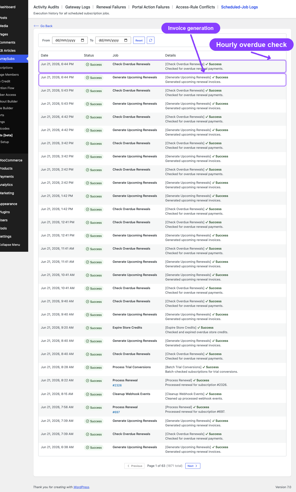
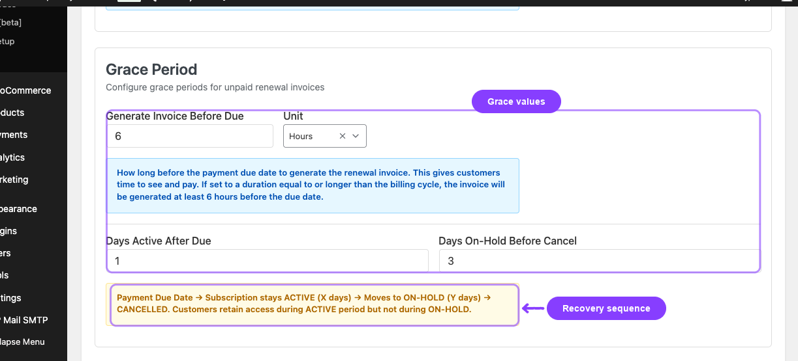
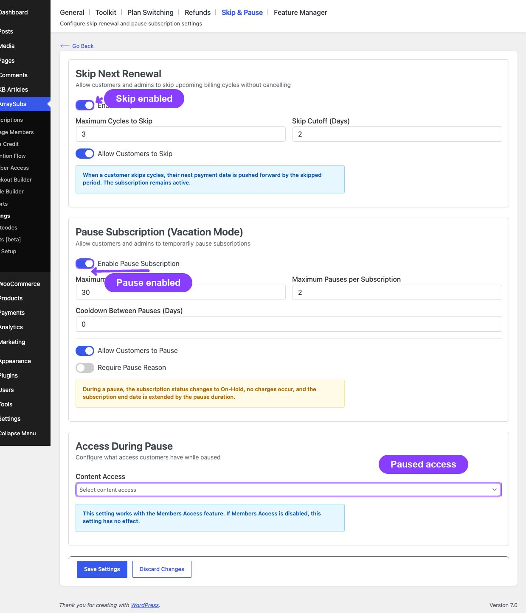
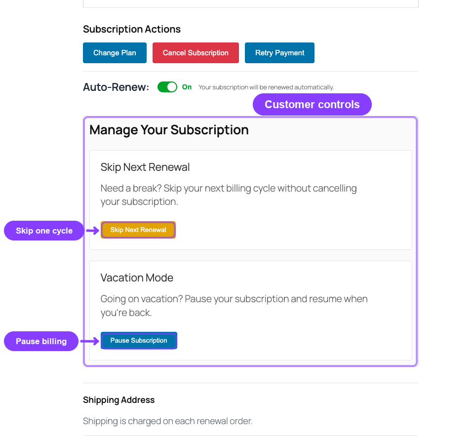
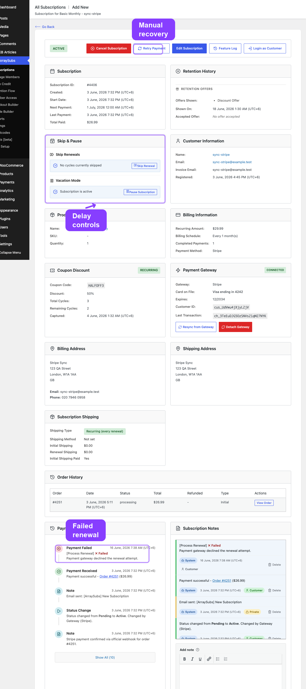

# Info
- Module: Billing and Renewals
- Availability: Free
- Last updated: 2026-06-21

# Recovery and Grace Flows

> What happens when a renewal payment is missed — the two-phase grace period, overdue detection, skip and pause interactions, and how payment at any point restores the subscription.

**Availability:** Free

## Page Navigation

- **Current guide:** Recovery and Grace Flows
- **Where to open renewal settings:** WordPress Admin -> ArraySubs -> Settings -> General
- **Where to open skip/pause settings:** WordPress Admin -> ArraySubs -> Settings -> Skip & Pause
- **Direct skip/pause route:** `/wp-admin/admin.php?page=arraysubs-mainadmin#/settings/skip-pause`
- **Where to inspect a renewal:** WordPress Admin -> ArraySubs -> Subscriptions -> open a subscription
- **Section overview:** [Open overview](./README.md)
- **Previous guide:** [README](./README.md)
- **Next guide:** [renewal-communication](./renewal-communication.md)
- **Troubleshooting:** [Audits, Logs, and Troubleshooting](../audits-and-logs/README.md)

## Overview

Not every renewal payment arrives on time. When a customer misses a payment, ArraySubs does not immediately cancel the subscription. Instead, it activates a **two-phase grace period** that gives the customer time to pay while progressively restricting access. This page explains the complete recovery timeline, how overdue renewals are detected, and how skip and pause features interact with the billing cycle.

## When to use this

- You want to understand what happens when a customer does not pay a renewal invoice
- You need to configure the grace period duration for your store
- You want to know how skip and pause affect renewal scheduling
- You need to understand how payment recovery works at any stage of the grace period

## How it works

### The two-phase grace period

When a renewal invoice remains unpaid past the due date, the subscription progresses through two phases before cancellation. Both phase durations are configurable in settings.

**Phase 1 — Active grace (default: 3 days)**
The subscription stays **Active** after the payment due date. The customer retains full access to all subscription benefits. This gives time for payment to process, for bank transfers to clear, or for the customer to notice the invoice email and pay.

**Phase 2 — On-hold grace (default: 7 days)**
After the active grace period expires, the subscription moves to **On-Hold**. Access is restricted based on your member access rules. The customer can still pay the outstanding invoice to restore their subscription.

**After both phases expire — Cancellation**
If the total grace period passes (default: 10 days total) without payment, the subscription is automatically **Cancelled** with the reason "overdue payment."

### Grace period timeline

```
Payment Due Date
│
├─ Day 0–3: ACTIVE (customer retains full access)
│  └─ Invoice is pending, subscription status unchanged
│
├─ Day 3: Transition to ON-HOLD
│  └─ Access restricted, On-Hold email sent
│  └─ _on_hold_date recorded for accurate cancellation timing
│
├─ Day 3–10: ON-HOLD (restricted access)
│  └─ Customer can still pay to restore subscription
│
├─ Day 10: CANCELLED
│  └─ Status set to Cancelled (reason: overdue payment)
│  └─ All future renewals unscheduled
│  └─ Pending renewal orders cancelled
│
└─ Payment received at ANY point before Day 10:
   └─ Subscription restored to ACTIVE
   └─ Grace period markers cleared
   └─ Next payment date recalculated
   └─ Next renewal scheduled
```

```box class="info-box"
## Payment restores the subscription at any time

If the customer pays the outstanding invoice during the active grace phase, the on-hold phase, or even moments before the cancellation deadline, the subscription is immediately restored to **Active**. The grace period resets, the next payment date advances by one billing cycle, and billing continues normally.
```

### How overdue detection works

A background job called **Check Overdue Renewals** runs **every hour** and performs three checks in sequence:

**Check 1 — Active subscriptions past the active grace period**
Finds subscriptions that are Active (or Trial) with a next payment date more than `grace_days_before_on_hold` (default: 3) days in the past and an unpaid renewal order. These subscriptions are moved to On-Hold.

**Check 2 — On-hold subscriptions past the on-hold grace period**
Finds subscriptions that are On-Hold with a next payment date more than `grace_days_before_on_hold + grace_days_before_cancel` (default: 10) days in the past. An additional safety check verifies the `on_hold_date` is more than 7 days old. These subscriptions are cancelled.

**Check 3 — Subscriptions waiting for end-of-period cancellation**
Finds Active or Trial subscriptions with a scheduled cancellation date that has passed (end-of-period cancellations requested by the customer). These are cancelled with the reason stored at the time of the cancellation request.

If ArraySubs cannot resolve a valid future scheduled-cancellation date when the customer requests end-of-period cancellation, the request fails safely instead of cancelling immediately.



### What happens when a subscription is cancelled for overdue payment

- Status changes to **Cancelled**
- End date and cancelled date are recorded
- Cancelled by is set to "system" with reason "overdue_payment"
- All pending renewal orders are cancelled
- All future renewal actions are unscheduled
- Any pending plan switch is cleared
- A **Subscription Cancelled** email is sent to the customer
- An **Admin Subscription Cancelled** email is sent to the store admin

---

## Grace period configuration

Configure the grace period at **ArraySubs -> Settings -> General -> Grace Period**.

| Setting | What it controls | Default | Recommended range |
|---|---|---|---|
| **Generate Invoice Before Due** + **Unit** | How far in advance the renewal invoice is created | 6 hours | 1-48 hours or 1-2 days |
| **Days Active After Due** | Days the subscription stays Active after the due date with an unpaid invoice | 3 | 1-7 days |
| **Days On-Hold Before Cancel** | Days the subscription stays On-Hold before automatic cancellation | 7 | 3-14 days |

The total grace period before cancellation is the sum: **Days Active After Due + Days On-Hold Before Cancel** (default: 3 + 7 = 10 days).

Your store can use different values from the defaults. For example, a strict recovery setup may use **Days Active After Due = 1** and **Days On-Hold Before Cancel = 3** so overdue subscriptions progress faster.



```box class="warning-box"
## Choose grace periods carefully

Setting the active grace period too short may move subscriptions to On-Hold before customers have a chance to pay (especially for manual payment subscriptions). Setting the on-hold period too long keeps cancelled-bound subscriptions in limbo. Balance customer flexibility with business needs.
```

---

## Skip and pause in the billing timeline

The skip and pause features directly affect when renewal invoices are generated and how the billing cycle progresses. Understanding their interaction with the billing engine is important for accurate subscription management.



### How skip affects renewals

When a customer skips one or more renewal cycles, the billing engine **blocks invoice generation** for those cycles. No renewal invoice is created, no payment is attempted, and the next payment date shifts forward.

**Date shift logic:**
```
New next payment date = Original next payment date + (billing interval × skipped cycles × billing period)
```

**Example:** A monthly subscription with next payment on January 15. Customer skips 2 cycles.
- Original date: January 15
- New date: March 15 (shifted forward by 2 months)
- No invoices are generated for January or February

**How the block works:** The SkipRenewal feature hooks into the `arraysubs_should_generate_renewal_invoice` filter. When the billing engine is about to create an invoice, the filter checks if the subscription has remaining skip cycles. If yes, it returns `false` and the invoice is not created.

**Key skip behaviors:**

| Scenario | Result |
|---|---|
| Invoice generation for a skipped cycle | Blocked — no invoice created |
| Customer undoes skip | Next payment date restored to original |
| Customer modifies skip (changes cycle count) | Date recalculated from original date |
| Skip cycles completed | Normal billing resumes automatically |
| Skip during grace period | Not explicitly restricted, but would delay any further grace processing |

**Skip limits and cutoff:**

| Setting | Default | What it controls |
|---|---|---|
| Maximum Cycles to Skip | 3 | Maximum number of cycles a customer can skip at once |
| Skip Cutoff (Days) | 2 | Cannot skip within this many days of the next renewal date |
| Allow Customers to Skip | Enabled by setup | Shows or hides skip controls in the customer My Account portal |



### How pause affects renewals

When a subscription is paused it moves to its own **Paused** status and all renewal processing is suspended. No invoices are generated during the pause. When it resumes — manually or by auto-resume — the billing dates shift forward by the time actually spent paused.

```box class="warning-box"
**Paused is not On-Hold.** They are two distinct statuses with two different meanings: **Paused** is a deliberate choice by the customer or an admin, with an end date; **On Hold** means a payment failed or an administrator held the subscription. Earlier versions reused On-Hold for pauses, which made them impossible to tell apart in status filters, reports, member-access rules, and the overdue checker. If you built rules or reports around "on-hold means paused", revisit them.
```

**During pause:**
- Subscription status changes to **Paused**
- All pending renewal actions are unscheduled
- No new renewal invoices are generated
- The next payment date is preserved (not changed during pause)

**On resume:**
- The subscription status returns to its pre-pause status (usually Active)
- The next payment date shifts forward by the **actual elapsed pause time**, not the duration originally requested — resume early and you get back only the days you actually used
- If the subscription has an end date, it shifts by the same amount
- Renewal actions are rescheduled

**Example:** A monthly subscription paused for 7 days.
- Next payment was: January 20
- Paused on: January 10 (for 7 days)
- Auto-resumes: January 17
- New next payment: January 27 (20 + 7 days extension)

**Pause limits:**

| Setting | Default | What it controls |
|---|---|---|
| **Enable Pause Subscription** | On | The master switch. Every setting below is hidden until this is on |
| Maximum Pause Duration (Days) | 30 days | Maximum length of a single pause |
| Maximum Pauses per Subscription | 2 | Total number of times a subscription can be paused |
| Cooldown Between Pauses (Days) | 30 days | Cooldown period between consecutive pauses |
| **Allow Customers to Pause** | Off | Shows or hides pause controls in the customer My Account portal |
| **Allow Resume** | On | Shows or hides the **Resume Now** control for a paused subscription |
| Require Pause Reason | Off | Requires customers to provide a reason when pausing |
| Content Access | No access / Limited access / Full access | What a paused member can still reach while Member Access is active |

```box class="info-box"
**Allow Customers to Pause** and **Allow Resume** used to live in General Settings → Customer Actions as **Allow Suspension** and **Allow Reactivation**. They moved here so every pause rule sits together, and they are now conditional on **Enable Pause Subscription** — a permission to pause is meaningless when pause is switched off. Existing values were migrated automatically; see [General Settings](../settings/general-settings.md#pause-and-resume-moved).
```

```box class="info-box"
Turning **Allow Resume** off does not trap anyone. Auto-resume still fires on the scheduled date, and an admin can resume from the subscription screen at any time. It only removes the customer's own button — useful when a pause is meant to run its full agreed term.
```

### Skip vs pause — key differences

| Aspect | Skip | Pause |
|---|---|---|
| Status during | Stays **Active** | Changes to **Paused** |
| Customer access | Full access continues | Set by **Content Access** — none, view-only, or full |
| How date shifts | Forward by skipped billing cycles | Forward by actual days paused |
| Invoice generation | Blocked by filter | Blocked by status (Paused) |
| Automatic resumption | Cycles decrement automatically | Resumes on pause end date |
| Undo available | Yes (restores original date) | Yes (manual resume at any time, if Allow Resume is on) |

### Interaction with automatic payments (Pro)

When a subscription is paused and it uses automatic gateway billing:

- The pause state is synced to the remote gateway (Stripe, PayPal, or Paddle). Mollie has no remote billing object to pause — ArraySubs owns the schedule, so simply not charging is the pause
- The gateway marks the subscription as paused on its side
- On resume, the gateway resumes the remote billing context

This ensures the gateway does not attempt to charge the customer during the pause period.

---

## Real-life use cases



### Use case 1: Grace period saves a customer

A customer's credit card expired and the automatic renewal payment fails. The subscription enters the active grace period (3 days). The customer receives a **Renewal Payment Failed** email — the email body now says explicitly *"Reason: the card has expired."* so the customer immediately knows what to fix. They update their card, click the **Pay Now** link, and pay the pending invoice on day 2. The subscription never leaves Active status and continues normally.

```box class="info-box"
**Failure reason in customer notifications.** When a renewal fails on an automatic gateway, the plugin classifies the gateway error code (Stripe `decline_code`, PayPal/Paddle/Mollie equivalents) into a stable category and surfaces it in two places:

- the **Renewal Payment Failed** email shows a one-line reason callout above the order details (e.g. *"Reason: insufficient funds on the card."*)
- the **subscription notes** include both the human reason and the raw gateway message

Recognized categories include `insufficient_funds`, `card_declined`, `expired_card`, `incorrect_cvc`, `invalid_card`, `authentication_required`, `processing_error`, and `generic_decline`. Unknown failures fall back to the raw gateway message only. See [Payment Recovery Tools](../checkout-and-payments/automatic-payments/payment-recovery.md) for the full category reference.
```

### Use case 2: On-hold recovery

A customer is traveling and misses the renewal invoice email. The active grace period passes and the subscription moves to On-Hold on day 3. The customer loses access to premium content. On day 6, they notice and pay the invoice. The subscription is immediately restored to Active with full access.

### Use case 3: Skip to manage cash flow

A customer on a monthly box subscription knows they will be away next month. They skip 1 renewal cycle from their account. The next invoice is pushed forward by one month. No box is shipped, no payment is charged, and the subscription stays Active throughout.

### Use case 4: Pause for seasonal use

A gym membership subscriber wants to pause during summer vacation. They pause for 30 days. During the pause the subscription shows **Paused** and no charges occur. After 30 days it auto-resumes, the next payment date shifts forward by 30 days, and billing continues normally. Because Paused is its own status, the merchant can filter the subscription list for genuine payment problems without vacationing members cluttering the view.

---

## Edge cases and important notes

- **Grace period only starts when an invoice exists.** If no renewal invoice was generated (e.g., because the subscription was skipped or paused), the grace period does not activate.
- **Paused and On-Hold are separate statuses.** A paused subscription is **Paused** and carries pause metadata (`_pause_start_date`, `_pause_end_date`); an overdue one is **On Hold** and carries grace metadata (`_on_hold_date`, `_pending_renewal_order_id`). The overdue checker only processes the latter, so a paused member is never swept into the cancel-for-non-payment path.
- **Pausing during the grace period.** If a subscription is On Hold for an unpaid invoice and a pause is initiated, the pause takes precedence and the status becomes Paused. The on-hold timer resets when the subscription resumes.
- **Resume is pause-only.** Resume acts on a Paused subscription. It will not clear an On-Hold caused by a failed payment — that needs the payment resolved, not a resume — and the API refuses the attempt rather than silently reactivating an unpaid subscription.
- **Active grace for trial subscriptions.** Trial subscriptions are included in the overdue checker. If a trial's next payment date passes without conversion or payment, the same grace period rules apply.
- **Background job timing.** The overdue checker runs hourly, not in real-time. Status transitions may occur up to an hour after the exact grace period boundary.

---

## Troubleshooting

| Problem | Likely cause | What to do |
|---|---|---|
| Subscription cancelled earlier than expected | Grace period settings are shorter than intended | Check **Settings -> General -> Grace Period** for Days Active After Due and Days On-Hold Before Cancel values. |
| Subscription stuck on On-Hold | Invoice is pending but the grace period has not expired | Check the subscription detail for a pending renewal order. A paused subscription is **not** On Hold — it shows Paused |
| Subscription shows Paused and is not resuming | Auto-resume has not fired, or Allow Resume is off so the customer has no button | Verify the auto-resume date, then check **Scheduled-Job Logs** (Pro). An admin can resume from the subscription screen regardless of the customer setting |
| Customer still has access after moving to On-Hold | Member access rules do not restrict On-Hold status | Review your access rules at **ArraySubs → Member Access** to ensure On-Hold subscriptions are restricted appropriately |
| Paused customer still has access | **Content Access** on the Skip & Pause page is set to Limited or Full | Set it to **No access** if a pause should suspend benefits too |
| Skip not available to customer | Skip is disabled, cutoff period is too restrictive, or max cycles reached | Check skip settings in **Settings -> Skip & Pause** for enabled state, Maximum Cycles to Skip, Skip Cutoff (Days), and Allow Customers to Skip. |
| Pause not resuming automatically | Auto-resume job may not have executed yet | The auto-resume is scheduled via Action Scheduler for the exact pause end date. Check **Scheduled-Job Logs** (Pro) to verify the resume action is queued. |
| Payment received but subscription still shows On-Hold | Order status has not been updated to Completed or Processing | Check the renewal order status in WooCommerce. The subscription restores to Active only when the linked order reaches a paid status (Completed or Processing). |

---

## Related docs

- [General Settings](../settings/general-settings.md) for configuring the grace period, and **Settings -> Skip & Pause** for skip/pause controls
- [Renewal Operations](renewal-operations.md) for how invoices are created and payment is routed
- [Renewal Communication](renewal-communication.md) for emails sent during the grace period (On-Hold, Payment Failed)
- [Self-Service Actions](../customer-portal/self-service-actions.md) for the customer experience of skip and pause
- [Lifecycle Management](../manage-subscriptions/lifecycle-management.md) for the complete status transition reference
- [Automatic Payments](../checkout-and-payments/automatic-payments/README.md) **(Pro)** for how gateways handle pause syncing and payment retries

---

## FAQ

### How long does a customer have before their subscription is cancelled for non-payment?
By default, 10 days: 3 days of active grace + 7 days of on-hold. Both values are configurable in General Settings.

### Can I disable the grace period entirely?
You can set both grace period values to 0, which means the subscription moves to On-Hold immediately on the due date and gets cancelled the same day. This is not recommended for most stores.

### Does the grace period apply to automatic payment subscriptions?
Yes. The grace period applies regardless of payment method. For automatic payments, the system attempts to charge the gateway. If the charge fails, the grace period starts. Payment retries (if configured) happen within the grace window.

### What happens if a customer skips and then pauses?
If a skip is active and the customer initiates a pause, the skip is deactivated and the pause takes over. The subscription moves to **Paused** and billing is fully suspended until the pause ends.

### Can a subscription be paused more than once?
Yes, up to the configured limit (default: 2 pauses per subscription). There is also a minimum cooldown period between pauses (default: 30 days).

### Does the customer receive any notification before being moved to On-Hold?
Yes. The customer receives a **Renewal Invoice** email when the invoice is created (before the due date), and may receive a **Payment Failed** email if an automatic payment attempt fails. The **Subscription On-Hold** email is sent when the status actually changes.

### What if I change the grace period settings after subscriptions are already in the grace period?
Changes apply to future overdue checks. A subscription already in the On-Hold phase will be evaluated against the new on-hold grace days during the next hourly check. Shortening the grace period can cause immediate cancellation of subscriptions that have already exceeded the new window.
