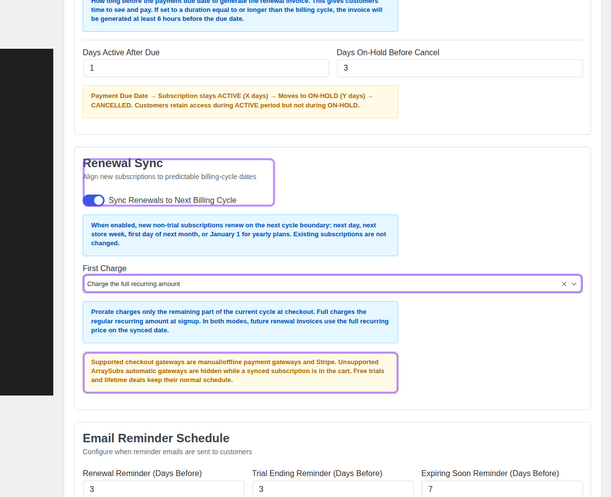
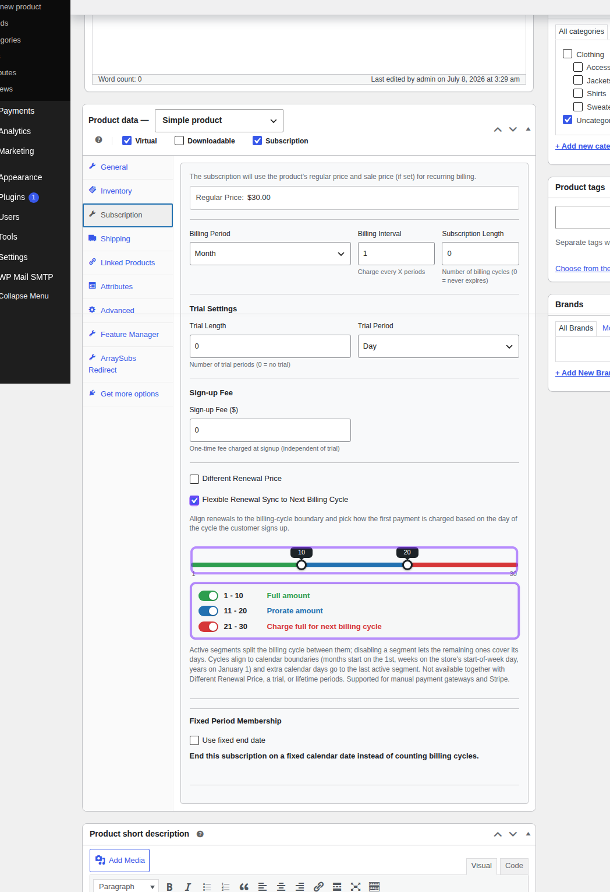
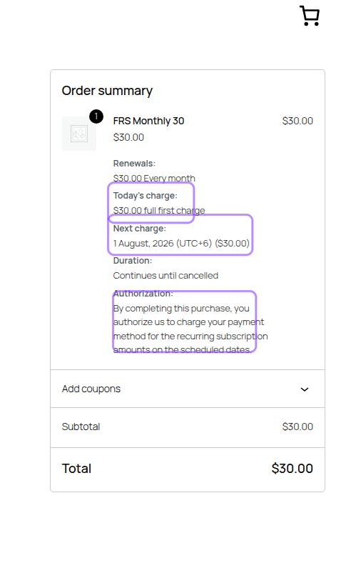

# Info
- Module: Billing and Renewals
- Availability: Free global Renewal Sync; Pro Flexible Renewal Sync and automatic gateway extensions
- Last updated: 2026-07-08

# Renewal Sync

> Align first renewals to predictable billing-cycle boundaries, then choose how the customer's first payment should behave.

**Availability:** Free for global Renewal Sync, Pro for product-level Flexible Renewal Sync

## Page Navigation

- **Current guide:** Renewal Sync
- **Where to open it:** WordPress Admin -> ArraySubs -> Settings -> General, and Products -> Edit Product -> Product data -> Subscription
- **Section overview:** [Open overview](./README.md)
- **Previous guide:** [renewal-operations](./renewal-operations.md)
- **Next guide:** [trial-management](./trial-management.md)
- **Troubleshooting:** [Audits, Logs, and Troubleshooting](../audits-and-logs/README.md)

**Last updated:** 2026-07-08

## Overview

Renewal Sync lets new subscriptions start on the checkout date but renew on a shared calendar boundary. That is useful when your business wants billing to happen on predictable dates, such as the first day of every month, the start of the store week, the next day for daily plans, or January 1 for yearly plans.

Use Renewal Sync when you sell subscription boxes, cohort memberships, magazine or content drops, first-of-month clubs, weekly delivery plans, or any subscription where operations and accounting are easier when renewals line up.

```box class="info-box"
Existing subscriptions are not changed when you enable Renewal Sync. The setting affects eligible new subscriptions created after checkout.
```

## Global Renewal Sync

The global setting is the simplest way to align new eligible subscriptions. Open **ArraySubs -> Settings -> General -> Renewal Sync**.



### Settings

| Setting | What it does |
|---|---|
| **Sync Renewals to Next Billing Cycle** | Enables renewal alignment for new eligible subscriptions. The first renewal date is moved to the next cycle boundary. |
| **First Charge: Prorate until the synced renewal date** | Charges only the remaining part of the current cycle at checkout. The first renewal on the synced date charges the full recurring amount. |
| **First Charge: Charge the full recurring amount** | Charges the full recurring amount at checkout. The first renewal still lands on the synced date and charges the full recurring amount again. |

### Boundary dates

ArraySubs calculates the next billing boundary from the subscription's billing period and the store timezone:

| Billing period | Synced first renewal boundary |
|---|---|
| Daily | Next day |
| Weekly | Next store week start day |
| Monthly | First day of the next month |
| Yearly | January 1 |

The subscription stores the synced next payment date. Renewal invoice generation, renewal reminders, gateway charging, and grace-period checks all use that stored date.

### How to configure global sync

1. Go to **ArraySubs -> Settings -> General**.
2. Find **Renewal Sync**.
3. Enable **Sync Renewals to Next Billing Cycle**.
4. Choose **First Charge**:
   - **Prorate until the synced renewal date** when the first payment should reflect only the remaining days in the current cycle.
   - **Charge the full recurring amount** when signup should always collect the standard recurring amount.
5. Click **Save Settings**.

```box class="warning-box"
Renewal Sync checkout is supported for manual/offline payment gateways and Stripe. Unsupported ArraySubs automatic gateways are hidden while a synced subscription is in the cart. Free trials and lifetime deals keep their normal schedule.
```

## Flexible Renewal Sync

Flexible Renewal Sync is the Pro product-level configuration for stores that need more control than one global first-charge mode. It lets each product split the billing cycle into active segments. The segment a customer signs up in decides how the first charge works.

Open **Products -> Edit Product -> Product data -> Subscription**.



### Segment behavior

| Segment | Typical use | Checkout behavior | First full renewal |
|---|---|---|---|
| **Full amount** | Early-cycle signups where the customer should pay the regular amount now | Charges the full recurring amount at signup | Next cycle boundary |
| **Prorate amount** | Mid-cycle signups where you want the first charge to match remaining time | Charges a prorated amount until the boundary | Next cycle boundary |
| **Charge full for next billing cycle** | Late-cycle signups where charging now should cover the upcoming cycle | Charges the full recurring amount at signup | One full cycle after the upcoming boundary |

Example: a monthly product uses boundaries **10** and **20**. A customer who signs up on day 8 falls into **Full amount**, a customer who signs up on day 15 falls into **Prorate amount**, and a customer who signs up on day 25 falls into **Charge full for next billing cycle**.

### Boundary rules

Flexible Renewal Sync uses a nominal cycle length to size the segment picker:

| Schedule | Segment picker length |
|---|---|
| Week | 7 days per billing interval |
| Month | 30 days per billing interval |
| Year | 365 days per billing interval |

Calendar cycles with extra days, such as 31-day months or leap years, add those extra days to the last active segment. Months still renew on the 1st, weeks still align to the store's start-of-week day, and years still align to January 1.

You can disable segments. At least one segment must remain active. When a segment is disabled, the remaining active segments expand to cover the full cycle.

```box class="info-box"
Flexible Renewal Sync is not available together with Different Renewal Price, free trials, or lifetime billing periods. Those features change the first-payment or renewal model, so ArraySubs keeps the checkout schedule unambiguous.
```

### How to configure a product

1. Go to **Products -> All Products** and edit the subscription product.
2. In **Product data**, make sure **Subscription** is enabled.
3. Open the **Subscription** tab.
4. Confirm the product is not using a trial, not using a lifetime billing period, and does not have **Different Renewal Price** enabled.
5. Enable **Flexible Renewal Sync to Next Billing Cycle**.
6. Move the boundary handles to split the cycle.
7. Leave all three segments enabled, or disable a segment when the remaining behaviors should cover the full cycle.
8. Click **Update**.

For variable products, configure the same feature inside the relevant variation's subscription fields. Each variation can have its own segment plan.

## What customers see

The cart and checkout summary explain the first charge and the next synced charge. This lets customers understand whether they are paying a prorated first amount, a full first amount, or a full amount that covers the next billing cycle.



In the screenshot above, the customer signs up for a monthly product on July 8, 2026. The product's first segment covers days 1-10, so checkout charges the full first amount. The next charge is synced to August 1, 2026.

## How Renewal Sync affects the subscription

When a synced subscription is created:

1. Checkout calculates the first payment according to the global mode or the product's flexible segment.
2. The subscription stores the full recurring amount as the normal renewal price.
3. The subscription's first next payment date is set to the synced boundary.
4. Renewal invoices and reminders use the stored next payment date.
5. After a successful renewal payment, the next date advances by the billing interval while staying anchored to the billing-cycle boundary.

```box class="info-box"
Product-level Flexible Renewal Sync is the right choice when different signup windows need different first-charge behavior. Use global Renewal Sync when every eligible product can use the same first-charge mode.
```

## Testing checklist

- Add the product to the cart from a logged-out or test customer session.
- Confirm checkout shows **Today's charge** and **Next charge** correctly.
- Confirm unsupported automatic gateways do not appear for the synced cart.
- Place a test order with a supported gateway.
- Open the created subscription and verify the **Next Payment Date** is the synced boundary.
- Check the first renewal invoice later uses the full recurring price unless the product's segment intentionally pushed the first full renewal one cycle forward.

## Troubleshooting

| Symptom | What to check |
|---|---|
| The product-level Flexible Renewal Sync panel is hidden | Confirm ArraySubsPro is active, the product is a subscription product, trial length is 0, billing period is not lifetime, and Different Renewal Price is disabled. |
| The First Charge dropdown is hidden in settings | Enable **Sync Renewals to Next Billing Cycle** first. The dropdown appears only when global sync is enabled. |
| Checkout shows a full first charge when you expected a prorated amount | Check the product's active segment for the signup day. Flexible Renewal Sync overrides the single global first-charge mode for that product. |
| The prorated amount is higher than expected | Gateway minimum-charge rules can raise very small prorated amounts, especially for Stripe. |
| A gateway is missing at checkout | Synced checkout supports manual/offline gateways and Stripe. Other ArraySubs automatic gateways are hidden for synced carts. |
