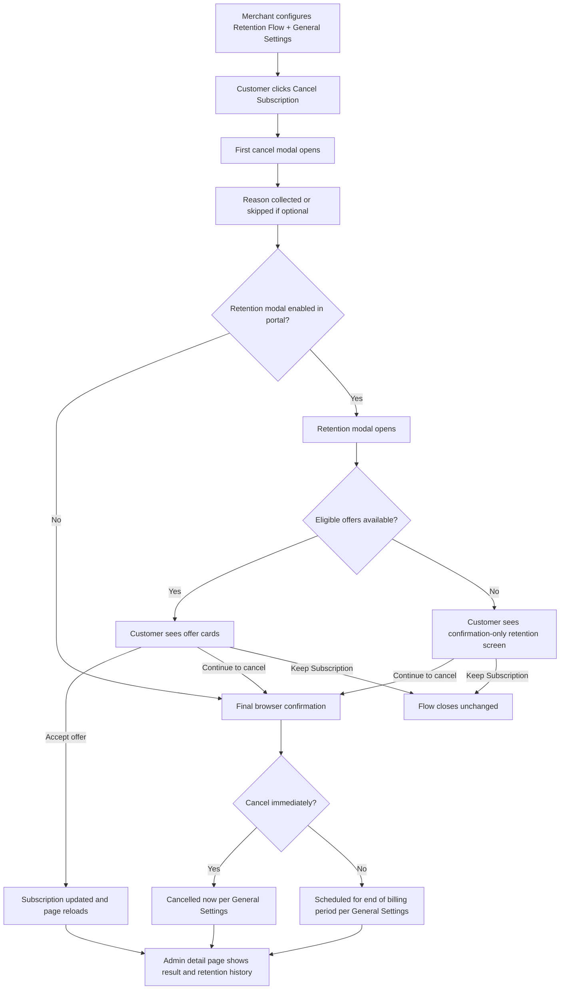

# Info
- Module: Retention Flow
- Availability: Shared
- Last updated: 16 March 2026

# User Guide
This section documents the full **Retention Flow** system in ArraySubs as it works now.

It covers the complete chain:

- how the merchant configures cancellation reasons and retention offers
- how the rebuilt customer portal modal flow behaves
- how retention offers branch from the cancel flow
- what happens after a customer accepts an offer or finishes cancelling
- what admins and support teams can review later

> **Note:** The **Cancel Immediately** toggle that controls whether cancellation is instant or end-of-period has moved to the [General Settings](../general-settings/README.md) page. The Retention Flow page focuses on cancellation reasons and retention offers.

This module is one of the most logic-heavy parts of ArraySubs because it combines:

- settings
- customer messaging
- multi-step modal flow
- conditional retention eligibility
- subscription updates
- customer email confirmation after accepted discount offers
- admin review history

## What this guide set includes

- [Retention Flow settings page](./settings-page.md)
- [Customer cancellation and retention flow](./customer-portal-flow.md)
- [Admin subscription detail actions for cancellation](./admin-subscription-detail-actions.md)

## System overview

## Availability and support boundaries

The cancellation and retention system itself belongs to the main ArraySubs experience.

However, runtime behavior depends on how the subscription renews.

- **Manual-payment subscriptions:** actionable retention flow supported
- **Stripe automatic-payment subscriptions:** actionable retention flow supported
- **Other automatic gateways:** the customer still gets a confirmation-style retention step, but not the same actionable offer experience

> **Pro:** Automatic-payment retention offers are currently supported for Stripe subscriptions. Unsupported automatic gateways fall back to a confirmation-style path instead of showing actionable retention offers.

## What changed in the rebuilt customer flow

The current portal flow is a structured sequence, not a one-click cancellation.

It now works like this:

1. customer opens the first cancel modal
2. customer reads warning copy that matches immediate or end-of-period cancellation mode
3. customer chooses a reason, optionally adding extra details for **Other**
4. customer moves into the retention modal when that step is enabled
5. the retention modal either:
   - shows eligible offer cards, or
   - becomes a confirmation-only “before you go” screen
6. final cancellation still requires an explicit confirmation checkpoint

## Why this matters for merchants and support teams

This module changes more than wording.

It changes:

- whether customers lose access now or later
- whether the cancel flow tries to rescue the subscription first
- what kinds of alternatives are offered
- whether accepted discount offers trigger a customer confirmation email
- how acceptance history appears later in wp-admin
- how active retention discounts are reflected in the subscription view

## Email behavior after accepted discount offers

When a customer accepts a **discount-style** retention offer, ArraySubs now sends a customer email confirming that the discount was applied.

That email helps the customer understand:

- that cancellation stopped
- that the subscription stayed active
- what discount was accepted
- what the new recurring amount looks like
- how many upcoming renewals the discount affects

Merchants can manage that email from **WooCommerce → Settings → Emails**.

Look for the ArraySubs email entry for the retention discount acceptance notification if you want to:

- enable or disable it
- change the subject and heading
- edit the additional email content

## Related guides

### General Settings
- [Cancellation Settings (Cancel Immediately toggle)](../general-settings/cancellation-settings.md)
- [General Settings overview](../general-settings/README.md)

### Customer Portal
- [Cancel Subscription and Retention Offers](../customer-portal/cancel-subscription-screen.md)
- [Subscription Details screen](../customer-portal/subscription-details-screen.md)
- [Skip Next Renewal screen](../customer-portal/skip-next-renewal-screen.md)
- [Vacation Mode screen](../customer-portal/vacation-mode-screen.md)

### Admin
- [Manage Subscription Admin](../manage-subscription-admin/README.md)
- [Subscription details and notes](../manage-subscription-admin/subscription-details-and-notes.md)
- [Orders, refunds, and cancellation](../manage-subscription-admin/orders-refunds-and-cancellation.md)

# Use Case
A merchant wants to reduce churn without removing self-service. They configure reason-based retention offers, then train support staff to understand the new two-step modal sequence, the unsupported-gateway fallback behavior, and the admin review path for cancellations and accepted offers.

# FAQ
### Is this topic only about settings?
No. It covers settings, the customer portal flow, and the admin review/action layer.

### Do customers always see a retention offer card?
No. If no eligible offer is available, the retention modal becomes a confirmation-only screen instead.

### Is the rebuilt flow available for automatic gateways?
Yes for Stripe. Other automatic gateways use the confirmation-style fallback rather than the same actionable retention-offer experience.

### Can admins see what happened later?
Yes. The subscription detail page can show cancellation state, retention history, and active discount context.