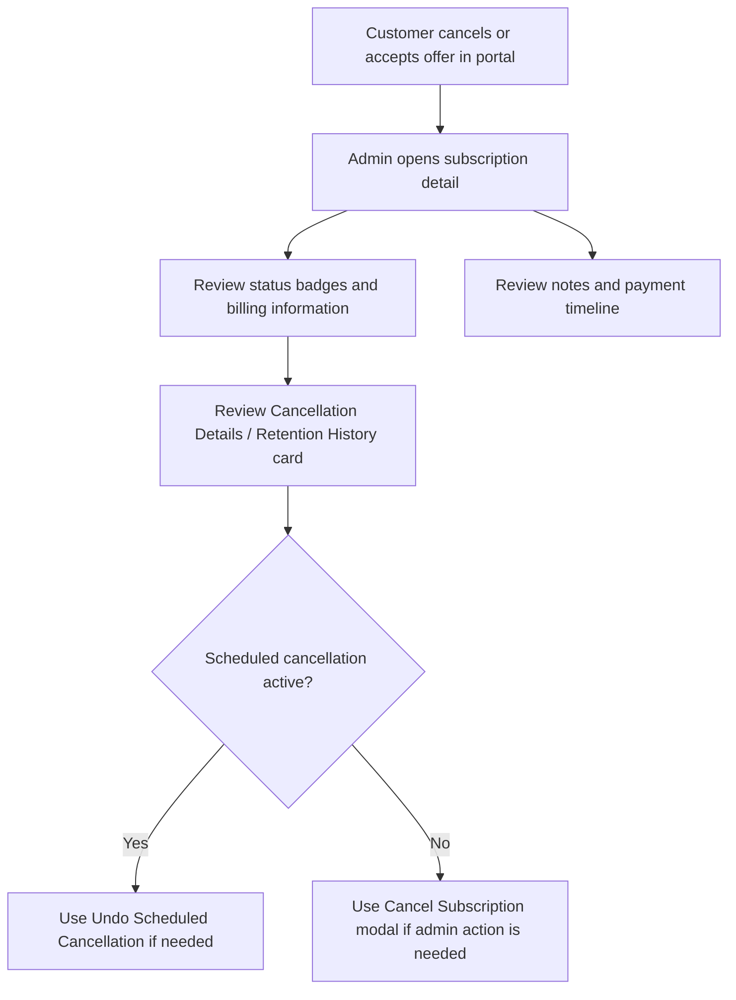

# Info

-   Module: Admin Subscription Detail Actions for Cancellation
-   Availability: Shared
-   Last updated: 16 March 2026

  

# User Guide

This guide explains the admin-side cancellation and retention workflow on the subscription detail screen.

The customer portal may start the cancellation conversation, but the admin detail page is where support teams:

-   manually cancel subscriptions
-   undo scheduled cancellations
-   review cancellation reasons
-   review retention history
-   confirm whether a retention discount is active

## Where admins use this

Open:

-   **WordPress Admin → ArraySubs → Subscriptions → open a subscription**

## Main header actions

Depending on state, the detail page shows one of these cancellation actions.

### Cancel Subscription

When the subscription is still cancellable, admins can open the admin cancellation modal.

### Undo Scheduled Cancellation

When the subscription is already marked to end at period end, the action changes to **Undo Scheduled Cancellation**.

## The admin cancel modal

The admin modal is operational and straightforward.

It includes:

-   **Cancel Immediately**
-   **Cancel at End of Period**
-   optional reason field
-   **Keep Subscription**
-   **Confirm Cancellation**

## Admin choices

### Cancel Immediately

Use this when the subscription should end now.

Examples:

-   hard-stop customer requests
-   abuse or policy handling
-   access should end immediately

### Cancel at End of Period

Use this when the subscription should finish the current paid term before ending.

Examples:

-   “do not renew again” requests
-   lower-friction customer offboarding
-   support-approved end-of-term cancellation

## What admins can review afterward

### Cancellation Details / Retention History card

The detail page can show:

-   whether the subscription is cancelled or waiting for cancellation
-   scheduled cancel date
-   cancelled date
-   cancellation reason label
-   additional reason details
-   which retention offers were shown
-   which retention offer was accepted
-   when the retention step happened

This helps support answer questions like:

-   Did the customer actually cancel?
-   Was it immediate or scheduled?
-   Did they see offers?
-   Did they accept one?
-   Should the customer also have received a discount-confirmation email?

### Billing Information card

If a retention discount is active, the billing area can show:

-   the current effective recurring amount
-   the base renewal amount
-   the retention discount value
-   how many discounted renewals remain

This is the key admin check after a customer accepts a discount offer.

## Undoing a scheduled cancellation

The undo action is useful when:

-   the customer changes their mind before the end date
-   support resolves the problem and the customer wants to stay
-   the scheduled cancellation was a mistake

Undoing the scheduled cancellation keeps the same subscription record alive instead of requiring a replacement subscription.

## Admin workflow diagram

## Relationship to customer portal behavior

The admin screen does not configure retention offers. It reviews and acts on the results of what happened.

To understand the customer side, read:

-   [Customer cancellation and retention flow](./customer-portal-flow.md)
-   [Cancel Subscription and Retention Offers](../customer-portal/cancel-subscription-screen.md)

## Related guides

-   [Cancellation & Retention settings page](./settings-page.md)
-   [Subscription details and notes](../manage-subscription-admin/subscription-details-and-notes.md)
-   [Orders, refunds, and cancellation](../manage-subscription-admin/orders-refunds-and-cancellation.md)

# Use Case

A customer accepts a temporary discount in the portal and later contacts support to confirm it really applied. The support agent opens the subscription detail page, checks the billing information for the effective recurring amount and remaining discounted renewals, then reviews the cancellation/retention history card to confirm the accepted offer. Support can also explain that the customer should have received a confirmation email about the accepted discount.

# FAQ

### Can admins choose a different cancellation type than the customer-facing default?

Yes. The admin modal lets admins choose immediate or end-of-period cancellation directly.

### Where can support confirm that a retention discount is active?

In the billing information area and the cancellation/retention history area of the subscription detail page.

### Should support expect a customer email after a discount offer is accepted?

Yes. Accepted discount-style retention offers can send a customer confirmation email summarizing the pricing change.

### Does Undo Scheduled Cancellation create a new subscription?

No. It restores the existing subscription’s renewal path.

### Is this where offer rules are configured?

No. Offer rules are configured on the **Cancellation & Retention** settings page.
