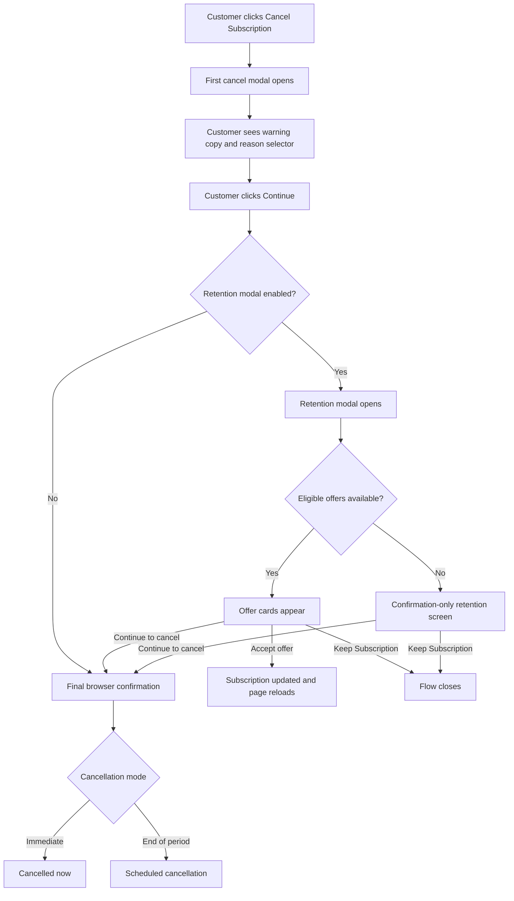

# Info
- Module: Customer Cancellation and Retention Flow
- Availability: Shared
- Last updated: 16 March 2026

# User Guide
This guide explains the current customer-facing cancellation flow in the ArraySubs portal.

It is based on the rebuilt modal sequence now used in the Customer Portal.

## Where the flow starts

Customers usually begin here:

- **My Account → Subscriptions → View subscription → Cancel Subscription**

The button only appears when the subscription is actually cancellable in the portal.

## Full customer flow

## Step 1: The first cancel modal

The first modal appears immediately after the customer clicks **Cancel Subscription**.

It includes:

- the cancellation warning message
- the reason selector
- the extra details field for **Other**
- **Keep Subscription**
- **Continue**

### Warning message behavior

The warning message reflects the store’s cancellation mode.

#### Immediate mode
The customer is warned that cancellation happens right away.

#### End-of-period mode
The customer is told the subscription remains active until the current billing period ends.

## Step 2: Reason collection

The rebuilt flow collects the reason in the first modal.

### If the reason is required

The customer must select a reason before continuing.

### If the reason is optional

The selector still appears, but the customer may continue without choosing one.

### If the customer chooses Other

An extra text field appears so they can add more details.

## Step 3: The retention modal

If retention is enabled for the portal flow, the customer moves to the retention modal after pressing **Continue**.

This is the **Before You Go** stage.

Its purpose is to offer a way to stay before final cancellation happens.

## Two versions of the retention modal

### Offer mode

If the subscription is eligible, the modal shows actionable offer cards.

Each card includes:

- title
- description
- action button

### Confirmation-only mode

If no actionable offer is available, the retention modal becomes a confirmation screen instead.

That can happen because:

- no enabled offer matched the selected reason
- the subscription was not eligible for the available offers
- the subscription used an unsupported automatic gateway for actionable retention offers

In that case the modal still gives the customer clear choices:

- **Keep Subscription**
- **No thanks, continue to cancel**

## Offer types customers can see

### Discount offer

This offers a temporary discount on future renewals.

Customer-visible result:

- the subscription stays active
- the recurring amount should reflect the discounted effective amount after reload
- the customer should receive a confirmation email about the accepted discount

### Pause offer

This pauses the subscription instead of cancelling it.

Customer-visible result:

- the subscription moves into a paused/on-hold style outcome instead of ending immediately

### Downgrade offer

This offers a lower-cost plan path instead of cancellation.

Customer-visible result:

- the customer moves into a change-plan path rather than a simple cancellation result

### Contact Support offer

This sends the customer to the configured support destination.

Customer-visible result:

- it is a help route, not an automatic subscription change

## Gateway support boundary

- **Manual-payment subscriptions:** actionable retention flow supported
- **Stripe automatic-payment subscriptions:** actionable retention flow supported

> **Pro:** Stripe automatic-payment subscriptions support the actionable retention flow. Other automatic gateways use the confirmation-style fallback instead.

## Step 4: Final cancellation confirmation

If the customer continues cancelling, the portal still asks for one more final confirmation before the request is submitted.

This gives the customer multiple chances to stop the cancellation.

## Step 5: Final outcome

### Immediate cancellation

- the subscription is cancelled right away
- the page reloads and shows the cancelled state

### End-of-period cancellation

- the subscription is marked to cancel later
- the subscription remains active until the current paid period ends
- the page reloads to show the scheduled-cancellation state

## What happens when the customer accepts an offer

When the customer accepts an offer:

- the cancellation flow stops
- the subscription is updated according to that offer
- the page reloads so the customer sees the result

Examples:

- accepted discount reflected in the displayed recurring amount
- accepted discount confirmed by email with the new pricing summary
- accepted pause reflected in subscription timing/status
- downgrade path taking the customer into a plan-change route

### Discount-offer email confirmation

When the accepted offer is a discount-style retention offer, ArraySubs sends a customer email confirming the result.

That email is meant to reassure the customer that:

- the cancellation flow stopped
- the discount is active
- the subscription remains active
- the recurring price shown after reload is intentional

This is especially helpful when the customer accepts an offer and then immediately wonders whether the lower amount really applied.

## Related but separate self-service actions

This cancellation-retention flow is related to, but separate from:

- **Change Plan**
- **Skip Next Renewal**
- **Vacation Mode**

Those are nearby portal tools, but they are not the same as the cancel-and-retention modal sequence.

# Use Case
A customer clicks **Cancel Subscription**, chooses **Too expensive**, and continues. The retention modal opens and shows a discount offer. If the customer accepts it, cancellation stops, the page reloads, the discounted recurring amount becomes the current customer-facing amount, and the customer receives an email confirming the accepted discount.

# FAQ
### Does the customer go straight to the retention screen?
No. The customer first sees the cancel modal, then the retention modal.

### What happens if no offer is available?
The retention modal becomes a confirmation-only screen instead of showing offer cards.

### Does every accepted retention offer send the same email?
No. This confirmation email is specifically relevant to accepted discount-style retention offers, because those offers change future renewal pricing.

### Can unsupported automatic gateways still use the rebuilt cancel flow?
Yes, but they do not get the same actionable retention offers. They get the confirmation-style fallback instead.

### Is Contact Support the same as accepting a subscription change?
No. It opens the configured support destination but does not automatically change the subscription by itself.