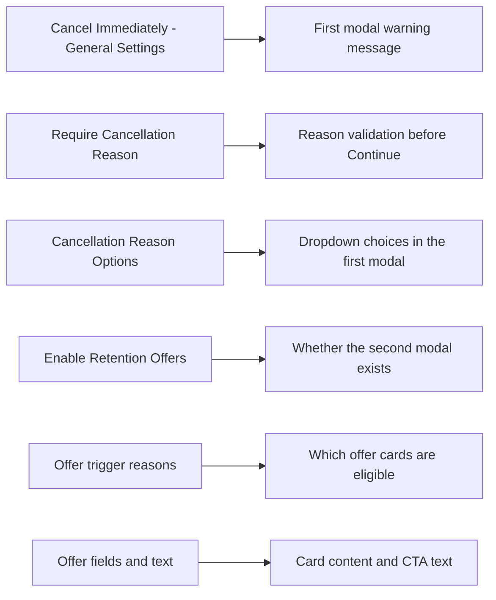

# Info
- Module: Retention Flow Settings Page
- Availability: Shared
- Last updated: 16 March 2026

# User Guide
The **Retention Flow** settings page controls the cancellation-reason and retention-offer policy behind the rebuilt cancel flow in the customer portal.

This page decides:

- whether the customer must choose a reason
- which reasons appear in the first modal
- whether the retention modal is part of the flow
- which offer types can appear there
- which reasons trigger which offers

> **Note:** The **Cancel Immediately** toggle that controls whether cancellation is instant or end-of-period has moved to the [General Settings → Cancellation Settings](../general-settings/cancellation-settings.md) card.

## Where to find it

Open:

- **ArraySubs → Retention Flow**

## What the page controls

The page is organized into these sections:

1. **Cancellation Reasons**
2. **Cancellation Reason Options**
3. **Retention Offers**
4. **Discount Offer**
5. **Pause Offer**
6. **Downgrade Offer**
7. **Contact Support Offer**

> The **Cancellation Settings** section (Cancel Immediately toggle) is now on the [General Settings](../general-settings/cancellation-settings.md) page.

## Settings-to-portal map

## Cancellation Reasons

> **Moved:** The **Cancel Immediately** toggle is now part of the [General Settings → Cancellation Settings](../general-settings/cancellation-settings.md) card.

This section controls whether customers must choose a reason before moving forward.

### Require Cancellation Reason

When enabled:

- the first cancel modal requires a reason
- the customer cannot continue without choosing one

When disabled:

- the reason selector still appears in the modal
- but the customer can continue without selecting one

### Important behavior note

In the rebuilt flow, the first cancel modal still appears even when the reason is optional. Optional only changes validation, not the existence of the step.

## Cancellation Reason Options

This is the reason library used by the customer portal.

You can:

- add reasons
- remove reasons
- rename labels
- reorder them

Each reason has:

- **Reason Key** — internal identifier
- **Display Label** — text customers see

### Recommended keys

Examples:

- `too_expensive`
- `not_using`
- `found_alternative`
- `missing_features`
- `technical_issues`
- `temporary_pause`
- `other`

### Why `other` matters

If the list includes `other`, the first cancel modal can reveal an extra details field for free-text feedback.

## Retention Offers

This is the master switch for the second modal in the rebuilt flow.

### Enable Retention Offers

When enabled:

- the portal can open the retention modal after the first cancel modal
- ArraySubs can attempt to save the subscription before final cancellation

When disabled:

- the customer goes from the first modal to the final cancellation path without the retention step

## Discount Offer

Use this when you want to rescue price-sensitive customers.

### What it controls

- whether the discount offer is available
- which reasons can trigger it
- the discount percentage
- how many billing cycles it lasts
- custom headline and description text

### Merchant impact

When a customer accepts this offer:

- the discount is saved against the subscription’s retention history
- the subscription’s effective recurring amount becomes the customer-facing display amount
- the customer can receive a confirmation email summarizing the accepted discount
- the same discount should not be offered again to that same subscription

### Email template and notification control

The Retention Flow settings page controls whether the discount offer exists and how it behaves in the portal.

The email sent after an accepted discount offer is managed separately in **WooCommerce → Settings → Emails**.

Use that email screen when you want to:

- enable or disable the notification
- customize the subject line
- customize the heading and additional message content

> **Pro:** Direct retention-discount renewal support currently applies to **manual-payment subscriptions** and **Stripe automatic renewals**.

## Pause Offer

Use this when customers need time away, not a permanent exit.

### What it controls

- whether a pause option appears in the retention modal
- which reasons can trigger it
- the maximum pause duration in days
- custom title and description text

### Important distinction

This **Pause Offer** is part of the cancellation-retention flow.

It is different from the separate **Vacation Mode** self-service controls that may appear elsewhere in the customer portal.

## Downgrade Offer

Use this when a lower-cost plan is the best rescue path.

### What it controls

- whether downgrade rescue can appear
- which reasons can trigger it
- custom headline and description

### Dependency

This depends on valid downgrade paths already being configured in your plan-switching setup. If downgrade options are not configured for the subscription product, the customer will not get a usable downgrade path.

## Contact Support Offer

Use this when you want at-risk customers to speak to your team before leaving.

### What it controls

- whether a support offer appears
- which reasons can trigger it
- the support destination URL
- custom title, description, and button text

### What it does not do

This offer does not itself cancel or transform the subscription. It sends the customer to the support destination you configured.

## What this page does not configure

This page does **not** control every nearby portal feature.

It does not directly configure:

- **Cancel Immediately** — that toggle is now on the [General Settings](../general-settings/cancellation-settings.md) page
- **Skip Next Renewal** self-service
- **Vacation Mode** self-service
- full plan-switching setup outside the downgrade retention path

## Good setup practices

- keep your reason list clear and short
- include `other` for flexible feedback
- target discount offers at price-related reasons
- target pause offers at temporary-break reasons
- enable downgrade only when downgrade paths are ready
- make sure the support URL is real and monitored
- test the portal flow after saving changes

## Related guides

- [General Settings → Cancellation Settings](../general-settings/cancellation-settings.md)
- [Customer cancellation and retention flow](./customer-portal-flow.md)
- [Admin subscription detail actions for cancellation](./admin-subscription-detail-actions.md)
- [Cancel Subscription and Retention Offers](../customer-portal/cancel-subscription-screen.md)
- [Vacation Mode screen](../customer-portal/vacation-mode-screen.md)
- [Skip Next Renewal screen](../customer-portal/skip-next-renewal-screen.md)

# Use Case
A merchant sees frequent “too expensive” cancellations. They enable retention offers, target **Discount Offer** and **Downgrade Offer** at price-related reasons, and keep **Contact Support** available for issue-related reasons. The customer portal now presents better rescue options before final cancellation.

# FAQ
### If the reason is optional, is the reason selector hidden?
No. The selector still appears in the first modal.

### Does enabling an offer guarantee customers will see it?
No. The reason must match, the subscription must be eligible, and the offer must actually be usable for that subscription.

### Does the Contact Support offer change the subscription automatically?
No. It opens the support destination you configured.

### Is this where Skip Next Renewal is configured?
No. That is a separate feature outside this settings page.