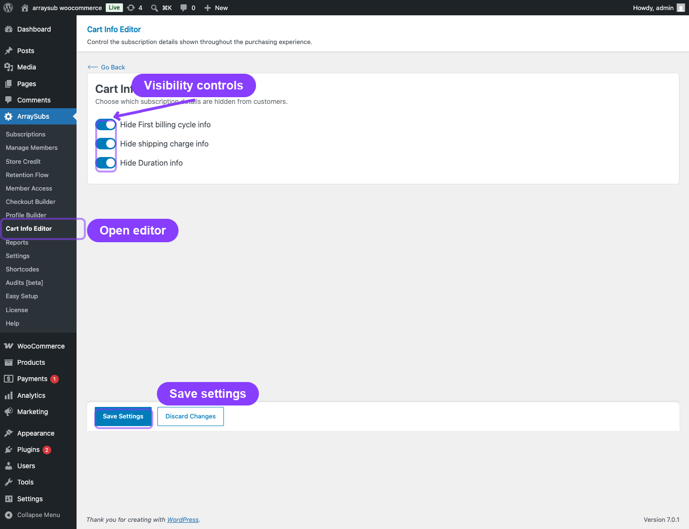

# Info
- Module: Cart Info Editor
- Availability: Pro
- Last updated: 2026-07-16

# Cart Info Editor

> Hide selected subscription explanations throughout the purchase experience without changing the prices, schedules, shipping charges, or subscription rules behind them.

**Availability:** Pro

## Page Navigation

- **Current guide:** Cart Info Editor
- **Where to open it:** WordPress Admin -> ArraySubs -> Cart Info Editor
- **Direct route:** `/wp-admin/admin.php?page=arraysubs-mainadmin#/cart-info-editor`
- **Section overview:** [Manual Home](../README.md)
- **Previous guide:** [Profile Builder](../profile-builder/README.md)
- **Next guide:** [Reports Hub](../analytics/reports-hub.md)
- **Troubleshooting:** [Audits, Logs, and Troubleshooting](../audits-and-logs/README.md)

## Overview

Cart Info Editor is a global display-control page in ArraySubs Pro. It lets you hide first-billing-cycle, shipping-charge, and subscription-duration explanations when those details would otherwise appear during a purchase.

The controls work across WooCommerce block and classic cart experiences, block and classic checkout, mini-cart or flying-cart displays, and newly generated emails that include the relevant item details.

## When to Use This

- Your cart or checkout feels crowded with subscription explanations.
- A landing page already explains the first billing period or fixed duration.
- You want customers to see the actual shipping amount without an additional recurring or one-time shipping note.
- You want the same streamlined presentation across block and classic WooCommerce layouts.

## How It Works

Each setting works independently. When a relevant subscription information row would normally appear, ArraySubs removes that row before the customer-facing item details are rendered.

All three settings are off by default. Turning one on changes presentation only. It does not change the subscription product, the amount due, renewal dates, shipping calculation, or subscription length.

## Real-Life Use Cases

### Compact Digital Membership Checkout

A membership site explains its billing terms on the pricing page and wants a shorter checkout summary. The merchant hides the first-billing-cycle and duration information while keeping the price, today's charge, renewals, and next charge visible.

### Physical Subscription With Separate Shipping Copy

A subscription-box store explains shipping in its delivery policy. The merchant hides the shipping charge explanation while WooCommerce continues to calculate and display the actual shipping amount.

### Fixed-Term Program

A course sells a fixed number of billing cycles but explains the full program timeline during enrollment. The merchant hides the duration row from cart and checkout summaries without changing when the subscription ends.

## How to Configure It

1. Go to **WordPress Admin → ArraySubs → Cart Info Editor**.
2. Turn on any information you want to hide:
   - **Hide First billing cycle info**
   - **Hide shipping charge info**
   - **Hide Duration info**
3. Click **Save Settings**.
4. Reload a cart, checkout, or mini-cart containing an applicable subscription product.
5. Place a test order if you also want to verify newly generated customer and admin emails.

Use **Discard Changes** before saving when you want to restore the form to its last saved values.

## Settings Reference

| Setting | Default | What It Hides | What It Does Not Change |
|---|---|---|---|
| **Hide First billing cycle info** | Off | The first-cycle coverage explanation produced by Flexible Renewal Sync when it uses next-cycle mode | Initial payment calculation, billing schedule, or next charge date |
| **Hide shipping charge info** | Off | Explanatory recurring or one-time shipping copy, including the related checkout note | Shipping method, shipping address, rate calculation, or shipping amount |
| **Hide Duration info** | Off | The displayed duration, whether it is a fixed number of billing cycles or "Continues until cancelled" | Stored subscription length, renewal schedule, expiration, or cancellation behavior |

## Supported Surfaces

| Surface | Supported Experience |
|---|---|
| Cart | WooCommerce Cart block and classic cart |
| Checkout | WooCommerce Checkout block and classic checkout |
| Mini-cart / flying cart | Block mini-cart drawer and classic WooCommerce mini-cart widget |
| Emails | Newly generated WooCommerce and ArraySubs emails that render the relevant order-item details |

A setting only hides information that the product or billing configuration would otherwise produce.

## What Happens After Saving

- The settings apply globally on the next render or page refresh.
- Each enabled setting removes only its matching information.
- Other purchase details remain visible, including the product price, renewals, today's charge, next charge, order total, and actual shipping amount.
- Existing subscription data and previously sent emails are not rewritten.

## Important Notes

- Cart Info Editor controls presentation only. It does not change billing or fulfillment logic.
- The settings are global rather than per-product.
- Some side carts cache their open state in the browser. Close and reopen the cart, or refresh the page, after changing a setting.
- Third-party cart widgets that bypass standard WooCommerce item data may require their own integration.

## Testing Checklist

1. Add subscription products that produce the information you want to test:
   - A plan using Flexible Renewal Sync in next-cycle mode for first-billing-cycle information.
   - A physical subscription for shipping information.
   - A fixed-length or unlimited subscription for duration information.
2. Confirm the relevant details appear while the settings are off.
3. Enable one setting and click **Save Settings**.
4. Refresh the cart, checkout, and mini-cart and confirm only that detail is hidden.
5. Repeat for the other settings.
6. Test both block and classic WooCommerce layouts when your store uses both.
7. Place a test order and review newly generated emails.

## Troubleshooting

| Problem | Likely Cause | What to Do |
|---|---|---|
| An enabled detail still appears | The setting was not saved, or the page or side cart is showing cached markup | Click **Save Settings**, refresh the page, and reopen the mini-cart |
| Shipping still appears in the totals | The setting hides explanatory shipping copy, not the real WooCommerce shipping charge | Confirm the explanatory note is gone and leave the calculated total visible |
| A detail is absent while its toggle is off | The current product or billing configuration does not generate that row | Test with Flexible Renewal Sync in next-cycle mode, a physical subscription, or a fixed-length or unlimited subscription |
| Cart Info Editor is missing from the menu | ArraySubs Pro is not active or does not include this feature version | Activate or update ArraySubs Pro |
| An older email still contains previous content | Sent emails are historical and are not rewritten | Generate a new test order and inspect the new email |

## Related Guides

- [Subscription Checkout](../checkout-and-payments/subscription-checkout.md) — Cart rules, checkout behavior, and subscription creation.
- [Product Experience and Display](../subscription-products/product-experience.md) — Subscription details shown across storefront surfaces.
- [Subscription Shipping](../subscription-shipping/README.md) — Configure one-time or recurring shipping behavior.
- [Emails and Notifications](../emails/README.md) — Configure and test subscription emails.

## FAQ

### Does Cart Info Editor change the renewal schedule or amount?

No. It only hides selected explanatory information. Prices, dates, and renewal processing stay unchanged.

### Does Hide shipping charge info remove the actual shipping charge?

No. WooCommerce still calculates and displays the real shipping amount. The setting removes only the related subscription shipping explanation.

### Does this work with block and classic themes?

Yes. It supports WooCommerce block and classic cart and checkout layouts, plus their standard mini-cart experiences.

### Can I hide only one type of information?

Yes. The three settings are independent.

### Does the change affect an existing cart?

The display updates the next time the cart information is rendered or refreshed. The stored cart items and subscription product data are not changed.

### Are previously sent emails changed?

No. The setting applies to newly generated output. Emails that were already sent remain unchanged.
