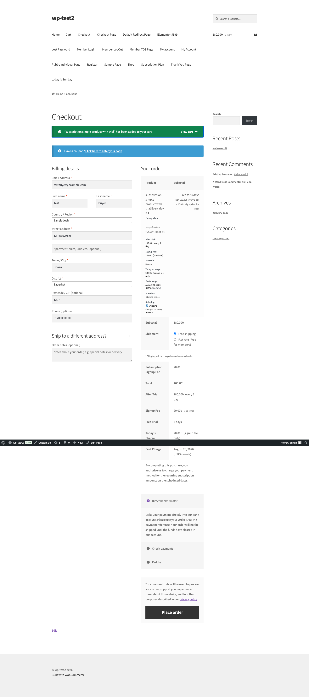
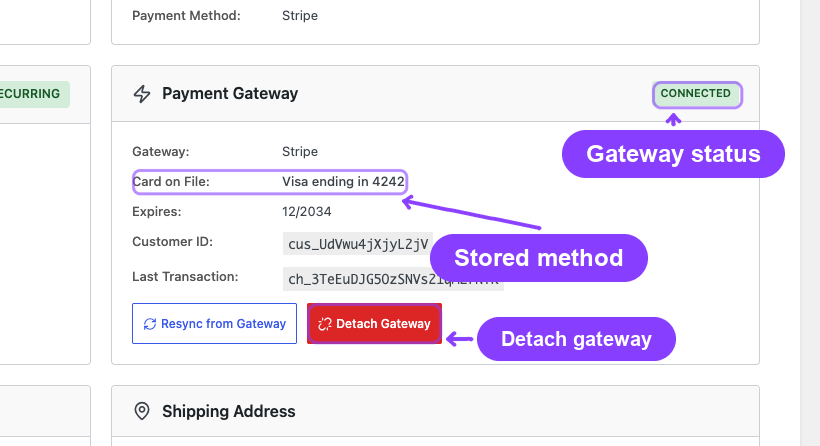

# Info
- Module: Automatic Payments
- Availability: Pro
- Last updated: 2026-08-17

# Gateway Overview and Architecture

> How ArraySubs connects to payment gateways for automatic recurring billing — the two billing models, supported gateways, capability matrix, and payment method lifecycle.

**Availability:** Pro

## Page Navigation

- **Current guide:** Gateway Overview and Architecture
- **Where to open it:** Storefront checkout, WordPress Admin -> ArraySubs -> Audits [beta] -> Gateway Logs, and ArraySubs -> Subscriptions -> subscription detail
- **Section overview:** [Open overview](../README.md)
- **Previous guide:** [paypal](./paypal.md)
- **Next guide:** [stripe](./stripe.md)
- **Troubleshooting:** [Audits, Logs, and Troubleshooting](../../audits-and-logs/README.md)

## Overview

ArraySubs Pro integrates with four payment gateways — **Stripe**, **PayPal**, **Paddle**, and **Mollie** — to process subscription payments automatically. Each gateway handles initial checkout payments, stores customer payment methods, and charges renewal invoices without merchant or customer intervention.

Stripe and Mollie ride the gateway plugin you already use for checkout: ArraySubs adds the recurring half rather than replacing your payment provider. PayPal and Paddle are ArraySubs' own checkout gateways.


The architecture supports two fundamentally different billing models, and understanding which model your gateway uses is essential for configuring your store correctly.

## Two Billing Models



### ArraySubs-Managed Billing

ArraySubs controls the entire billing schedule. It decides when to charge, generates the renewal invoice, and sends a charge request to the gateway.

**How it works:**
1. ArraySubs calculates the next payment date based on the subscription's billing cycle
2. When the date arrives, the renewal engine creates an invoice and tells the gateway to charge the stored payment method
3. The gateway processes the charge off-session (no customer action needed)
4. The result (success or failure) comes back to ArraySubs via webhook

**Used by:** Stripe, Mollie

**Advantages:** Full control over billing timing, grace periods, retry logic, and renewal dates. The billing schedule in ArraySubs is always the single source of truth.

### Gateway-Managed Billing

The payment gateway controls its own billing cycle. ArraySubs creates the initial subscription agreement, and the gateway handles all future charges on its own schedule.

**How it works:**
1. During checkout, ArraySubs creates a billing agreement or subscription on the gateway's platform
2. The gateway charges the customer according to its own schedule
3. When a charge occurs, the gateway sends a webhook to ArraySubs
4. ArraySubs creates the corresponding renewal order and updates the subscription

**Used by:** PayPal, Paddle

**Advantages:** Simpler integration, the gateway handles PCI compliance and SCA challenges internally, and features like Paddle's automatic tax/VAT are handled natively.

```box class="info-box"
With gateway-managed billing, the gateway is the source of truth for payment timing. When ArraySubs fires a renewal event for PayPal or Paddle subscriptions, **no local charge is sent** — the system waits for the gateway's webhook to confirm a payment occurred.
```

---

## Who Owns the Billing Clock

Before the capability matrix, one distinction explains most of the differences in it: **who decides when the next charge happens.**

| Gateway | Owns the billing clock | What that means |
|---|---|---|
| Stripe | ArraySubs | ArraySubs stores the next payment date and charges on it. Skip, pause, manual date changes, and early renewal are local decisions with nothing remote to keep in step. |
| Mollie | ArraySubs | Same as Stripe. Mollie holds a mandate, not a schedule. |
| PayPal | PayPal | PayPal's Subscriptions API holds `next_billing_time` and charges on its own cadence. ArraySubs records what PayPal reports. |
| Paddle | Paddle | Paddle holds `next_billed_at`. ArraySubs can *move* that date through the API, so skip and manual date changes work — but the provider is still the authority. |

When a provider owns the clock, ArraySubs will not quietly change a local date that the provider is going to ignore. Any action that moves a payment date — **Skip**, **Pause**, a manual date change, **Record Payment** — is propagated to the provider first and only committed locally once the provider accepts it. If the provider has no call for it, the action is refused with a reason rather than silently drifting out of step.

```box class="warning-box"
On PayPal, **Skip** and manual next-payment-date changes are refused. PayPal's Subscriptions API exposes no call that moves the next billing date, so a local change would put your store and PayPal on two different schedules. Pause and resume *are* supported, because PayPal has real suspend and activate calls.
```

---

## Gateway Capability Matrix

Not all gateways support the same features, because their APIs do not. Every gateway declares exactly what it can do; the matrix below is that declaration in plain language. The same information, live for your own store, is on the **Gateway Health** screen — expand any gateway card to see its capability tags and the reason behind anything unavailable.

### Billing and checkout

| Capability | Stripe | PayPal | Paddle | Mollie |
|---|---|---|---|---|
| **Automatic payments** | Yes | Yes | Yes | Yes |
| **Billing model** | ArraySubs-managed | Gateway-managed | Gateway-managed | ArraySubs-managed |
| **Requires another plugin** | Yes (WooCommerce Stripe) | No | No | Yes (Mollie for WooCommerce) |
| **Free trials** | Yes | Yes | Yes | Card and PayPal methods only |
| **Mixed cart** (subscription + normal products) | Yes | No | Yes | Yes |
| **Several subscriptions in one checkout** | Yes | No | Yes | Yes |
| **Different billing cycles in one checkout** | Yes | No | No | Yes |
| **Customer-chosen schedule** (flexible duration) | Yes | Yes | No | Yes |
| **Quantity above one** | Yes | Yes | Yes | Yes |
| **Signup fee** | Yes | Yes | Yes | Yes |
| **Recurring shipping** | Yes | Yes | Yes | Yes |
| **Coupons at checkout** | Yes | First payment only | Yes | Yes |
| **Recurring coupons** (discount that keeps applying) | Yes | No | Yes | Yes |
| **Hosted payment page** | Yes | No | Yes (Paddle.js overlay) | Yes (Mollie hosted) |
| **Product sync required** | No | Plans created automatically | Yes | No |

### Lifecycle and money movement

| Capability | Stripe | PayPal | Paddle | Mollie |
|---|---|---|---|---|
| **Pause / Resume at the provider** | Not needed (local) | Yes | Yes | Not needed (local) |
| **Cancel at end of period** | Yes | Yes (local) | Yes (provider-scheduled) | Yes |
| **Reverse a scheduled cancellation** | Yes | No | Yes | Yes |
| **Plan switching** | Yes | Next cycle only | Yes | Yes |
| **Retention discount** | Yes | Yes, from next renewal | Yes, immediately | Yes |
| **Mid-cycle price change** | Yes | No | Yes | Yes |
| **Skip a renewal / change the date** | Yes | No | Yes | Yes |
| **Early renewal** | Yes | No | Off by default (setting) | Yes |
| **Refunds** | Yes | Yes | Yes | Yes |
| **Partial refunds** | Yes | Yes | Yes | Yes |
| **Disputes / chargebacks recorded** | Yes | Yes | Yes | Yes |
| **Charge reconciliation** (missed webhook) | Yes | Yes | Yes | Yes |

### Payment method

| Capability | Stripe | PayPal | Paddle | Mollie |
|---|---|---|---|---|
| **Payment method update** | Yes | Yes (new agreement) | Yes (Paddle billing flow) | Yes (rebind the mandate) |
| **Card auto-update** (reissued cards) | Yes | No | Yes | No |
| **Card expiry warning email** | Yes | Card-funded subscriptions | Yes | Card mandates |
| **SCA / 3D Secure** | Yes | Handled by PayPal | Handled by Paddle | Yes (on first payment) |
| **Customer portal at the provider** | Yes | No | Yes | No |
| **Delayed settlement** | No | No | No | Yes (SEPA, up to 21 days) |

```box class="warning-box"
PayPal covers **one subscription plan per checkout**. Mixed carts, several plans in one order, and different billing cycles are limits of PayPal's Billing Subscriptions API, not choices ArraySubs made — and they are enforced automatically even if your General Settings allow them.
```


---

## How Capabilities Change Checkout

Capabilities are not a reference table only — they decide what the shopper sees.

### In the cart

If a cart needs something no enabled gateway can do — a mixed cart, several subscriptions, a coupon that must recur — the cart itself blocks with an explanation. A cart is only blocked when **every** enabled gateway refuses it. One capable gateway is enough to let it through.

### At checkout

Once the shopper reaches checkout, ArraySubs knows which cart is in front of it and hides the payment methods that cannot take it. A PayPal button does not appear for a mixed cart, and Paddle does not appear for a cart mixing weekly and monthly plans. The last remaining payment option is never hidden — if nothing qualifies, the full list stays and checkout explains the problem instead of dead-ending on an empty payment section.

The refusal message names the gateway and the reason, for example:

```text
Paddle cannot charge a signup fee alongside a subscription. Choose another payment method.
```

### Turning a restriction off

Every capability is also a switch. A snippet can override any one of them per gateway:

```text
arraysubs_<gateway_slug>_allow_<capability>
```

Hiding incapable gateways at checkout can be switched off entirely with `arraysubs_hide_incapable_gateways`. Both are escape hatches for a store that knows its provider's behaviour better than the default — turning one on does not make the underlying API limit go away.

---

## Payment Method Lifecycle

Every subscription that uses a gateway stores payment method details as metadata on the subscription record.

### Stored Data

| Meta Key | Description | Example |
|---|---|---|
| `_payment_gateway` | Gateway slug | `stripe` |
| `_gateway_customer_id` | Remote customer/payer ID | `cus_abc123` |
| `_gateway_payment_method_id` | Remote payment method ID | `pm_xyz789` |
| `_gateway_status` | Gateway connection status | `active`, `paused`, `errored`, `detached`, `cancelled` |
| `_payment_method_brand` | Card brand | `visa`, `mastercard`, `amex` |
| `_payment_method_last4` | Last 4 digits | `4242` |
| `_payment_method_expiry_month` | Expiry month | `12` |
| `_payment_method_expiry_year` | Expiry year | `2027` |
| `_payment_method_type` | Payment instrument type | `card`, `paypal`, `generic` |

### Gateway Status Values

| Status | Meaning |
|---|---|
| `active` | Gateway is connected and ready to charge |
| `paused` | Billing paused at gateway level (Paddle only) |
| `errored` | Last charge failed; awaiting retry or manual action |
| `detached` | Gateway disconnected by admin; subscription reverted to manual payments |
| `cancelled` | Subscription cancelled at the gateway level |

### Detaching a Gateway

Administrators can detach a gateway from a subscription through the admin subscription detail page. Detaching:

- Clears all payment method metadata (brand, last4, expiry, session, transaction IDs)
- Sets `_gateway_status` to `detached`
- Converts the subscription to manual payment mode — future renewals generate invoices that the customer must pay manually

This is useful when migrating a subscription from one gateway to another or when a customer's payment method is permanently invalid.



---

## Webhook Architecture

All four gateways communicate with ArraySubs through webhooks — HTTP POST requests sent when events occur on the gateway side.

### Webhook URL

Each gateway has a dedicated webhook endpoint:

```
https://yoursite.com/wp-json/arraysubs/v1/webhooks/{gateway_slug}
```

For example:
- Stripe: official WooCommerce Stripe Gateway webhook URL for core payment events, plus an ArraySubs secondary endpoint `https://yoursite.com/wp-json/arraysubs/v1/webhooks/arraysubs_stripe` for ArraySubs-specific payment-method, card, and reconciliation events. ArraySubsPro creates or repairs this secondary endpoint automatically through the active WooCommerce Stripe API connection.
- PayPal: `https://yoursite.com/wp-json/arraysubs/v1/webhooks/arraysubs_paypal`
- Paddle: `https://yoursite.com/wp-json/arraysubs/v1/webhooks/arraysubs_paddle`
- Mollie: `https://yoursite.com/wp-json/arraysubs/v1/webhooks/mollie` — set automatically on every renewal payment ArraySubs creates, so there is nothing to configure at Mollie

You can find the exact URL for each gateway on the [Gateway Health Dashboard](../../gateway-health/README.md).

### Processing Pipeline

Every incoming webhook goes through a standardized pipeline:

1. **Signature verification** — cryptographic check using the gateway's webhook secret (HMAC-SHA256 for Stripe/Paddle, API verification for PayPal, and re-fetch-by-ID for Mollie, whose classic webhook carries no signature)
2. **Payload parsing** — gateway-specific parsing into a normalized event structure
3. **Idempotency check** — duplicate detection using the event ID (stored in `wp_arraysubs_webhook_events` table)
4. **Entity resolution** — maps the webhook data to the correct subscription, order, and customer
5. **Event dispatch** — routes to the appropriate handler based on the normalized event type
6. **Logging** — records the event in the webhook events table

An event ArraySubs does not handle is **accepted** with a success response and logged as ignored, rather than rejected. Providers disable an endpoint that keeps returning errors, so refusing an event you do not care about eventually takes down every event you do.

### When a Webhook Never Arrives

A webhook can be lost to a firewall, an outage, or a misconfigured endpoint. Every renewal order that is waiting on a provider carries a deadline, and a sweep every six hours asks the provider directly what happened to it:

- **Stripe and Mollie** — the charge is looked up and the order completed or failed accordingly.
- **PayPal** — the subscription's own transaction list is read, and a transaction is only matched when its amount **and** currency match exactly and no other order has already claimed it.
- **Paddle** — the subscription's transactions are read the same way.

If the provider cannot be reached, the answer is *inconclusive* — never a false "not charged". A subscription is never failed on the strength of a lookup that did not complete.

### Normalized Event Types

Regardless of which gateway sends the webhook, events are mapped to these standardized types:

| Normalized Event | Meaning |
|---|---|
| `payment_succeeded` | A charge completed successfully |
| `payment_failed` | A charge attempt failed |
| `payment_requires_action` | Customer authentication needed (SCA/3DS) |
| `payment_method_updated` | Card or payment method changed |
| `card_expiring` | Stored card is about to expire |
| `refund_created` | A refund was processed |
| `dispute_created` | A chargeback/dispute was opened |
| `dispute_resolved` | A chargeback/dispute was closed |
| `subscription_cancelled` | Subscription was cancelled at the gateway |

---

## Real-Life Use Cases

### SaaS with Global Customers (Stripe)

A software company serving customers worldwide chooses Stripe for full SCA/3D Secure support, card auto-update (so expired cards are replaced automatically), and ArraySubs-managed billing for precise control over grace periods and retry timing.

### Marketplace with PayPal Buyers (PayPal)

An online marketplace where many customers prefer PayPal uses PayPal's Billing Agreements. Customers approve the agreement once during checkout, and PayPal handles all future charges on its own schedule. The marketplace doesn't store any card data.

### Digital Products with Tax Compliance (Paddle)

A digital course seller uses Paddle as Merchant of Record. Paddle handles all tax/VAT calculations and compliance automatically. The seller receives net payouts and doesn't need to worry about tax filings in 100+ countries.

---

## Related Docs

- [Stripe Gateway](stripe.md) — Detailed Stripe integration guide
- [PayPal Gateway](paypal.md) — Detailed PayPal integration guide
- [Paddle Gateway](paddle.md) — Detailed Paddle integration guide
- [Mollie Gateway](mollie.md) — Detailed Mollie integration guide
- [Payment Recovery Tools](payment-recovery.md) — Automatic retries, manual retry, sync from gateway, pending-cancel handling
- [Auto-Renew and Manual Fallback](auto-renew-and-manual-fallback.md) — Customer toggle and manual payment flow
- [Gateway Health Dashboard](../../gateway-health/README.md) — Monitoring and webhook event log
- [Cron Job Setup](../../getting-started/cron-job-setup.md) — Required for automatic retries and scheduled jobs to fire reliably

---

## FAQ

**Can I use multiple gateways at the same time?**
Yes. All four gateways can be enabled simultaneously. Customers choose their preferred gateway at checkout. Each subscription is tied to the gateway used for its initial purchase.

**What happens if a webhook fails to arrive?**
The renewal engine has a fallback: if no webhook confirms payment within the grace period, the subscription follows the standard overdue flow (Active → On-Hold → Cancelled). For ArraySubs-managed gateways like Stripe, the system also has retry logic.

**Can I switch a subscription from one gateway to another?**
Not directly. You would need to detach the current gateway (converting to manual payments) and then have the customer pay a renewal invoice with the new gateway. The new gateway's payment method is then stored for future renewals.

**Do I need to configure webhooks manually?**
For Stripe, normally no. Configure and connect the official WooCommerce Stripe Gateway first; ArraySubsPro uses that official connection to create or repair its secondary ArraySubs Stripe webhook automatically for the active test/live mode. PayPal and Paddle still require their webhook details to be configured in their provider dashboards. Mollie needs no dashboard webhook at all — ArraySubs sends the webhook URL with every renewal payment it creates. Paddle also requires a Default Payment Link in Paddle Dashboard -> Checkout -> Checkout settings before transaction checkout can open.

**What if a customer's card expires?**
ArraySubs now warns the customer itself, on every gateway that stores a card expiry — Stripe, Mollie, Paddle, and card-funded PayPal subscriptions. A daily sweep checks the expiry date already stored on each subscription and emails the customer **30 days** and **7 days** before the card stops working, once each. Replacing the card re-arms the warning for the new expiry date. On Stripe and Paddle the card network may also update a reissued card automatically, in which case no warning is needed. A subscription paid from a PayPal wallet balance or a SEPA mandate has no card to expire and produces no warning.

**Why is a payment method missing at checkout?**
It was hidden because it cannot take the cart in front of it — a mixed cart on PayPal, or mixed billing cycles on Paddle, for example. Remove the offending item, or use a gateway that supports it. ArraySubs never hides the last remaining option; if nothing qualifies, checkout keeps the full list and explains the problem.

**Can a discount keep applying to renewals on any gateway?**
On Stripe, Mollie, and Paddle, yes — including a discount limited to a set number of renewals. PayPal has no coupon object, so a discount there applies to the first payment only, and a coupon limited to N renewals is declined at checkout rather than being silently dropped.
