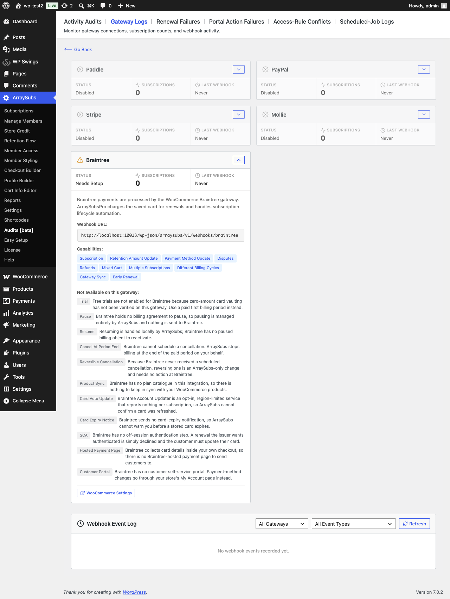
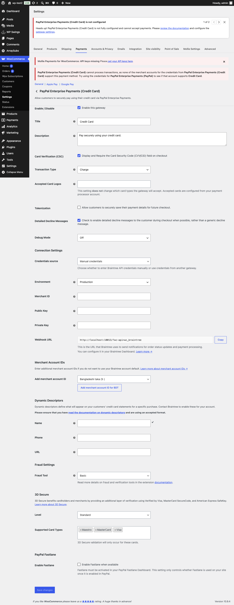

# Info
- Module: Braintree Gateway
- Availability: Pro
- Last updated: 2026-07-28

# Braintree Gateway

> Automatic renewals against the card saved in the Braintree vault at checkout — with dispute notifications and settlement-aware refunds.

**Availability:** Pro

## Page Navigation

- **Current guide:** Braintree Gateway
- **Where to open it:** WordPress Admin -> WooCommerce -> Settings -> Payments -> PayPal Enterprise Payments (Credit Card)
- **Section overview:** [Open overview](./README.md)
- **Previous guide:** [mollie](./mollie.md)
- **Next guide:** [payment-recovery](./payment-recovery.md)
- **Troubleshooting:** [Audits, Logs, and Troubleshooting](../../audits-and-logs/README.md)

## Requirements

Braintree automatic renewals need the official **WooCommerce Braintree** gateway plugin (listed as *PayPal Enterprise Payments (formerly Braintree) for WooCommerce*) installed and connected. ArraySubs does not take Braintree payments on its own — it rides the plugin you already use for checkout and adds the recurring half.

| Requirement | Detail |
|---|---|
| Host plugin | WooCommerce Braintree, version 3.0 or newer (verified against 3.11.0) |
| Enabled gateway | **PayPal Enterprise Payments (Credit Card)** enabled in WooCommerce — its internal ID is still `braintree_credit_card` |
| Connection | Either API keys (merchant ID, public key, private key) or the Braintree "Connect" OAuth flow |
| Tokenization | Handled for you — ArraySubs forces the card to be saved when the cart contains a subscription |

## Overview

Braintree uses the **ArraySubs-managed billing** model, the same as Stripe and Mollie. ArraySubs owns the schedule, raises each renewal order, and charges it against the `paymentMethodToken` the Braintree plugin vaulted at checkout.

ArraySubs never creates a Braintree Subscription. The gateway holds no competing schedule, so trials, plan switches, proration, grace periods and dunning all stay under ArraySubs' control.

## Current Capability Snapshot

| Capability | Braintree Behavior in ArraySubsPro |
|---|---|
| Automatic renewals | Yes. `Transaction::sale` against the vaulted token, flagged as a recurring merchant-initiated charge. |
| Checkout type | Braintree Hosted Fields inside your own checkout (classic and Blocks). |
| Required credentials | None of your own — ArraySubs uses the connection the Braintree plugin already holds. |
| Webhook URL | `wp-json/arraysubs/v1/webhooks/braintree` |
| Sandbox mode | Follows the Braintree plugin's environment; a sandbox token is never charged against production. |
| Mixed carts | Supported. |
| Multiple subscriptions in one checkout | Supported. |
| Different billing cycles in one checkout | Supported. |
| Native pause/resume | Not supported — Braintree holds no billing agreement to pause. |
| Payment method update | Supported through your store's My Account -> Payment methods page. |
| Card auto-update | Not surfaced. Braintree Account Updater is opt-in and reports nothing per subscription. |
| Card expiry notices | Not supported — Braintree publishes no card-expiry event. |
| Free trials | Not enabled. Use a paid first billing period. |
| Refunds and disputes | Refunds go through the Braintree plugin; disputes arrive as webhooks. |

```box class="info-box"
Only **Braintree Credit Card** carries subscriptions. Braintree PayPal, Venmo, ACH, SEPA and the local payment methods (iDEAL, Bancontact, P24, BLIK and friends) are not used for renewals — the local methods have no reusable vault entry at all.
```

---

## How Braintree Payments Work

### Initial Checkout

1. The customer enters card details in Braintree's Hosted Fields on your checkout
2. Because the cart contains a subscription, ArraySubs forces the card to be **saved to the vault** — the customer does not have to remember to tick "save card"
3. The charge is flagged to the card networks as the first payment of a recurring series
4. ArraySubs stores the vault token, the Braintree customer ID, the card brand, last four digits and expiry, plus the environment and merchant ID the token belongs to

```box class="warning-box"
If the checkout completes without a vaulted token, the subscription is marked as needing a payment method **immediately** and the customer is asked to add one — rather than the problem surfacing weeks later at the first renewal.
```

### Renewal Payments

1. The ArraySubs schedule fires and creates the renewal order
2. ArraySubs checks the stored token still belongs to the current Braintree environment and merchant account
3. A sale is submitted for settlement in a single call, tagged `transactionSource: recurring`
4. Braintree answers synchronously — there is no waiting on a webhook for cards

| Braintree status | Result |
|---|---|
| `submitted_for_settlement`, `settling`, `settled` | Renewal paid |
| `authorized` | Held, **not** paid — the money has not moved. Capture it in your Braintree Control Panel |
| `authorizing`, `settlement_pending` | Still processing; re-checked automatically |
| `processor_declined` | Declined. Soft declines retry; hard declines ask for a new card |
| `gateway_rejected` | Rejected by your Braintree rules (AVS, CVV, fraud, duplicate) |

```box class="info-box"
Braintree sends **no card transaction webhooks** — transaction webhooks exist only for ACH and SEPA. The renewal result is the answer to the sale call itself, which is why Braintree renewals resolve instantly while SEPA-style gateways do not.
```

---

## Multi-Currency

Braintree decides the transaction currency from the **merchant account**, not from the request. If a renewal order's currency differs from your store currency, ArraySubs looks for a merchant account configured for that currency in the Braintree plugin settings. If there is none, the renewal is stopped with a configuration error rather than charged in the wrong currency.

Zero-decimal currencies (JPY, KRW, ISK and similar) are refused by default, because the exact amount format Braintree expects for them has not been verified. A developer can enable them with the `arraysubspro_braintree_allow_zero_decimal_currency` filter once tested.

---

## Payment Method Updates

Braintree has no customer portal. Updates run through your own store:

1. The customer opens **My Account -> Payment methods**
2. They add a new card, which Braintree vaults
3. ArraySubs points the subscription at the new token

If the customer **deletes** their saved card — either on your site or at Braintree — ArraySubs notices straight away, marks the subscription as needing a payment method, and stops attempting charges that would only be declined.

---

## Refunds

Refunds are issued the normal WooCommerce way, on the renewal order.

Braintree distinguishes refunding from voiding, and the right one depends on how far the transaction has settled:

| Transaction state | Correct action |
|---|---|
| Settled or settling | Refund |
| Submitted for settlement (not yet settled) | Void |

ArraySubs re-reads the live transaction state before WooCommerce decides, so the Braintree plugin takes the correct path. Without that, refunding a renewal charged minutes earlier would fail — and retrying it by hand while WooCommerce also retries is how double refunds happen.

---

## Disputes

Braintree dispute webhooks are handled:

| Braintree Event | ArraySubs Action |
|---|---|
| `dispute_opened` | Renewal order set to on hold, warning note on the subscription |
| `dispute_won` | Recorded as resolved in your favour |
| `dispute_lost`, `dispute_accepted`, `dispute_expired` | Recorded as lost — `dispute_expired` means the reply-by date passed and the cardholder keeps the funds |
| `dispute_disputed`, `dispute_under_review` | Noted as still open, not treated as a resolution |

The subscription is never cancelled automatically when a dispute opens — that decision stays yours.

---

## Limitations

| Feature | Status | Why |
|---|---|---|
| Free trials | Not enabled | Zero-amount card vaulting is not verified on this gateway. Use a paid first billing period. |
| Pause / Resume | Not supported | Braintree holds no billing agreement to pause. |
| Cancel at period end | Not supported | Braintree cannot schedule a cancellation; ArraySubs stops billing at the end of the paid period. |
| Card auto-update | Not supported | Account Updater is opt-in, region-limited, and reports nothing per subscription. |
| Card expiry notice | Not supported | Braintree publishes no card-expiry event. |
| SCA / 3D Secure on renewals | Not applicable | Braintree has no off-session authentication step; an issuer wanting authentication simply declines. |
| Hosted payment page | Not applicable | Card details are collected inside your own checkout. |
| Customer portal | Not supported | Changes go through your store's My Account page. |
| Dispute notifications on OAuth connections | Unavailable | Braintree signs webhooks with the private key, which an OAuth ("Connect") store does not have. |

Every one of these is shown in plain language on the **Gateway Health** screen, under the Braintree card — open **ArraySubs -> Audits -> Gateway Logs** and expand Braintree.



```box class="warning-box"
If your store is connected to Braintree with **Connect / OAuth** rather than API keys, webhook signatures cannot be verified at all, so ArraySubs rejects them and switches dispute notifications off. Charging still works normally. Connect with API keys if you want dispute alerts.
```

---

## Webhooks

### Webhook URL

```
https://yoursite.com/wp-json/arraysubs/v1/webhooks/braintree
```

Add this as a webhook destination in your **Braintree Control Panel -> Settings -> Webhooks**. Braintree checks the URL with a signed challenge before it will save it; the ArraySubs endpoint answers that challenge automatically.

### Useful Events

| Event | Why enable it |
|---|---|
| `dispute_opened` | Chargeback alerts |
| `dispute_won`, `dispute_lost`, `dispute_accepted`, `dispute_expired` | Dispute outcomes |
| `payment_method_revoked_by_customer` | Customer revoked the card at Braintree |
| `payment_method_customer_data_updated` | Refreshed card details |

Card renewal outcomes do **not** need a webhook — they are answered synchronously.

---

## Double-Charge Protection

Braintree's sale call has no idempotency key, so ArraySubs adds its own protection:

- Every attempt is recorded on the order **before** the request is sent, so a timeout or a killed worker forces a reconciliation with Braintree instead of a second charge
- A per-order lock prevents a manual retry from racing the scheduled renewal
- Every renewal carries a site-namespaced order reference, so reconciliation can find the real transaction even on a Braintree account shared with another store
- A `duplicate` rejection is never assumed to mean "already paid" — the actual transaction is looked up before the renewal is treated as settled

---

## Braintree Settings

There are no ArraySubs-specific Braintree settings. Everything is read from the Braintree plugin's own configuration under **WooCommerce -> Settings -> Payments -> PayPal Enterprise Payments (Credit Card)**:

| Setting | Where it matters |
|---|---|
| Enable this gateway | Must be on before ArraySubs treats Braintree as available |
| Credentials source | Either **Manual credentials** or credentials inherited from another Braintree gateway. ArraySubs resolves whichever one is active |
| Environment (Sandbox / Production) | Stored with each subscription; a token is never charged in the wrong environment |
| Merchant ID, Public key, Private key | Used for renewals and webhook verification |
| Connect / OAuth connection | Supported for charging; disables webhook verification |
| Merchant Account IDs | Add one per extra currency; required for renewals in a non-store currency |
| Dynamic Descriptors (Name / Phone / URL) | Copied onto renewal charges when valid |
| Tokenization | ArraySubs forces this on for subscription carts, so it can stay off for ordinary orders |



---

## Troubleshooting

| Problem | Likely Cause | Solution |
|---|---|---|
| Subscription needs a payment method right after checkout | No token was vaulted | Confirm Braintree Credit Card is the gateway used and tokenization is not blocked by another plugin |
| Renewal fails with an environment mismatch | The store switched between sandbox and production | Existing tokens are not portable; customers must add a card again |
| Renewal fails on a non-store currency | No merchant account for that currency | Add one in the Braintree plugin settings |
| Renewals in JPY or another zero-decimal currency are refused | Amount format unverified | Test in sandbox, then enable via the documented filter |
| Refund fails on a recent renewal | The transaction has not settled yet | It must be voided rather than refunded — ArraySubs routes this for you; wait and retry if it was already settling |
| No dispute alerts | OAuth connection, or webhook URL not saved | Connect with API keys, and add the webhook URL in the Braintree Control Panel |
| Braintree rejects the webhook URL | Challenge not reaching the site | Confirm the REST API is reachable and not blocked by a security plugin |

---

## Related Docs

- [Gateway Overview](README.md) — Architecture and capability comparison
- [Mollie Gateway](mollie.md) — The other mandate/vault gateway
- [Payment Recovery](payment-recovery.md) — Dunning and retry behaviour
- [Gateway Health Dashboard](../../gateway-health/README.md) — Webhook status and capability notes

---

## FAQ

**Do I need to enter Braintree keys in ArraySubs?**
No. ArraySubs uses the connection the Braintree plugin already holds, including OAuth connections.

**What happens to Braintree subscriptions I already had?**
They keep working as manual renewals — the customer gets an invoice email each cycle exactly as before. They become automatic once a card is vaulted, which happens the next time the customer pays through Braintree.

**Does the customer have to tick "save card"?**
No. When the cart contains a subscription ArraySubs forces tokenization, on both the classic and Blocks checkout.

**Why did a renewal come back as `authorized` instead of paid?**
Something turned off automatic settlement — usually a filter or a delayed-settlement merchant account. ArraySubs deliberately does not mark the order paid, because the money has not moved. Capture it in the Braintree Control Panel.

**Can I use Braintree PayPal or Venmo for subscriptions?**
Not yet. Only Braintree Credit Card is used for renewals.
