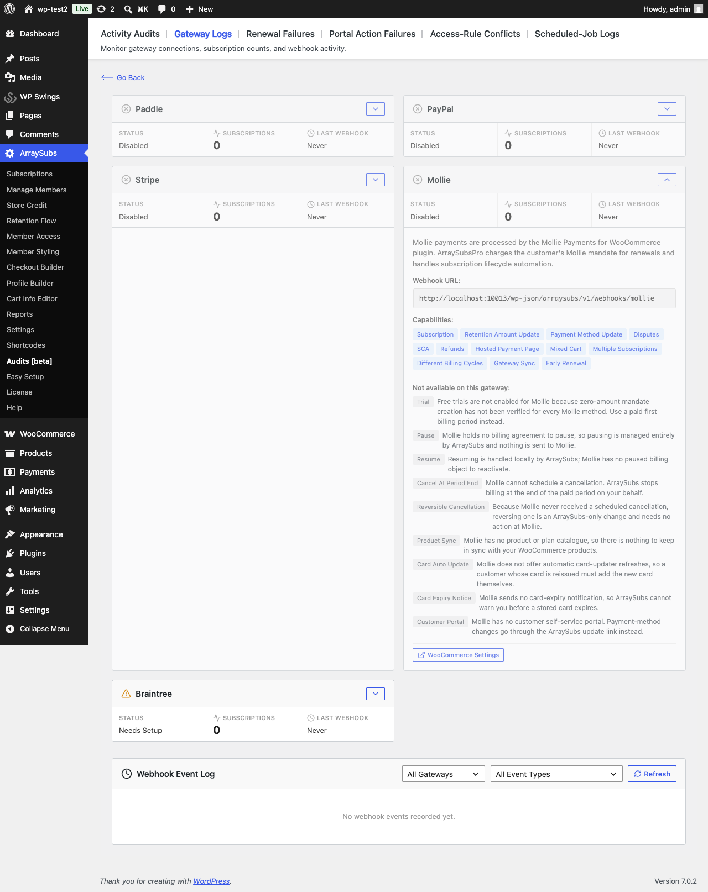
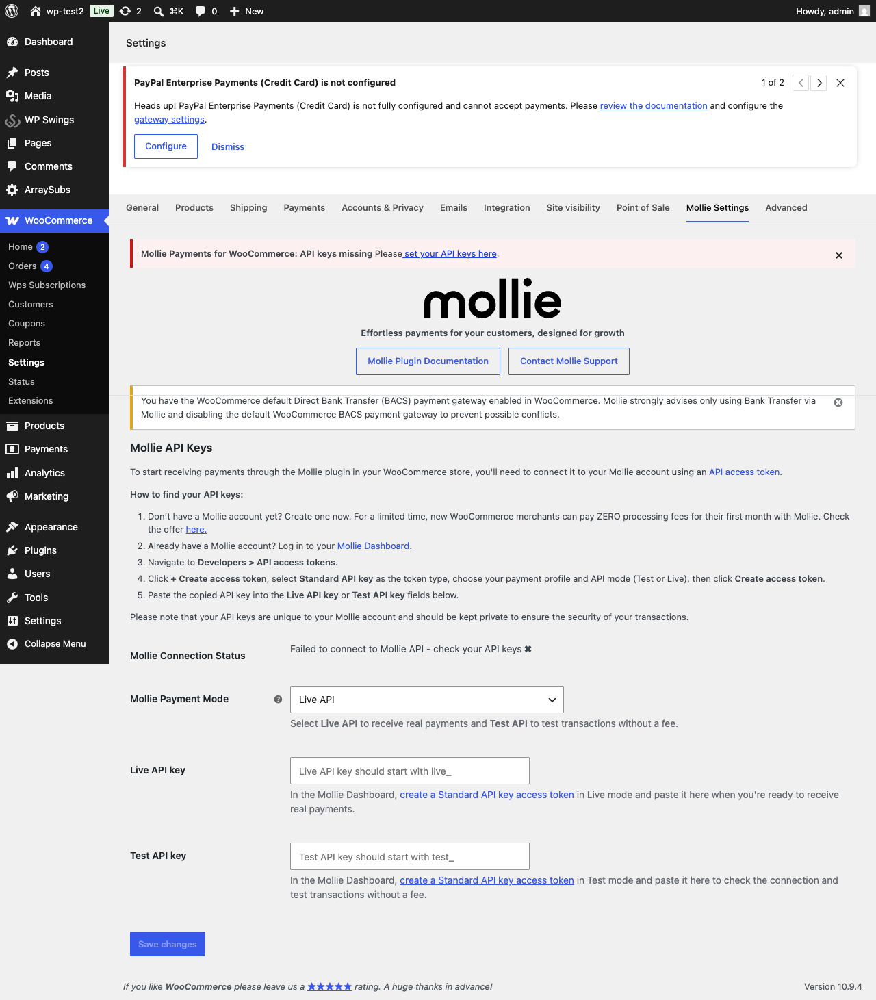

# Info
- Module: Mollie Gateway
- Availability: Pro
- Last updated: 2026-07-28

# Mollie Gateway

> Automatic renewals against the Mollie mandate created at checkout — credit card and SEPA Direct Debit, with delayed-settlement tracking for bank debits.

**Availability:** Pro

## Page Navigation

- **Current guide:** Mollie Gateway
- **Where to open it:** WordPress Admin -> WooCommerce -> Settings -> Mollie Settings
- **Section overview:** [Open overview](./README.md)
- **Previous guide:** [paddle](./paddle.md)
- **Next guide:** [payment-recovery](./payment-recovery.md)
- **Troubleshooting:** [Audits, Logs, and Troubleshooting](../../audits-and-logs/README.md)

## Requirements

Mollie automatic renewals need the official **Mollie Payments for WooCommerce** plugin installed and connected. ArraySubs does not take Mollie payments on its own — it rides the plugin you already use for checkout and adds the recurring half.

| Requirement | Detail |
|---|---|
| Host plugin | Mollie Payments for WooCommerce, version 7.0 or newer (verified against 8.1.9) |
| Mollie profile | SEPA Direct Debit and/or credit card enabled, as Mollie requires for recurring payments |
| Mollie plugin setting | **Store customer details at Mollie** must be on — without it Mollie never creates the mandate a renewal charges against |
| Enabled gateway | At least one mandate-capable method enabled: Credit Card, iDEAL, or Bancontact |

```box class="warning-box"
If **Store customer details at Mollie** is off, ArraySubs marks Mollie as misconfigured and shows a notice on the WooCommerce and ArraySubs settings screens. Subscriptions still sell, but every renewal falls back to a manual invoice.
```

## Overview

Mollie uses the **ArraySubs-managed billing** model, the same as Stripe. ArraySubs owns the schedule, raises each renewal order, and charges it against the customer's Mollie **mandate** — the standing authorization Mollie stores when the first payment is taken.

ArraySubs never creates a Mollie Subscription object. Everything about the cycle — trials, plan switches, proration, grace periods, dunning — stays under ArraySubs' control and behaves exactly as it does on any other automatic gateway.

## Current Capability Snapshot

| Capability | Mollie Behavior in ArraySubsPro |
|---|---|
| Automatic renewals | Yes. Charged against the customer's mandate with `sequenceType=recurring`. |
| Checkout type | Mollie's own hosted checkout, through the Mollie plugin. |
| Required credentials | None of your own — ArraySubs reads the API key the Mollie plugin already stores. |
| Webhook URL | `wp-json/arraysubs/v1/webhooks/mollie` |
| Test mode | Follows the order's own mode, so a test subscription keeps using the test key after you go live. |
| Mixed carts | Supported. |
| Multiple subscriptions in one checkout | Supported. |
| Different billing cycles in one checkout | Supported. |
| Native pause/resume | Not supported — Mollie holds no billing agreement to pause. |
| Payment method update | Supported by authorizing a new mandate. |
| Card auto-update | Not supported by Mollie. |
| Card expiry notices | Not supported — Mollie sends no expiry event. |
| Free trials | Not enabled. Use a paid first billing period. |
| Refunds and chargebacks | Refunds go through the Mollie plugin; chargebacks put the order on hold for review. |
| Renewal Sync | Supported. ArraySubs owns the schedule, so it can prorate the signup charge and move the first renewal to the synced date. |
| Early renew | Supported. The mandate is charged off-session ahead of the due date. |
| Retention discount amounts | Supported. Each renewal is charged at whatever amount the offer sets. |

```box class="info-box"
**Renewal Sync and small prorated charges.** Mollie enforces a per-method minimum charge. When a prorated signup amount falls under it, ArraySubs raises the charge to Mollie's own minimum for that method and currency — read live from Mollie's Methods API and cached for 12 hours — instead of letting checkout fail. If the minimum can't be read (no API key yet, or Mollie is unreachable), the prorated amount is left untouched.
```

## Which Mollie Methods Can Renew

A Mollie method can only carry a subscription if it can hold a **mandate**.

| Method | Renewals | Notes |
|---|---|---|
| Credit Card | Yes | Always mandate-capable. Renewals usually settle immediately. |
| iDEAL | Yes | The first payment converts into a SEPA Direct Debit mandate. Requires SEPA Direct Debit enabled at Mollie. |
| Bancontact | Yes | Same as iDEAL. |
| SEPA Direct Debit | Renewal-time only | Not shown at checkout; it is the method renewals are charged on after an iDEAL or Bancontact first payment. |
| Everything else | No | iDEAL-style one-off methods with no mandate, and wallets whose recurring behaviour is not verified. |

```box class="info-box"
When a customer pays with iDEAL or Bancontact, Mollie issues a **new SEPA mandate** with a different ID. ArraySubs follows the change automatically and writes a note on the subscription recording the switch, so renewals continue on the new instrument.
```

---

## How Mollie Payments Work

### Initial Checkout

1. The customer picks a Mollie method and pays through Mollie's hosted checkout
2. ArraySubs tells the Mollie plugin this payment starts a subscription, so Mollie takes it as a **first payment** and mints a mandate
3. When the payment completes, ArraySubs reads the payment back from the Mollie API and stores the customer ID, the mandate ID, the method, and the card details it can display
4. If no mandate was created, the subscription is marked as needing a payment method immediately — at checkout, not weeks later at the first renewal

### Renewal Payments

1. The ArraySubs schedule fires and creates the renewal order
2. ArraySubs confirms the mandate is still valid, then creates a Mollie payment with `sequenceType=recurring`
3. A card renewal normally comes back paid straight away and the order is completed
4. A SEPA Direct Debit renewal comes back **pending** — the money has not moved yet

### Delayed Settlement (SEPA Direct Debit)

SEPA debits take days to clear. ArraySubs treats them as money in flight:

- The renewal order stays pending and is **not** marked paid
- The subscription is not extended until Mollie confirms the payment
- Mollie's webhook completes or fails the order when it settles
- If nothing arrives within **21 days**, the renewal is failed and normal dunning takes over

```box class="warning-box"
Your grace-period settings should allow for this. With the default 3-day on-hold and 7-day cancel windows, a SEPA renewal can still be settling when the subscription is put on hold. If you sell to SEPA customers, raise the grace days under **Settings -> General** to comfortably exceed your typical settlement time.
```

---

## Payment Method Updates

Mollie has no customer portal to send people to. A payment-method update is a **new mandate**:

1. The customer opens Payment methods from their account
2. They authorize a new payment through Mollie
3. ArraySubs captures the new mandate and points the subscription at it

---

## Refunds

Refunds are issued the normal WooCommerce way, on the renewal order. ArraySubs writes the Mollie payment reference onto every renewal order it charges, so the Mollie plugin can find and refund it.

Two cases ArraySubs warns you about on the order:

| Situation | What happens |
|---|---|
| The payment is authorized but not captured | Mollie accepts the refund request without moving any money. ArraySubs adds a warning note telling you to capture or cancel the payment in your Mollie dashboard instead. |
| The order was paid in test mode but the store is now live | Mollie cannot find the payment. ArraySubs blocks the attempt and explains the mode mismatch on the order. |

A SEPA renewal that has not settled yet **cannot** be refunded — Mollie only refunds paid payments. Wait for it to settle, or cancel it at Mollie.

---

## Chargebacks

Mollie reports a chargeback on the payment webhook rather than as a separate event. When one arrives:

- The renewal order is set to **on hold**
- A warning note is written on the subscription
- The subscription is **not** cancelled — that decision stays yours

Mollie has no "you lost the dispute" event. A chargeback that is never reversed is a chargeback you lost.

---

## Limitations

| Feature | Status | Why |
|---|---|---|
| Free trials | Not enabled | Zero-amount mandate creation is not verified for every Mollie method. Use a paid first billing period. |
| Pause / Resume | Not supported | Mollie holds no billing agreement to pause; pausing is handled entirely by ArraySubs. |
| Cancel at period end | Not supported | Mollie cannot schedule a cancellation; ArraySubs stops billing at the end of the paid period. |
| Card auto-update | Not supported | Mollie offers no account-updater service. |
| Card expiry notice | Not supported | Mollie sends no card-expiry event. |
| Customer portal | Not supported | Mollie has no self-service portal; updates go through your store. |
| Product sync | Not applicable | Mollie has no product or plan catalogue. |
| SEPA in non-EUR | Not supported | Mollie SEPA Direct Debit is EUR-only, so a non-EUR renewal on a SEPA mandate is refused before it is attempted. |

Every one of these is shown in plain language on the **Gateway Health** screen, under the Mollie card — open **ArraySubs -> Audits -> Gateway Logs** and expand Mollie.



---

## Webhooks

### Webhook URL

```
https://yoursite.com/wp-json/arraysubs/v1/webhooks/mollie
```

ArraySubs sets this on every renewal payment it creates — **you do not need to configure anything at Mollie.** Your first-payment webhooks continue to go to the Mollie plugin as they always have.

### How Mollie Webhooks Are Verified

Mollie's webhook is unsigned by design: it posts only a payment ID. ArraySubs verifies authenticity the way Mollie documents — it fetches that payment from the Mollie API using your own secret key. A payment that does not resolve in your account is rejected, and a payment that does not belong to the order it names is ignored.

### Missed Webhooks

A webhook can be lost to a firewall or an outage. Every six hours ArraySubs re-checks renewals that are still waiting, asks Mollie what actually happened, and either completes the order or fails it once the settlement window has passed. Nothing is left pending forever.

---

## Mollie Settings

There are no ArraySubs-specific Mollie settings. Everything is read from the Mollie plugin's own configuration under **WooCommerce -> Settings -> Mollie Settings**:

| Setting | Where it found | Why it matters |
|---|---|---|
| Live API key / Test API key | Mollie Settings | Used for renewals, matched to the mode the subscription was created in |
| Mollie Payment Mode (Live / Test API) | Mollie Settings | Determines which key a new subscription uses |
| Store customer details at Mollie | Mollie Settings -> Advanced | **Required.** Without it Mollie strips the customer from every payment and no mandate is created |
| Enabled payment methods | WooCommerce -> Settings -> Payments | Determines which methods can carry a subscription |



```box class="info-box"
Until a valid API key is saved, the Mollie plugin registers **no payment gateways at all** — so ArraySubs reports Mollie as needing setup and no Mollie method appears at checkout. Connect the API key first, then enable the methods you want.
```

---

## Troubleshooting

| Problem | Likely Cause | Solution |
|---|---|---|
| Every Mollie subscription renews manually | **Store customer details at Mollie** is off, or no mandate-capable method is enabled | Turn the setting on and enable Credit Card, iDEAL, or Bancontact |
| Gateway Health shows Mollie as disabled | No mandate-capable Mollie gateway is enabled in WooCommerce | Enable one under WooCommerce -> Settings -> Payments |
| Subscription says it needs a payment method right after checkout | The payment was taken as a one-off, so no mandate exists | Check the customer paid with a mandate-capable method and that customer storage is on |
| SEPA renewal stuck pending for days | Normal — SEPA settles over several business days | Leave it; ArraySubs completes or fails it automatically within 21 days |
| Subscription went on hold while a SEPA renewal was still settling | Grace period shorter than settlement time | Raise the grace days under Settings -> General |
| Refund does nothing | The payment is authorized, not captured | Capture or cancel it in the Mollie dashboard |
| *"The customer has no valid Mollie mandate"* | The mandate was revoked or expired | The customer must add a new payment method |

---

## Related Docs

- [Gateway Overview](README.md) — Architecture and capability comparison
- [Payment Recovery](payment-recovery.md) — Dunning and retry behaviour
- [Gateway Health Dashboard](../../gateway-health/README.md) — Webhook status and capability notes

---

## FAQ

**Do I need my own Mollie API keys in ArraySubs?**
No. ArraySubs uses the keys the Mollie plugin already stores, and picks the live or test key based on how the subscription was originally paid.

**What happens to subscriptions I already had on Mollie before this?**
They keep working as manual renewals — the customer gets an invoice email each cycle exactly as before. They become automatic only once a mandate is captured, which happens the next time the customer pays through Mollie.

**Can a customer pay a renewal invoice by hand?**
Yes, and it does not disturb the subscription. ArraySubs deliberately does not create a second mandate from a manually paid renewal.

**Why is there no free trial option on Mollie?**
Zero-amount mandate creation has not been verified across Mollie's methods, so it is switched off rather than shipped as a maybe. Use a paid first billing period instead.

**Which currency can SEPA renewals use?**
EUR only. A non-EUR renewal against a SEPA mandate is refused before it reaches Mollie, and the subscription is flagged for a new payment method.
