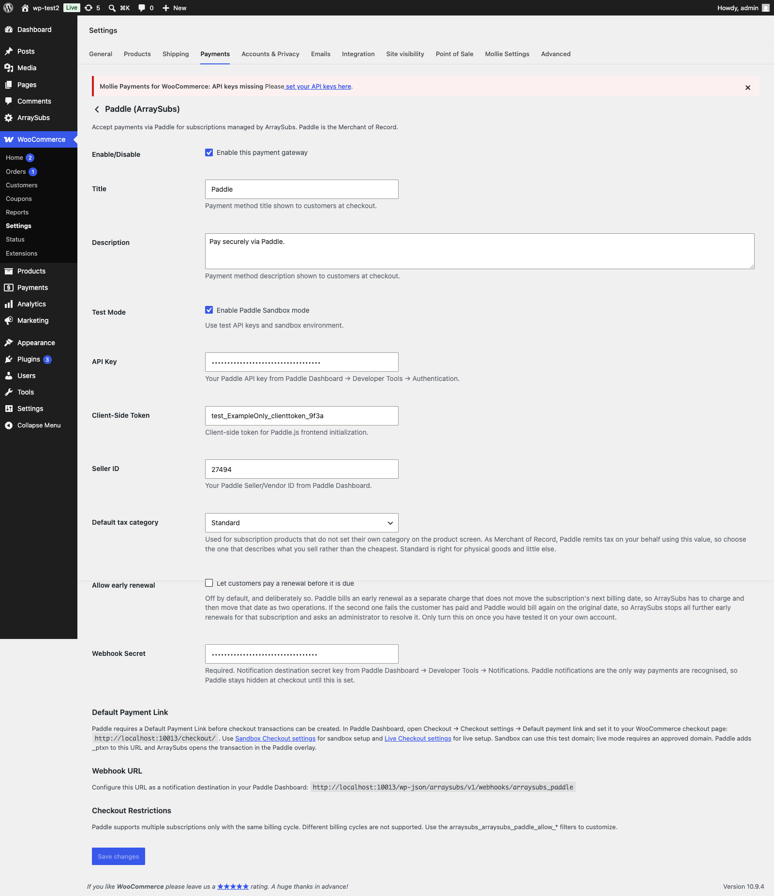

# Info
- Module: Paddle Gateway
- Availability: Pro
- Last updated: 2026-08-17

# Paddle Gateway

> Paddle integration with Merchant of Record model — Paddle.js overlay checkout, tax categories and VAT handling, native pause/resume, recurring discounts, mid-cycle price changes, and product catalog sync.

**Availability:** Pro

## Page Navigation

- **Current guide:** Paddle Gateway
- **Where to open it:** Storefront checkout and WordPress Admin -> ArraySubs -> Checkout Builder
- **Section overview:** [Open overview](../README.md)
- **Previous guide:** [Gateway Health](../../gateway-health/README.md)
- **Next guide:** [mollie](./mollie.md)
- **Troubleshooting:** [Audits, Logs, and Troubleshooting](../../audits-and-logs/README.md)

## Overview

Paddle is unique among ArraySubs gateways because it operates as a **Merchant of Record (MoR)**. This means Paddle is the legal seller of your product — it handles all payment processing, tax calculation, VAT collection, compliance, and customer invoicing. You receive net payouts after Paddle deducts its fee and applicable taxes.

Paddle uses the **gateway-managed billing** model and includes features that other gateways don't offer, such as native pause/resume and automatic tax handling in 200+ countries.

## Current Capability Snapshot

| Capability | Paddle Behavior in ArraySubsPro |
|---|---|
| Automatic renewals | Yes. Paddle manages the billing schedule and confirms events by webhook. |
| Checkout type | Paddle.js overlay using a Paddle transaction. |
| Required credentials | API Key, Client-Side Token, Seller ID, **and Webhook Secret**. The webhook secret is required — without it no notification can be verified, so Paddle stays hidden at checkout. |
| Webhook URL | `wp-json/arraysubs/v1/webhooks/arraysubs_paddle` |
| Sandbox mode | Supported through the gateway settings. |
| Default Payment Link | Required in Paddle Dashboard before transactions can open. Set it to your WooCommerce checkout page. |
| Product sync | Required before checkout. ArraySubs creates or updates Paddle product/price records. |
| Tax category | **Required per product** (with a store-wide default). Paddle remits tax using it. |
| Mixed carts | Supported. |
| Multiple subscriptions in one checkout | Supported only when billing cycles are compatible. |
| Different billing cycles in one checkout | Not supported. |
| Customer-chosen schedule (flexible duration) | Not supported — renewals bill from the synced Paddle price. |
| Quantity above one | Supported. |
| Signup fee | Supported, as its own one-time Paddle price on the checkout. |
| Recurring shipping | Supported, the same way. |
| Coupons | Supported, including **recurring** discounts and "for the next N renewals". |
| Free trials | Supported natively through the Paddle price. |
| Pause / Resume | Supported natively. |
| End-of-period cancellation | Supported, scheduled at Paddle, and reversible. |
| Plan switching | Supported, including downgrades and deferred changes. |
| Retention discount | Supported, and takes effect **immediately** (mid-cycle). |
| Skip a renewal / change the date | Supported. Paddle's next billing date is moved through its API. |
| Early renewal | Supported but **off by default** behind a setting — see below. |
| Payment method update | Supported through Paddle customer billing flows. |
| Card auto-update | Supported. Paddle handles reissued cards internally. |
| Card expiry notices | Supported. ArraySubs warns from the card expiry Paddle reports on the transaction. |
| Refunds | Supported, including **partial** refunds allocated across the transaction's own items. |
| Chargebacks | Recorded, including reversal when you win. |
| Charge reconciliation | Supported. A renewal whose notification never arrived is resolved from Paddle's transaction list. |

```box class="info-box"
Paddle is the best fit when you want Merchant-of-Record handling for tax, invoices, and payment compliance. It is not the best fit when one checkout must contain subscriptions with unrelated billing cycles, or when customers pick their own billing interval.
```



## Required Paddle Dashboard Setup

Paddle needs a few dashboard settings before ArraySubs can create checkout transactions.

### Default Payment Link

Paddle requires a **Default Payment Link** before transaction checkout URLs can be created. Configure it separately in the Paddle sandbox dashboard and live dashboard.

1. Open **WooCommerce -> Settings -> Payments -> ArraySubs Paddle**
2. Copy the checkout URL shown in the **Default Payment Link** settings guide, usually:

```text
https://yoursite.com/checkout/
```

3. In Paddle Dashboard, open **Checkout -> Checkout settings -> Default payment link**
4. Paste the WooCommerce checkout URL and save
5. For live mode, make sure the checkout domain is approved in Paddle before using it

```box class="info-box"
The Default Payment Link is configured in Paddle, not saved inside WordPress. ArraySubs shows the recommended URL so you can copy it into the matching Paddle environment.
```

Paddle appends `_ptxn=<transaction_id>` to this URL when it creates a transaction checkout link. The checkout page must load WooCommerce checkout and Paddle.js. When Paddle returns a transaction URL, ArraySubs opens the Paddle.js checkout as an overlay on the current checkout page.

The same Paddle setting may also be used by Paddle for payment-method update links and customer-facing payment links. If it is missing, Paddle returns the API error `transaction_default_checkout_url_not_set`, and checkout setup cannot continue.

## How Paddle Payments Work

### Initial Checkout

1. Customer selects Paddle at checkout
2. ArraySubs ensures the subscription product is synced to Paddle's catalog (creates a Paddle Price if one doesn't exist)
3. ArraySubs creates a corresponding Paddle Customer (or resolves an existing one by email)
4. A **Paddle Transaction** is created with the correct price ID
5. The Paddle.js overlay opens on top of your checkout page
6. The customer completes payment within the Paddle overlay (supports cards, PayPal, Apple Pay, Google Pay, and local payment methods)
7. Paddle sends a `transaction.completed` webhook followed by `subscription.created`
8. ArraySubs captures the Paddle subscription ID, customer ID, and payment context

### Renewal Payments

1. Paddle manages its own billing cycle and charges the customer automatically
2. When payment succeeds, Paddle sends a `transaction.completed` webhook (for the renewal)
3. ArraySubs creates a renewal order and marks it as paid
4. If payment fails, `transaction.payment_failed` fires and ArraySubs triggers the failure flow

```box class="info-box"
Like PayPal, Paddle controls its own billing schedule. ArraySubs does **not** send charge requests to Paddle — it waits for Paddle's webhook to report each payment event.
```

### Trial Support

Paddle supports trials natively through its Price object. When a subscription product has a trial period, ArraySubs configures the Paddle Price with a trial phase. Paddle handles the trial-to-paid conversion on its own schedule.

---

## Merchant of Record Model

As the Merchant of Record, Paddle assumes these responsibilities:

| Responsibility | Who Handles It |
|---|---|
| Payment processing | Paddle |
| PCI compliance | Paddle |
| Tax / VAT calculation | Paddle (200+ countries) |
| Tax collection and remittance | Paddle |
| Customer invoicing | Paddle |
| Dispute / chargeback handling | Paddle |
| Currency conversion | Paddle |
| Payment method support | Paddle (cards, PayPal, Apple Pay, Google Pay, local methods) |

**What you receive:** Net payouts after Paddle's fee and taxes are deducted. Paddle provides detailed payout reports.

```box class="info-box"
Because Paddle is the seller of record, the payout amount stored on the subscription (`_gateway_paddle_payout_amount`) may differ from the nominal subscription price due to taxes, currency conversion, and Paddle's fee.
```

---

## Product Catalog Sync

Unlike Stripe and PayPal, Paddle requires products and prices to exist in its catalog before transactions can be created. ArraySubs handles this automatically:

1. When a subscription product is first purchased via Paddle, ArraySubs checks for an existing Paddle Price
2. If none exists, it creates a Paddle Product and Price through Paddle's API
3. The Paddle Price ID is stored as product meta for future use
4. Subsequent checkouts for the same product reuse the synced Price

```box class="warning-box"
If you change a subscription product's price in WooCommerce, the Paddle Price may need to be updated or recreated. Existing subscriptions keep the price they were created with; only new subscriptions use the updated price.
```

---

## Tax Category (Required)

Paddle remits tax on your behalf, and it uses each product's **tax category** to decide how much. A wrong category is a tax problem, not a cosmetic one — which is why ArraySubs asks for it explicitly instead of quietly sending everything as Standard.

### Setting it per product

1. Edit the subscription product
2. Open the **General** tab in Product data
3. Set **Paddle tax category**
4. Update the product

The field appears only while the Paddle gateway is enabled, and it is available on variations as well as simple products.

| Choice | Use for |
|---|---|
| **Use store default** | Falls back to the store-wide setting below |
| Standard | Physical goods and anything without a more specific category |
| Digital goods | Downloadable digital products |
| Ebooks | Ebooks specifically — many jurisdictions tax these differently |
| SaaS | Software delivered as a subscription service |
| Website hosting | Hosting and related infrastructure |
| Implementation services | Setup and onboarding work |
| Professional services | Consulting and advisory work |
| Software programming services | Custom development work |
| Training services | Courses and training delivered as a service |

### Setting the store-wide default

**WooCommerce → Settings → Payments → Paddle (ArraySubs) → Default tax category**, directly below the Seller ID.

It applies to every subscription product that does not set its own category, and it ships as **Standard**. Change it and click **Save changes** like any other gateway setting.

```box class="warning-box"
Choose the category that describes what you **sell**, not the one with the lowest rate. Paddle files on your behalf using this value, and Standard is right for physical goods and little else.
```

A store selling more than one kind of thing should set the default to whatever it sells most of, then override the exceptions per product.

### How the amount reaches Paddle

ArraySubs sends Paddle the WooCommerce **gross** amount and pins each price it creates to Paddle's internal tax mode. That is the only combination where Paddle's charge reconciles exactly against the WooCommerce order total.

The tax mode and a signature of your WooCommerce tax rate are part of the price's identity, so a different jurisdiction or a different tax setting resolves to its own Paddle price rather than silently reusing one built for someone else's rate. If your Paddle account overrides the tax mode at account level, that is recorded and logged rather than surfacing as a confusing "invalid price" error.

---

## Signup Fees and Shipping

A signup fee and a recurring shipping line are sent to Paddle as their **own one-time prices** on the checkout, anchored to the subscription product, each at its gross amount.

This is what makes Paddle's total match the WooCommerce order total. Before this, a cart with a signup fee was both undercharged and unable to complete.

- A negative fee line is refused rather than dropped
- Paddle's limit of 100 line items is enforced

---

## Discounts and Coupons

ArraySubs maps a WooCommerce coupon onto a Paddle discount — percentage or flat amount, and importantly **recurring**:

| Coupon type | Paddle behaviour |
|---|---|
| One-off discount | Applies to the first payment |
| Recurring discount | Keeps applying to renewals |
| Recurring, limited to N renewals | Applies for exactly that many renewals, then stops |

Discounts are created privately for the transaction, so they never enter your Paddle catalogue and can never be redeemed by someone at a Paddle-hosted checkout. Each discount is reused for identical coupon definitions and re-validated before use.

---

## Retention Discounts (Mid-Cycle)

A retention offer that lowers the recurring amount takes effect **immediately** on Paddle, not at the next renewal — Paddle accepts an effective-from-now price change and ArraySubs verifies it against Paddle's own state afterwards. The retention screen says which behaviour applies for the gateway on the subscription, so a customer is never told a discount is instant when it is not.

This is the difference from PayPal, where the same offer starts at the next renewal.

---

## Native Pause and Resume

Paddle is the only gateway that supports **native pause and resume** at the gateway level.

### Pause

When a subscription is paused through ArraySubs (customer self-service or admin action):

1. ArraySubs sends a pause request to Paddle's API
2. Paddle pauses its billing cycle — no future charges until resumed
3. The `_gateway_status` is updated to `paused`
4. Paddle sends a `subscription.paused` webhook for confirmation

### Resume

When the subscription is resumed:

1. ArraySubs sends a resume request to Paddle
2. Paddle resumes its billing cycle
3. The `_gateway_status` returns to `active`
4. Paddle sends a `subscription.resumed` webhook

PayPal also supports a real remote pause. For Stripe and Mollie, pausing is a purely local decision — there is no provider-side schedule to hold.

---

## Skip and Manual Date Changes

Paddle owns the billing clock, but it also lets that clock be moved. When you skip a renewal, record a payment, or change a subscription's next payment date, ArraySubs moves Paddle's own next billing date **first** and commits the local date only once Paddle accepts it. Your store and Paddle stay on one schedule.

This is the difference from PayPal, where the same actions are refused because PayPal exposes no call to move its date.

---

## Early Renewal (Off by Default)

Letting a customer pay a renewal before it is due is available on Paddle, but ships **switched off**.

**WooCommerce → Settings → Payments → ArraySubs Paddle → Allow early renewal**

The reason is in the mechanics. Paddle bills an early charge as a separate transaction that explicitly does **not** move the subscription's next billing date. So an early renewal is two operations — charge, then move the date — and the failure mode of the second one is a double charge.

ArraySubs fences the sequence: it records the intent, charges, verifies the transaction, moves the date, confirms, and only then commits. If a charge succeeds but the date move fails, the order is **completed** — the money is real — early renewal is then blocked for that subscription, and an urgent note is left naming the transaction and the date Paddle will otherwise bill on, so an administrator can resolve it.

```box class="warning-box"
Test this on your own Paddle account before enabling it on a live store.
```

---

## Refunds and Chargebacks

### Partial refunds

Supported. A partial refund is allocated across the transaction's own line items in proportion to each item's settled total, with the rounding remainder placed on the largest item so the parts add up exactly. Whether it is issued as a refund or a credit is taken from the transaction's own status.

Each attempt is fenced on the WooCommerce refund ID, and a failed call deliberately keeps its claim — Paddle has no idempotency key for adjustments, so releasing it would let a retry refund twice.

### Refunds issued in the Paddle dashboard

A refund you issue directly at Paddle is turned into a real WooCommerce refund on the order, so your store's totals match Paddle's. It is recorded once no matter how often Paddle reports it, and a cumulative report only adds the difference.

### Chargebacks

Paddle raises a chargeback as an adjustment, and reverses it when you win the case. Both are recorded on the subscription as notes and meta.

```box class="info-box"
A chargeback **never** changes the status of an order that has already been paid. A settled order stays settled, so the next renewal cycle cannot mistake it for an unpaid invoice.
```

---

## Limitations

| Feature | Status | Detail |
|---|---|---|
| Mixed carts | Supported | Subscription + regular products can be in the same cart |
| Multiple subscriptions | Supported | Multiple subscriptions per checkout |
| Different billing cycles | Not supported | All subscriptions must share the same billing schedule |
| Customer-chosen schedule | Not supported | Renewals bill from a per-product synced Paddle price, so a customer-picked interval would be ignored |
| Card auto-update | Supported | Paddle handles card updates internally |
| Card expiry notices | Supported | Warned from the expiry Paddle reports on the transaction |
| SCA / 3D Secure | N/A | Handled internally by Paddle |
| Chargebacks | Recorded | Paddle handles the case as MoR; ArraySubs records creation and reversal |
| Retention amount update | Supported | Takes effect immediately, mid-cycle |
| Early renewal | Off by default | Behind a gateway setting — see above |
| Product sync required | Yes | Products must be synced to Paddle catalog |
| Tax category required | Yes | Per product, with a store-wide default |

---

## Webhook Events

Configure these events in your Paddle webhook settings (Paddle Vendor Dashboard → Developer Tools → Notifications):

| Paddle Event | ArraySubs Handler |
|---|---|
| `transaction.completed` | Marks payment as successful |
| `transaction.payment_failed` | Triggers payment failure flow |
| `subscription.created` | Captures subscription context |
| `subscription.updated` | Updates payment method details |
| `subscription.canceled` | Handles remote cancellation |
| `subscription.paused` | Confirms pause |
| `subscription.resumed` | Confirms resume |
| `adjustment.created` | Records a refund, a credit, or a chargeback |
| `adjustment.updated` | Records a chargeback reversal or an adjustment change |

### Webhook URL

```
https://yoursite.com/wp-json/arraysubs/v1/webhooks/arraysubs_paddle
```

### Signature Verification

Paddle signs webhooks using SHA-256. ArraySubs verifies each webhook by computing the expected signature from the request body and the webhook secret.

- A bad signature or a missing signature is rejected.
- The same event delivered twice is processed once and reported as a duplicate.
- An event ArraySubs does not handle is **accepted** and logged rather than rejected. Repeated failures make Paddle disable the destination, which would take down every event that does matter.

### API Version

ArraySubs pins the Paddle API version it sends on every request. If Paddle reports a different version than the pin, a warning is recorded once — not on every request — so a version drift is visible on the Gateway Health screen before it becomes a mystery.

---

## Paddle-Specific Settings

Paddle gateway settings are configured in **WooCommerce → Settings → Payments → ArraySubs Paddle**:

| Setting | Description |
|---|---|
| Enable/Disable | Turn the gateway on or off |
| Title | Payment method name shown at checkout |
| Description | Text shown below the payment method |
| API Key | Paddle API authentication key |
| Client-Side Token | Used by Paddle.js to open the overlay |
| Seller ID | Your Paddle seller/vendor ID |
| **Default tax category** | Applies to subscription products that do not set their own on the product screen. Defaults to Standard |
| **Allow early renewal** | Off by default. Lets customers pay a renewal before it is due, with the two-step risk described above |
| Webhook Secret | **Required.** Notification destination secret. Paddle stays hidden at checkout until it is set |
| Default Payment Link | Setup guide showing which WooCommerce checkout URL to paste into Paddle Dashboard -> Checkout -> Checkout settings. This value is stored in Paddle, not WordPress. |
| Sandbox Mode | Enable to use Paddle's sandbox environment |

```box class="warning-box"
**The Webhook Secret is a credential, not an optional extra.** Paddle notifications are the only way a payment is recognised. Without the secret every notification fails verification, so ArraySubs reports Paddle as **Needs Setup** and keeps it hidden at checkout rather than letting it look healthy while nothing is recorded.
```

The **Gateway Health** screen reports the same facts back to you — whether the webhook secret is set, the pinned API version, the active tax mode, and whether early renewal is on:


---

## Troubleshooting

| Problem | Likely Cause | Solution |
|---|---|---|
| Paddle overlay not appearing | Paddle.js script blocked | Check for script-blocking plugins or Content Security Policy restrictions |
| `transaction_default_checkout_url_not_set` or checkout setup fails before the overlay opens | Paddle Default Payment Link is not configured in the active Paddle environment | Set Paddle Dashboard -> Checkout -> Checkout settings -> Default payment link to your WooCommerce checkout URL, then retry checkout |
| Product sync fails | API key invalid or permissions missing | Verify your Paddle API key has catalog write permissions |
| Customer charged but renewal order missing | `transaction.completed` webhook not arriving | Check webhook configuration in Paddle Dashboard and verify the URL |
| Pause request fails | Paddle API error | Check Gateway Health Dashboard for the specific error; verify subscription is active on Paddle's side |
| Different billing cycles error | Paddle limitation | Paddle requires all subscriptions to share the same billing schedule. Separate the checkout into individual orders. |
| Paddle shows as **Needs Setup** with the API key filled in | The Webhook Secret is empty | Paste the notification destination secret from Paddle Dashboard → Developer Tools → Notifications |
| Paddle is missing from the checkout payment methods | The cart mixes billing cycles, or uses a customer-chosen interval | Check Gateway Health for the reason and split the order, or offer Stripe/Mollie for flexible schedules |
| Paddle's charge does not match the WooCommerce total | Tax mode or tax category mismatch | Confirm the product's Paddle tax category, and check the Gateway Health Paddle card for a recorded tax-mode override |
| Customer taxed at the wrong rate | Product left on the store default category | Set the correct **Paddle tax category** on the product's General tab |
| Early renewal is unavailable to customers | The **Allow early renewal** setting is off (the default) | Enable it only after testing on your own Paddle account |
| A subscription refuses further early renewals | A previous early charge succeeded but the date move failed | Read the urgent note on the subscription; it names the transaction and the date Paddle will otherwise bill on |
| API version warning on Gateway Health | Paddle responded with a different API version than the pinned one | Note the reported version; behaviour may have shifted at Paddle's end |

---

## Related Docs

- [Gateway Overview](README.md) — Architecture overview and capability matrix
- [Auto-Renew and Manual Fallback](auto-renew-and-manual-fallback.md) — Customer toggle and manual payment
- [Gateway Health Dashboard](../../gateway-health/README.md) — Monitoring Paddle status
- [Customer Portal — Self-Service Actions](../../customer-portal/self-service-actions.md) — How pause/resume works from the customer's perspective

---

## FAQ

**Do I need a Paddle account to use this gateway?**
Yes. You need a verified Paddle vendor account with API access enabled. Paddle has its own approval process for new vendors.

**How does Paddle's pricing work?**
Paddle charges a percentage fee per transaction (varies by plan). Taxes are calculated and collected by Paddle on top of your set price, or included in the price depending on your Paddle configuration.

**Can customers use Apple Pay or Google Pay?**
Yes. The Paddle.js overlay automatically displays all payment methods available in the customer's region, including Apple Pay, Google Pay, and local payment methods, without any additional configuration.

**What happens to existing subscriptions if I deactivate the Paddle gateway?**
Paddle continues to bill customers on its own schedule until the subscriptions are cancelled on Paddle's side. However, ArraySubs won't process webhooks if the gateway is deactivated, so renewal orders won't be created locally. Always cancel Paddle subscriptions before deactivating the gateway.

**Is Paddle suitable for physical product subscriptions?**
Paddle works best for digital products and services because it is designed as a MoR for digital goods. Physical product subscription stores should verify that Paddle's terms of service cover their product type.

**Do I have to set a tax category on every product?**
No — a product with no category uses the store-wide default. But the default is Standard, and Standard is wrong for most digital products, so set it deliberately for anything that is not a physical good.

**Can I offer a discount that keeps applying to renewals?**
Yes. Paddle supports recurring discounts and discounts limited to a set number of renewals, and ArraySubs maps your WooCommerce coupon onto one. Discounts are created privately for the transaction and never appear in your Paddle catalogue.

**Does a retention discount apply straight away on Paddle?**
Yes. Paddle accepts an immediate price change, so the discount applies mid-cycle. On PayPal the same offer starts at the next renewal instead, and the retention screen tells the customer which one applies.

**Why is early renewal off by default?**
Because Paddle bills an early charge without moving the next billing date, so ArraySubs has to do both as separate operations. If the second one fails, the customer has paid and Paddle would bill again on the original date. The failure is handled safely, but the setting stays off until you have tested it yourself.

**Can I skip a renewal on Paddle?**
Yes. Paddle allows its next billing date to be moved, so skip, record-payment, and manual date changes all work — the change goes to Paddle first and is committed locally only once Paddle accepts it.
