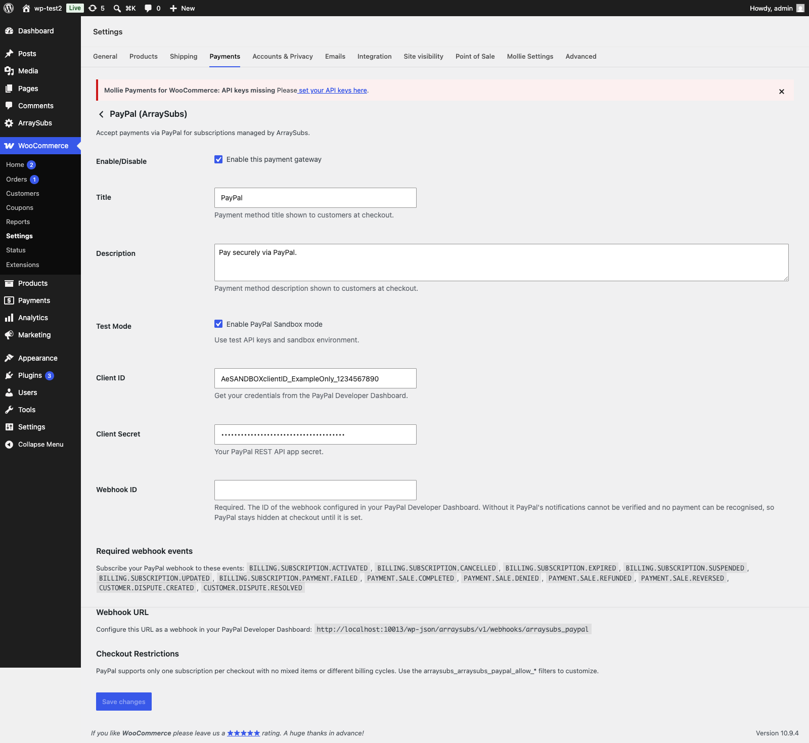
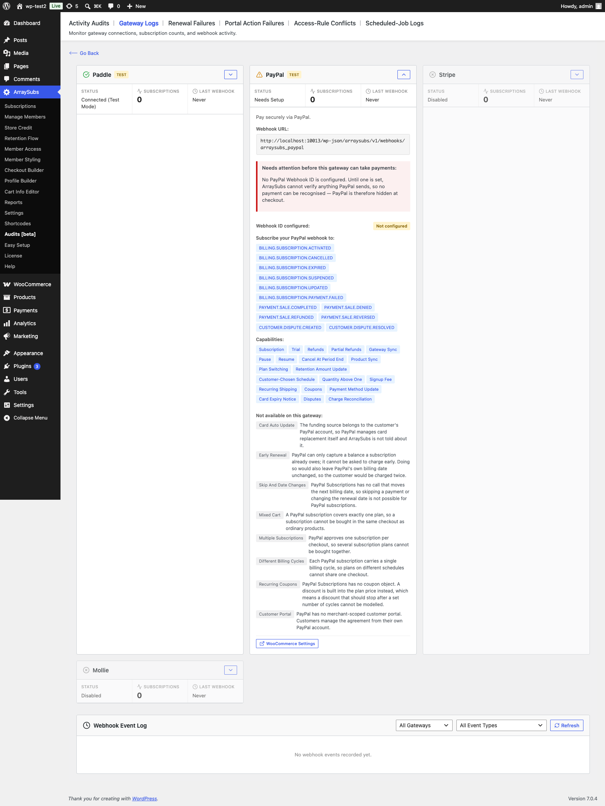

# Info
- Module: PayPal Gateway
- Availability: Pro
- Last updated: 2026-08-17

# PayPal Gateway

> PayPal integration using Billing Subscriptions for recurring payments — gateway-managed billing schedule, Smart Payment Buttons, pause and resume, next-cycle plan changes, and reconciliation for missed notifications.

**Availability:** Pro

## Page Navigation

- **Current guide:** PayPal Gateway
- **Where to open it:** Storefront checkout and WordPress Admin -> ArraySubs -> Checkout Builder
- **Section overview:** [Open overview](../README.md)
- **Previous guide:** [payment-recovery](./payment-recovery.md)
- **Next guide:** [README](./README.md)
- **Troubleshooting:** [Audits, Logs, and Troubleshooting](../../audits-and-logs/README.md)

## Overview

PayPal uses the **gateway-managed billing** model. ArraySubs creates a PayPal Billing Plan and Subscription during checkout, and PayPal handles all future charges on its own schedule. When PayPal processes a payment, it sends a webhook to ArraySubs, which creates the corresponding renewal order and updates the subscription.

This model is simpler than ArraySubs-managed billing but gives you less direct control over renewal timing, retry behavior, and grace periods.

## Current Capability Snapshot

| Capability | PayPal Behavior in ArraySubsPro |
|---|---|
| Automatic renewals | Yes. PayPal charges on its own schedule and ArraySubs records notification-confirmed payments. |
| Checkout type | PayPal Smart Payment Buttons through the PayPal JS SDK, on both classic checkout and the WooCommerce Checkout block. |
| Required credentials | Client ID, Client Secret, **and Webhook ID**. All three are required — without the Webhook ID no notification can be verified, so PayPal stays hidden at checkout. |
| Webhook URL | `wp-json/arraysubs/v1/webhooks/arraysubs_paypal` |
| Sandbox mode | Supported through the gateway settings. |
| Mixed carts | Not supported. |
| Multiple subscriptions in one checkout | Not supported. |
| Different billing cycles in one checkout | Not supported. |
| Customer-chosen schedule (flexible duration) | Supported. Each chosen interval gets its own PayPal plan. |
| Quantity above one | Supported. The plan price is per unit and PayPal multiplies it. |
| Signup fee | Supported, as the plan's setup fee. |
| Recurring shipping | Supported, as a subscription-level shipping amount PayPal adds to every cycle. |
| Coupons | First payment only. A discount that must recur is declined at checkout. |
| Free trials | Supported, as a trial cycle on the PayPal plan. |
| Pause / Resume | **Supported.** PayPal is suspended and reactivated through its own API. |
| Plan switching | Supported for the **next cycle**. A switch that would need a payment now is refused. |
| Retention discount | Supported, taking effect at the **next renewal**. |
| Skip a renewal / change the date | Not supported. PayPal exposes no call that moves its next billing date. |
| Early renewal | Not supported. |
| Payment method update | Supported by creating a new billing agreement. |
| Card expiry notices | Supported for card-funded subscriptions. A wallet-funded subscription has no card to warn about. |
| Refunds | Supported, including partial refunds. |
| Disputes | Recorded as notes and subscription meta. A paid order is never re-opened by a dispute. |
| Charge reconciliation | Supported. A renewal whose notification never arrived is resolved from PayPal's own transaction list. |

```box class="warning-box"
PayPal covers **one subscription plan per checkout**. Mixed carts, several plans in one order, and mixed billing cycles are limits of PayPal's Billing Subscriptions API. ArraySubs hides PayPal at checkout for a cart it cannot take, rather than failing at the end of the payment flow.
```

## How PayPal Payments Work

### Initial Checkout

1. Customer selects PayPal at checkout and clicks the **Smart Payment Button**
2. ArraySubs creates a **PayPal Billing Plan** with the subscription's billing cycle, price, and any trial configuration
3. A **PayPal Subscription** is created with the billing plan, and the customer is redirected to PayPal for approval
4. The customer logs into PayPal and approves the Billing Agreement
5. PayPal sends a `BILLING.SUBSCRIPTION.ACTIVATED` webhook
6. ArraySubs captures the PayPal subscription ID, payer ID, and payment context

### Renewal Payments

1. PayPal charges the customer according to its own billing schedule
2. When a payment succeeds, PayPal sends a `PAYMENT.SALE.COMPLETED` webhook
3. ArraySubs creates a renewal order, marks it as paid, and updates the subscription's next payment date
4. If payment fails, PayPal sends `BILLING.SUBSCRIPTION.PAYMENT.FAILED` and ArraySubs triggers the failure flow

```box class="info-box"
When the ArraySubs renewal engine fires for a PayPal subscription, **no local charge is sent**. The system recognizes PayPal as gateway-managed and waits for PayPal's webhook to confirm any payment.
```

### Trial Setup

PayPal does not support trials in the same way as Stripe. Trial handling is configured through the **Billing Plan** itself — the plan includes a trial cycle with a $0 charge for the specified duration. This is managed automatically by PayPal's billing system.

---

## Smart Payment Buttons

The PayPal integration uses Smart Payment Buttons at checkout. These are PayPal's modern payment buttons that adapt to the customer's device and region, showing options like:

- Pay with PayPal account
- Pay with PayPal Credit (where available)
- Pay with Venmo (US only, where available)

The button is rendered at checkout using PayPal's JavaScript SDK. Customers complete the entire payment flow in a popup or redirect without leaving your site (popup) or via a redirect to PayPal's hosted page.

PayPal appears on **both** checkout experiences: classic WooCommerce checkout and the WooCommerce **Checkout block**. No extra configuration is needed for the block.

---

## What the PayPal Plan Carries

ArraySubs builds a PayPal plan from the subscription's own pricing and reuses it for every customer who buys the same thing on the same terms. That plan carries more than the base price:

| Cart element | How PayPal receives it |
|---|---|
| **Quantity** | The plan price is **per unit** and the subscription carries the quantity. PayPal bills quantity × unit price. |
| **Signup fee** | The plan's setup fee, charged once with the first payment. |
| **Recurring shipping** | A subscription-level shipping amount that PayPal adds to **every** cycle, on top of the plan price. It is sent as the gross amount, so the shipping tax matches what WooCommerce charges. One-time shipping is deliberately not repeated. |
| **Trial** | A trial cycle on the plan at zero, for the configured duration. |
| **Coupon** | A single discounted first cycle baked into the plan. |

Because shipping is supported, **Subscription Boxes are sellable on PayPal.**

```box class="info-box"
When shipping applies, the order's address is sent to PayPal and PayPal is told not to ask the customer for one. Without that, PayPal would collect an address it then ignores.
```

### Coupons: First Payment Only

PayPal has no coupon object. ArraySubs models a checkout discount as a discounted **first cycle** on the plan.

That means:

- A one-off "first month 50% off" coupon works.
- A coupon that must keep applying to renewals — including one limited to a set number of renewals — **cannot** be modelled, so the cart is refused on PayPal at checkout rather than the discount being silently dropped and the customer overcharged.

If you sell with recurring discounts, offer Stripe, Mollie, or Paddle alongside PayPal.

---

## Pause and Resume

PayPal subscriptions can be paused and resumed for real, through PayPal's own suspend and activate calls.

1. ArraySubs reads the subscription's current status at PayPal first
2. It sends the suspend (or activate) request
3. It **re-reads** the subscription to confirm the change actually landed
4. Only then is the local status committed

A lost response or an ambiguous error is resolved by asking PayPal what its state is — never by assuming. PayPal's own status notification coming back afterwards is recognised as an echo of your action, not as something the customer did.

A pause has a duration in ArraySubs; PayPal's suspend does not. The scheduled auto-resume is what calls PayPal to reactivate.

---

## Plan Changes (Upgrade and Downgrade)

A PayPal subscription can move to a different plan, taking effect at the **next cycle**.

1. ArraySubs revises the PayPal subscription onto the new plan
2. If PayPal requires the customer to approve the change, ArraySubs holds the switch as **pending** and gives the customer the PayPal approval link
3. The switch commits only when PayPal confirms it — either through the subscription-updated notification, or a verified re-read
4. An approval that never happens expires and the pending switch rolls back cleanly

```box class="warning-box"
A switch that would require a payment **right now** is refused on PayPal, with the reason shown. PayPal does not prorate, so there is no correct amount to charge mid-cycle. Schedule the change for the next cycle, or move the subscription to a gateway that prorates.
```

The switch is never committed just because the customer returned from PayPal. Coming back from a redirect is not proof that PayPal accepted anything.

---

## Retention Discounts

A retention offer that lowers the recurring amount is applied by revising the subscription onto a cheaper plan. PayPal cannot change an amount mid-cycle, so:

- The discount takes effect at the **next renewal**, not immediately
- The retention screen says so, per gateway, instead of implying an instant change
- If PayPal refuses the revision, the offer is **not** recorded as accepted — the customer is not told they got a discount the provider never applied

---

## Card Expiry Warnings

PayPal reports the funding card's expiry on a card-funded subscription. ArraySubs stores it and warns the customer **30 days** and **7 days** before it expires, once each, from a daily sweep.

A subscription funded from a PayPal balance or a bank account has no card to expire and produces no warning — that is expected, not a fault.

---

## Reconciliation: When a Notification Goes Missing

Every PayPal renewal order carries a deadline. A sweep every six hours picks up any that are still waiting and asks PayPal directly.

A PayPal transaction is only matched to an order when:

- the amount matches exactly, **and**
- the currency matches exactly, **and**
- no other order has already claimed that transaction

If PayPal cannot be reached, the answer is *inconclusive* — the renewal is left alone rather than being failed on the strength of a lookup that did not complete.

---

## Payment Method Updates

When a customer needs to update their PayPal payment method:

1. A new Billing Agreement is created
2. The customer is redirected to PayPal to approve the new agreement
3. PayPal confirms the new agreement via `BILLING.SUBSCRIPTION.ACTIVATED` webhook
4. ArraySubs switches the subscription to the new PayPal subscription ID

This is essentially a re-authorization — the customer agrees to a new billing relationship with PayPal.

---

## Refunds

Refunds are issued the normal WooCommerce way, on the renewal order, and **partial refunds are supported**.

Each refund attempt carries its own key derived from the WooCommerce refund ID. That matters: without it, two identical partial refunds look like the same request to PayPal, and PayPal returns the first one twice while ArraySubs records two — money that never actually left. With the key, two identical refunds are two refunds.

A refund issued directly in the PayPal dashboard is picked up and turned into a real WooCommerce refund on the order, so your store's totals match PayPal's. It is recorded once, no matter how many times PayPal reports it.

---

## Dispute Handling

PayPal notifies ArraySubs of disputes through webhooks:

| PayPal Event | ArraySubs Action |
|---|---|
| `CUSTOMER.DISPUTE.CREATED` | Records the dispute as a subscription note and meta |
| `CUSTOMER.DISPUTE.RESOLVED` | Records the resolution outcome |

```box class="info-box"
A dispute **never** changes the status of an order that has already been paid. A settled order stays settled, so the next renewal cycle cannot mistake it for an unpaid invoice and reuse it. Disputes are still managed in the PayPal Resolution Center; ArraySubs records them and leaves the decision to you.
```

ArraySubs does not automatically cancel subscriptions when a dispute is opened.

---

## Limitations

These are real limits of PayPal's Billing Subscriptions API, not settings you can turn on:

| Feature | Status | Detail |
|---|---|---|
| Mixed carts | Not supported | Subscription + regular products cannot be in the same cart |
| Multiple subscriptions | Not supported | Only one subscription plan per checkout |
| Different billing cycles | Not supported | Cannot process subscriptions with different schedules in one order |
| Recurring coupons | Not supported | PayPal has no coupon object; only the first payment can be discounted |
| Mid-cycle price change | Not supported | PayPal does not prorate, so a retention discount starts at the next renewal |
| Skip a renewal / change the date | Not supported | No PayPal call moves the subscription's next billing date |
| Early renewal | Not supported | PayPal owns the schedule and exposes no arbitrary off-cycle charge |
| Reverse a scheduled cancellation | Not supported | Once a PayPal agreement is cancelled it cannot be reinstated |
| Card auto-update | Not supported | PayPal manages payment methods internally |
| Customer portal | Not applicable | Payment method changes happen through a new agreement |
| SCA / 3D Secure | N/A | Handled internally by PayPal |

When PayPal is enabled, these restrictions are enforced automatically at checkout — even if your General Settings allow mixed carts or multiple subscriptions.

```box class="info-box"
**Cancel at end of period** works on PayPal, but through ArraySubs rather than PayPal: the agreement is cancelled immediately and local access is kept until the scheduled date. PayPal has no scheduled-cancel call, and once an agreement is cancelled it cannot be reinstated — so the cancellation cannot be reversed afterwards.
```

---

## Webhook Events

PayPal notifications are the only way ArraySubs learns that money moved, so all twelve events below must be subscribed in the PayPal Developer Dashboard (**My Apps & Credentials → your REST app → Webhooks**). The same list is printed on the PayPal gateway settings screen for copying.

| PayPal Event | ArraySubs Handler |
|---|---|
| `BILLING.SUBSCRIPTION.ACTIVATED` | Captures initial payment context |
| `BILLING.SUBSCRIPTION.CANCELLED` | Handles remote cancellation |
| `BILLING.SUBSCRIPTION.EXPIRED` | Handles remote cancellation |
| `BILLING.SUBSCRIPTION.SUSPENDED` | Confirms a pause, or triggers the payment failure flow |
| `BILLING.SUBSCRIPTION.UPDATED` | Commits a pending plan change |
| `BILLING.SUBSCRIPTION.PAYMENT.FAILED` | Triggers payment failure flow |
| `PAYMENT.SALE.COMPLETED` | Marks renewal as paid |
| `PAYMENT.SALE.DENIED` | Triggers payment failure flow |
| `PAYMENT.SALE.REFUNDED` | Records refund |
| `PAYMENT.SALE.REVERSED` | Records refund |
| `CUSTOMER.DISPUTE.CREATED` | Records dispute |
| `CUSTOMER.DISPUTE.RESOLVED` | Records resolution |

```box class="warning-box"
`BILLING.SUBSCRIPTION.UPDATED` is what commits a plan change the customer approved at PayPal. Leave it out and an approved upgrade never takes effect locally.
```

An event ArraySubs does not handle is accepted and logged rather than rejected — PayPal disables an endpoint that keeps failing, and that would take down every event that does matter.

### Webhook URL

```
https://yoursite.com/wp-json/arraysubs/v1/webhooks/arraysubs_paypal
```

### Signature Verification

PayPal uses API-based verification instead of HMAC signatures. Each incoming webhook is verified by calling PayPal's `/v1/notifications/verify-webhook-signature` endpoint with the webhook ID and payload.

---

## PayPal-Specific Settings

PayPal gateway settings are configured in **WooCommerce → Settings → Payments → ArraySubs PayPal**:

| Setting | Description |
|---|---|
| Enable/Disable | Turn the gateway on or off |
| Title | Payment method name shown at checkout |
| Description | Text shown below the payment method |
| Client ID | PayPal REST API Client ID (live and sandbox) |
| Client Secret | PayPal REST API Client Secret (live and sandbox) |
| Webhook ID | PayPal webhook ID for verification. **Required** — treated as a credential |
| Sandbox Mode | Enable to use PayPal's sandbox environment |



```box class="warning-box"
**The Webhook ID is a credential, not an optional extra.** Without it every incoming PayPal notification fails verification and is rejected — so no renewal is ever recorded, while the gateway would otherwise look perfectly healthy. ArraySubs therefore reports PayPal as **Needs Setup** and keeps it hidden at checkout until the Webhook ID is saved.
```

The settings screen also lists the twelve events to subscribe in the PayPal Developer Dashboard, so you can set the webhook up without leaving the page.

The same information appears on the **Gateway Health** screen, where an unset Webhook ID is reported as a blocking issue alongside PayPal's capability tags and the reason behind each capability it does not have:



---

## Troubleshooting

| Problem | Likely Cause | Solution |
|---|---|---|
| Smart Payment Button not appearing | JavaScript SDK not loaded | Check for JavaScript errors in the browser console; verify Client ID is correct |
| PayPal shows as **Needs Setup** with credentials filled in | The Webhook ID is empty | Enter the Webhook ID from the PayPal Developer Dashboard. Without it every notification is rejected |
| PayPal is missing from the checkout payment methods | The cart needs something PayPal cannot do — a mixed cart, several plans, mixed cycles, or a recurring coupon | Check the Gateway Health screen for the reason, then adjust the cart or offer another gateway |
| Customer approves but subscription not created | Webhook not arriving | Verify the webhook URL in PayPal Developer Dashboard |
| Renewal order not created after payment | `PAYMENT.SALE.COMPLETED` event not configured | Add this event to your PayPal webhook config. The six-hourly reconciliation sweep also recovers these once the credentials work |
| An approved upgrade never takes effect | `BILLING.SUBSCRIPTION.UPDATED` not subscribed | Add the event; the pending switch commits only when PayPal confirms it |
| *"Cannot process subscription and regular products together"* | PayPal mixed cart restriction | Remove regular products from cart or switch to a gateway that supports mixed carts |
| Plan change refused with "needs a payment now" | PayPal cannot prorate | Schedule the change for the next cycle, or use a gateway that prorates |
| Skip or a manual date change is refused | PayPal owns the billing date and exposes no call to move it | Not fixable on PayPal. Pause and resume are the available equivalents |
| Refund issued but not reflected | `PAYMENT.SALE.REFUNDED` not configured | Add this event to PayPal webhooks |
| No card expiry warning for a subscription | It is funded from a PayPal balance or bank account, not a card | Expected. There is no card to expire |

---

## Related Docs

- [Gateway Overview](README.md) — Architecture and capability comparison
- [Auto-Renew and Manual Fallback](auto-renew-and-manual-fallback.md) — What happens when auto-renew is toggled off
- [Gateway Health Dashboard](../../gateway-health/README.md) — Monitoring PayPal connection and webhooks

---

## FAQ

**Can I use PayPal as the only payment gateway?**
Yes, but be aware of the limitations: no mixed carts, no multiple subscriptions per checkout, and no different billing cycles. These restrictions may limit your product catalog design.

**Does PayPal support test/sandbox mode?**
Yes. Enable sandbox mode in the PayPal gateway settings and use sandbox API credentials from the PayPal Developer Dashboard.

**What happens if PayPal suspends the billing agreement?**
PayPal sends a `BILLING.SUBSCRIPTION.SUSPENDED` webhook. If ArraySubs asked for that suspension — a pause — it is recognised as the echo of your own action. An unexpected suspension is treated as a payment failure and follows the grace period flow.

**Can customers pause a PayPal subscription?**
Yes. Unlike the earlier behaviour, this is a real suspension at PayPal, not just ArraySubs declining to charge. The pause duration is held locally and the scheduled resume reactivates the PayPal subscription.

**Why can't I skip a renewal on PayPal?**
PayPal owns the billing date and gives no way to move it. A local skip would leave ArraySubs and PayPal on two different schedules, and PayPal would charge on the original date anyway — so it is refused with that reason instead. Pause is the workable alternative.

**Can I sell a Subscription Box on PayPal?**
Yes. Recurring shipping is sent as a subscription-level shipping amount that PayPal adds to every cycle, so box products with recurring shipping now work.

**Does a coupon work on PayPal?**
A first-payment discount does. A discount that keeps applying to renewals does not — PayPal has no coupon object — so that cart is declined on PayPal at checkout rather than the discount being dropped without telling anyone.

**Can customers pay with Venmo or PayPal Credit?**
Smart Payment Buttons automatically show available payment options based on the customer's location and device. Venmo and PayPal Credit appear when eligible without additional configuration.
