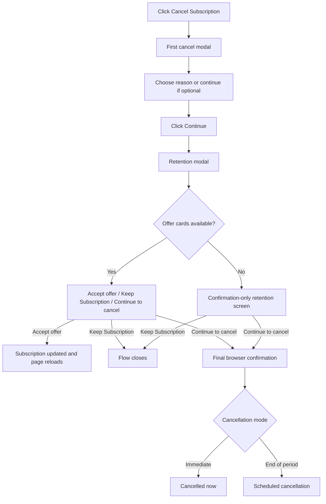

# Info
- Module: Cancel Subscription and Retention Offers
- Availability: Shared
- Last updated: 16 March 2026

# User Guide
This guide explains the **Cancel Subscription** experience inside the Customer Portal exactly as the rebuilt portal flow now behaves.

This is no longer a one-click action. It is a guided sequence with two modal stages and a final confirmation checkpoint.

Customers usually reach it from:

- **My Account → Subscriptions → View subscription → Cancel Subscription**

## What this screen now includes

The experience can include:

1. the first cancel modal
2. reason selection and optional extra details
3. the retention modal
4. a confirmation-only fallback when no actionable offers are available
5. final cancellation confirmation

## Screen flow diagram

## The first cancel modal

The first modal opens as soon as the customer clicks **Cancel Subscription**.

It contains:

- the warning message
- the reason dropdown
- the extra details field for **Other**
- **Keep Subscription**
- **Continue**

### Warning copy changes by cancellation mode

#### Immediate cancellation mode
The customer is warned that the subscription will be cancelled immediately.

#### End-of-period mode
The customer is told the subscription remains active until the current billing period ends.

## Reason selection

The customer can choose from the configured reason list.

Common examples include:

- Too expensive
- Not using it enough
- Found a better alternative
- Missing features I need
- Technical issues
- Just need a temporary break
- Other

### If the customer chooses Other

The modal reveals an additional text field for more context.

### Important behavior note

Even when the reason is optional, the first modal still appears. Optional only changes whether the customer must pick a reason before continuing.

## The retention modal

After the customer clicks **Continue**, the portal can open the retention modal.

This is the **Before You Go** stage.

Its job is to offer a way to stay before the final cancellation happens.

## Two possible retention outcomes

### Offer-card mode

If the subscription is eligible, the customer sees actionable offer cards.

These can include:

- **Discount**
- **Pause**
- **Downgrade**
- **Contact Support**

### Confirmation-only mode

If no actionable offer is available, the same modal becomes a confirmation-style screen instead.

That happens when:

- no configured offer matched the reason
- the subscription was not eligible for available offers
- the subscription uses an unsupported automatic gateway for actionable retention offers

In that case the customer still sees:

- **Keep Subscription**
- **No thanks, continue to cancel**

## What each action does

### Keep Subscription

This closes the flow and leaves the subscription unchanged.

### Accept Offer

#### Discount
- the subscription stays active
- a temporary discount applies to future renewals
- the customer should see the discounted recurring amount after reload
- the customer should receive a confirmation email for the accepted discount

#### Pause
- the subscription is paused instead of cancelled

#### Downgrade
- the customer moves toward a lower-tier plan path

#### Contact Support
- the configured support destination opens
- this does not automatically cancel or transform the subscription

### No thanks, continue to cancel

This preserves the reason already chosen and moves the customer into the final cancellation confirmation path.

## Final cancellation confirmation

The rebuilt flow includes a final confirmation checkpoint before the cancellation request is actually submitted.

That means the customer has multiple opportunities to stop:

- close the first modal
- keep the subscription in the retention modal
- stop at the final confirmation prompt

## Final outcomes

### Immediate cancellation outcome

- the subscription is cancelled immediately
- the page reloads and shows the cancelled state

### End-of-period outcome

- the subscription is scheduled to end at the end of the billing period
- the subscription remains active until then
- the page reloads to show the scheduled state

## Support boundary for automatic gateways

- **Manual-payment subscriptions:** actionable retention flow supported
- **Stripe automatic-payment subscriptions:** actionable retention flow supported

> **Pro:** Stripe automatic-payment subscriptions support the actionable retention flow. Other automatic gateways use the confirmation-style fallback instead of showing active retention offers.

## Related screens

This flow is related to, but different from:

- [Change Plan screen](./change-plan-screen.md)
- [Skip Next Renewal screen](./skip-next-renewal-screen.md)
- [Vacation Mode screen](./vacation-mode-screen.md)
- [Subscription Details screen](./subscription-details-screen.md)

For the full module explanation, also read:

- [Cancellation and Retention Offers](../cancellation-and-retention-offers/README.md)
- [Customer cancellation and retention flow](../cancellation-and-retention-offers/customer-portal-flow.md)

# Use Case
A customer opens the subscription detail page, clicks **Cancel Subscription**, selects **Too expensive**, and continues. The retention modal appears with a discount offer. If they accept it, the cancellation stops, the reloaded page shows the new discounted recurring amount, and an email confirms that the retention discount is now active.

# FAQ
### Does clicking Cancel Subscription always cancel right away?
No. The store may use immediate cancellation or end-of-period cancellation.

### Can the customer back out after opening the modal?
Yes. The rebuilt flow includes multiple safe-exit points, including **Keep Subscription**.

### What happens if no retention offer is available?
The retention modal becomes a confirmation-only screen instead of showing offer cards.

### Does accepting a discount offer send an email?
Yes. Accepted discount-style retention offers can send a customer confirmation email so the customer has a record of the updated recurring pricing.

### Is Contact Support the same as accepting a subscription change?
No. Contact Support is a support detour, not an automatic subscription change.