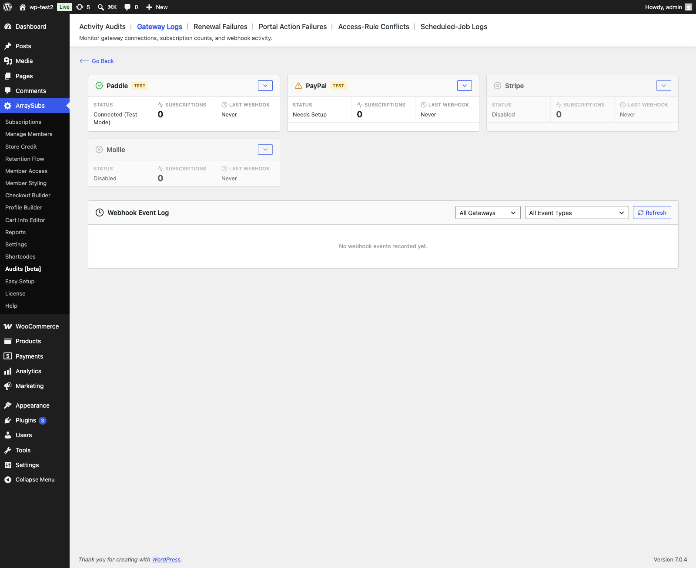
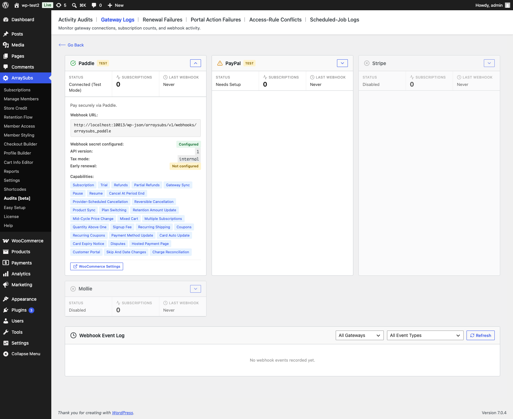

# Info
- Module: Gateway Health
- Availability: Pro
- Last updated: 2026-08-17

# Gateway Health

> Monitor payment gateway connections, track subscription counts per gateway, find webhook URLs, review gateway capabilities, and browse the webhook event log — all from one admin screen.

**Availability:** Pro

## Page Navigation

- **Current guide:** Gateway Health
- **Where to open it:** WordPress Admin -> ArraySubs -> Audits [beta] -> Gateway Logs
- **Direct route:** `/wp-admin/admin.php?page=arraysubs-mainadmin#/settings/gateways`
- **Section overview:** [Open overview](../README.md)
- **Previous guide:** [Auto-Renew and Manual Fallback](../checkout-and-payments/automatic-payments/auto-renew-and-manual-fallback.md)
- **Next guide:** [Payment Recovery](../checkout-and-payments/automatic-payments/payment-recovery.md)
- **Troubleshooting:** [Audits, Logs, and Troubleshooting](../audits-and-logs/README.md)

## Overview

The Gateway Health Dashboard gives you a single view of every payment gateway's status, connection health, and recent webhook activity. Use it to verify your gateway setup is working, confirm Stripe's auto-provisioned ArraySubs webhook status, find provider webhook URLs where manual setup is still required, and diagnose webhook delivery issues.

**Navigation:** **ArraySubs → Audits [beta] → Gateway Logs**. The admin page title is **Payment Gateways**.



## Gateway Status Cards

The top section displays a card for each registered gateway (Stripe, PayPal, Paddle, Mollie) in a responsive grid.

### Card Summary

Each card shows three key metrics at a glance:

| Metric | Description | Example |
|---|---|---|
| **Status** | Connection state | `Connected`, `Connected (Test Mode)`, `Needs Setup`, `Disabled`, `Unavailable` |
| **Subscriptions** | Count of active subscriptions using this gateway | `42` |
| **Last Webhook** | Timestamp of the most recent webhook received | `Apr 2, 2026, 3:30 PM` or `Never` |

A **Test Mode** badge appears next to the gateway title when the gateway is running in sandbox/test mode.

### Expanded Details


Click the expand button on any card to reveal:

- **Blocking issues** — anything actively stopping this gateway from taking payments, shown as a *"Needs attention before this gateway can take payments"* notice. See below.
- **Description** — Brief text explaining what the gateway does
- **Webhook URL** — The provider webhook URL displayed in a monospace code block for easy copying. For Stripe, regular payment/refund/dispute events use the official WooCommerce Stripe Gateway webhook, and the expanded Stripe details also show the auto-provisioned ArraySubs secondary endpoint:
  ```
  https://yoursite.com/wp-json/arraysubs/v1/webhooks/arraysubs_stripe
  ```
- **Provider facts** — a short list of the settings that most often go wrong for that specific provider. See below.
- **Capabilities** — Tag badges showing what the gateway supports, in plain language: `trial`, `pause`, `refunds`, `partial refunds`, `plan switching`, `quantity above one`, `signup fee`, `recurring shipping`, `coupons`, `recurring coupons`, `mid-cycle price change`, `skip and date changes`, `charge reconciliation`, `card expiry notice`, and the rest.
- **Why a capability is off** — where a gateway can explain a missing capability, the reason is printed next to it instead of the tag silently being absent.
- **WooCommerce Settings** — A button that links directly to the gateway's WooCommerce payment settings page for quick access to API keys and configuration

### Blocking Issues

A gateway can be enabled, have valid API keys, and still be incapable of recognising a single payment. The classic case is a missing PayPal Webhook ID or Paddle webhook secret: every notification arrives and is rejected, while the gateway itself looks perfectly healthy.

Those are now reported as **blocking issues**, and the underlying status reflects them:

- PayPal without a **Webhook ID** reports **Needs Setup** and stays hidden at checkout.
- Paddle without a **Webhook Secret** does the same.

Both are treated as credentials, because functionally that is what they are.

### Provider Facts

Each provider surfaces the handful of facts that actually determine whether it works:

| Gateway | Facts shown |
|---|---|
| **PayPal** | Whether the Webhook ID is configured, and the twelve events to subscribe in the PayPal Developer Dashboard |
| **Paddle** | Whether the webhook secret is configured, the pinned API version, the active tax mode, and whether early renewal is enabled |
| **Mollie** | Whether the API key is configured, whether customer storage is enabled, which of your methods are **mandate-capable**, and which are **trial-capable** |
| **Stripe** | Secondary webhook endpoint status, checked live against Stripe |



```box class="info-box"
The Mollie method lists are read from your **live** gateway objects, not a hardcoded table — several Mollie methods only become mandate-capable once SEPA Direct Debit is enabled on your profile. If a trial-capable list is empty, trials will not sell on Mollie, and this is where you find out before a customer does.
```

### Why a Capability Is Off

Where a gateway can give a reason, it does. For example, Mollie's `card auto update` tag is absent with the note that Mollie publishes nothing about running a card-updater service — so ArraySubs will not claim a reissued card keeps working when it might not.

An honest "no, and here is why" is more useful than a missing badge, and it stops you from designing a store around a capability the provider does not have.

### Status Values

| Status | Meaning | Action Needed |
|---|---|---|
| `Connected` | Gateway is enabled, configured, and receiving webhooks | None |
| `Connected (Test Mode)` | Gateway is working but using sandbox credentials | Switch to live keys before going live |
| `Needs Setup` | Gateway is enabled but missing required configuration | Enter API keys in WooCommerce payment settings. For PayPal, also the Webhook ID; for Paddle, also the webhook secret. For Stripe, connect WooCommerce Stripe first so ArraySubsPro can create/repair its secondary webhook automatically |
| `Disabled` | Gateway is not enabled in WooCommerce | Enable in WooCommerce → Settings → Payments if you want to use it |
| `Unavailable` | Gateway extension or class is missing | Ensure ArraySubs Pro is active and the gateway class is loaded |

---

## Webhook Event Log

Below the gateway cards, the **Webhook Event Log** shows a paginated table of every webhook event received from all gateways.

### Filters

| Filter | Options |
|---|---|
| **Gateway** | All Gateways, or a specific gateway (Stripe, PayPal, Paddle, Mollie) |
| **Refresh** | Manual refresh button with loading spinner |

### Table Columns

| Column | Description | Example |
|---|---|---|
| **Gateway** | Badge showing the gateway slug | `stripe` |
| **Event ID** | The unique event identifier from the gateway | `evt_1234abc` |
| **Event Type** | The normalized event type | `payment_succeeded`, `payment_failed`, `dispute_created` |
| **Processed At** | Timestamp when ArraySubs processed the webhook | `Apr 2, 2026, 3:30 PM` |

### Pagination

The log displays up to 50 events per page with previous/next navigation and a "Page X of Y" indicator. The total event count is shown in the footer.

### Data Retention

Webhook events are stored in the `wp_arraysubs_webhook_events` database table. Events older than 30 days are automatically cleaned up by a scheduled maintenance job.

---

## How to Use This Dashboard

### Step 1: Check Gateway Status and Blocking Issues

After configuring a new gateway, visit this dashboard to verify the status shows `Connected`. If it shows `Needs Setup`, expand the card and read the **blocking issues** list first — it names exactly what is missing. Then click the WooCommerce Settings link and complete the configuration.

A gateway with blocking issues is deliberately hidden at checkout. That is the safe outcome: taking a payment you cannot then recognise is worse than not offering the method.

### Step 2: Confirm Webhook Setup

Expand the gateway card and review the webhook configuration:

- **Stripe:** the official WooCommerce Stripe webhook URL should be configured by WooCommerce Stripe, and the ArraySubs secondary webhook should show as configured automatically. No manual Stripe Dashboard endpoint is normally required for the ArraySubs URL. If the secondary webhook is missing or was deleted in Stripe, open **WooCommerce -> Settings -> Payments -> ArraySubs Stripe Configs** and click **Refresh** to check and recreate it.
- **Mollie:** nothing to configure. ArraySubs sets its own webhook URL on every renewal payment it creates, and your first-payment webhooks keep going to the Mollie plugin as before.
- **PayPal:** Developer Dashboard → My Apps & Credentials → REST API apps → Webhooks
- **Paddle:** Vendor Dashboard → Developer Tools → Notifications → New destination

### Step 3: Test the Connection

After the webhook is configured or auto-provisioned:

1. Use the gateway's "Test" or "Send test webhook" feature (if available)
2. Return to the ArraySubs Gateway Health Dashboard
3. Check the Webhook Event Log for the test event
4. Verify the "Last Webhook" timestamp on the gateway card updated

### Step 4: Monitor Ongoing Health

Periodically check:

- **Subscription counts** — ensure they match your expected numbers
- **Last webhook timestamps** — a gateway that hasn't received a webhook in days may indicate a configuration issue
- **Event log** — look for `payment_failed` events that might indicate widespread billing problems

---

## Real-Life Use Cases

### Post-Setup Verification

After connecting Stripe for the first time, the merchant visits the dashboard, verifies the status shows `Connected (Test Mode)`, confirms the official Woo Stripe webhook and ArraySubs secondary webhook both show configured, sends a test webhook, and confirms it appears in the event log before switching to live mode. If the ArraySubs secondary webhook was deleted from the Stripe Dashboard, the merchant opens **ArraySubs Stripe Configs** and clicks **Refresh** so ArraySubs recreates the endpoint and saves the new signing secret.

### Debugging Missing Renewals

Customers report their subscriptions cancelled unexpectedly. The merchant checks the event log, finds no `payment_succeeded` events for the last 3 days, and realizes the provider webhook URL changed during a site migration. For Stripe, saving WooCommerce Stripe settings or revisiting admin after credentials are available lets ArraySubsPro repair the secondary endpoint; for PayPal/Paddle, update the provider dashboard URL manually. Mollie needs no fix — ArraySubs attaches the current webhook URL to every renewal payment it creates, so new charges self-heal after a migration.

---

## Edge Cases and Important Notes

- The dashboard shows **all registered gateways**, even those that are disabled. This helps you see the full picture and quickly enable a gateway when needed.
- **Subscription counts** reflect active subscriptions with that gateway stored as `_payment_gateway`. Subscriptions that were detached from a gateway are not counted.
- **Webhook events** are deduplicated by event ID per gateway. If the same event is sent twice (retry), only one entry appears in the log.
- If your site uses **plain permalinks** (no pretty URLs), the webhook URL format changes accordingly. The dashboard always shows the correct URL for your site configuration.

---

## Related Docs

- [Automatic Payments Overview](../checkout-and-payments/automatic-payments/README.md) — How payment gateways work and capability comparison.
- [Stripe Gateway](../checkout-and-payments/automatic-payments/stripe.md) — Stripe webhook events reference.
- [PayPal Gateway](../checkout-and-payments/automatic-payments/paypal.md) — PayPal webhook events reference.
- [Paddle Gateway](../checkout-and-payments/automatic-payments/paddle.md) — Paddle webhook events reference.
- [Audits and Logs](../audits-and-logs/README.md) — Related troubleshooting pages for renewals, portal failures, and payment issues.

---

## FAQ

**How often should I check the Gateway Health Dashboard?**
A weekly glance is sufficient for a healthy store. Check immediately after any site migration, URL change, SSL certificate update, or gateway configuration change.

**What does "Never" mean for Last Webhook?**
The gateway has not sent any webhooks that ArraySubs has processed. Either no transactions have occurred yet, the provider webhook is not configured, or for Stripe the secondary endpoint has not received an ArraySubs-specific event yet.

**Can I clear the webhook event log?**
Events older than 30 days are automatically cleaned. There is no manual clear button — the log is designed as an audit trail.

**The dashboard shows "Needs Setup" but I've configured the gateway — what's wrong?**
Expand the card and read the blocking issues list. The two most common are a missing **PayPal Webhook ID** and a missing **Paddle webhook secret** — both are credentials, because without them every incoming notification is rejected. For Stripe, confirm the official WooCommerce Stripe gateway is connected in the active test/live mode, then open **WooCommerce -> Settings -> Payments -> ArraySubs Stripe Configs**. If the Webhook status is not `Enabled`, click **Refresh** to check and recreate the ArraySubs secondary endpoint.

**A gateway is missing from my checkout even though it says Connected — why?**
It was hidden for that specific cart. A gateway is hidden when it cannot take what is in the cart — a mixed cart on PayPal, mixed billing cycles on Paddle, a coupon that must recur. Expand the gateway card here to see which capabilities it has; the checkout message names the gateway and the reason. ArraySubs never hides the last remaining payment option.

**Why does a capability tag have a note next to it instead of just being missing?**
Because "not supported" and "not supported, and here is why" are very different pieces of information. Where a gateway can explain itself — for example Mollie having no documented card-updater service — the reason is shown so you can plan around a real limit rather than guessing at a bug.
