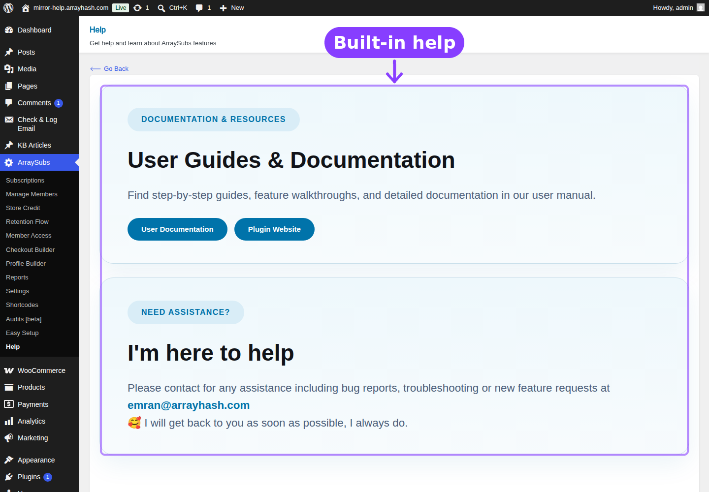

# Info
- Module: Getting Started
- Availability: Free + Pro
- Last updated: 2026-06-04

# Getting Started

> Everything you need to know before launching your subscription store with ArraySubs.

**Availability:** Free + Pro

## Page Navigation

- **Current guide:** Getting Started
- **Where to open it:** WordPress Admin -> ArraySubs
- **Section overview:** [Open overview](../README.md)
- **Previous guide:** [import-export-settings](./import-export-settings.md)
- **Next guide:** [member-commerce-overview](../member-insight/member-commerce-overview.md)
- **Troubleshooting:** [Audits, Logs, and Troubleshooting](../audits-and-logs/README.md)

## Overview

This section walks you through the fundamentals: what ArraySubs is, what it requires, and how to get your first subscription product live and collecting payments. Whether you are setting up a simple monthly membership or a multi-tier product catalog, start here.

## In This Section

### [Before You Launch](before-you-launch.md)
Requirements, installation, WooCommerce prerequisites, core concepts (products, billing cycles, trials, statuses), and a clear breakdown of Free versus Pro features.

### [Cron Job Setup](cron-job-setup.md)
**Required for production.** Configure a system cron so renewals, scheduled cancellations, and emails fire on time — not just when somebody visits the site. The single most important reliability change.

### [First-Time Setup](first-time-setup.md)
A step-by-step checklist: configure your store, create your first subscription product, place a test order, and review the customer portal.

### [Easy Setup Wizard](easy-setup-wizard.md)
A 9-step guided interview that configures the most important subscription settings for you — choose your business type and let the wizard do the rest.

### [Admin Bar Visibility](../admin-bar-visibility/README.md)
Hide the WordPress frontend toolbar for customers while administrators keep normal shortcuts.

### [Admin Dashboard Access](../admin-dashboard-access/README.md)
Redirect unauthorized users away from `/wp-admin` while preserving backend access for administrators and staff roles.

### [WordPress Login Page](../wordpress-login-page/README.md)
Route customer login and registration traffic through WooCommerce My Account.

### [Login as User](../login-as-user/README.md)
Impersonate non-admin customers for support and customer-portal troubleshooting.

### [Multi-Login Prevention](../multi-login-prevention/README.md)
Limit concurrent sessions per account to reduce credential sharing *(Pro)*.

### [Coupons](../coupons/README.md)
Configure subscription-aware WooCommerce coupons with recurring discounts, cycle limits, and initial-checkout counting.

### [Subscription Notes](../subscription-notes/README.md)
Review the subscription timeline for system events, gateway events, admin notes, and customer-visible notes.

### [Member Insight](../member-insight/README.md)
Search customers and open a complete subscription, commerce, profile, and support dashboard *(Pro)*.

### [Redirect Product Page](../redirect-product-page/README.md)
Redirect direct subscription product URLs to sales pages or return 404 responses *(Pro)*.

### [Subscription Shipping](../subscription-shipping/README.md)
Control one-time versus recurring shipping charges on physical subscription products *(Pro)*.

### [Retention Analytics](../retention-analytics/README.md)
Analyze cancellation reasons, churn trends, offer acceptance, and retained revenue.

### [Gateway Health](../gateway-health/README.md)
Monitor payment gateway connection status, webhook URLs, capabilities, and webhook events *(Pro)*.

### [Import / Export Settings](import-export-settings.md)
Download your full ArraySubs configuration as a JSON file or restore a previously exported configuration with granular section-level control.

### [Essential Daily Workflows](essential-daily-workflows.md)
How the subscription lifecycle works from checkout to renewal, where merchants manage everything, and what to verify before going live.
