# Info
- Module: Easy Setup
- Availability: Shared
- Last updated: 2026-09-14

# Easy Setup Wizard

> Answer a guided set of questions about your subscription business and let the wizard configure the most important settings for you — no manual hunting through settings pages required.

**Availability:** Free (Pro options appear when ArraySubs Pro is active)

## Page Navigation

- **Admin screen:** WordPress Admin → **ArraySubs → Easy Setup**
- **From Home:** WordPress Admin → **ArraySubs → Home → Easy Setup Wizard**, or **Start setup / Review setup** in the setup checklist.
- **Direct admin route:** `/wp-admin/admin.php?page=arraysubs-mainadmin#/easy-setup`
- **Use this first:** [First-Time Setup](first-time-setup.md)
- **Review settings after saving:** [General Settings](../settings/general-settings.md), [Toolkit Settings](../settings/toolkit-settings.md), [Plan Switching and Product Relationships](../subscription-products/plan-switching-and-relationships.md)
- **Need to move settings between sites?** Use the Export and Import cards on this same screen.

## Overview

The Easy Setup Wizard guides you through nine steps: Your Business, Billing & Renewal Rules, Checkout & Cart Rules, Plan Switching, Cancellation & Retention, Refunds, Emails & Notifications, Additional Features & Tools, and Review & Apply. Choose the answers that fit your store, review them, and save the matching settings together.

After saving, the final step shows a congratulations message, the settings' last-saved time, and cards for the next setup tasks. When you reopen a completed wizard, these cards appear first. Choose **Start Over** to review your saved setup from Step 1. Member access and content gating are configured separately; they are not a wizard step.

Open the wizard from [Home](../analytics/home.md) or from **ArraySubs → Easy Setup**, alongside the Export and Import tools and a separate **Create subscription product** button.

The same screen is also the safest place to back up or restore an ArraySubs configuration. Export before major changes, then import the JSON file on another site or after a reset.

## When to Use This

- You just installed ArraySubs and want a fast, guided initial configuration.
- You are launching a new subscription model and want the plugin configured to match your business type.
- You want smart defaults based on your industry — SaaS, membership, physical box, content, services, or nonprofit.
- You prefer answering questions in plain language over navigating individual settings fields.

## Prerequisites

- ArraySubs core plugin installed and activated.
- ArraySubs Pro installed and activated (optional — Pro-only wizard options appear only when Pro is active).
- Administrator or shop-manager access to the WordPress dashboard.

## How It Works

The wizard presents eight configuration steps followed by a ninth **Review & Apply** step. Each configuration step has a title, an explanation, and one or more questions. Some questions only appear based on your earlier answers — for example, trial payment settings only show up if you said you offer free trials.

When you reach the final step, a review screen summarizes every relevant answer organized by step. Use **Edit** to revisit a section. Click **Apply Settings**, then confirm **Apply settings** to save. The same final step then changes to the congratulations view.

The wizard loads your saved settings when it opens. If you previously completed it, it also remembers your business answers. On a first run, **Other / Custom** supplies the starting business profile. Profile recommendations fill settings that have not been saved yet; existing settings take priority in the later steps.

Applying saves the supported settings you changed and initializes missing settings. Existing values you left unchanged are preserved. Settings outside the wizard's scope stay intact. The review's answer count describes the visible answers, not the number of settings that will change.

```box class="info-box"
The wizard only configures settings it can map to. It does not create products, define cancellation reasons, build access rules, or write email body content. Complete those tasks after saving; the product card opens a separate guided creation modal.
```

## Real-Life Use Cases

### Use Case 1: New SaaS Launch

A new software store chooses **SaaS / Digital Software**. For settings that have not been saved, the profile recommends strict grace periods, multiple plans, trials with a payment method required, and plan switching. With Pro active, its recommendations include Feature Manager and Activity Audit Log. The team reviews any existing values before saving, then opens **Set up member access** to configure content rules.

### Use Case 2: Physical Subscription Box

A snack box company selects **Physical Subscription Box**. Its recommendations include lenient grace periods, skip and pause flexibility, and, with Pro, Store Credit and pause/contact-support retention offers. The merchant checks the loaded settings, enables the options it needs, changes the maximum pause duration to 60 days, and confirms the review.

### Use Case 3: Membership Community

A community platform picks **Membership / Community**, reviews its saved rules alongside recommendations for trials, pausing, and plan switching, and chooses the tools it needs. With Pro active, the profile also recommends Multi-Login Prevention, Feature Manager, and Activity Audit Log. After saving, the admin opens Member Access and Profile Builder from the next-step cards.

---

## Steps / Configuration

### Launching the Wizard


1. Go to **ArraySubs → Easy Setup**.
2. Find the **Setup Wizard** card on the page.
3. Click **Launch Setup Wizard**.
4. The wizard opens in a modal that fills the available screen height. Scroll inside it to see longer steps; the header and bottom action bar stay in place.

You can also launch it from **ArraySubs → Home → Easy Setup Wizard**, or the checklist's **Start setup / Review setup** action. All entry points open the same wizard. If you see **Your subscription setup is ready.**, choose **Start Over** to load the current saved settings and return to **Your Business**. Start Over does not reset your store settings.

The neighboring **Create subscription product** button opens the [product creation wizard](../subscription-products/quick-product-creation.md) directly. Use it when you want to add a product after configuring the store.

The screenshots below show ArraySubs Pro active, with example choices that reveal conditional fields. Use the settings that suit your store; you do not need to copy every selection.

```box class="info-box"
If ArraySubs Pro is not active, a small note at the top of the wizard reads: "ArraySubs Pro is not active, so Pro-only wizard options are hidden for now."
```

### Navigation

- **Next** — Validates the current step's visible questions and moves forward.
- **Close** — Appears on the first step and asks whether to discard this session.
- **Back** — Appears from the second step onward and returns to the previous step without losing answers.
- **Skip** — Replaces edits on the current step with the values loaded from saved settings, using profile recommendations where no saved value exists, then moves forward.
- **Apply Settings** — Opens a confirmation from the final review step. Confirm **Apply settings** to save; **Applying…** appears while it runs.
- **Start Over** — On the completion screen, reloads saved settings and starts a new review at Step 1.
- **Done** — Closes the wizard after a successful save.

If you try to close the wizard before applying, a confirmation dialog appears:

> "Closing the wizard will discard the answers from this session. Your current plugin settings will stay unchanged."

You can choose **Keep working** to stay in the wizard or **Discard wizard** to close without saving.

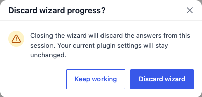

The header's close icon and Escape key use the same confirmation before saving. Clicking the backdrop does not close the wizard. After a successful save, closing it does not ask you to discard anything.

---

### Step 1 — Your Business


Defines your subscription business and supplies recommendations where settings have not been saved yet.

**Multiple plans / tiers** is the profile default. Choose **One plan** if that fits your store and the option is available. When the store already has multiple published subscription products, **One plan** is disabled and the reason appears beneath it. Selecting a different business type rebuilds the session's answers using that profile and your saved settings, so review any edits again.

| Question | Type | Options |
|---|---|---|
| What type of subscription business are you running? | Radio cards | SaaS / Digital Software · Physical Subscription Box · Membership / Community · Digital Content · Professional Services · Nonprofit / Donations · Other / Custom |
| What is your primary billing cycle? | Radio | Weekly · Monthly · Yearly · Custom |
| Every how many billing periods? | Number (1–365) | Only shown when billing cycle is Custom |
| Which period should that custom interval use? | Select | Day · Week · Month · Year (only shown when billing cycle is Custom) |
| How many subscription plans do you offer? | Radio | One plan · Multiple plans / tiers |
| Do you offer free trials? | Radio | Yes · No |
| Should a payment method be required for a free trial? | Radio | Yes · No (only shown when trials are enabled) |
| Limit free trials to one per customer? | Radio | Yes · No (only shown when trials are enabled) |

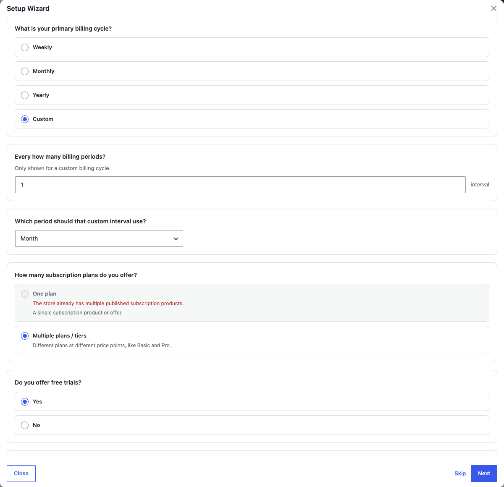

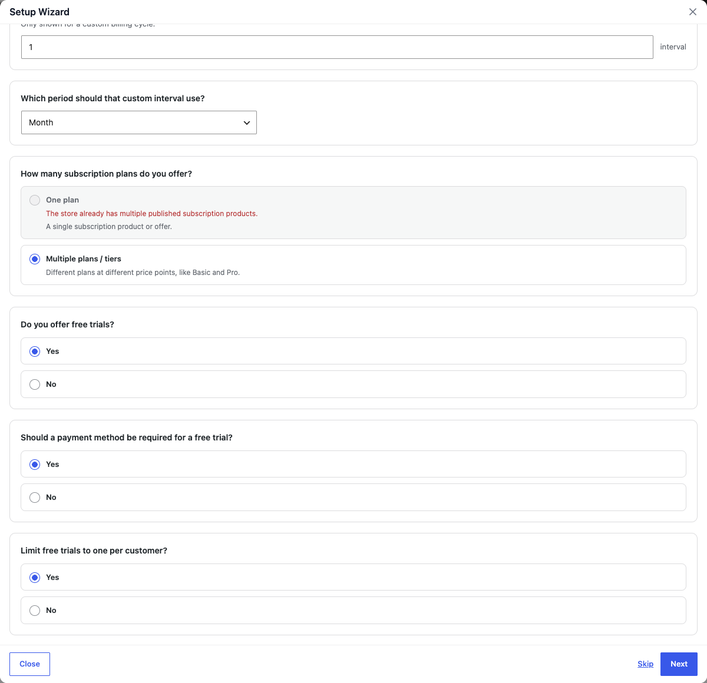

#### Business Type Profiles

These are the starting recommendations for settings that have not been saved yet. Saved values take priority in Steps 2–8, so selecting a profile may leave existing choices unchanged. You can edit the loaded answers as you go.

```box class="info-box"
Pro-only profile recommendations are shown and applied only while ArraySubs Pro is active.
```

| Profile | Key Defaults |
|---|---|
| **SaaS / Digital Software** | Trials with payment required, strict grace (1 active / 3 hold days), one subscription per customer, all-direction plan switching, immediate proration, immediate refunds with gateway and prorated refunds enabled, Feature Manager on |
| **Physical Subscription Box** | Lenient grace (5/14 days), skip and pause enabled, contact-support retention offer, Store Credit enabled |
| **Membership / Community** | Trials, pause flexibility, one subscription per customer, all-direction plan switching, end-of-period cancellation, Feature Manager and Multi-Login Prevention on |
| **Digital Content** | Trials, upgrade-only plan switching, end-of-period cancellation and refunds, gateway and prorated refunds enabled |
| **Professional Services** | Pause enabled, immediate refunds with gateway and prorated refunds enabled, and the customer admin bar hidden |
| **Nonprofit / Donations** | Lenient grace, hide admin bar, minimal defaults |
| **Other / Custom** | Monthly billing, standard grace, multiple subscriptions allowed, plan switching disabled, no automatic refund, and both refund switches off |

Every profile recommends **Multiple plans / tiers** and **Enable User Impersonation**. **Activity Audit Log** is also recommended when Pro is active. Other optional features depend on the profile. Saved business answers and tool settings can change what is selected when you open the wizard.

---

### Step 2 — Billing & Renewal Rules


Controls grace periods, invoice timing, renewal sync, and skip/pause flexibility.

| Question | Type | Options |
|---|---|---|
| How strict should unpaid renewals be handled? | Radio | Strict (1 active / 3 hold days) · Standard (3 / 7) · Lenient (5 / 14) · Custom |
| How many days should the subscription stay active after a failed payment? | Number (0–30) | Only shown for Custom grace |
| How many days should it remain on-hold before cancellation? | Number (1–60) | Only shown for Custom grace |
| When should renewal invoices be generated? | Radio | 6 hours before due date · 1 day before · 3 days before |
| Should new subscriptions renew on the next billing-cycle boundary? | Radio | Yes · No |
| How should the first checkout charge work? | Radio | Prorate until the synced renewal date · Charge the full recurring amount (only shown when renewal sync is enabled) |
| Allow Early Renew | Checkbox | Lets customers pay the next renewal early without shortening the subscription period. Supports manual payments and Stripe; excludes PayPal and Paddle (**Pro**) |
| What billing flexibility should customers have? | Checkboxes | Allow skipping the next renewal · Allow pausing the subscription |
| Maximum consecutive skips allowed | Select | 1 · 2 · 3 · 5 (only when skip is enabled) |
| How many days before renewal can a skip still be requested? | Select | Any time · 2 days before · 5 days before · 7 days before (only when skip is enabled) |
| Maximum pause duration | Select | 14 · 30 · 60 · 90 days (only when pause is enabled) |
| Maximum pauses per subscription | Select | 1 · 2 · 3 · 5 (only when pause is enabled) |

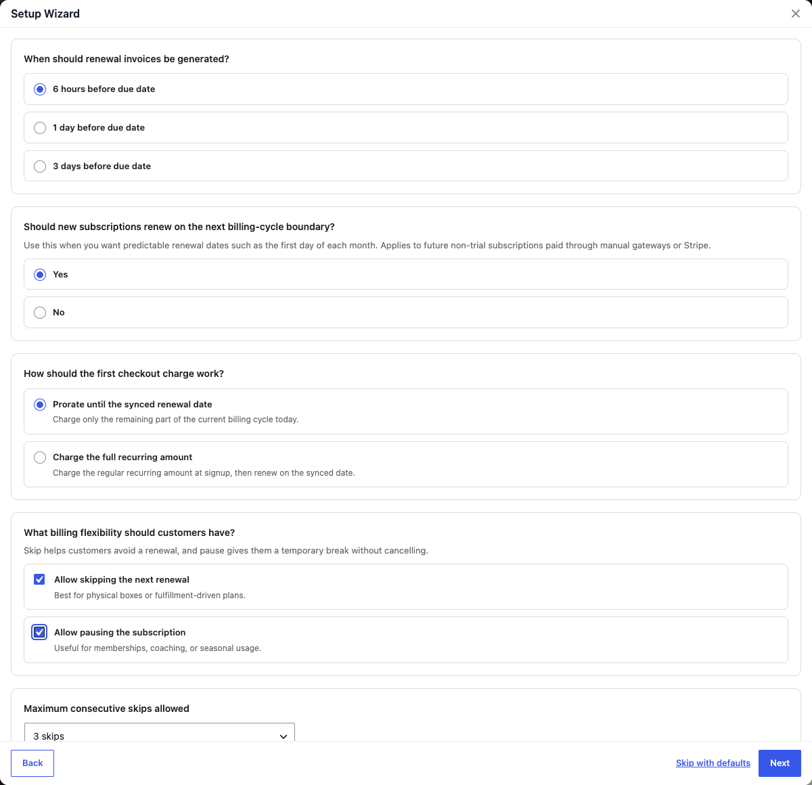

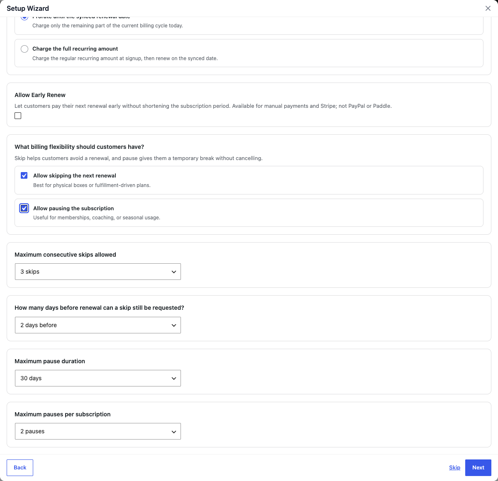

---

### Step 3 — Checkout & Cart Rules


Shapes how subscriptions behave in the cart, at checkout, and during account creation.

| Question | Type | Options |
|---|---|---|
| Can customers have multiple active subscriptions? | Radio | Allow multiple subscriptions · Only one subscription per customer · One subscription per product |
| Should checkout auto-migrate an existing subscription? | Radio | Yes — automatically replace the old subscription · No — block checkout until they cancel first (only when one-per-customer is selected) |
| Allow subscription and non-subscription products in the same cart? | Radio | Yes · No (hidden when one-per-customer) |
| Allow subscriptions with different billing cycles in the same cart? | Radio | Yes · No (hidden when one-per-customer) |
| Add to Cart Text | Text | Subscription purchase-button label; leave empty to use the default |
| One Click Checkout | Radio | Standard cart and checkout flow · One-click checkout for subscription items · One-click checkout for all products |
| Should one-click items skip the cart page entirely? | Radio | Yes · No (only when one-click is not "Standard") |
| Non-Subscription Purchase Button Text | Text | Appears for one-click checkout for all products; leave empty to keep WooCommerce's default text |
| Automatically create customer accounts at checkout? | Radio | Yes · No |
| Hide First billing cycle info | Checkbox | Hides the first billing-cycle details from customers (**Pro**) |
| Hide shipping charge info | Checkbox | Hides the shipping-charge details from customers (**Pro**) |
| Hide Duration info | Checkbox | Hides the subscription-duration details from customers (**Pro**) |

One-click checkout sends the clicked item to checkout and clears existing cart contents. Review this choice before enabling it. The two text fields change purchase-button labels; they do not create products.

The three cart-information checkboxes use your saved values. Their profile defaults are unchecked, keeping these details visible. They are the same options available in **Cart Info Editor**.

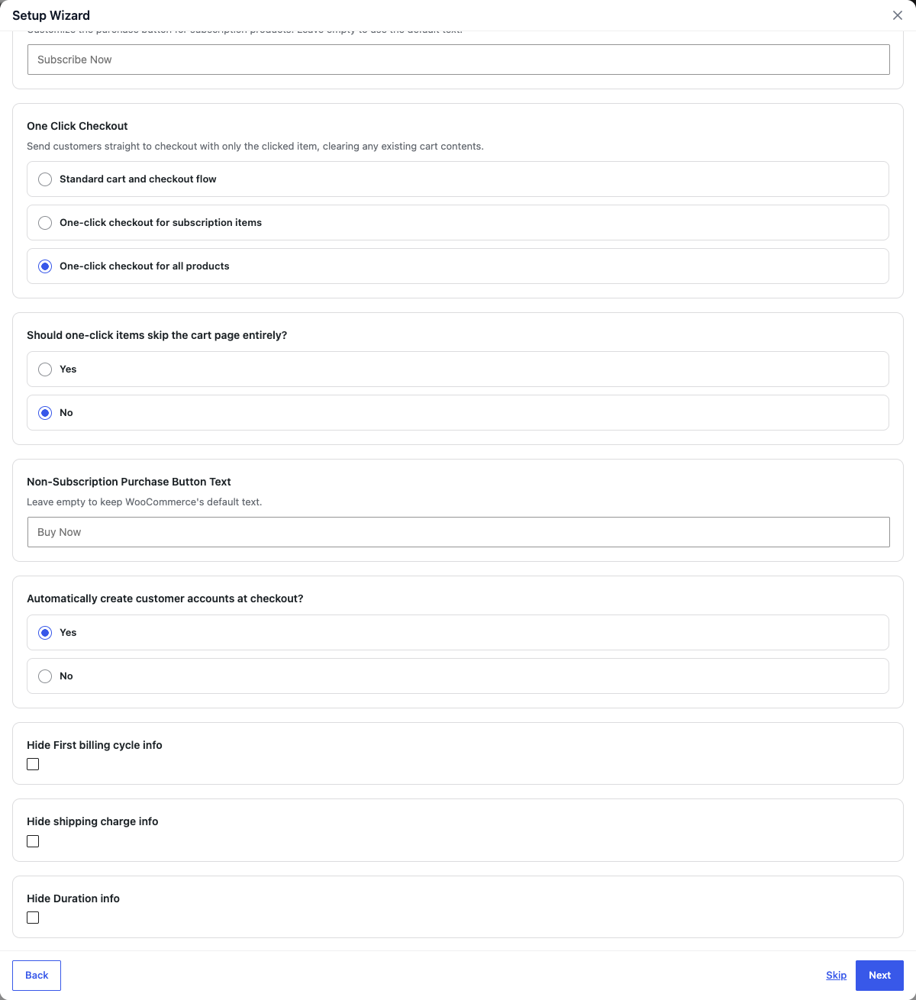

Choosing **Only one subscription per customer** replaces the mixed-cart questions with the auto-migration question:

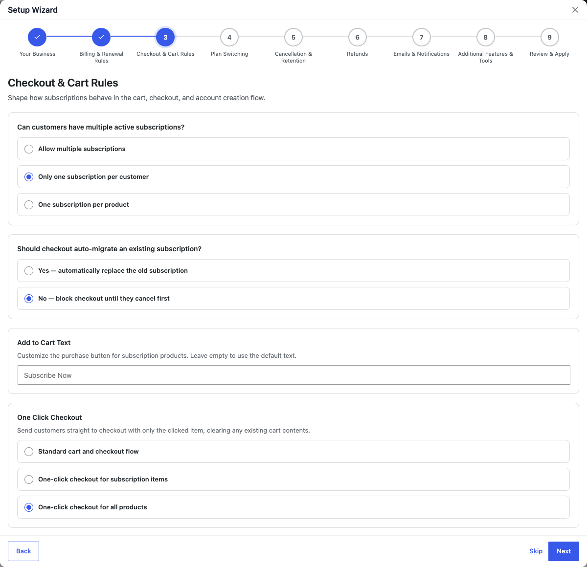

---

### Step 4 — Plan Switching


Decides whether customers with multiple plan choices can switch from **My Account → Subscriptions**, and how any price difference is handled.

| Question | Type | Options |
|---|---|---|
| Should customers be able to switch plans from the portal? | Radio | Allow all switching directions · Only upgrades and downgrades · Only upgrades · Disable plan switching (only when multiple plans selected in Step 1) |
| How should price differences be handled during plan switching? | Radio | Prorate immediately · Apply the change at renewal · No proration (only when multiple plans are selected and plan switching is not disabled) |

```box class="info-box"
If you selected **One plan** in Step 1, this step explains why plan switching does not apply. The switching questions are hidden and switching remains disabled. Go back to **Your Business** and choose **Multiple plans / tiers** to configure it.
```

---

### Step 5 — Cancellation & Retention


Choose whether customers can cancel, when cancellation takes effect, and which retention offers they can see.

| Question | Type | Options |
|---|---|---|
| Allow customers to cancel subscriptions from My Account? | Radio | Yes · No |
| When should a cancellation take effect? | Radio | Immediately · At the end of the billing period |
| Should customers be required to provide a cancellation reason? | Radio | Yes · No |
| Show retention offers during the cancellation flow? | Radio | Yes · No (**Pro**) |
| Which retention offers should be enabled? | Checkboxes | Discount offer · Pause offer · Downgrade offer · Contact support (only when retention offers are enabled; **Pro**) |
| Retention discount percentage | Select | 10% · 20% · 30% · 50% off (only when the discount offer is enabled; **Pro**) |
| How many billing cycles should that discount last? | Select | 1 · 2 · 3 · 6 cycles (only when the discount offer is enabled; **Pro**) |

```box class="info-box"
Cancellation access, timing, and reason requirements are available in ArraySubs core. Retention offers appear only while ArraySubs Pro is active. Refund settings have their own step immediately afterward.
```

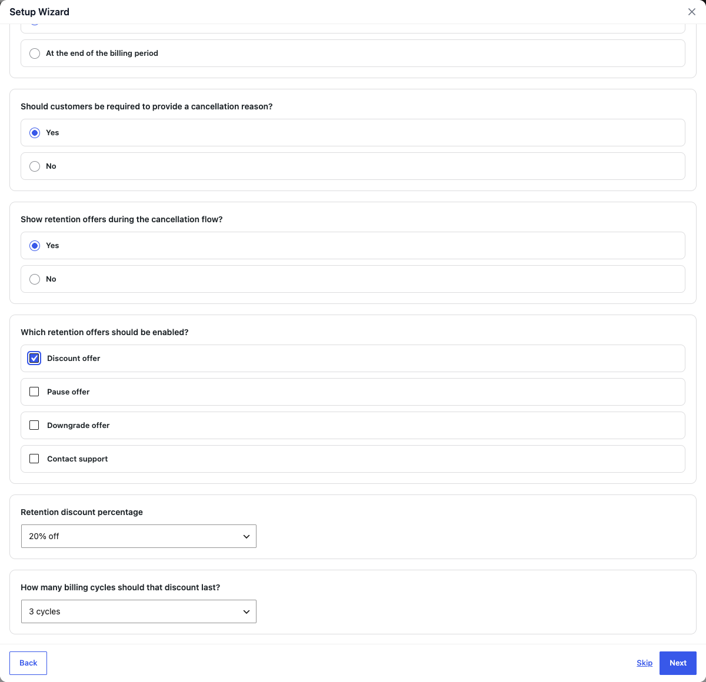

---

### Step 6 — Refunds

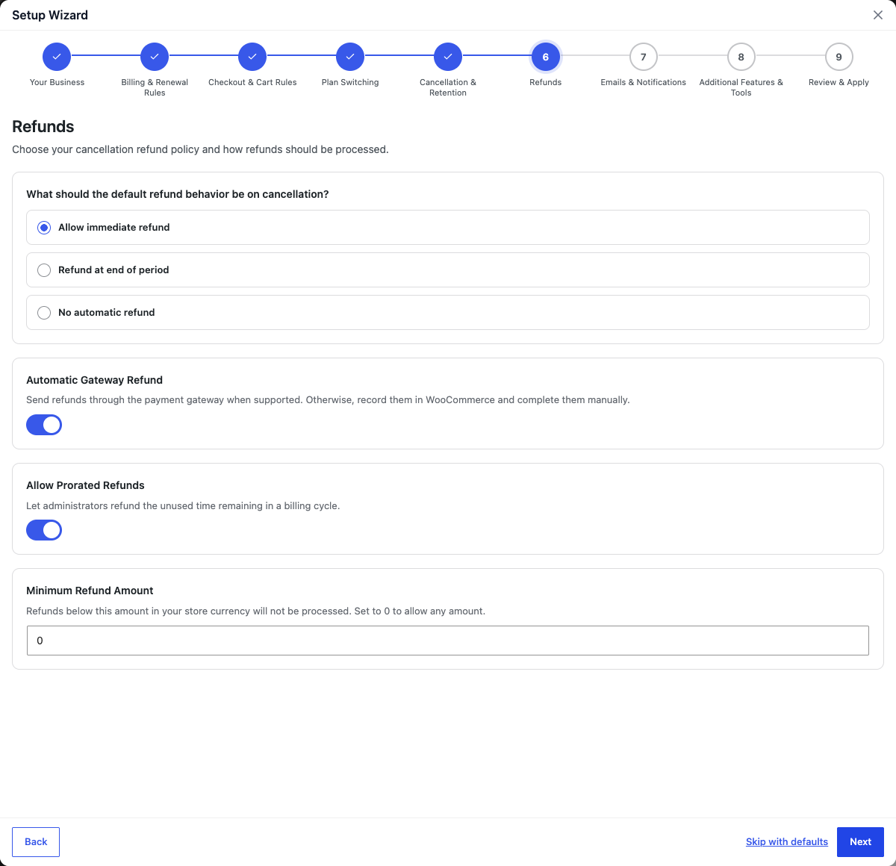

Set the cancellation refund policy and choose how refunds are processed. These controls are available in ArraySubs core.

| Question | Type | Options |
|---|---|---|
| What should the default refund behavior be on cancellation? | Radio | Allow immediate refund · Refund at end of period · No automatic refund |
| Automatic Gateway Refund | Switch | Sends refunds through the payment gateway when supported. Otherwise, records them in WooCommerce for you to complete manually |
| Allow Prorated Refunds | Switch | Lets administrators refund the unused time remaining in a billing cycle |
| Minimum Refund Amount | Number (0–10,000) | Amount in your store currency, with up to two decimal places. Refunds below this amount are not processed; use **0** to allow any amount |

```box class="info-box"
The cancellation refund policy and the two processing switches are separate choices. Review all three, along with the minimum amount, before applying. Saving this step configures future refund behavior; it does not issue a refund now.
```

---

### Step 7 — Emails & Notifications


Picks how chatty the subscription system is with customers and admins.

| Question | Type | Options |
|---|---|---|
| How many customer email notifications should be sent? | Radio | All notifications · Essential only · Minimal · Let me choose |
| Choose the customer emails to enable | Checkboxes | 21 email types (see table below) — only shown when **Let me choose** is selected |
| How many days before renewal should customers get a reminder? | Select | 1 · 3 · 5 · 7 days before (shown when renewal reminder is enabled) |
| Which admin notifications should stay enabled? | Checkboxes | New subscription created · Subscription scheduled to cancel · Subscription cancelled · Payment failed |

#### Notification Presets

| Preset | Customer Emails Enabled |
|---|---|
| **All notifications** | All 21 customer email types |
| **Essential only** | New subscription, renewal invoice, payment success/failure, scheduled cancellation, cancellation, expiration, resumed subscription, and trial start/conversion |
| **Minimal** | Payment failed and subscription cancelled |
| **Let me choose** | Only the email types you select |

#### Customer Email Options

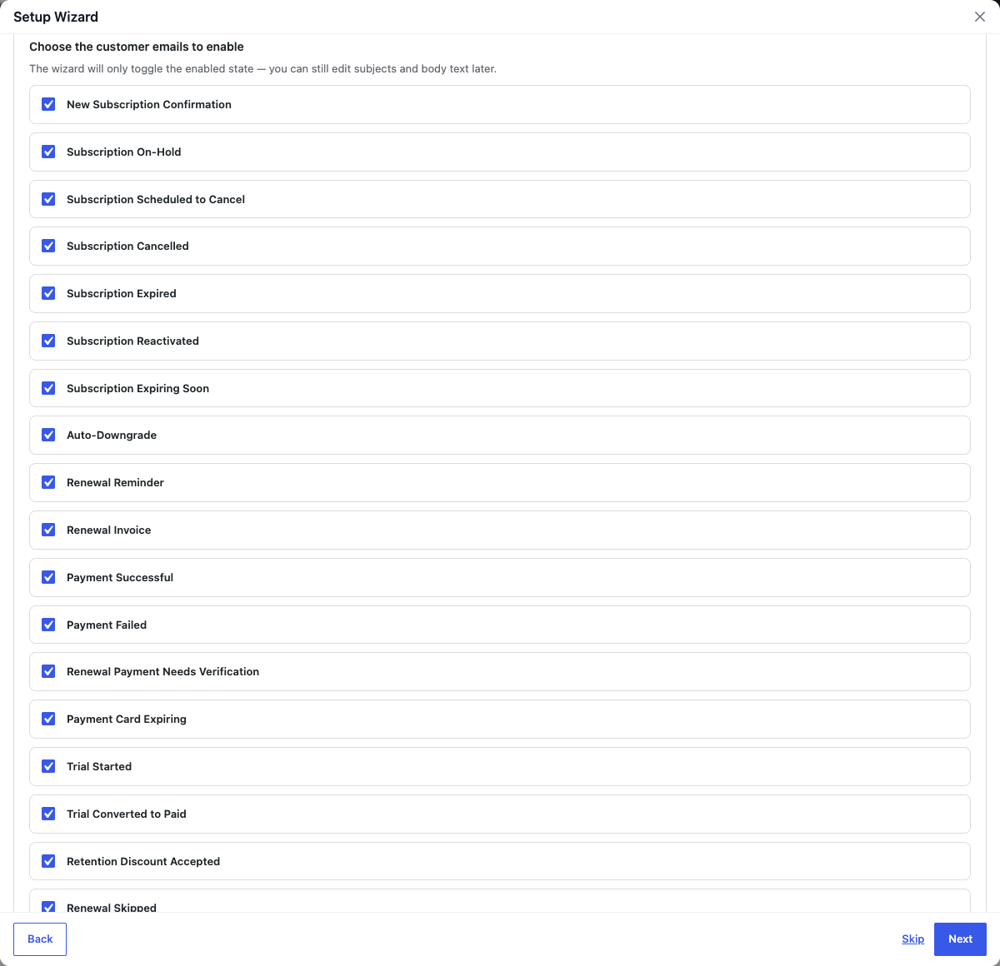

| | | |
|---|---|---|
| New Subscription Confirmation | Subscription On-Hold | Subscription Scheduled to Cancel |
| Subscription Cancelled | Subscription Expired | Subscription Reactivated |
| Subscription Expiring Soon | Auto-Downgrade | Renewal Reminder |
| Renewal Invoice | Payment Successful | Payment Failed |
| Renewal Payment Needs Verification | Payment Card Expiring | Trial Started |
| Trial Converted to Paid | Retention Discount Accepted | Renewal Skipped |
| Skipped Renewal Restored | Subscription Paused | Subscription Resumed |

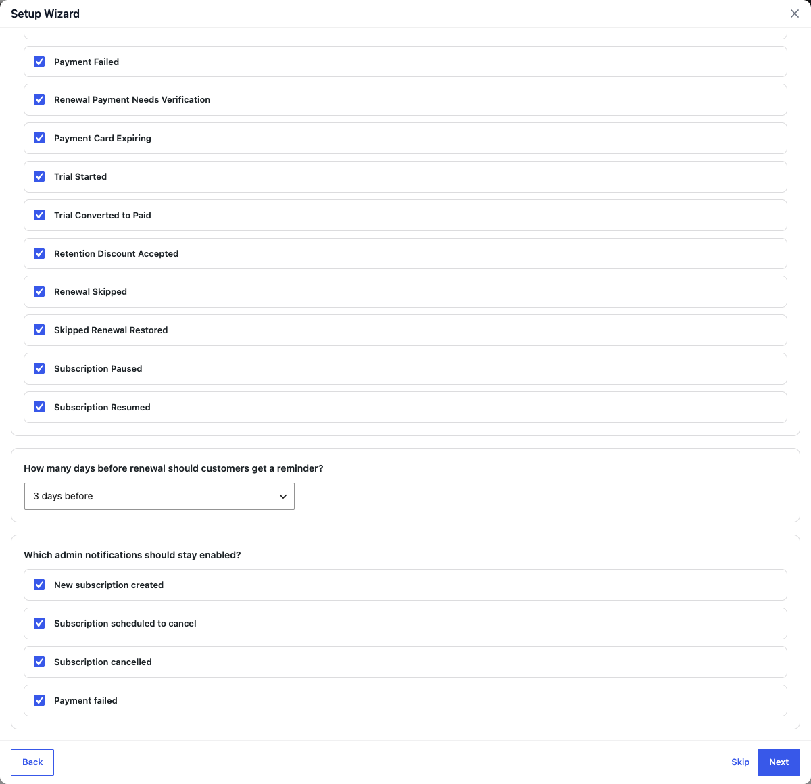

```box class="info-box"
The wizard controls which emails are enabled and sets the renewal-reminder timing. Subject lines, body content, and template customization are still managed from the email settings page.
```

---

### Step 8 — Additional Features & Tools


Choose optional modules and customer-account tools using checkboxes. A checked box means the feature will be enabled when you apply the wizard.

Saved tool settings determine the initial selections. For unsaved settings, **Enable User Impersonation** and, with Pro, **Activity Audit Log** are recommended; other features depend on the business profile. Checking Store Credit, Feature Manager, Restrict WP Dashboard Access, or Multi-Login Prevention reveals follow-up controls directly beneath that feature.

| Question | Type | Options |
|---|---|---|
| Which optional features should be enabled now? | Checkboxes | See feature list below |
| Should store credit automatically apply to renewal payments? | Radio | Yes · No (only when Store Credit is enabled; **Pro**) |
| When should store credits expire? | Select | Never expire · After 90 days · After 180 days · After 365 days (only when Store Credit is enabled; **Pro**) |
| Show Feature Manager highlights on product pages? | Radio | Yes · No (only when Feature Manager is enabled; **Pro**) |
| Maximum concurrent login sessions per customer | Select | 1 · 2 · 3 · 5 sessions (only when Multi-Login is enabled; **Pro**) |
| Where should blocked dashboard users be sent? | Radio | My Account page · Show a 404 page (only when Restrict Dashboard is enabled) |

#### Available Features

| Feature | Availability | Description |
|---|---|---|
| Store Credit System | **Pro** | Refund to credit, credit balances, and credit purchases |
| Feature Manager | **Pro** | Define plan entitlements like seats, storage, or usage caps |
| Activity Audit Log | **Pro** | Track subscription, payment, and settings changes over time |
| Enable User Impersonation | Free | Let administrators log in as non-admin users for support and troubleshooting |
| Hide Admin Bar for Customers | Free | Keep the frontend cleaner for non-admin customer accounts |
| Restrict WP Dashboard Access | Free | Block non-admin users from reaching the WordPress dashboard |
| Multi-Login Prevention | **Pro** | Limit concurrent sessions to reduce shared-account abuse |

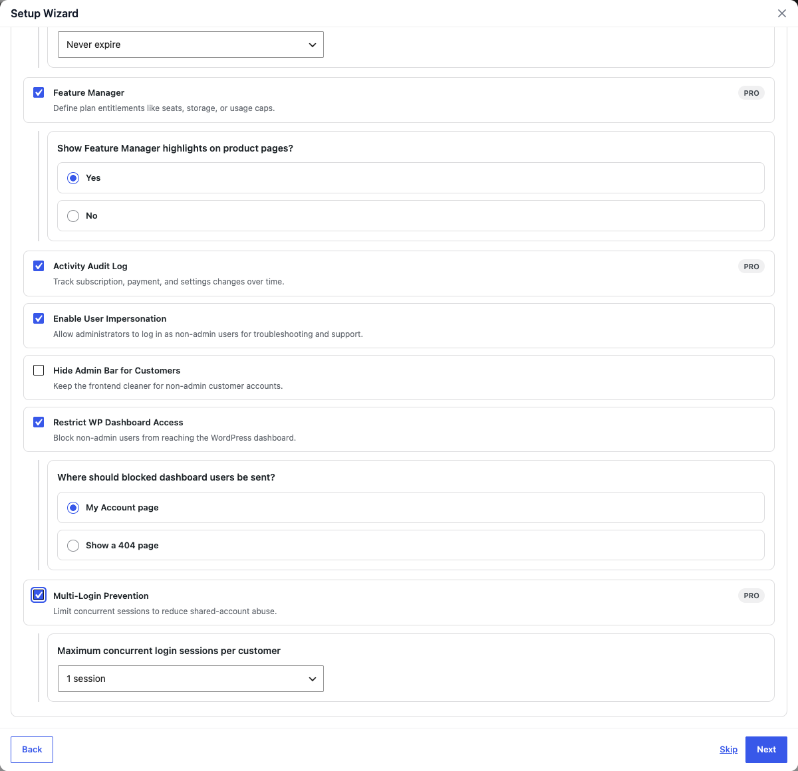

Custom profile fields and My Account page editing are not choices in this step. Configure them separately after saving; the congratulations screen includes a Profile Builder shortcut when that page is available.

---

### Step 9 — Review & Apply


The final step shows a summary of every currently visible answer, organized by step. Each step section is collapsible and includes an **Edit** button that jumps you back to that step to make changes.

At the top, you see a count of how many answers are ready to apply and a note:

> "The wizard only applies the supported settings below. Advanced rules and content structures stay untouched."

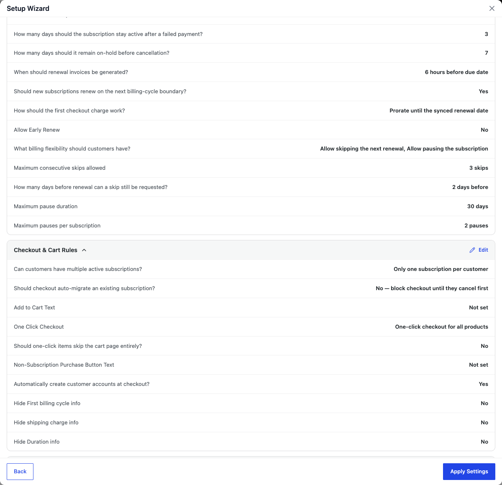

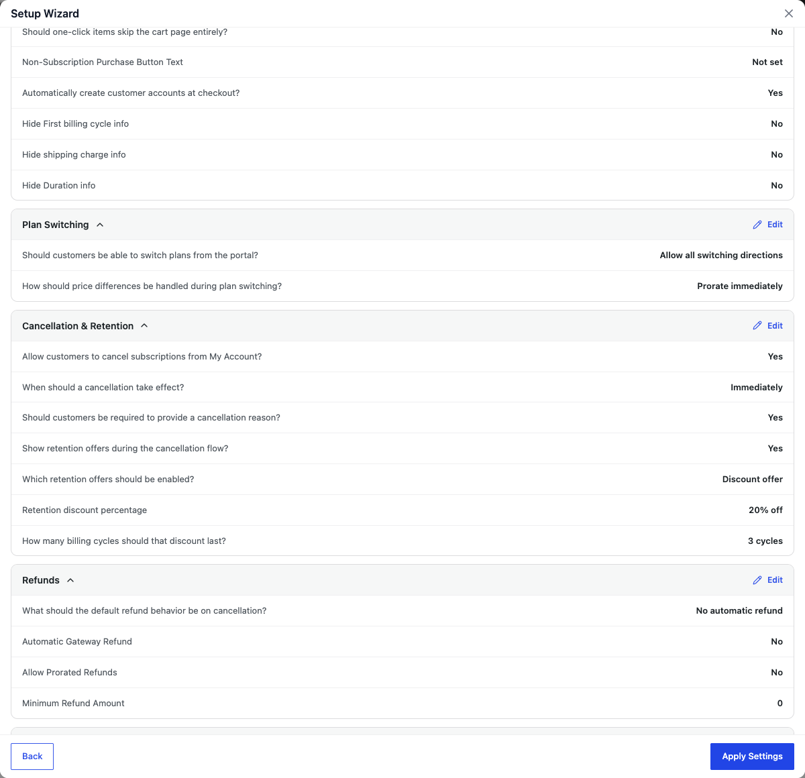

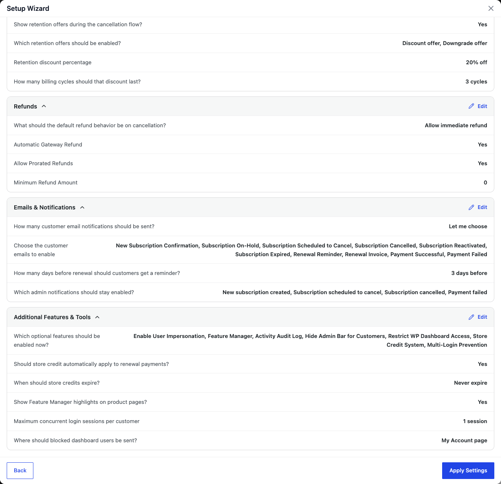

The count is the number of visible answers in this review, including answers you have not changed. It is not a count of changed settings.

Click **Apply Settings** to open the confirmation below. Choose **Keep reviewing** to return without saving, or **Apply settings** to save the changes. The confirmation shows **Applying…** while the request runs. On success, this step changes to the congratulations view. If saving fails, read the error shown in the wizard, correct the relevant answer, and try again.

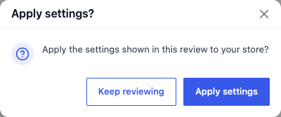

### Congratulations and Next Steps

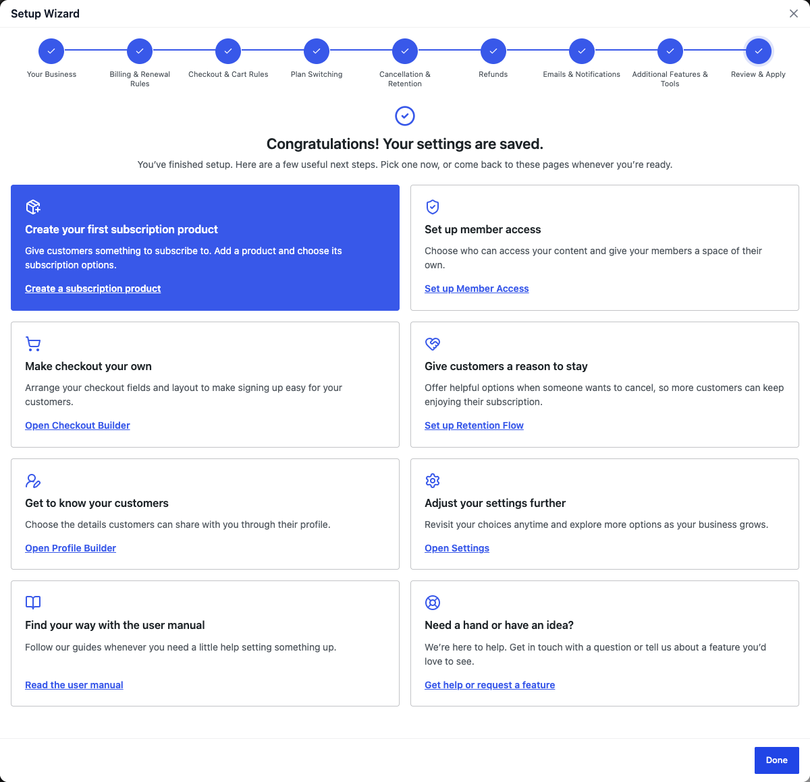

After applying, the completion heading reads **Congratulations! Your settings are saved.** When returning to a completed setup, it reads **Your subscription setup is ready.**, as shown above. **Settings last saved** shows the saved-settings timestamp, including the displayed timezone; opening the wizard alone does not update it.

The product card opens the **Create subscription product** modal on the current page. Other cards open their destination in a **new tab**, so you can return to the completed wizard. See [Create Products with the Quick Creation Wizard](../subscription-products/quick-product-creation.md) for the complete product flow.

| Card | Where it takes you |
|---|---|
| **Create your first subscription product** / **Create a subscription product** | Opens the [product creation modal](../subscription-products/quick-product-creation.md). The label changes depending on whether a subscription product already exists; the card remains available for additional products |
| **Configure payment method** | WooCommerce payment settings |
| **Set up member access** | Member Access, where you configure content gating and access rules |
| **Make checkout your own** | Checkout Builder, for checkout fields and layout |
| **Give customers a reason to stay** | Retention Flow, for cancellation offers and messages |
| **Get to know your customers** | Profile Builder, for customer profile fields |
| **Adjust your settings further** | ArraySubs Settings, where you can revisit your choices and explore more options |
| **Connect your integrations** | Integrations, for available connections |
| **Find your way with the user manual** | The ArraySubs user manual |
| **Need a hand or have an idea?** | Help, for support and feature requests |

Cards for plugin pages appear only when those pages are available in your admin menu. Your selection may differ depending on the installed features and access permissions.

Choose **Start Over** to reload the saved configuration and review it from Step 1. When you are finished, click **Done** or the header's close icon. The settings are already saved; you can return to these tools later from Home or Easy Setup.

---

## What Happens After Saving

- The wizard saves supported settings changed during the session and fills missing settings from the reviewed answers.
- Global settings take effect immediately, but the wizard does not rewrite existing subscription records. Future subscription actions use the new rules.
- If Renewal Sync is enabled, it applies to future non-trial subscriptions paid through supported manual gateways or Stripe.
- Existing settings left unchanged in the session and settings outside the wizard's scope are preserved.
- The business answers are remembered. Reopening a completed setup shows the next-step cards; **Start Over** reloads saved settings for another review.
- The wizard does **not** create, edit, or delete products, subscriptions, access rules, email templates, or cancellation reasons.

## Edge Cases / Important Notes

- **Pro features hidden when Pro is inactive.** If ArraySubs Pro is not active, Allow Early Renew, Store Credit, Feature Manager, Activity Audit Log, Multi-Login Prevention, retention offers, and the three cart-information checkboxes are hidden. User impersonation and the Refunds step remain available.
- **Conditional questions.** Many questions only appear based on earlier answers. If you change an earlier answer, the wizard may show or hide dependent questions. The settings generated by the wizard follow the currently relevant choices.
- **Changing business type rebuilds the session.** It combines the chosen profile with saved settings. Unsaved edits can be replaced, so review the later steps again.
- **Skip discards this step's edits.** It restores loaded saved values and uses profile recommendations for missing settings before advancing.
- **Saved custom values can appear.** A value already configured in Settings may appear as an extra choice beyond the usual presets. Keep it if it suits your store.
- **Multiple published products require multiple plans.** The wizard disables **One plan** when this store already has multiple published subscription products.
- **Wizard does not delete data.** It only adds or updates settings. It never removes products, subscriptions, access rules, or other data from your site.
- **Review repeat runs.** Start Over loads your saved configuration; it does not reset it. Review edits before confirming, and export first if you want a backup.

## Troubleshooting

| Problem | Likely Cause | What to Do |
|---|---|---|
| Wizard does not appear in the menu | EasySetup feature is not loaded | Verify ArraySubs core is activated and up to date |
| Pro-only options are not showing | ArraySubs Pro is not active | Activate the Pro addon, then re-open the wizard |
| The wizard opens on the next-step cards | Setup was completed previously | Choose **Start Over** to review the saved configuration |
| Could not load saved settings | The initial settings request failed | Close and reopen the wizard. Reload the admin page if needed; navigation and applying are unavailable until loading succeeds |
| "Apply Settings" fails with an error | A validation or request error | Read the error inside the wizard, fix any flagged answer, and try again |
| Settings did not change after applying | Wizard may have merged with existing identical values | Open **ArraySubs → Settings** and verify the values. The wizard only updates what differs |
| Conditional questions disappeared | An earlier answer was changed | Go back to the step that changed and re-answer the dependent questions |
| Plan Switching shows a message instead of questions | **One plan** was selected | Choose **Multiple plans / tiers** in Your Business if your store offers multiple plans |
| One plan is disabled | Multiple subscription products are already published | Continue with **Multiple plans / tiers**; the explanation is displayed beneath One plan |
| The product card says Create a subscription product instead of Create your first subscription product | A subscription product already exists | Use the card to create another product; **ArraySubs → Home → + Subscription Product** opens the same modal |

---

## Related Guides

- [Home](../analytics/home.md) — Open the wizard, check setup progress, and access daily subscription tools.
- [Quick Product Creation](../subscription-products/quick-product-creation.md) — Create a subscription product from the Easy Setup page or completion cards.
- [Import / Export Settings](import-export-settings.md) — Back up and restore your full ArraySubs configuration across sites.
- [First-Time Setup](first-time-setup.md) — A manual step-by-step checklist if you prefer configuring settings one by one.
- [General Settings](../settings/general-settings.md) — Detailed reference for every individual setting the wizard configures.
- [Retention Offers](../retention-and-refunds/retention-offers.md) — Set up the retention flow the wizard enabled.
- [Member Access](../member-access/README.md) — Configure content gating and member access separately after the wizard.

---

## FAQ

### Does the wizard replace all my existing settings?

No. It loads saved settings, saves supported choices you change, and initializes missing values. Existing values you leave unchanged and settings outside the wizard's scope are preserved.

### Can I run the wizard more than once?

Yes. Reopen it from Home or Easy Setup. A completed setup opens on the next-step cards; choose **Start Over** to load the saved configuration and review it from Step 1. Changes are saved only after you confirm **Apply settings**.

### Does Start Over reset my store settings?

No. It reloads your saved settings and starts a fresh review. **Skip** similarly restores the current step's loaded values, using profile recommendations where values have not been saved.

### What happens if I close the wizard without applying?

Nothing changes. A confirmation dialog warns you that your answers will be discarded, and your current plugin settings stay exactly as they were.

### Does the wizard create my subscription products?

Applying Easy Setup saves plugin settings. Afterward, **Create your first subscription product** or **Create a subscription product** opens a separate [product creation wizard](../subscription-products/quick-product-creation.md). Use that modal to create and publish a product. Its variable-product path guides you through the full WooCommerce editor.

### Where did the Access Control & Content Gating step go?

It is no longer part of the wizard. After saving, use **Set up member access** on the congratulations screen or open **ArraySubs → Member Access** to configure those rules.

### Will Pro features break if I deactivate Pro later?

Pro-specific settings that were applied by the wizard remain stored, but they become dormant when Pro is deactivated. The core plugin continues working with its free feature set. Reactivating Pro restores the Pro settings automatically.

### Does the wizard configure email subject lines and body content?

No. The wizard only toggles which emails are enabled or disabled. Subject lines, body text, and template customization are managed from **ArraySubs → Settings** or the WooCommerce email settings screen.
