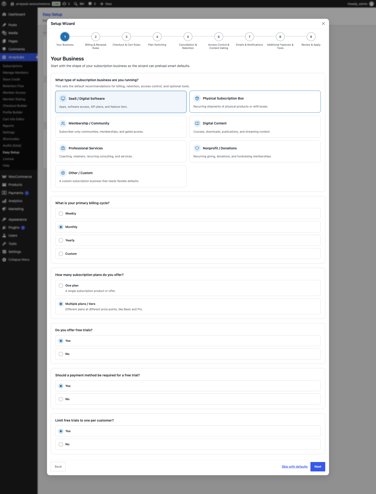
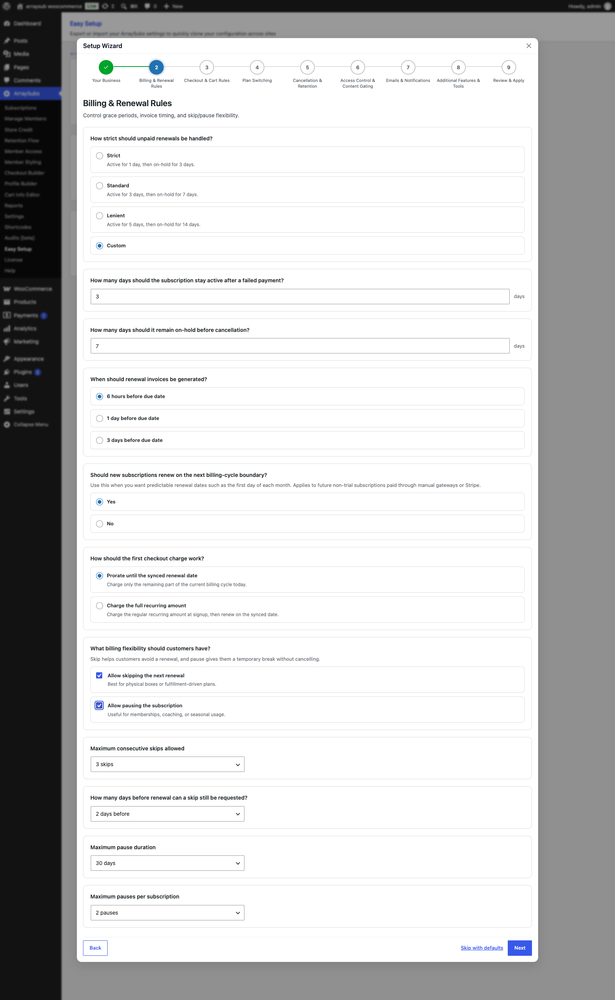
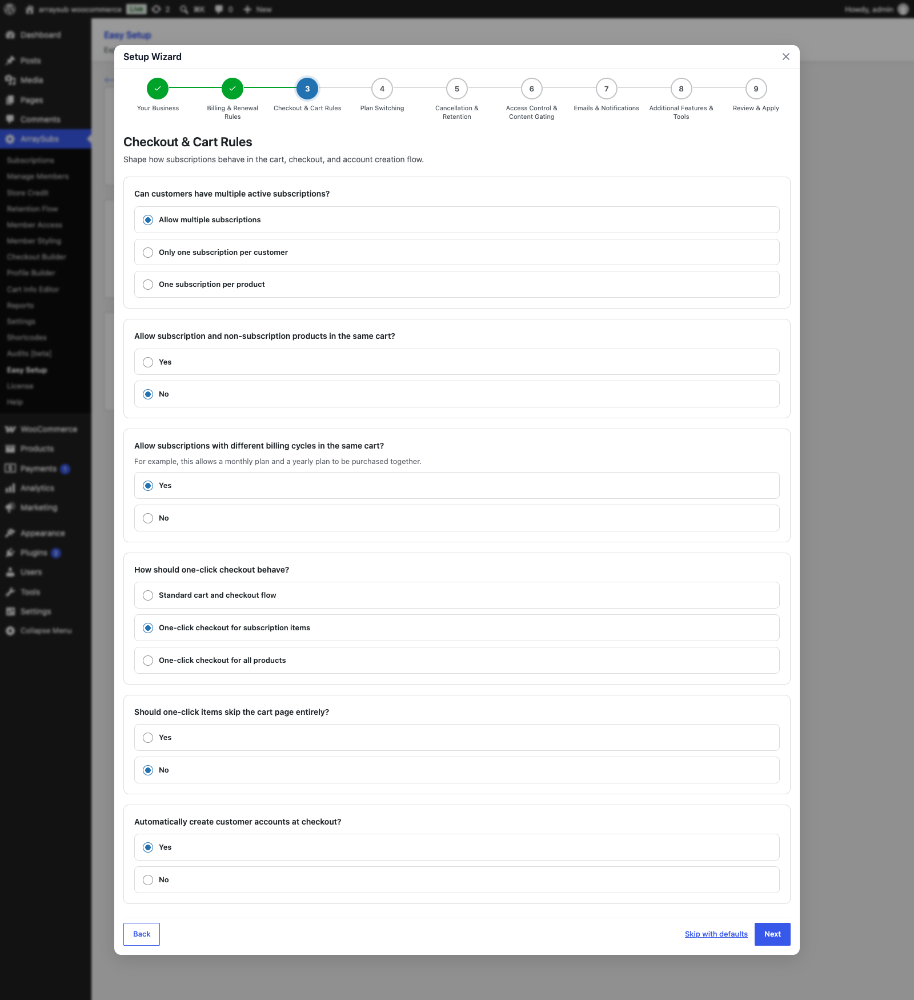
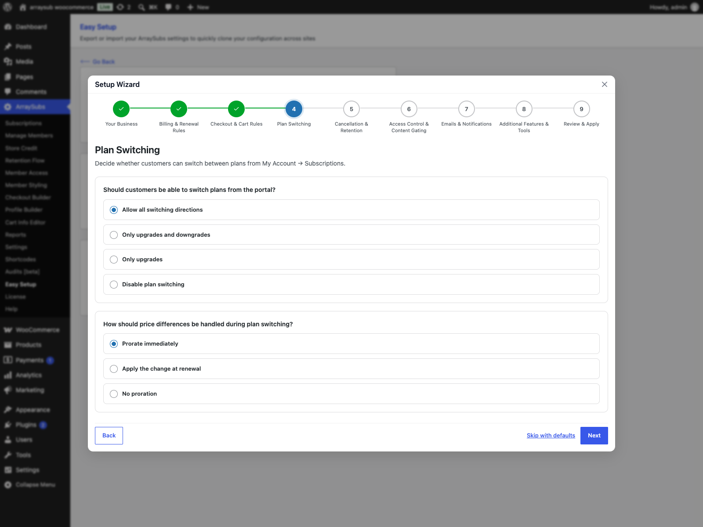
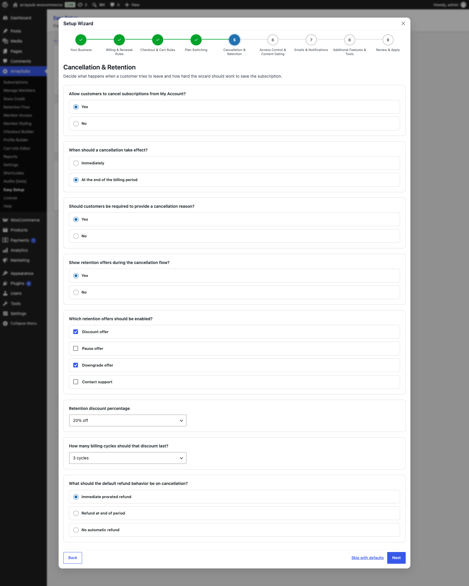
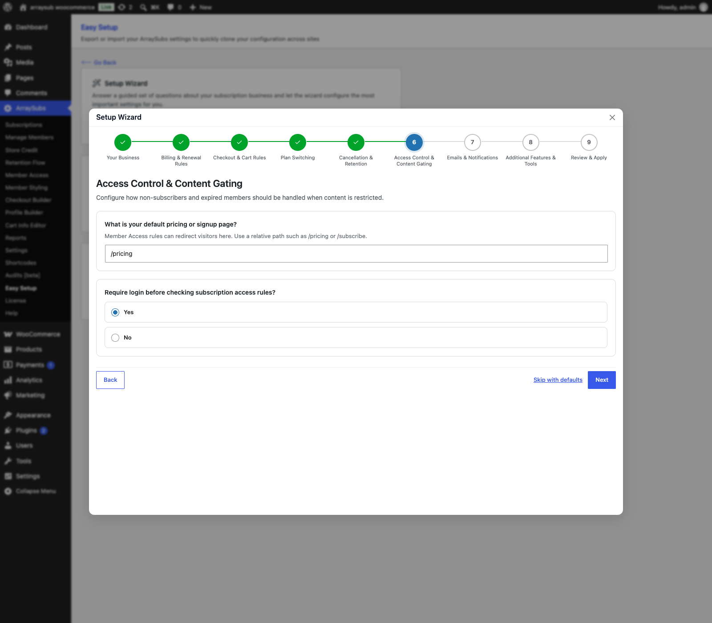
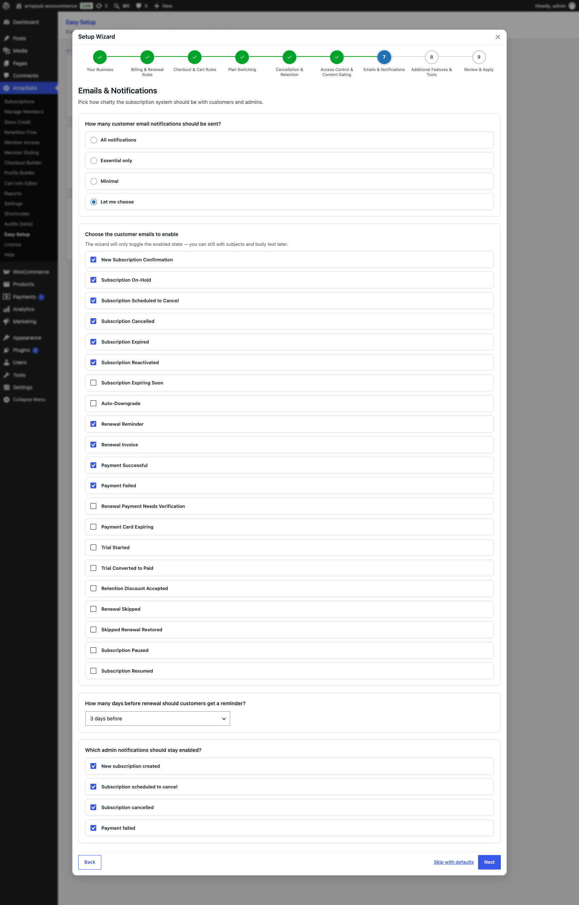
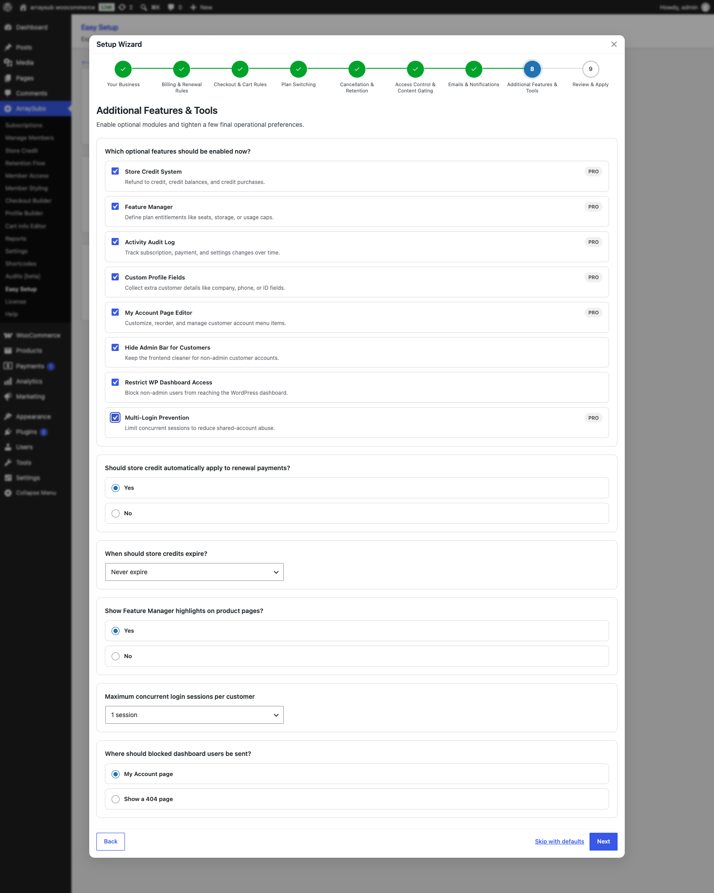
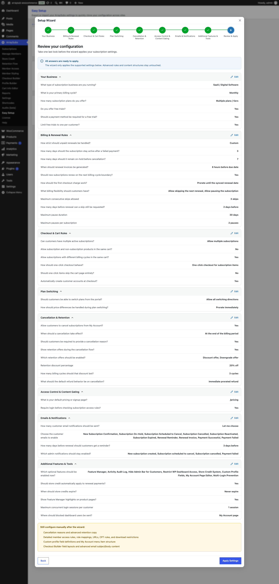

# Info
- Module: Easy Setup
- Availability: Shared
- Last updated: 2026-09-03

# Easy Setup Wizard

> Answer a guided set of questions about your subscription business and let the wizard configure the most important settings for you — no manual hunting through settings pages required.

**Availability:** Free (Pro options appear when ArraySubs Pro is active)

## Page Navigation

- **Admin screen:** WordPress Admin → **ArraySubs → Easy Setup**
- **Direct admin route:** `/wp-admin/admin.php?page=arraysubs-mainadmin#/easy-setup`
- **Use this first:** [First-Time Setup](first-time-setup.md)
- **Review settings after saving:** [General Settings](../settings/general-settings.md), [Toolkit Settings](../settings/toolkit-settings.md), [Plan Switching and Product Relationships](../subscription-products/plan-switching-and-relationships.md)
- **Need to move settings between sites?** Use the Export and Import cards on this same screen.

## Overview

The Easy Setup Wizard is a 9-step guided interview that walks you through the key decisions for your subscription business and automatically configures matching settings. Instead of visiting each settings page individually, you answer plain-language questions about your billing model, customer experience, cancellation policy, access control, emails, and optional tools. The wizard translates your answers into the correct plugin settings and applies them in one click.

The wizard lives on the **ArraySubs → Easy Setup** page alongside the Export and Import tools.

The same screen is also the safest place to back up or restore an ArraySubs configuration. Export before major changes, then import the JSON file on another site or after a reset.

## When to Use This

- You just installed ArraySubs and want a fast, guided initial configuration.
- You are launching a new subscription model and want the plugin configured to match your business type.
- You want smart defaults based on your industry — SaaS, membership, physical box, content, services, or nonprofit.
- You prefer answering questions in plain language over navigating individual settings fields.

## Prerequisites

- ArraySubs core plugin installed and activated.
- ArraySubs Pro installed and activated (optional — Pro-only wizard options appear only when Pro is active).
- Administrator or shop-manager access to the WordPress dashboard.

## How It Works

The wizard presents eight configuration steps followed by a ninth **Review & Apply** step. Each configuration step has a title, an explanation, and one or more questions. Some questions only appear based on your earlier answers — for example, trial payment settings only show up if you said you offer free trials.

When you reach the final step, a review screen summarizes every relevant answer organized by step. You can edit any step before applying. When you click **Apply Settings**, the wizard maps your answers to the matching ArraySubs settings, merges them with your current configuration, and saves everything at once.

```box class="info-box"
The wizard only configures settings it can map to. It does not create products, define cancellation reasons, build access rules, or write email body content. Those tasks still need to be done manually after the wizard finishes.
```

## Real-Life Use Cases

### Use Case 1: New SaaS Launch

A software company installs ArraySubs and chooses **SaaS / Digital Software** as their business type. The wizard pre-selects strict grace periods, multiple plan tiers, free trials with a payment method required, and access control. With ArraySubs Pro active, it also pre-selects Feature Manager and activity auditing. The team reviews the defaults, chooses its notification level, and clicks **Apply Settings**. In under two minutes, the store-wide subscription rules are configured.

### Use Case 2: Physical Subscription Box

A snack box company selects **Physical Subscription Box**. The wizard pre-selects lenient grace periods plus skip and pause flexibility. With ArraySubs Pro active, it also enables Store Credit and a contact-support retention offer. The merchant adjusts the max pause duration from 30 to 60 days and applies. The box billing model is ready.

### Use Case 3: Membership Community

A community platform picks **Membership / Community** and immediately gets multiple plans, pause support, and access control. With ArraySubs Pro active, the profile also recommends Multi-Login Prevention, Feature Manager, custom profile fields, and My Account editing. The admin can additionally enable Store Credit, set credits to expire after 365 days, and apply the configuration.

---

## Steps / Configuration

### Launching the Wizard


1. Go to **ArraySubs → Easy Setup**.
2. Find the **Setup Wizard** card on the page.
3. Click **Launch Setup Wizard**.
4. The wizard opens in a large modal. Clicking the backdrop does not close it. Using the close button or pressing Escape opens a confirmation before any answers are discarded.

```box class="info-box"
If ArraySubs Pro is not active, a small note at the top of the wizard reads: "ArraySubs Pro is not active, so Pro-only wizard options are hidden for now."
```

### Navigation

- **Next** — Validates the current step's visible questions and moves forward.
- **Back** — Returns to the previous step without losing answers.
- **Skip with defaults** — Accepts the pre-loaded default values for the current step and moves forward. Useful when a step does not apply to your business.
- **Apply Settings** — Appears on the final review step. Sends all answers to the server and configures the plugin.

If you try to close the wizard before applying, a confirmation dialog appears:

> "Closing the wizard will discard the answers from this session. Your current plugin settings will stay unchanged."

You can choose **Keep working** to stay in the wizard or **Discard wizard** to close without saving.

---

### Step 1 — Your Business



Defines the shape of your subscription business. Your choice here sets smart defaults for every later step.

| Question | Type | Options |
|---|---|---|
| What type of subscription business are you running? | Radio cards | SaaS / Digital Software · Physical Subscription Box · Membership / Community · Digital Content · Professional Services · Nonprofit / Donations · Other / Custom |
| What is your primary billing cycle? | Radio | Weekly · Monthly · Yearly · Custom |
| Every how many billing periods? | Number (1–365) | Only shown when billing cycle is Custom |
| Which period should that custom interval use? | Select | Day · Week · Month · Year (only shown when billing cycle is Custom) |
| How many subscription plans do you offer? | Radio | One plan · Multiple plans / tiers |
| Do you offer free trials? | Radio | Yes · No |
| Should a payment method be required for a free trial? | Radio | Yes · No (only shown when trials are enabled) |
| Limit free trials to one per customer? | Radio | Yes · No (only shown when trials are enabled) |

#### Business Type Profiles

When you choose a business type, the wizard preloads recommended defaults for all subsequent steps. You can override any default as you go.

```box class="info-box"
Pro-only profile recommendations are shown and applied only while ArraySubs Pro is active.
```

| Profile | Key Defaults |
|---|---|
| **SaaS / Digital Software** | Multiple plans, trials with payment required, strict grace (1 active / 3 hold days), one subscription per customer, all-direction plan switching, immediate proration, access control enabled, Feature Manager and Audit Logging on |
| **Physical Subscription Box** | Lenient grace (5/14 days), skip and pause enabled, contact-support retention offer, Store Credit enabled |
| **Membership / Community** | Multiple plans, trials, pause flexibility, one per customer, access control, Feature Manager, custom profile fields, My Account editing, and Multi-Login Prevention |
| **Digital Content** | Multiple plans, trials, upgrade-only plan switching, end-of-period cancellation and refund, access control |
| **Professional Services** | Pause enabled, immediate prorated refund, custom profile fields, and the customer admin bar hidden |
| **Nonprofit / Donations** | Lenient grace, hide admin bar, minimal defaults |
| **Other / Custom** | Monthly billing, one plan, standard grace, multiple subscriptions allowed, and no optional features enabled |

---

### Step 2 — Billing & Renewal Rules



Controls grace periods, invoice timing, renewal sync, and skip/pause flexibility.

| Question | Type | Options |
|---|---|---|
| How strict should unpaid renewals be handled? | Radio | Strict (1 active / 3 hold days) · Standard (3 / 7) · Lenient (5 / 14) · Custom |
| How many days should the subscription stay active after a failed payment? | Number (0–30) | Only shown for Custom grace |
| How many days should it remain on-hold before cancellation? | Number (1–60) | Only shown for Custom grace |
| When should renewal invoices be generated? | Radio | 6 hours before due date · 1 day before · 3 days before |
| Should new subscriptions renew on the next billing-cycle boundary? | Radio | Yes · No |
| How should the first checkout charge work? | Radio | Prorate until the synced renewal date · Charge the full recurring amount (only shown when renewal sync is enabled) |
| What billing flexibility should customers have? | Checkboxes | Allow skipping the next renewal · Allow pausing the subscription |
| Maximum consecutive skips allowed | Select | 1 · 2 · 3 · 5 (only when skip is enabled) |
| How many days before renewal can a skip still be requested? | Select | Any time · 2 days before · 5 days before · 7 days before (only when skip is enabled) |
| Maximum pause duration | Select | 14 · 30 · 60 · 90 days (only when pause is enabled) |
| Maximum pauses per subscription | Select | 1 · 2 · 3 · 5 (only when pause is enabled) |

---

### Step 3 — Checkout & Cart Rules



Shapes how subscriptions behave in the cart, at checkout, and during account creation.

| Question | Type | Options |
|---|---|---|
| Can customers have multiple active subscriptions? | Radio | Allow multiple subscriptions · Only one subscription per customer · One subscription per product |
| Should checkout auto-migrate an existing subscription? | Radio | Yes — automatically replace the old subscription · No — block checkout until they cancel first (only when one-per-customer is selected) |
| Allow subscription and non-subscription products in the same cart? | Radio | Yes · No (hidden when one-per-customer) |
| Allow subscriptions with different billing cycles in the same cart? | Radio | Yes · No (hidden when one-per-customer) |
| How should one-click checkout behave? | Radio | Standard cart and checkout flow · One-click checkout for subscription items · One-click checkout for all products |
| Should one-click items skip the cart page entirely? | Radio | Yes · No (only when one-click is not "Standard") |
| Automatically create customer accounts at checkout? | Radio | Yes · No |

---

### Step 4 — Plan Switching



Decides whether customers with multiple plan choices can switch from **My Account → Subscriptions**, and how any price difference is handled.

| Question | Type | Options |
|---|---|---|
| Should customers be able to switch plans from the portal? | Radio | Allow all switching directions · Only upgrades and downgrades · Only upgrades · Disable plan switching (only when multiple plans selected in Step 1) |
| How should price differences be handled during plan switching? | Radio | Prorate immediately · Apply the change at renewal · No proration (only when multiple plans are selected and plan switching is not disabled) |

```box class="info-box"
If you selected **One plan** in Step 1, the switching questions are hidden and plan switching remains disabled.
```

---

### Step 5 — Cancellation & Retention



Decides what happens when a customer tries to cancel and how aggressively the system works to save the subscription.

| Question | Type | Options |
|---|---|---|
| Allow customers to cancel subscriptions from My Account? | Radio | Yes · No |
| When should a cancellation take effect? | Radio | Immediately · At the end of the billing period |
| Should customers be required to provide a cancellation reason? | Radio | Yes · No |
| Show retention offers during the cancellation flow? | Radio | Yes · No (**Pro**) |
| Which retention offers should be enabled? | Checkboxes | Discount offer · Pause offer · Downgrade offer · Contact support (only when retention offers are enabled; **Pro**) |
| Retention discount percentage | Select | 10% · 20% · 30% · 50% off (only when the discount offer is enabled; **Pro**) |
| How many billing cycles should that discount last? | Select | 1 · 2 · 3 · 6 cycles (only when the discount offer is enabled; **Pro**) |
| What should the default refund behavior be on cancellation? | Radio | Immediate prorated refund · Refund at end of period · No automatic refund |

```box class="info-box"
Cancellation access, timing, reason requirements, and refund behavior are available in ArraySubs core. Retention offers appear only while ArraySubs Pro is active.
```

---

### Step 6 — Access Control & Content Gating



Configures how non-subscribers and expired members are handled when they hit restricted content.

| Question | Type | Options |
|---|---|---|
| Do you need subscription-based content restriction? | Radio | Yes · No (only shown for business types where access control is not implied) |
| What is your default pricing or signup page? | Text | A relative path such as `/pricing` or `/subscribe` (shown when access control is enabled or implied by the business type) |
| Require login before checking subscription access rules? | Radio | Yes · No (shown when access control is enabled or implied by the business type) |

```box class="info-box"
For SaaS, Membership, and Digital Content business types, access control is assumed to be needed. The first question is skipped, and the wizard asks for the default pricing or signup path directly.
```

---

### Step 7 — Emails & Notifications



Picks how chatty the subscription system is with customers and admins.

| Question | Type | Options |
|---|---|---|
| How many customer email notifications should be sent? | Radio | All notifications · Essential only · Minimal · Let me choose |
| Choose the customer emails to enable | Checkboxes | 21 email types (see table below) — only shown when **Let me choose** is selected |
| How many days before renewal should customers get a reminder? | Select | 1 · 3 · 5 · 7 days before (shown when renewal reminder is enabled) |
| Which admin notifications should stay enabled? | Checkboxes | New subscription created · Subscription scheduled to cancel · Subscription cancelled · Payment failed |

#### Notification Presets

| Preset | Customer Emails Enabled |
|---|---|
| **All notifications** | All 21 customer email types |
| **Essential only** | New subscription, renewal invoice, payment success/failure, scheduled cancellation, cancellation, expiration, resumed subscription, and trial start/conversion |
| **Minimal** | Payment failed and subscription cancelled |
| **Let me choose** | Only the email types you select |

#### Customer Email Options

| | | |
|---|---|---|
| New Subscription Confirmation | Subscription On-Hold | Subscription Scheduled to Cancel |
| Subscription Cancelled | Subscription Expired | Subscription Reactivated |
| Subscription Expiring Soon | Auto-Downgrade | Renewal Reminder |
| Renewal Invoice | Payment Successful | Payment Failed |
| Renewal Payment Needs Verification | Payment Card Expiring | Trial Started |
| Trial Converted to Paid | Retention Discount Accepted | Renewal Skipped |
| Skipped Renewal Restored | Subscription Paused | Subscription Resumed |

```box class="info-box"
The wizard controls which emails are enabled and sets the renewal-reminder timing. Subject lines, body content, and template customization are still managed from the email settings page.
```

---

### Step 8 — Additional Features & Tools



Enables optional modules and operational preferences.

| Question | Type | Options |
|---|---|---|
| Which optional features should be enabled now? | Checkboxes | See feature list below |
| Should store credit automatically apply to renewal payments? | Radio | Yes · No (only when Store Credit is enabled; **Pro**) |
| When should store credits expire? | Select | Never expire · After 90 days · After 180 days · After 365 days (only when Store Credit is enabled; **Pro**) |
| Show Feature Manager highlights on product pages? | Radio | Yes · No (only when Feature Manager is enabled; **Pro**) |
| Maximum concurrent login sessions per customer | Select | 1 · 2 · 3 · 5 sessions (only when Multi-Login is enabled; **Pro**) |
| Where should blocked dashboard users be sent? | Radio | My Account page · Show a 404 page (only when Restrict Dashboard is enabled) |

#### Available Features

| Feature | Availability | Description |
|---|---|---|
| Store Credit System | **Pro** | Refund to credit, credit balances, and credit purchases |
| Feature Manager | **Pro** | Define plan entitlements like seats, storage, or usage caps |
| Activity Audit Log | **Pro** | Track subscription, payment, and settings changes over time |
| Custom Profile Fields | **Pro** | Collect extra customer details like company, phone, or ID fields |
| My Account Page Editor | **Pro** | Customize, reorder, and manage customer account menu items |
| Hide Admin Bar for Customers | Free | Keep the frontend cleaner for non-admin customer accounts |
| Restrict WP Dashboard Access | Free | Block non-admin users from reaching the WordPress dashboard |
| Multi-Login Prevention | **Pro** | Limit concurrent sessions to reduce shared-account abuse |

---

### Step 9 — Review & Apply



The final step shows a summary of every currently visible answer, organized by step. Each step section is collapsible and includes an **Edit** button that jumps you back to that step to make changes.

At the top, you see a count of how many answers are ready to apply and a note:

> "The wizard only applies the supported settings below. Advanced rules and content structures stay untouched."

At the bottom, a **Still configure manually after the wizard** section lists tasks the wizard cannot automate:

- Cancellation reasons and advanced retention copy
- Detailed member access rules, role mappings, URLs, CPT rules, and download restrictions
- Custom profile field definitions and My Account menu item structure
- Checkout Builder field layouts and advanced email subject/body content

Click **Apply Settings** to save. The wizard maps your answers to the corresponding plugin settings, merges them with your existing configuration, and applies them. A success message confirms how many settings were configured.

---

## What Happens After Saving

- The wizard maps your answers into the `arraysubs_settings` option and saves them immediately.
- Global settings take effect immediately, but the wizard does not rewrite existing subscription records. Future subscription actions use the new rules.
- If Renewal Sync is enabled, it applies to future non-trial subscriptions paid through supported manual gateways or Stripe.
- The wizard merges its generated settings patch with the current configuration; settings outside the wizard's supported mappings stay unchanged.
- You can run the wizard again at any time. Re-running it overwrites the settings it touches, leaving manual-only settings intact.
- The wizard does **not** create, edit, or delete products, subscriptions, access rules, email templates, or cancellation reasons.

## Edge Cases / Important Notes

- **Pro features hidden when Pro is inactive.** If ArraySubs Pro is not active, Store Credit, Feature Manager, Activity Audit Log, Custom Profile Fields, My Account Page Editor, Multi-Login Prevention, and retention-offer questions are hidden.
- **Conditional questions.** Many questions only appear based on earlier answers. If you change an earlier answer, the wizard may show or hide dependent questions. The settings generated by the wizard follow the currently relevant choices.
- **Changing the business type reloads recommendations.** Selecting another business profile resets the wizard answers to that profile's defaults, so review each later step again.
- **Skip with defaults uses business profile values.** When you skip a step, the wizard fills in the defaults for your selected business type — not empty values.
- **Wizard does not delete data.** It only adds or updates settings. It never removes products, subscriptions, access rules, or other data from your site.
- **Re-running is safe.** You can run the wizard multiple times. Each run overwrites the settings it touches without affecting settings outside the wizard's scope.

## Troubleshooting

| Problem | Likely Cause | What to Do |
|---|---|---|
| Wizard does not appear in the menu | EasySetup feature is not loaded | Verify ArraySubs core is activated and up to date |
| Pro-only options are not showing | ArraySubs Pro is not active | Activate the Pro addon, then re-open the wizard |
| "Apply Settings" fails with an error | Validation error on one or more answers | Check the error message shown in the wizard footer, fix the flagged answer, and try again |
| Settings did not change after applying | Wizard may have merged with existing identical values | Open **ArraySubs → Settings** and verify the values. The wizard only updates what differs |
| Conditional questions disappeared | An earlier answer was changed | Go back to the step that changed and re-answer the dependent questions |

---

## Related Guides

- [Import / Export Settings](import-export-settings.md) — Back up and restore your full ArraySubs configuration across sites.
- [First-Time Setup](first-time-setup.md) — A manual step-by-step checklist if you prefer configuring settings one by one.
- [General Settings](../settings/general-settings.md) — Detailed reference for every individual setting the wizard configures.
- [Retention Offers](../retention-and-refunds/retention-offers.md) — Set up the retention flow the wizard enabled.
- [Member Access](../member-access/README.md) — Configure detailed access rules after the wizard enables access control.

---

## FAQ

### Does the wizard replace all my existing settings?

No. The wizard merges its answers with your current settings. Any setting the wizard does not cover remains unchanged. Settings the wizard does cover are overwritten with the new values.

### Can I run the wizard more than once?

Yes. You can re-run the wizard at any time. Each run reconfigures the settings it covers. This is useful when switching business models or starting fresh.

### What happens if I close the wizard without applying?

Nothing changes. A confirmation dialog warns you that your answers will be discarded, and your current plugin settings stay exactly as they were.

### Does the wizard create my subscription products?

No. The wizard only configures plugin settings. You still need to create subscription products manually through **Products → Add New** in WooCommerce.

### Will Pro features break if I deactivate Pro later?

Pro-specific settings that were applied by the wizard remain stored, but they become dormant when Pro is deactivated. The core plugin continues working with its free feature set. Reactivating Pro restores the Pro settings automatically.

### Does the wizard configure email subject lines and body content?

No. The wizard only toggles which emails are enabled or disabled. Subject lines, body text, and template customization are managed from **ArraySubs → Settings** or the WooCommerce email settings screen.
