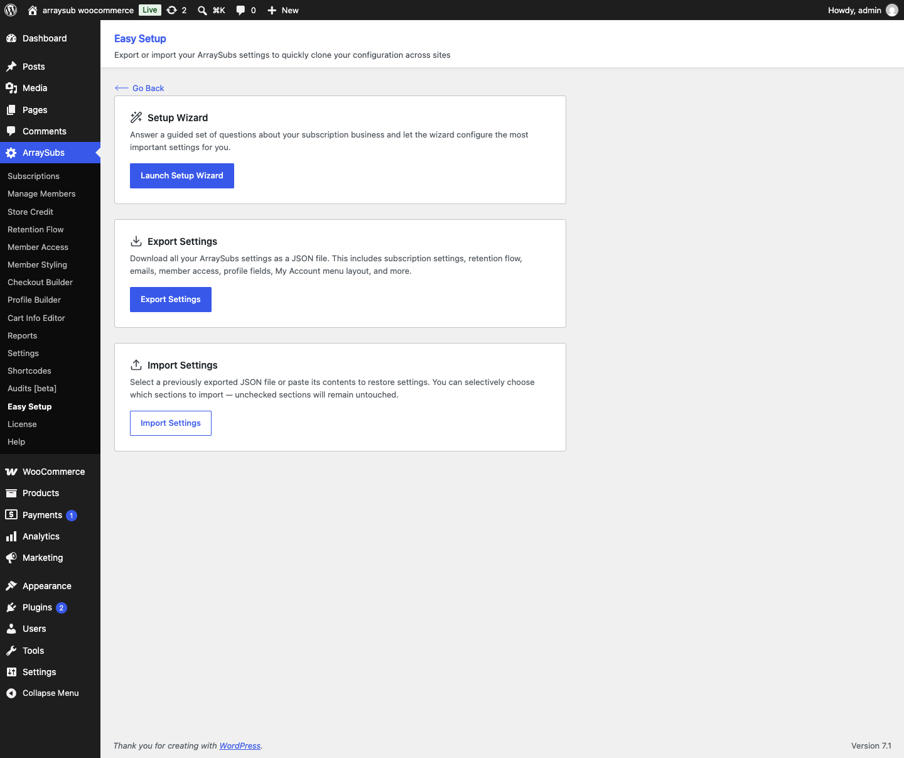
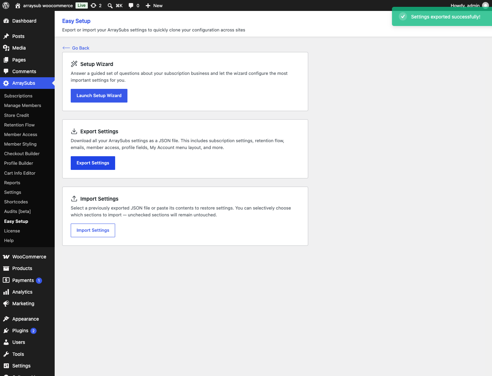
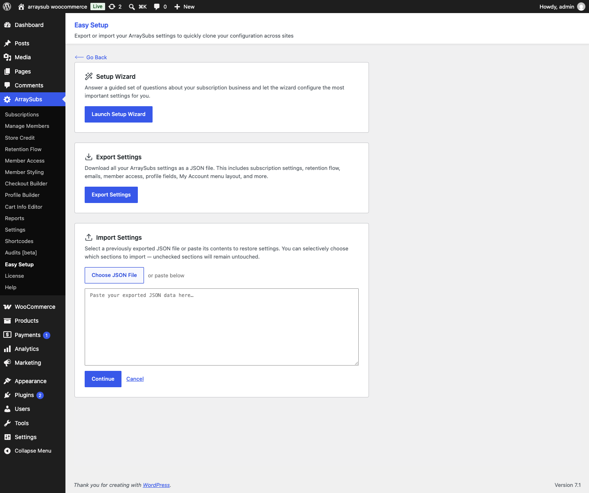
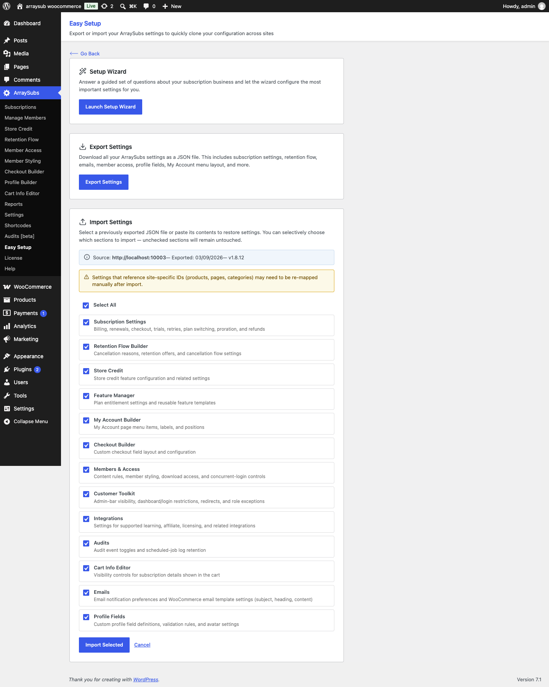
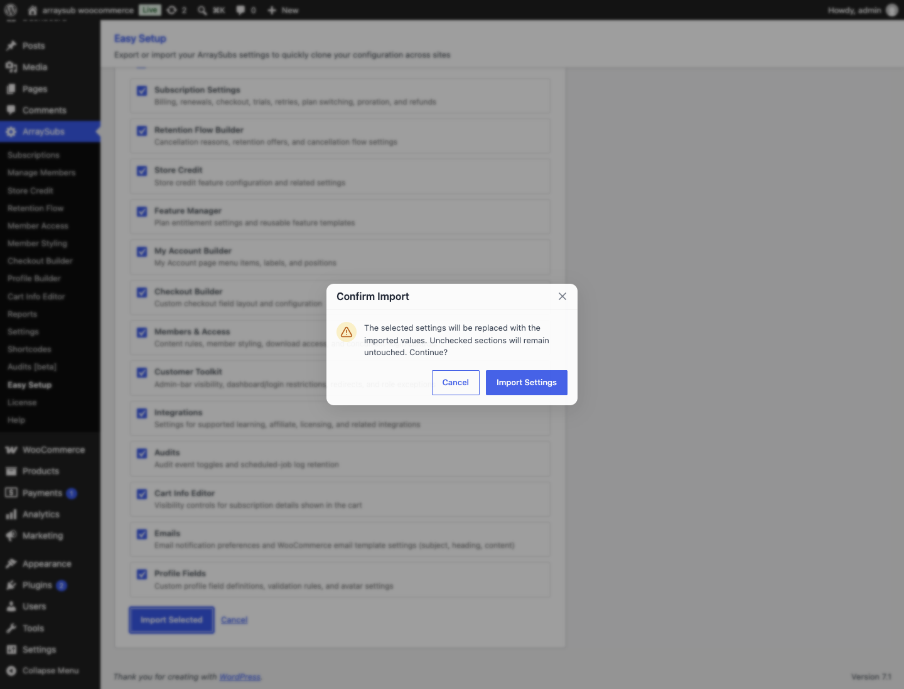
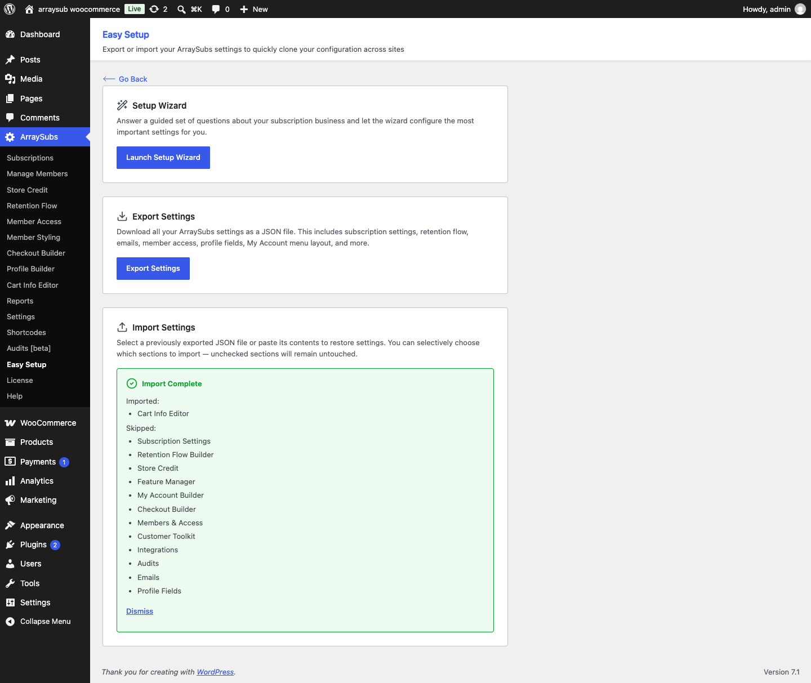

# Info
- Module: Getting Started
- Availability: Free
- Last updated: 2026-09-03

# Import / Export Settings

> Download a portable ArraySubs configuration as JSON, or restore a current export with granular control over which settings sections are replaced.

**Availability:** Free

## Page Navigation

- **Current guide:** Import / Export Settings
- **Where to open it:** WordPress Admin -> ArraySubs -> Easy Setup
- **Direct admin route:** `/wp-admin/admin.php?page=arraysubs-mainadmin#/easy-setup`
- **Section overview:** [Open overview](./README.md)
- **Previous guide:** [first-time-setup](./first-time-setup.md)
- **Next guide:** [README](./README.md)
- **Troubleshooting:** [Audits, Logs, and Troubleshooting](../audits-and-logs/README.md)

## Overview



The Import / Export tools let you back up the portable parts of your ArraySubs configuration and restore them on the same site or a different one. A current export contains a complete 13-section manifest, supported core and Pro settings, 29 ArraySubs WooCommerce email rows, profile fields, feature templates, the My Account menu layout, and more. Payment credentials and customer records are not included.

Import reads that file, validates its structure and settings, and lets you choose exactly which sections to apply. Selected sections are replaced; unchecked sections remain untouched.

Both tools live on the **ArraySubs → Easy Setup** page alongside the Setup Wizard.

## When to Use This

- You are **migrating** an ArraySubs configuration from a staging site to production.
- You want a **backup** of your current settings before making major changes.
- You manage **multiple stores** and want identical subscription configurations across all of them.
- You are **restoring** a known-good configuration after an experiment or misconfiguration.
- You are sharing your configuration with another team member or support agent for troubleshooting.

## Prerequisites

- ArraySubs core plugin installed and activated.
- Administrator or shop-manager access with either the `manage_options` or `manage_woocommerce` capability.
- ArraySubs Pro active on the target site if you want Pro-owned sections imported. Without Pro, those sections are skipped with warnings rather than stored for later.
- A JSON export created by the current settings format (`arraysubs-settings`, module version `2.0.0`) and no larger than 5 MiB.

## How It Works

**Export** reads an explicit allowlist of portable ArraySubs settings, removes payment gateway API keys and webhook secrets, fills in supported defaults and empty configuration rows, and attaches metadata such as the format version, section manifest, source site, and export date. This produces a complete file that can also clear stale values when a section is restored.

**Import** is a multi-step process: provide a JSON file or paste its contents, review the 13-section manifest, select the sections to replace, and confirm the operation. The browser checks the format before showing the selection screen, and the server then validates and sanitizes the complete selected payload before writing anything.

The commit is atomic. If any option write fails, ArraySubs restores the previous values and reports the failure instead of leaving a partial import. After a successful import, the result screen lists imported sections, skipped sections, and warnings.

```box class="warning-box"
Importing is **destructive** for the sections you select. Their supported values are replaced with the imported values, including explicit empty/default values. Unchecked sections stay untouched. There is no manual undo after a successful import, so export the current site first if you need a recovery point.
```

## Real-Life Use Cases

### Use Case 1: Staging to Production Migration

A store owner finishes configuring ArraySubs on a staging site — billing rules, retention offers, email preferences, access control, and custom profile fields. They export the settings as JSON, upload that file on the production site, select all sections, and import. The production site is now configured identically without re-entering a single setting.

### Use Case 2: Pre-Change Safety Backup

Before experimenting with new cancellation and retention settings, a merchant exports their current configuration. If the experiment does not work out, they import the backup file and select only the **Retention Flow Builder** section to restore just that part.

### Use Case 3: Multi-Store Consistency

A franchise operates five WooCommerce stores that all use the same subscription model. The admin configures one store, exports the settings, and imports the same file on the other four stores. Each store gets the same billing rules, email setup, and access control instantly.

---

## Exporting Settings



1. Go to **ArraySubs → Easy Setup**.
2. Find the **Export Settings** card.
3. Click **Export Settings**.
4. A JSON file downloads automatically with the name `arraysubs-settings-YYYY-MM-DD.json`.
5. A success toast confirms: "Settings exported successfully!"

That is all — no configuration or section selection is needed for export. A fresh export includes every supported section in the manifest, even when a section currently uses defaults or contains an empty configuration list.

### What Gets Exported

The export file contains these WordPress options:

| Option Key | Contents |
|---|---|
| `arraysubs_settings` | Portable core and Pro settings for billing, renewal sync, retries, checkout, trials, customer actions, skip/pause, plan switching, proration, refunds, cancellation, access, integrations, audits, Toolkit, Cart Info Editor, emails, and related modules |
| `arraysubs_profile_fields_config` | Custom profile field definitions and validation rules |
| `arraysubs_avatar_settings` | Avatar upload configuration |
| `arraysubs_myaccount_menu_config` | My Account page menu structure, labels, and positions |
| `arraysubs_feature_templates` | Reusable Feature Manager template definitions |
| `wc_email_settings` | All 29 managed ArraySubs WooCommerce email rows, including explicit empty/default rows and portable enabled, subject, heading, additional-content, email-type, recipient, CC, BCC, and preheader fields |

### What Is Not Exported

For security, the export does not include customer records, orders, subscriptions, products, passwords, uploaded media, or payment credentials. It also removes supported gateway secrets if they are found in the settings being prepared, including:

- Stripe secret keys, publishable keys, and webhook secrets
- PayPal client ID, client secret, and webhook IDs
- Paddle API keys, client tokens, and webhook secrets

WooCommerce gateway settings and ArraySubs gateway credentials are not portable through this tool. Re-enter or re-provision them on the target site.

```box class="warning-box"
An export is configuration data, not a secrets-free public document. It can contain the source site URL, email recipient/CC/BCC addresses, custom email copy, menu labels, profile-field definitions, access rules, content references, and redirect paths. Review the JSON before sharing it outside your team.
```

### Export File Structure

The JSON file has two top-level keys. This simplified example shows the required v2 metadata and all supported option containers:

```json
{
  "meta": {
    "format": "arraysubs-settings",
    "plugin_version": "<current ArraySubs version>",
    "pro_version": null,
    "module_version": "2.0.0",
    "sections": [
      "subscription_settings",
      "retention_flow",
      "store_credit",
      "feature_manager",
      "myaccount_builder",
      "checkout_builder",
      "members_access",
      "toolkit",
      "integrations",
      "audits",
      "cart_info_editor",
      "emails",
      "profile_fields"
    ],
    "export_date": "2026-09-03T12:34:56+00:00",
    "site_url": "https://example.com",
    "php_version": "<PHP version>",
    "wp_version": "<WordPress version>",
    "wc_version": "<WooCommerce version>"
  },
  "options": {
    "arraysubs_settings": {},
    "arraysubs_profile_fields_config": [],
    "arraysubs_avatar_settings": {},
    "arraysubs_myaccount_menu_config": [],
    "arraysubs_feature_templates": [],
    "wc_email_settings": {}
  }
}
```

When Pro is active, `pro_version` contains its current version string; otherwise it is `null`. The importer requires the exact `format`, module version `2.0.0`, and a `meta.sections` manifest that matches the option data. A missing, duplicated, unknown, incomplete, or mismatched manifest is rejected. Export a fresh file from the current ArraySubs version instead of editing this structure manually.

---

## Importing Settings

### Step 1 — Provide the JSON Data



1. Go to **ArraySubs → Easy Setup**.
2. Click **Import Settings** on the Import card.
3. Choose one of two methods:
   - Click **Choose JSON File** and select a current ArraySubs `.json` export. A valid file is read and advanced automatically.
   - **Or** paste the raw JSON text into the textarea, then click **Continue**.

The file must use the `.json` extension, must not exceed 5 MiB, and must contain text in the current v2 format. If validation succeeds, you move to section selection. Otherwise, an inline error explains the problem:

| Error | Meaning |
|---|---|
| "Please paste your exported JSON data or select a file" | No input was provided |
| "Please choose a .json settings file." | The selected file does not have the expected extension |
| "The settings file is too large. The maximum size is 5 MB." | The file exceeds the 5 MiB import limit |
| "Invalid export format — metadata and options must be objects" | The JSON does not contain valid `meta` and `options` objects |
| "Unsupported settings format. Export a fresh file with this version of ArraySubs." | The format identifier, module version, or section manifest is missing or from another format version |
| "The settings section manifest is invalid or does not match this ArraySubs version." | The manifest contains a duplicate or unknown section, or the main settings object is missing |
| "Invalid export metadata." | The source URL, export date, or plugin-version metadata has an invalid value type |
| "No recognized settings found in this export file" | The file has the right structure but no sections the importer knows about |
| "Invalid JSON format — please check the pasted data" | The text is not valid JSON |

### Step 2 — Select Sections



After validation, the importer shows:

- **Source site URL** and **export date** from the file metadata.
- **Plugin version** from the export.
- A list of **available sections** found in the file, each with a checkbox.

Every section declared by the export manifest is selected initially. Use **Select All** or individually check and uncheck the sections you want to import. The **Import Selected** button remains disabled when nothing is selected. Unchecked sections are left untouched on the current site.

```box class="info-box"
Settings that reference site-specific products, pages, categories, content, or other records may need to be re-mapped manually after import. The selection screen displays this reminder before you continue.
```

#### Available Sections

| Section | Label | What It Contains |
|---|---|---|
| `subscription_settings` | **Subscription Settings** | Billing, renewals, checkout, trials, retries, plan switching, proration, and refunds |
| `retention_flow` | **Retention Flow Builder** | Cancellation reasons, retention offers, and cancellation flow settings |
| `store_credit` | **Store Credit** | Store credit feature configuration and related settings |
| `feature_manager` | **Feature Manager** | Plan entitlement settings and reusable feature templates |
| `myaccount_builder` | **My Account Builder** | My Account page menu items, labels, and positions |
| `checkout_builder` | **Checkout Builder** | Custom checkout field layout and configuration |
| `members_access` | **Members & Access** | Content rules, member styling, download access, and concurrent-login controls |
| `toolkit` | **Customer Toolkit** | Admin-bar visibility, dashboard/login restrictions, redirects, and role exceptions |
| `integrations` | **Integrations** | Supported learning, affiliate, licensing, and related integration settings |
| `audits` | **Audits** | Audit event toggles and scheduled-job log retention |
| `cart_info_editor` | **Cart Info Editor** | Visibility controls for subscription details shown in the cart |
| `emails` | **Emails** | Notification preferences and WooCommerce email settings, including subject, heading, content, type, recipients, and preheader |
| `profile_fields` | **Profile Fields** | Custom profile field definitions, validation rules, and avatar settings |

A fresh v2 export includes all 13 sections, including complete defaults and explicit empty configuration lists. The importer derives this screen from the manifest and rejects a file when the manifest does not match its option data.

```box class="warning-box"
If ArraySubs Pro is inactive, Pro-owned sections — Store Credit, Feature Manager, My Account Builder, Checkout Builder, Audits, Cart Info Editor, and Profile Fields — are skipped with warnings. **Members & Access** can still import its core settings, but concurrent-login settings are skipped and the destination's existing Pro-owned values are preserved.
```

### Step 3 — Confirm the Import



After selecting your sections, click **Import Selected**. A confirmation modal appears:

> "The selected settings will be replaced with the imported values. Unchecked sections will remain untouched. Continue?"

- Click **Import Settings** to proceed. The dialog shows **Importing…** and remains open while the operation runs.
- Click **Cancel** to go back to section selection.

Before committing, the server verifies the file size and complexity, checks the strict section manifest, rejects unknown options and settings groups, and sanitizes every selected section with its owning settings rules. It then writes the prepared changes as one transaction-like operation. If any write fails, the previous main and standalone option values are restored automatically.

### Step 4 — View Results



After the import completes, a result screen shows:

- **Imported** — The list of sections that were successfully applied.
- **Skipped** — Sections that were not selected or not found in the file.
- **Warnings** — Compatibility and portability notes, such as Pro sections skipped because Pro is inactive or references imported from another site.

Click **Dismiss** to close the result view and return to the Easy Setup page.

When the source URL differs from the current site, ArraySubs adds this warning:

> "This export came from a different site. Review any product, page, category, and content references after import."

---

## Settings Reference

| Setting | What It Controls | Details |
|---|---|---|
| Export file name | Automatic download naming | `arraysubs-settings-YYYY-MM-DD.json` using the current date |
| Export format | File identity | `meta.format` must be `arraysubs-settings` and `meta.module_version` must be `2.0.0` |
| Import size limit | Maximum encoded settings payload | 5 MiB |
| Sensitive data exclusion | Data that remains site-specific | Payment gateway API keys, client secrets, webhook secrets, customer records, orders, subscriptions, products, and media are not exported |
| Section-level import | Granularity of import | 13 ordered sections map to explicit settings groups, paths, and standalone options |
| Manifest validation | Completeness and compatibility | `meta.sections` must contain recognized, unique sections that exactly match the exported option data |
| Transactional persistence | Protection from partial writes | Every selected section is preflighted first; if a write fails, previous option snapshots are restored |

## What Happens After Saving

- **Export**: A JSON file downloads to your browser's default download location. No settings on your site are changed.
- **Import**: After validation and confirmation, the selected sections are replaced together. Unchecked sections remain untouched.
- **Existing records** are not created, deleted, or rewritten. Imported global settings can affect the interface immediately, while future subscription actions and renewal cycles use the imported rules.
- **Configuration cache** is refreshed automatically after import.
- **My Account configuration** is committed before its imported endpoints and rewrite rules are refreshed.
- You can verify imported values by visiting the relevant settings pages (**ArraySubs → Settings**, **Retention Flow**, **Profile Builder**, etc.).

## Edge Cases / Important Notes

- **Selective import is safe.** If you only check one section, every other section remains exactly as it was. This is useful for restoring a single area of configuration.
- **Current v2 exports are required.** Files with an older or different format/module version are rejected. Re-export with the current ArraySubs version instead of altering the metadata.
- **Every fresh export is complete.** All 13 sections, required setting groups and paths, standalone option containers, and all 29 managed WooCommerce email rows are represented, including explicit defaults and empty arrays.
- **Site-specific references may need re-mapping.** Product, page, category, content, URL, and similar references from the source site may not resolve on the target site. Review redirect paths, access rules, integrations, and product references after importing.
- **Pro sections are skipped without Pro.** The import can continue, but Pro-owned sections are reported as skipped and are not stored for later activation. Activate ArraySubs Pro and import those sections again when needed.
- **Members & Access has mixed ownership.** Without Pro, its core configuration can import, while concurrent-login rules and settings are skipped and existing destination values are preserved.
- **Payment gateway keys are never exported.** Stripe, PayPal, and Paddle API credentials must be re-entered on the target site. This is a deliberate security measure.
- **Renewal Sync settings are included.** `renewals.sync_to_billing_cycle` and `renewals.sync_first_charge_mode` are part of **Subscription Settings**, so importing that section can change future checkout pricing and first renewal dates.
- **WooCommerce email settings are included.** The Emails section imports ArraySubs notification preferences plus the portable fields for all 29 managed WooCommerce email rows. Empty rows intentionally clear stale destination overrides and return them to class defaults.
- **Selected groups are replaced, not loosely merged.** Whole settings groups are replaced where the section owns them; shared parent groups use isolated mapped paths so importing one section does not overwrite an unchecked sibling section.
- **Failed writes roll back.** ArraySubs does not dispatch successful settings side effects until all option writes have completed and been verified.

## Troubleshooting

| Problem | Likely Cause | What to Do |
|---|---|---|
| Export button does nothing | JavaScript error or REST API is blocked | Open the browser console, check for errors, and verify your REST API is accessible |
| "Unsupported settings format" on import | The file uses another format/module version or its manifest is missing | Export a fresh file with the current ArraySubs version and import it without editing the metadata |
| Manifest or unknown-option error | The file is incomplete, manually edited, corrupted, or contains settings this version does not recognize | Re-export from the source site. Do not repair the section list by hand |
| The file is too large | The encoded JSON exceeds 5 MiB | Use an untouched ArraySubs settings export; confirm that unrelated data was not added to the file |
| Sections are missing from the import list | The file is not a complete current export | Fresh v2 exports contain all 13 supported sections. Create a new export on the source site |
| Pro sections appear under Skipped | ArraySubs Pro is not active on the target site | Activate Pro, return to Easy Setup, and import those sections again |
| Imported settings look wrong | Site-specific IDs do not match | Check settings that reference pages, products, or categories. Re-map them to the correct IDs on this site |
| Nothing changed after import | All sections were unchecked, or the imported values are identical to existing ones | Verify you selected the correct sections in Step 2 and that the export file contains different values |
| Import fails while saving an option | WordPress could not persist one of the prepared changes | Previous values are restored automatically. Resolve the database or option-write problem, then retry |

---

## Related Guides

- [Easy Setup Wizard](easy-setup-wizard.md) — Use the guided wizard for initial configuration instead of importing from a file.
- [First-Time Setup](first-time-setup.md) — A manual step-by-step checklist for new installations.
- [General Settings](../settings/general-settings.md) — The full reference for individual settings the import may overwrite.
- [Retention Offers](../retention-and-refunds/retention-offers.md) — Verify your retention flow after importing the Retention Flow Builder section.
- [Email Configuration](../emails/README.md) — Review email settings after importing the Emails section.

---

## FAQ

### Does exporting affect my current settings?

No. Exporting is a read-only operation. It downloads a copy of your settings as a file. Nothing on your site changes.

### Can I import just one section and leave everything else alone?

Yes. The import flow lets you check or uncheck individual sections. Only the sections you select are replaced. Everything else stays untouched.

### Is the export file safe to share?

It contains no customer records, orders, subscriptions, products, passwords, media, or payment gateway credentials. However, it can contain the source site URL, recipient/CC/BCC email addresses, custom copy, labels, rules, URLs, and record references. Review and redact the JSON as appropriate before sharing it outside your team.

### What if I import settings from a newer version of ArraySubs?

The importer requires `arraysubs-settings` module version `2.0.0` and a complete matching manifest. An incompatible file is rejected before settings are changed. Export a fresh file from the current source site and keep the target plugin up to date.

### Will importing create or delete my subscriptions, products, or orders?

No. Import only affects plugin settings and configuration. Subscriptions, products, orders, customers, and all other WooCommerce data are completely unaffected.

### Can I import settings from an ArraySubs Pro export on a site that only has the free plugin?

Yes, but Pro-owned sections are skipped with warnings and are not imported for later activation. Core sections still import. **Members & Access** imports its core values while leaving concurrent-login settings unchanged. After activating Pro, run the import again and select the required Pro sections.

### How often should I export as a backup?

Export whenever you are about to make significant settings changes. The file is small and downloads instantly, so there is no cost to exporting frequently.
