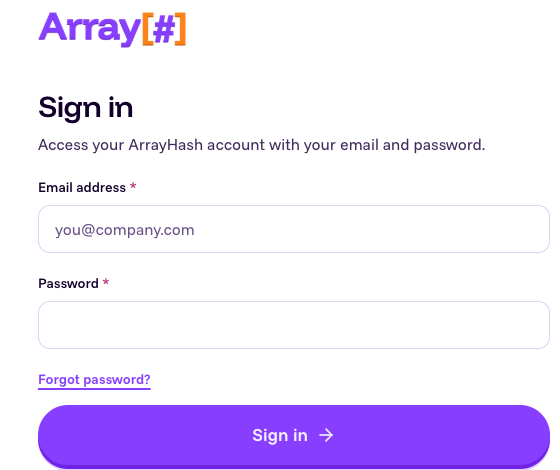
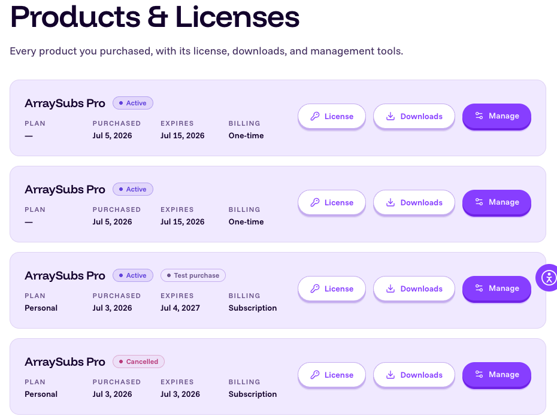
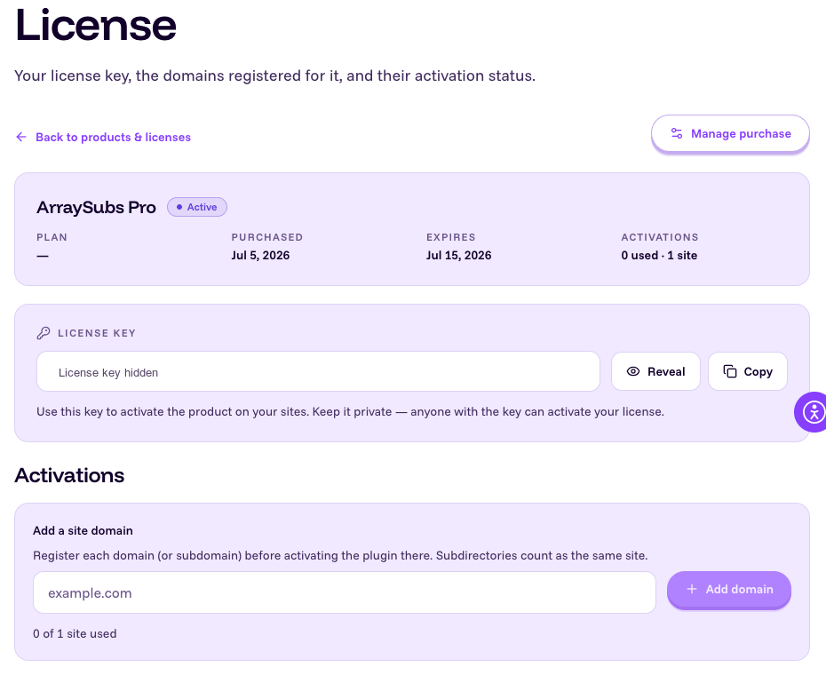
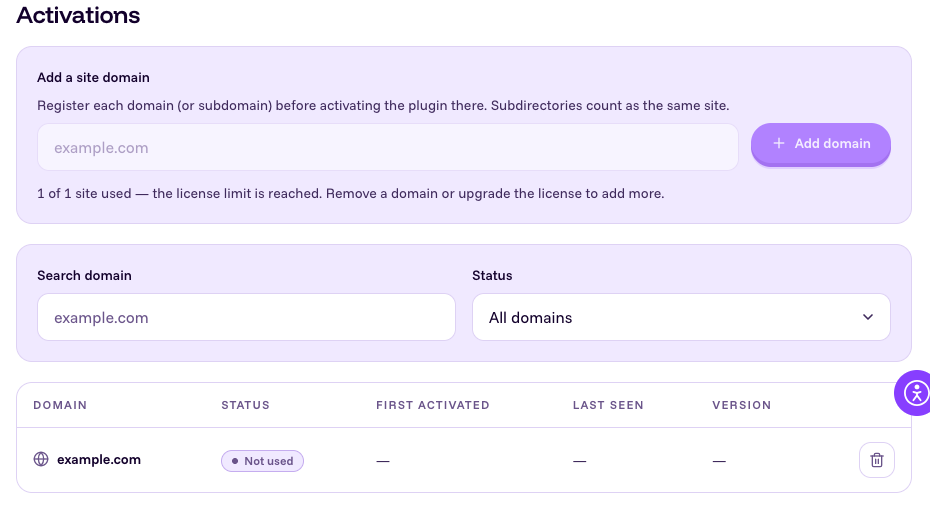
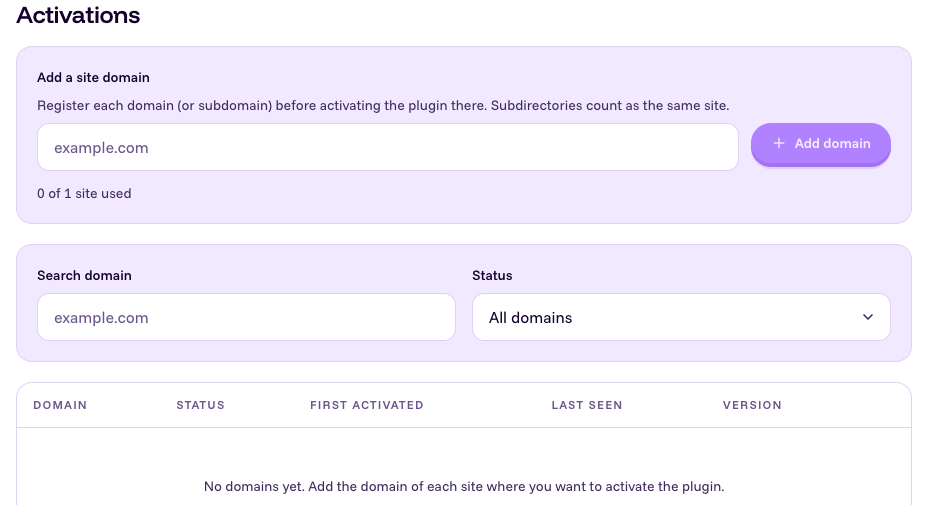
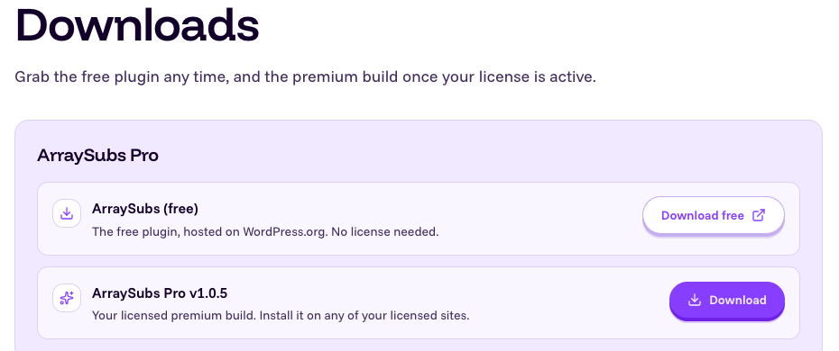
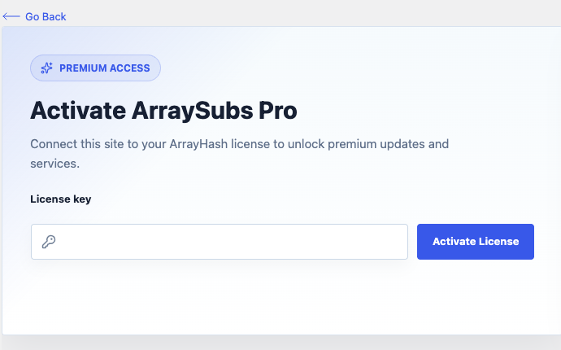
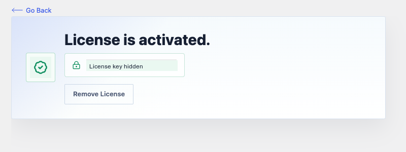
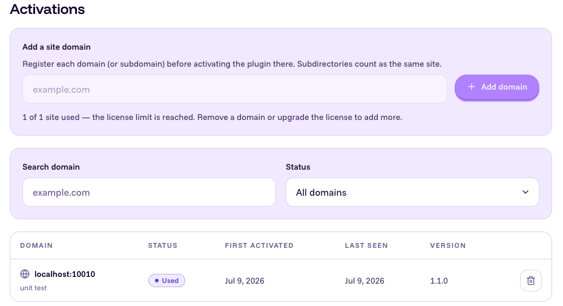

# Info
- Module: Getting Started
- Availability: Pro
- Last updated: 2026-07-10

# License Activation

> Download ArraySubs Pro, register your site in the ArrayHash user portal, activate the license in WordPress, and revoke a site activation when you no longer need it.

**Availability:** Pro

## Page Navigation

- **Current guide:** License Activation
- **Where to open it in WordPress:** WordPress Admin -> ArraySubs -> License
- **Direct admin route:** `/wp-admin/admin.php?page=arraysubs-mainadmin#/license`
- **ArrayHash pricing:** [https://arrayhash.com/deals/arraysubs/pricing/](https://arrayhash.com/deals/arraysubs/pricing/)
- **ArrayHash user portal:** [https://user-portal.arrayhash.com/](https://user-portal.arrayhash.com/)
- **Portal products and licenses:** [https://user-portal.arrayhash.com/products/](https://user-portal.arrayhash.com/products/)
- **Portal downloads:** [https://user-portal.arrayhash.com/downloads/](https://user-portal.arrayhash.com/downloads/)
- **Section overview:** [Open overview](./README.md)
- **Previous guide:** [first-time-setup](./first-time-setup.md)
- **Next guide:** [import-export-settings](./import-export-settings.md)
- **Troubleshooting:** [Audits, Logs, and Troubleshooting](../audits-and-logs/README.md)

## Overview

ArraySubs Pro licensing has two parts:

1. The **ArrayHash user portal** stores your purchase, Pro download, license key, and the sites allowed to use that license.
2. The **WordPress License page** activates ArraySubs Pro on the current WordPress site with the license key from the portal.

The portal is the source of truth for which domains can use a license. Add the site domain in the portal before activating the license in WordPress.

```box class="info-box"
Local development domains are allowed. If your local WordPress URL includes a port, add the exact local host and port, such as `localhost:10010`, in the portal before activating the license.
```

## Prerequisites

- ArraySubs core plugin installed and activated.
- An ArraySubs Pro purchase, subscription, or trial.
- Access to the ArrayHash user portal account that owns the license.
- Admin or Shop Manager access to the WordPress dashboard.
- The WordPress **Site Address** should already be the domain you want to activate.

## Step 1: Get ArraySubs Pro

Open the [ArraySubs pricing page](https://arrayhash.com/deals/arraysubs/pricing/) and choose the Pro plan or trial that fits your site.

After purchase, sign in to the [ArrayHash user portal](https://user-portal.arrayhash.com/).



## Step 2: Open Products and Licenses

In the portal, open **Products & Licenses**. Your ArraySubs Pro license appears in the product list.



Click **License** for ArraySubs Pro. The license page shows:

- License status and dates.
- Your masked license key.
- Copy and reveal controls for the license key.
- The **Activations** area where you register site domains.



Copy the license key from this page. Keep it private.

## Step 3: Add the Website Domain

On the same license page, use **Add a site domain** before activating the plugin in WordPress.

Enter the domain exactly as the site uses it:

| Site Type | Example to Add |
|---|---|
| Production domain | `example.com` |
| Subdomain | `staging.example.com` |
| Localhost without port | `localhost` |
| Localhost with port | `localhost:10010` |

Subdirectories count as the same site. For example, `example.com/shop` uses `example.com`.



If the license has a one-site limit and one domain is already registered, the add form is disabled until you remove or revoke a domain.



## Step 4: Download the Pro Plugin Zip

Open **Downloads** in the user portal and download **ArraySubs Pro**.



The download is a WordPress plugin zip file. Do not unzip it before uploading it to WordPress.

## Step 5: Install ArraySubs Pro in WordPress

In WordPress:

1. Go to **Plugins -> Add Plugin**.
2. Click **Upload Plugin**.
3. Choose the ArraySubs Pro zip file from the portal.
4. Click **Install Now**.
5. Click **Activate Plugin**.

After ArraySubs Pro is active, the **License** item appears under **ArraySubs**.

## Step 6: Activate the License in WordPress

Open **ArraySubs -> License** in WordPress.



Paste the license key copied from the portal and click **Activate License**.

WordPress sends the current site domain and license key to ArrayHash. If the license is valid and the domain is registered for that license, the page reloads into the activated state.



After activation, the page shows:

- **License is activated.**
- A masked license key.
- A **Remove License** button.

## Step 7: Confirm the Active Site in the Portal

Return to the license page in the ArrayHash user portal. The Activations table shows the domain as used after WordPress activates the license.



The activation row can show the domain, first activation date, last seen date, plugin version, and site title.

## Revoke or Remove a Website Activation

Use the user portal when you want to free a license seat or stop a site from using the license.

1. Open [Products & Licenses](https://user-portal.arrayhash.com/products/).
2. Open the ArraySubs Pro **License** page.
3. Find the site in **Activations**.
4. Click **Revoke** for an active site, or the delete control for an unused site.
5. Confirm the action when prompted.

After revoke or removal, the domain is no longer assigned to the license seat.


```box class="warning-box"
Revoking a site in the portal and removing a license inside WordPress are separate actions. Revoke in the portal to free the license seat. Use **Remove License** in WordPress only to clear the local license record from that WordPress installation.
```

## Remove the Local WordPress License

Use **Remove License** in WordPress when you only want to clear the local license record from the current site.

1. Go to **ArraySubs -> License**.
2. Click **Remove License**.
3. Confirm the action.
4. Wait for the success message and page reload.

Removing the local license clears WordPress license data, but it does not free the domain in the ArrayHash portal. Revoke or remove the domain in the portal if you also want to release the seat.

## What Gets Stored in WordPress

After successful activation, WordPress stores license activation details in the `arraysubs_license` option.

Stored data can include:

| Stored Value | Purpose |
|---|---|
| License key or activation token | Used for Pro update checks and protected downloads |
| Activated domain | Used to confirm the current site still matches the activation |
| Plugin slug | Confirms the license belongs to ArraySubs Pro |
| Package or plan data | Confirms the licensed package |
| Created and expiry dates | Define the license validity window |
| Activation date | Records when this WordPress site activated the license |

## Pro Updates and Downloads

ArraySubs Pro update downloads are protected by the active license. To download Pro updates through WordPress, the current site must have a valid local activation and the domain must remain assigned to the license in the ArrayHash portal.

If the license is missing, expired, revoked, or assigned to a different domain, WordPress may not be able to download the protected Pro update zip.

## Troubleshooting

| Problem | Likely Cause | What to Do |
|---|---|---|
| The **License** menu is missing | ArraySubs Pro is not active | Install and activate ArraySubs Pro first |
| You cannot download the Pro zip | You are not signed in to the portal account that owns the license | Sign in to the correct ArrayHash account and open **Downloads** |
| The portal add form is disabled | The license has no unused site seats | Revoke or remove an old domain, or upgrade the license |
| Activation says the domain is not allowed | The WordPress site domain was not added in the portal | Add the exact domain in **Activations**, then activate again |
| Localhost activation fails | The local URL includes a port or host that was not added | Add the exact local domain, for example `localhost:10010` |
| The license was active but now shows inactive | The domain changed, the seat was revoked, or the license expired | Check the WordPress Site Address and the portal activation row |
| Pro update zip download fails | The protected download could not validate the active license | Reactivate the license and confirm the domain is still assigned in the portal |

## FAQ

### Do I need ArraySubs Pro active before activating a license?

Yes. The **License** menu is shown only when ArraySubs Pro is active.

### Where do I get the Pro plugin zip?

Sign in to the ArrayHash user portal and open **Downloads**.

### Where do I get the license key?

Open **Products & Licenses**, click **License** for ArraySubs Pro, then copy the key from the license page.

### Do I need to add my website in the portal first?

Yes. Add the domain in the license page's **Activations** area before activating the license in WordPress.

### Are local development sites allowed?

Yes. Localhost domains are allowed for development. If the local URL has a port, add the exact host and port, such as `localhost:10010`.

### Does removing the license in WordPress revoke the site in the portal?

No. Removing the license in WordPress only clears the local WordPress license record. Revoke or remove the domain from the portal to free the license seat.

### Do subdomains count separately?

Yes. `example.com`, `www.example.com`, `staging.example.com`, and `localhost:10010` are separate activation domains. Subdirectories are ignored.

## Related Guides

- [Before You Launch](before-you-launch.md)
- [First-Time Setup](first-time-setup.md)
- [Import / Export Settings](import-export-settings.md)
- [Gateway Health](../gateway-health/README.md)
- [Audits, Logs, and Troubleshooting](../audits-and-logs/README.md)
