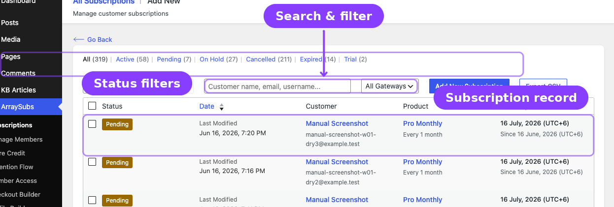
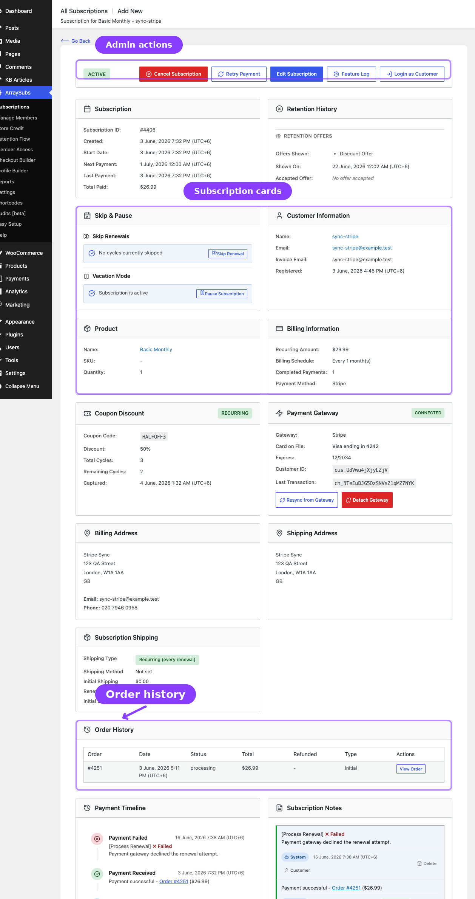

# Info
- Module: Subscription Admin
- Availability: Free, some cards and tools require Pro
- Last updated: 2026-06-04

# Manage Subscriptions

> The central hub for viewing, creating, editing, and managing every subscription in your store.

**Availability:** Free (core features), some cards and tools require Pro

## Page Navigation

- **Current guide:** Manage Subscriptions
- **Where to open it:** WordPress Admin -> ArraySubs -> Subscriptions
- **Section overview:** [Open overview](../README.md)
- **Previous guide:** [lifecycle-management](./lifecycle-management.md)
- **Next guide:** [subscription-detail-cards](./subscription-detail-cards.md)
- **Troubleshooting:** [Audits, Logs, and Troubleshooting](../audits-and-logs/README.md)

## Overview

The **Manage Subscriptions** area is where you spend most of your day-to-day time as a subscription merchant. From here you can browse all subscriptions, create new ones manually, edit billing details, review order history, track lifecycle changes, and take action on individual subscriptions.

This section covers four main areas:

| Area | What It Covers |
|------|----------------|
| [Subscription Operations](subscription-operations.md) | The subscriptions list, creating a subscription, editing a subscription, and the subscription detail screen |
| [Admin Tools and Records](admin-tools-and-records.md) | Subscription notes, feature log (**Pro**), related orders and refund history, and CSV/JSON export |
| [Subscription Detail Cards](subscription-detail-cards.md) | Every information card on the detail screen — cancellation, skip & pause, coupon, gateway (**Pro**), checkout fields (**Pro**), and shipping (**Pro**) |
| [Lifecycle Management](lifecycle-management.md) | How subscriptions move through statuses — activation, renewals, grace periods, cancellation, expiration, trials, and email triggers |

## When to Use This

- You need to look up a customer's subscription status or billing details.
- You want to create a subscription manually (for phone orders, migrations, or exceptions).
- You need to reschedule a renewal, update an address, or change a subscription's status.
- You want to review payment history, refund records, or admin notes for a specific subscription.
- You need to understand what happens at each stage of a subscription's life.

## Before You Create Subscriptions

Subscriptions are created from WooCommerce products that have ArraySubs subscription settings enabled. Before using **ArraySubs -> Subscriptions -> Add New**, create or edit the product that customers will subscribe to:

1. Go to **Products -> Add New** or open an existing WooCommerce product.
2. Set the product's **Regular price**.
3. Check **Subscription** in the product data panel.
4. Open the **Subscription** tab and configure the billing period, interval, length, trial, signup fee, and renewal pricing.
5. Publish or update the product, then return to **ArraySubs -> Subscriptions** to create or manage customer subscriptions.

See [Subscription Products](../subscription-products/README.md) for the full product setup workflow.

## How to Get Here

Navigate to **ArraySubs → Subscriptions** in the WordPress admin sidebar. This opens the All Subscriptions list. From there, every subscription operation is one or two clicks away.

---

## Related Guides

- [Getting Started — Essential Daily Workflows](../getting-started/essential-daily-workflows.md)
- [Subscription Products — Create and Configure](../subscription-products/create-and-configure.md)
- [Settings — General Settings](../settings/general-settings.md)
