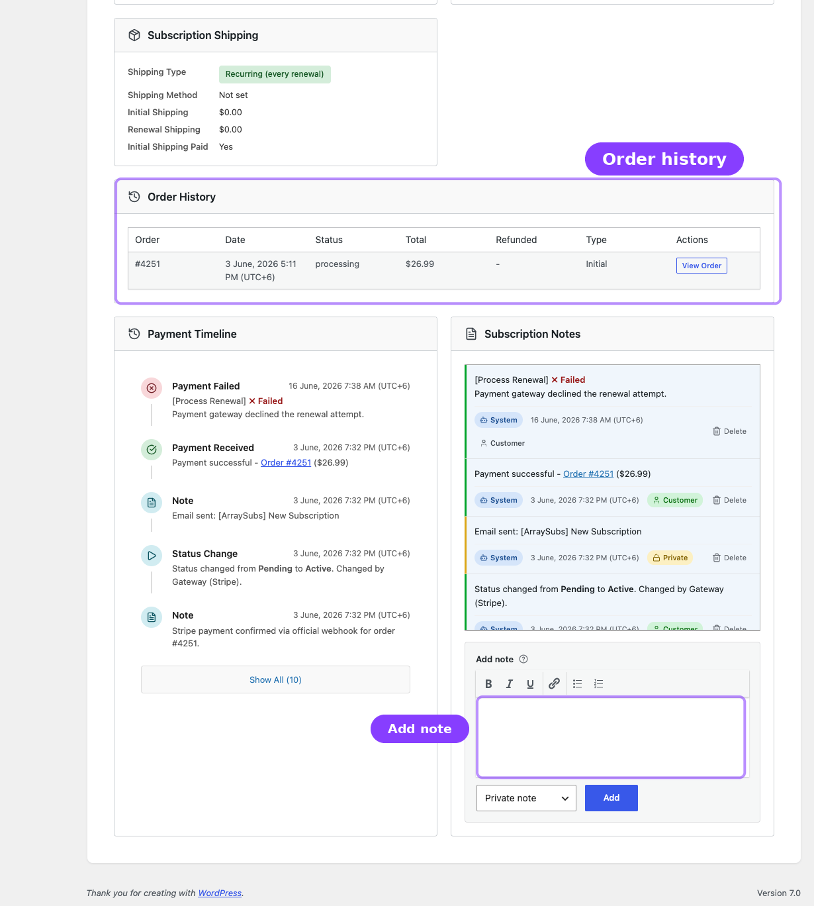
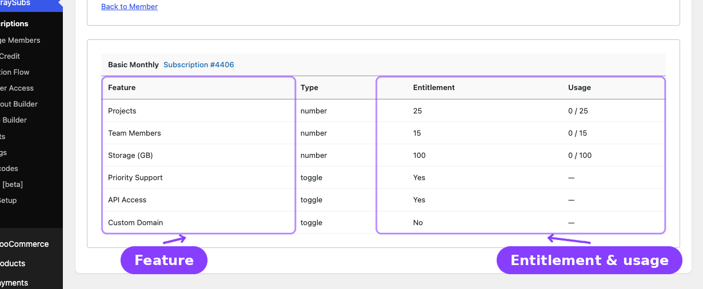
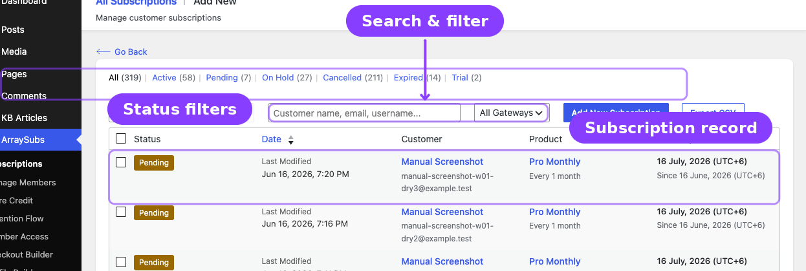

# Info
- Module: Subscription Admin
- Availability: Free; Pro
- Last updated: 2026-07-26

# Admin Tools and Records

> Subscription notes, feature entitlements, related orders, and data export — the tools that keep your records complete.

**Availability:** Free (Notes, Orders, Export); Pro (Feature Log)

## Page Navigation

- **Current guide:** Admin Tools and Records
- **Where to open it:** WordPress Admin -> ArraySubs -> Subscriptions
- **Section overview:** [Open overview](./README.md)
- **Previous guide:** [README](../member-insight/README.md)
- **Next guide:** [lifecycle-management](./lifecycle-management.md)
- **Troubleshooting:** [Audits, Logs, and Troubleshooting](../audits-and-logs/README.md)

## Overview

Beyond browsing and editing subscriptions, ArraySubs gives you a set of tools for record-keeping and operational insight. This guide covers:

- **Subscription Notes** — an activity log of every change, plus a space for your own admin notes. See the dedicated [Subscription Notes](../subscription-notes/README.md) module guide.
- **Feature Log** — a per-customer view of subscription entitlements and usage (**Pro**).
- **Related Orders and Refund History** — every order and refund linked to a subscription.
- **Export Subscriptions** — download subscription data as CSV or JSON. Full guide: [Subscription Data Export](subscription-data-export.md).

---

## Subscription Notes



Subscription Notes is now documented as its own root-level module because it is a core operational tool, not a small detail inside the subscription screen. Open [Subscription Notes](../subscription-notes/README.md) for note types, author badges, automatic events, manual note workflow, and troubleshooting examples.

---

## Feature Log / Entitlement Review **Pro**



The Feature Log shows what product entitlements (features) a customer has access to across their subscriptions. This is part of the **Feature Manager** module.

### How to Access

Open a subscription detail screen and click **Feature Log** in the header (or follow the link from a Manage Members profile). The route uses `/subscriptions/feature-log?user_id=...` and displays feature data for that customer.

### What It Shows

The page header shows the customer's name and email. Below that, the display depends on the **aggregation mode** configured in Feature Manager settings:

#### Per-Subscription Mode

Each active subscription gets its own table. The table header shows the product name and a link to the subscription (e.g., "Monthly Plan – Subscription #1234").

| Column | What It Shows |
|--------|---------------|
| **Feature** | Feature name (e.g., "Downloads", "API Access") |
| **Type** | The feature type — Toggle, Number, or Text |
| **Entitlement** | The granted value — "Yes"/"No" for toggles, a number or "Unlimited" for number types, raw text for text types |
| **Usage** | Current usage against the entitlement limit (only shown if usage tracking is enabled in settings) — e.g., "10 / 50" or "10 / Unlimited" |

#### Combined Mode

All features across all active subscriptions are merged into a single table with the same columns. Duplicate features are resolved using the Feature Manager's merge/intersect logic.

### Feature Types

| Type | Display | Example |
|------|---------|---------|
| **Toggle** | "Yes" or "No" | API Access: Yes |
| **Number** | Numeric value or "Unlimited" | Downloads: 50 (or Unlimited) |
| **Text** | Raw string value | License Tier: Gold |

```box class="info-box"
The Usage column only appears when the **Show usage in admin** setting is enabled in Feature Manager settings.
```

For the full Feature Manager guide — including product setup, customer display, all settings, and usage tracking — see the dedicated [Feature Manager](../feature-manager/README.md) section.

---

## Related Orders, Invoices, and Refund History

The **Order History** card on the subscription detail screen shows every WooCommerce order linked to the subscription.

### Order Table Columns

| Column | What It Shows |
|--------|---------------|
| **Order** | Order number (e.g., #1234), linked to the WooCommerce order edit screen |
| **Date** | Order creation date |
| **Status** | WooCommerce order status — Processing, Completed, Refunded, etc. |
| **Total** | Formatted order total with currency symbol |
| **Refunded** | Refund amount in red text, or a dash if no refunds |
| **Type** | **Initial** for the first signup order, **Renewal** for every subsequent billing |
| **Actions** | A "View Order" link that opens the order in WooCommerce |

### Refund Sub-Rows

When an order has refunds, each refund appears as an indented row directly below the parent order:

- **Refund ID** (e.g., "└ Refund #456")
- **Date** of the refund
- **Amount** (shown as a negative, e.g., "-$50.00")
- **Reason** for the refund

If the order is fully refunded, the row gets a visual highlight.

### Total Refunded Badge

If any refunds exist across all orders, the Order History card header displays a red **Total Refunded** badge showing the cumulative refund total — for example, "Total Refunded: $150.00".

### Sorting

Orders are displayed in chronological order. The full list is loaded with the subscription detail — there is no separate pagination for orders.

---

## Export Subscriptions



Subscription data can be downloaded as a CSV from **ArraySubs → Subscriptions**. You choose which of the 47 available columns the file contains — subscription details, customer identity, and the full shipping and billing addresses — and the selection is remembered for next time. The same data is available as JSON through the REST API.

```box class="info-box"
Exporting has its own guide: [Subscription Data Export](subscription-data-export.md) covers the column picker, the complete column catalogue, the shipping-label workflow, file details, and the JSON endpoint.
```

---

## Real-Life Use Cases

### Use Case 1: Investigating a Support Ticket

A customer says they were charged twice. Open the subscription detail, scroll to **Order History**, and check all renewal orders and their dates. Then read the **Subscription Notes** to see system-generated events around the dates in question.

### Use Case 2: Verifying Feature Entitlements (**Pro**)

A customer claims they should have 100 downloads per month but only see 50. Open the **Feature Log** for that customer and check the entitlement value against their subscription's product configuration.

### Use Case 3: Monthly Revenue Report

At the end of each month, go to **Subscriptions**, filter by **Active**, and click **Export CSV**. Open the file in a spreadsheet to calculate monthly recurring revenue from the Recurring Amount column. See [Subscription Data Export](subscription-data-export.md) for choosing the columns.

### Use Case 4: Documenting an Admin Action

Before making a manual change to a subscription (like updating the invoice email or correcting an address), add a **Private** note explaining why — e.g., "Updated invoice email per support ticket #5432." This preserves the audit trail.

---

## Troubleshooting

| Problem | Likely Cause | What to Do |
|---------|--------------|------------|
| Notes panel is empty on a subscription | The subscription is newly created with no events yet | System notes are created as events occur (status changes, payments, etc.). Add a manual note if needed. |
| Feature Log page shows "No features found" | The customer has no active subscriptions with Feature Manager products, or the feature is not configured | Verify the simple subscription product has features defined in the Feature Manager [AS] tab, or check the Feature Manager section inside the relevant variation |
| Refund amounts do not appear in Order History | The refund was processed outside WooCommerce (e.g., directly in the payment gateway dashboard) | Process refunds through WooCommerce so they are recorded on the order and reflected in the subscription |

---

## Related Guides

- [Subscription Operations](subscription-operations.md) — the full subscription list, create, edit, and detail screens
- [Subscription Data Export](subscription-data-export.md) — CSV export, the column picker, and shipping-address columns
- [Subscription Detail Cards](subscription-detail-cards.md) — the conditional cards for cancellation, coupon, and more
- [Lifecycle Management](lifecycle-management.md) — understanding the events that create system notes
- [Advanced Analytics — Order List Enhancements](../analytics/order-list-enhancements.md) *(Pro)* — order type columns, filters, and the embedded report panel on the WooCommerce Orders page

---

## FAQ

### Can customers see private notes?
No. Private notes are only visible to users with admin access. Only notes created with the **Customer** type appear in the customer's My Account area.

### Are system notes editable?
No. System-generated notes cannot be edited. You can delete them, but the content cannot be modified after creation.

### Can I export subscriptions in a format other than CSV?
Yes. The REST endpoint supports JSON: `GET /wp-json/arraysubs/v1/subscriptions/export?format=json`. It returns the same columns as the CSV, one object per subscription. See [Subscription Data Export](subscription-data-export.md).

### Does the Feature Log show cancelled subscriptions?
The Feature Log displays features from the customer's active subscriptions. Cancelled or expired subscriptions are not included in the entitlement calculation.

### How far back does the Order History go?
The Order History shows every order ever linked to the subscription — from the initial signup order through every renewal. There is no time limit or page limit on the history.
