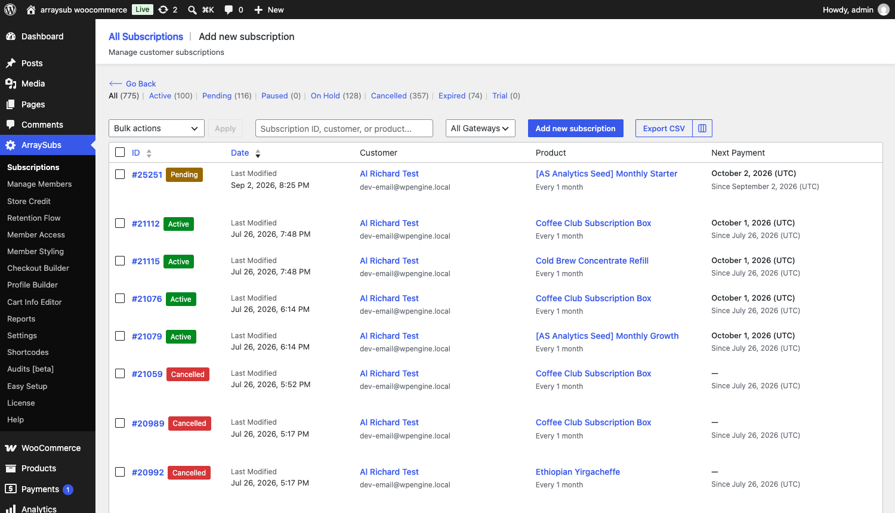
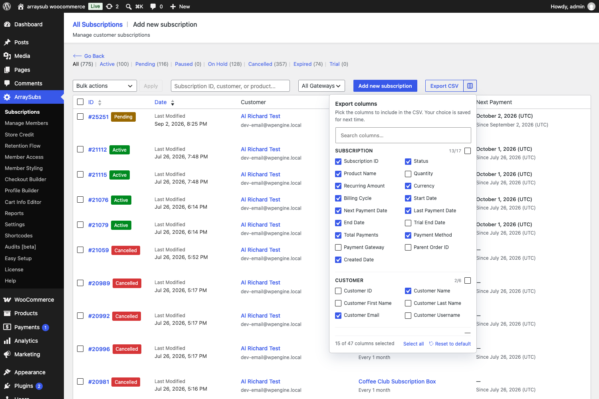
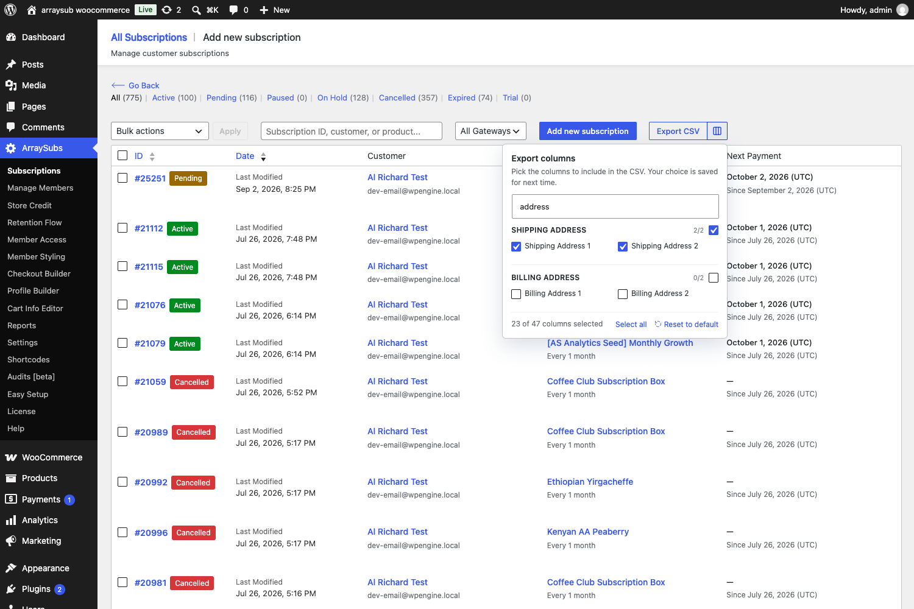
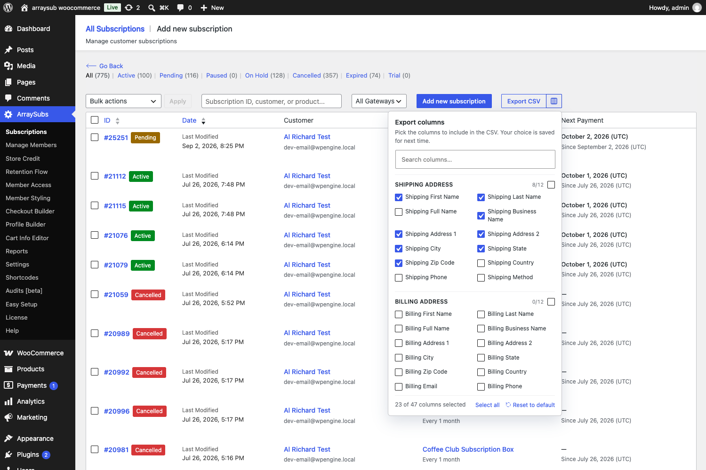
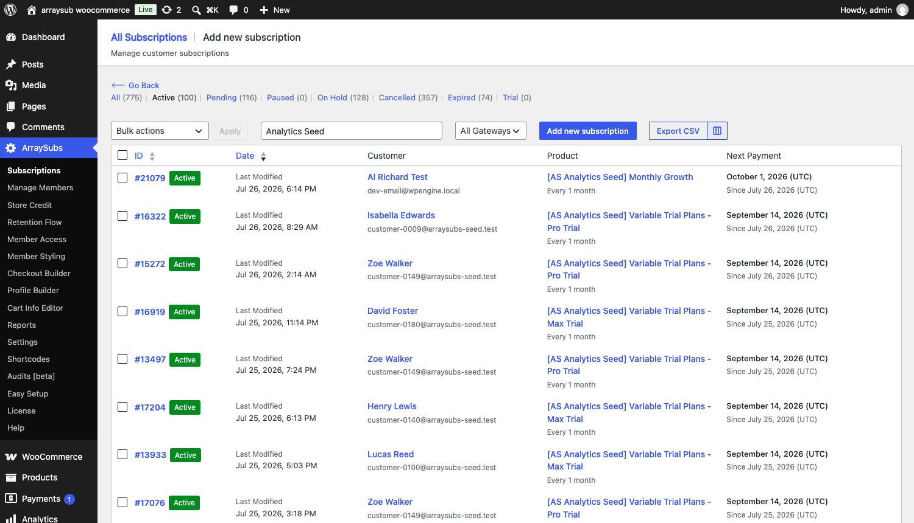

# Info
- Module: Subscription Admin
- Availability: Free
- Last updated: 2026-09-03

# Subscription Data Export

> Download your subscriptions as a CSV — customer shipping addresses included — and pick exactly which columns come with them.

**Availability:** Free

## Page Navigation

- **Admin screen:** WordPress Admin → **ArraySubs → Subscriptions**
- **Direct admin route:** `/wp-admin/admin.php?page=arraysubs-mainadmin#/subscriptions`
- **The list itself:** [Subscription Operations](subscription-operations.md)
- **Shipping setup:** [Subscription Shipping](../subscription-shipping/README.md) *(Pro)*
- **Troubleshooting:** [Audits, Logs, and Troubleshooting](../audits-and-logs/README.md)

## Overview

Every subscription in your store can be downloaded as a CSV file straight from the **All Subscriptions** list. The export is not a fixed report — you choose which of the **47 available columns** it contains, and your choice is remembered for next time.

The catalogue covers four areas:

| Group | Columns | What it is for |
|-------|--------:|----------------|
| **Subscription** | 17 | Status, product, billing cycle, dates, payment method, order link |
| **Customer** | 6 | Account ID, name, email, username |
| **Shipping Address** | 12 | The delivery address, split into label-ready fields |
| **Billing Address** | 12 | The invoicing address, split the same way |

## When to Use This

- You post physical goods and need one address sheet per shipping run instead of printing labels one order at a time.
- You want a monthly recurring-revenue snapshot to open in a spreadsheet.
- You are handing subscription data to an accountant, a fulfilment partner, or a mail-merge tool.
- You are migrating to or from another platform and need the raw records.
- You want an offline backup of your subscription list.

## Prerequisites

- At least one subscription in the store.
- Admin or Shop Manager access (**manage_woocommerce** or **manage_options** capability).

---

## The Export Controls



Open **ArraySubs → Subscriptions**. Two controls sit together at the right of the toolbar:

| Control | What it does |
|---------|--------------|
| **Export CSV** | Downloads the file immediately, using your saved column selection |
| **Column picker** (the icon beside it) | Opens the panel where you choose which columns the file contains |

The button shows **Exporting…** with a spinner while the file is being built, then the download starts on its own.

---

## Choosing Which Columns to Export



Click the column picker icon to open the **Export columns** panel. Columns are grouped by area, and each group header shows how many of its columns are currently selected — for example, **13/17**.

### Selecting Columns

- **Tick a single column** to add it to the export.
- **Tick a group header** to select every column in that group at once. The header box shows a dash when only part of the group is selected.
- The **counter in the footer** ("15 of 47 columns selected") always reflects the current total.

```box class="info-box"
At least one column must stay selected. When you are down to the last one, its tick box is disabled so the export can never end up empty.
```

### Finding a Column Quickly



With 47 columns available, use the **Search columns…** box at the top of the panel. Typing narrows the list to matching columns and hides groups with no match — searching `address` leaves just the four address-line columns, `zip` leaves the two postcode columns.

```box class="info-box"
While a search is active, the group header count and its tick box apply to the **visible** matches only. Searching `address` and ticking the **Shipping Address** header selects the two visible address lines, not the whole 12-column group.
```

### Select All and Reset to Default

Two shortcuts sit in the footer:

| Shortcut | What it does |
|----------|--------------|
| **Select all** | Ticks all 47 columns. Greyed out when everything is already selected. |
| **Reset to default** | Returns to the standard 15-column set listed below |

### Where Your Choice Is Saved

Your selection is saved to **your own WordPress user account** a moment after you change it — there is no Save button. That means:

- The panel reopens with your columns already ticked, on any device you log in from.
- Each administrator and shop manager keeps their own selection. Changing yours never affects a colleague's.
- Closing the panel or leaving the page does not discard anything.

---

## The Column Catalogue

### Subscription

| Column | What It Contains |
|--------|------------------|
| Subscription ID | The subscription's record ID, the same number shown as `#1234` in the list |
| Status | Status label — Active, Pending, Paused, On Hold, Cancelled, Expired, Trial |
| Product Name | The subscribed product, including the variation name where there is one |
| Quantity | How many units the subscription covers |
| Recurring Amount | The renewal price as a plain number, with no currency symbol |
| Currency | Three-letter currency code, e.g. `USD` |
| Billing Cycle | Interval and period together, e.g. `1 month` |
| Start Date | When the subscription started |
| Next Payment Date | The next scheduled renewal |
| Last Payment Date | The most recent successful payment |
| End Date | When the subscription ended — blank while it is still running |
| Trial End Date | When the free trial ends — blank when there is no trial |
| Total Payments | Count of completed renewal payments |
| Payment Method | The payment method title shown to the customer, e.g. `Direct bank transfer` |
| Payment Gateway | The gateway's internal ID, e.g. `stripe` — useful for filtering in a spreadsheet |
| Parent Order ID | The order the subscription was bought on |
| Created Date | When the subscription record was created |

### Customer

| Column | What It Contains |
|--------|------------------|
| Customer ID | The WordPress user ID — blank for guest subscriptions |
| Customer Name | Full name, matching the **Customer** column in the list |
| Customer First Name | First name on its own, for mail merge |
| Customer Last Name | Last name on its own |
| Customer Email | The account email address |
| Customer Username | The WordPress login name |

### Shipping Address



These are the columns to use for shipping labels and pick lists.

| Column | What It Contains |
|--------|------------------|
| Shipping First Name | Recipient's first name |
| Shipping Last Name | Recipient's last name |
| Shipping Full Name | First and last name in one cell, for label templates that take a single name field |
| Shipping Business Name | Company or organisation line |
| Shipping Address 1 | Street address |
| Shipping Address 2 | Apartment, suite, or unit |
| Shipping City | Town or city |
| Shipping State | State or county code, e.g. `MI` |
| Shipping Zip Code | Postcode or ZIP |
| Shipping Country | Two-letter country code, e.g. `US` |
| Shipping Phone | Contact number for the delivery |
| Shipping Method | The shipping method saved on the subscription *(Pro)* |

```box class="info-box"
State and country are exported as the codes WooCommerce stores — `MI`, `US` — because that is the format postal carriers and label software expect.
```

### Billing Address

| Column | What It Contains |
|--------|------------------|
| Billing First Name | Payer's first name |
| Billing Last Name | Payer's last name |
| Billing Full Name | First and last name in one cell |
| Billing Business Name | Company on the invoice |
| Billing Address 1 | Street address |
| Billing Address 2 | Apartment, suite, or unit |
| Billing City | Town or city |
| Billing State | State or county code |
| Billing Zip Code | Postcode or ZIP |
| Billing Country | Two-letter country code |
| Billing Email | Invoice email address |
| Billing Phone | Billing contact number |

### The Default 15 Columns

A fresh install — and the **Reset to default** shortcut — gives you: Subscription ID, Status, Product Name, Recurring Amount, Currency, Billing Cycle, Start Date, Next Payment Date, Last Payment Date, End Date, Total Payments, Payment Method, Created Date, Customer Name, Customer Email.

---

## What Gets Exported



**The download always contains exactly the rows the list is showing.** All three filters carry over:

| Filter | Effect on the export |
|--------|----------------------|
| **Status tab** | On **Active**, only active subscriptions are exported. On **All**, everything is. |
| **Gateway dropdown** | Limits the export to subscriptions paying through that gateway |
| **Search box** | Limits the export to subscriptions matching the search — customer, product, or subscription ID |

Set your filters first, confirm the list shows what you expect, then click **Export CSV**. The row count in the file will match the count on the status tab.

```box class="warning-box"
Pagination does **not** limit the export. Viewing page 1 of 39 still exports all matching subscriptions, not just the 20 rows on screen.
```

### Column Order

Columns always come out in catalogue order — Subscription, then Customer, then Shipping Address, then Billing Address — regardless of the order you ticked them in. Two exports of the same selection always have the same layout, so a spreadsheet template built on one file keeps working with the next.

---

## How the Shipping Address Is Chosen

Not every store collects a separate delivery address, and older subscriptions may pre-date the one on file. So that a label sheet is never half empty, ArraySubs fills the shipping columns from the first source that has a street address:

1. The **shipping address saved on the subscription** — the one an admin or the customer can edit.
2. The **shipping address on the original order**, if the subscription has no address of its own.
3. The **billing address**, when there is no delivery address anywhere.

Missing names, company, and phone are then topped up from the billing address, so a row that has a street will normally have a usable recipient too.

```box class="info-box"
Customers can keep their own delivery address current from **My Account → Subscriptions**. Encourage that before a shipping run and your export needs less cleaning up.
```

---

## Steps: Build a Shipping Label Sheet

1. Go to **ArraySubs → Subscriptions**.
2. Click the **Active** status tab so cancelled and expired subscriptions are left out.
3. Open the **column picker** beside **Export CSV**.
4. Click **Reset to default**, then untick everything you do not need — or type `shipping` in the search box and tick the group header to take the whole delivery block at once.
5. For a typical postal label, select: **Shipping First Name**, **Shipping Last Name**, **Shipping Business Name**, **Shipping Address 1**, **Shipping Address 2**, **Shipping City**, **Shipping State**, **Shipping Zip Code**. Add **Subscription ID** if you want a reference on each row.
6. Close the panel and click **Export CSV**.
7. Open the file in your spreadsheet or upload it to your label software. The column headings already match the field names most carriers use.

The next time you run the shipping cycle, your columns are still selected — steps 3 to 5 are a one-off.

---

## File Details

| Detail | Value |
|--------|-------|
| **Format** | Comma-separated values (`.csv`) |
| **Filename** | `subscriptions-export-YYYY-MM-DD-HHmmss.csv`, e.g. `subscriptions-export-2026-09-03-143022.csv` |
| **Encoding** | UTF-8 with a BOM header, so Excel reads accented characters correctly |
| **Header row** | Always present, using the same column names shown in the picker |
| **Escaping** | Values containing commas, quotes, or line breaks are wrapped in double quotes |

### Spreadsheet Safety

Address and name fields come from customers, and a spreadsheet will try to run a cell that begins with `=`, `+`, `-`, or `@` as a formula. ArraySubs prefixes those values with an apostrophe so they stay plain text. Real numbers — a `-12.50` refund or a `+1` phone prefix — are left untouched.

---

## Real-Life Use Cases

### Use Case 1: Monthly Subscription Box Shipping

A coffee subscription store posts boxes on the first of every month. On the last day of the month the owner opens **Subscriptions**, switches to **Active**, and exports the shipping columns. The file goes straight into USPS bulk-label software — one upload instead of creating labels one subscription at a time.

### Use Case 2: Monthly Revenue Snapshot

At month end, filter by **Active** and export the default columns. Sum the **Recurring Amount** column in a spreadsheet, grouped by **Billing Cycle**, for a monthly recurring revenue figure you can put in a report.

### Use Case 3: Handing Work to a Fulfilment Partner

A store outsources packing. Each week they export **Subscription ID**, **Product Name**, **Quantity**, and the shipping block, and email the file to the warehouse. The subscription ID gives both sides a shared reference when something needs chasing.

### Use Case 4: Chasing Failed Payments

Switch to the **On Hold** tab and export **Customer Name**, **Customer Email**, **Product Name**, **Recurring Amount**, and **Last Payment Date**. The result is a ready-made call list for a recovery campaign.

---

## Exporting as JSON

The same data is available as JSON for scripts and integrations. Call the REST endpoint as a logged-in administrator:

```
GET /wp-json/arraysubs/v1/subscriptions/export?format=json
```

The endpoint accepts the same options as the button: `status`, `gateway`, `customer_search`, and a comma-separated `columns` list. Leave `columns` off and it uses your saved selection.

```
GET /wp-json/arraysubs/v1/subscriptions/export?format=json&status=arraysubs-active&columns=id,shipping_city,shipping_state
```

Each row comes back as an object keyed by column name. The endpoint requires the **manage_woocommerce** or **manage_options** capability.

---

## Edge Cases and Important Notes

- **Guest subscriptions** leave **Customer ID** and **Customer Username** blank. Name and email still come through from the billing address.
- **Subscriptions with no address anywhere** — usually digital-only records — export empty shipping cells rather than being skipped. Sort by **Shipping Address 1** in your spreadsheet to spot them.
- **Recurring Amount has no currency symbol** so spreadsheets treat it as a number. Use the **Currency** column if you sell in more than one currency.
- **Dates are exported as stored** (`YYYY-MM-DD HH:MM:SS`, UTC), not in your site's display format, so they sort and filter correctly in a spreadsheet.
- **Large stores**: the file is built in batches as it downloads, so a store with tens of thousands of subscriptions still exports in one request. Very large exports simply take longer to start.
- **Changing your column selection does not change past files.** Exports already downloaded keep the layout they had.

---

## Troubleshooting

| Problem | Likely Cause | What to Do |
|---------|--------------|------------|
| The file has fewer rows than expected | A status tab, gateway filter, or search term is still applied | Switch to the **All** tab and clear the search box, then export again |
| Shipping columns are empty for some rows | Those subscriptions never had a delivery address, and no billing address to fall back on | Add the address on the subscription's Edit screen, or ask the customer to set it in **My Account → Subscriptions** |
| Shipping address looks like the billing address | The subscription has no separate delivery address, so the billing address was used | Expected behaviour. Set a distinct shipping address on the subscription if the two differ. |
| The CSV opens garbled in Excel | Excel did not detect UTF-8 | The file carries a BOM header for this reason. Open it with **Data → From Text/CSV** instead of double-clicking. |
| Some cells start with an apostrophe | The value began with `=`, `+`, `-`, or `@` and was made safe | Expected behaviour. Remove the apostrophe with find-and-replace if your downstream tool needs the raw text. |
| The column picker will not let me untick a column | It is the only column left selected | Tick another column first, then untick that one |
| My colleague's columns are different from mine | The selection is saved per user account | Expected behaviour. Each admin sets their own columns. |
| The picker says it could not load columns | The browser could not reach the site's REST API | Reload the page. The **Export CSV** button still works meanwhile, using your last saved columns. |

---

## Related Guides

- [Subscription Operations](subscription-operations.md) — the All Subscriptions list, its filters, and the search box that shape the export
- [Admin Tools and Records](admin-tools-and-records.md) — notes, feature log *(Pro)*, and order history
- [Subscription Shipping](../subscription-shipping/README.md) *(Pro)* — shipping methods, recurring shipping charges, and delivery address handling
- [Customer Portal — Self-Service Actions](../customer-portal/self-service-actions.md) — how customers update their own delivery address
- [Analytics — Reports Hub](../analytics/reports-hub.md) — built-in reporting when you want charts rather than a raw file

---

## FAQ

### Does the export include customer shipping addresses?
Yes. The **Shipping Address** group has 12 columns covering name, company, both street lines, city, state, postcode, country, phone, and shipping method. Select them in the column picker before exporting.

### Do I have to pick my columns every time?
No. Your selection is saved to your user account and reused on every later export, including after you log out or switch computers.

### Can I export only active subscriptions?
Yes. Click the **Active** status tab before exporting. The download matches whatever the list is showing, including the gateway filter and the search box.

### Will the export include subscriptions on other pages of the list?
Yes. Pagination affects only what you see on screen. The export always covers every subscription matching your current filters.

### Can I change the order of the columns in the file?
Not from the picker. Columns are always written in catalogue order so repeat exports stay consistent. Reorder them in your spreadsheet after opening the file.

### Is there a limit on how many subscriptions can be exported?
There is no fixed limit. Rows are written in batches as the file downloads, so large stores export in a single request.

### Does the export include renewal orders?
No. Each row is one subscription. For order-level data use WooCommerce's own order export, or the **Total Payments** and **Last Payment Date** columns for a summary.

### Who can export subscription data?
Users with the **manage_woocommerce** or **manage_options** capability — administrators and shop managers. Customers and other roles cannot reach the export at all.
