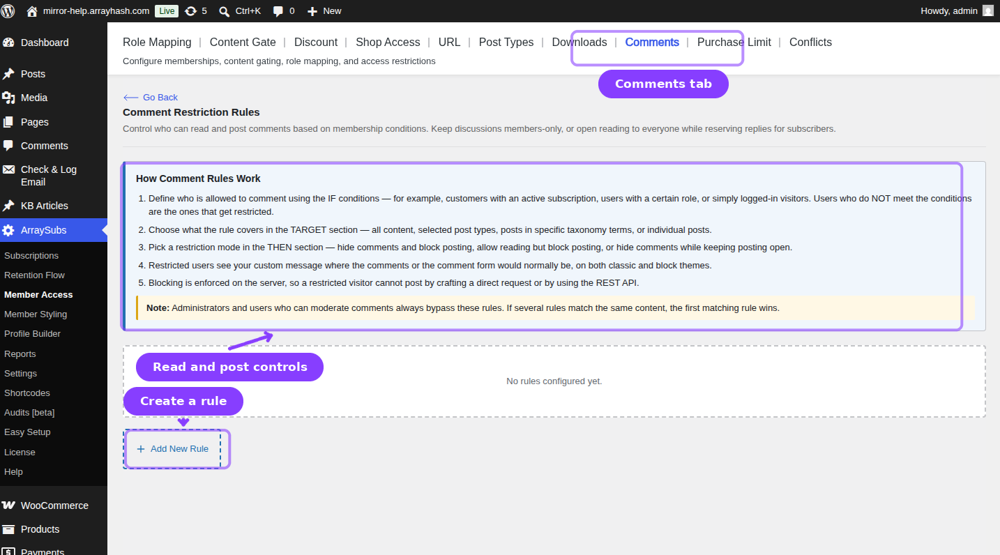
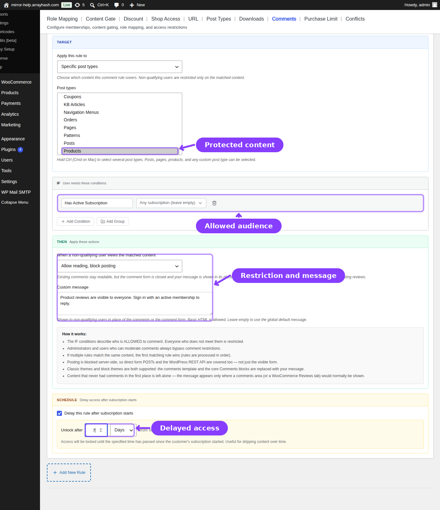

# Info
- Module: Member Access
- Submodule: Comments
- Availability: Free
- Last updated: 2026-07-22

# Comment Restrictions

> Control who can read existing comments and who can post new comments on selected content.

**Availability:** Free / ArraySubs core.

## Page Navigation

- **Current guide:** Comments
- **Where to open it:** WordPress Admin -> ArraySubs -> Member Access -> Comments
- **Direct route:** `/wp-admin/admin.php?page=arraysubs-mainadmin#/members-access/comment-rules`
- **Previous guide:** [Downloads](downloads.md)
- **Next guide:** [Purchase Limit](purchase-limit.md)
- **Parent guide:** [Member Access](README.md)

## Overview



Comment rules combine a content target, member conditions, and one restriction mode. They can hide existing discussion, prevent new submissions, or do both. The protection is enforced in rendered templates and on direct requests, including WordPress REST requests and WooCommerce product reviews.

Use comment restrictions to:

- Keep member discussions private on subscription content.
- Let visitors read a discussion while reserving replies for members.
- Hide old comments while leaving the comment form available.
- Target all content, selected post types, taxonomy terms, or individual entries.

## How Rules Are Evaluated

1. ArraySubs reads enabled rules from top to bottom.
2. A rule is considered only when the current post matches its target.
3. The rule's IF conditions determine who is allowed.
4. The first targeted rule that the visitor does **not** qualify for supplies the restriction and message.
5. Users who can moderate comments, and site administrators, bypass comment restrictions.

```box class="warning-box"
Rule order matters. Put the narrowest or most important target above broader rules when the same content could match several entries.
```

## Create a Comment Rule



1. Open **ArraySubs -> Member Access -> Comments**.
2. Confirm **Enable comment restrictions** is on.
3. Click **Add New Rule** and enter an internal rule name.
4. Choose the content to protect in **TARGET**.
5. Build the eligible audience in **IF** with conditions and nested groups.
6. Select a **Restriction mode**.
7. Enter the message shown to a visitor whose access is restricted.
8. Optionally configure a subscription-based schedule delay.
9. Click **Save Rules**.

## Target Options

| Target | Additional Controls | Result |
|---|---|---|
| **All content** | None | Applies to every supported singular post |
| **Specific post types** | Multi-select one or more public post types | Applies to entries in the selected types |
| **By taxonomy term** | Choose a taxonomy, then search for terms | Applies when the entry has a selected term |
| **Specific posts** | Choose a post type, then search for entries | Applies only to the selected posts, pages, products, or custom entries |

Taxonomy and entry selectors load results on demand. Start typing to search instead of expecting the full site catalog to be preloaded.

## Audience Conditions

The Comments tab uses the shared Member Access condition builder. It includes lifetime spend, purchased products or variations, purchased categories/tags, active subscription, subscription variation, login status, negative subscription and negative variation checks, Feature Manager values *(Pro)*, and WordPress roles.

- Conditions in one row/group can be combined with AND or OR.
- **Add Group** creates nested logic for more precise audiences.
- An empty IF section qualifies everyone, so it does not restrict any visitor by itself.

See [Member Access condition types](README.md#condition-types) for the full reference.

## Restriction Modes

| Mode | Existing Comments | Comment Form / Submission |
|---|---|---|
| **Hide comments + block posting** | Hidden | Blocked |
| **Allow reading, block posting** | Visible | Blocked |
| **Hide comments, allow posting** | Hidden | Available |

The configured message is used where the active restriction can show explanatory feedback. Keep it concise and tell the visitor what membership or login step unlocks access.

## Where Enforcement Applies

ArraySubs protects more than the visible comment form:

- Classic WordPress comment templates and comment counts.
- WordPress comment blocks.
- WooCommerce product review tabs and review submission.
- Direct `wp-comments-post.php` submissions.
- WordPress REST comment creation.

This prevents a visitor from bypassing a blocked form by sending the same request directly.

## Scheduling

Enable the schedule when comment access should begin only after a matching subscription has been active for a number of days, weeks, or months. The visitor must satisfy the IF conditions and the delay. If no qualifying subscription provides a start date, the scheduled rule cannot unlock access.

## Rule Management

- Drag or use **Move up / Move down** to set evaluation priority.
- Use **Duplicate** to create a similar target or audience.
- Toggle a rule off to pause it without deleting its settings.
- Delete unwanted rules, then save the page to persist the removal.

## Practical Examples

### Members can read and reply

Target the member-only post category, add **Has Active Subscription**, and choose **Hide comments + block posting**. Qualifying subscribers use comments normally; everyone else sees neither the discussion nor a working submission path.

### Public discussion, member-only replies

Target the relevant content, use **Has Active Subscription**, and choose **Allow reading, block posting**.

### Require login before commenting

Set **User Login Status** to **Logged in** and choose **Allow reading, block posting**. Logged-out visitors can read the thread but cannot submit a comment.

## Troubleshooting

| Symptom | Check |
|---|---|
| Rule does not affect a page | Confirm the post type, taxonomy term, or specific entry matches the TARGET section |
| Comments are still visible | Check the restriction mode and whether the current account has comment-moderation capability |
| A member is restricted unexpectedly | Review rule order and all IF groups, including negative subscription conditions |
| Scheduled access never starts | Verify a qualifying subscription exists and has a usable start date |
| Product reviews remain available | Confirm the product or product taxonomy is included in the rule target |

## Related Guides

- [Member Access](README.md) — Shared conditions and all access-rule tabs.
- [Purchase Limit](purchase-limit.md) — Restrict cart quantities instead of comments.
- [Content Gate](content-gate.md) — Protect the main page content itself.

## FAQ

### Does hiding comments delete them?
No. The comments remain stored; the rule only changes reading and submission behavior for visitors who do not qualify.

### Can a rule protect product reviews?
Yes. WooCommerce product reviews use the WordPress comment system and are covered when the product matches the rule.

### Can administrators still moderate comments?
Yes. Administrators and users with comment-moderation capability bypass these restrictions.

### What happens when several rules target the same post?
ArraySubs processes them in order. The first targeted rule whose IF conditions the visitor fails determines the restriction.
