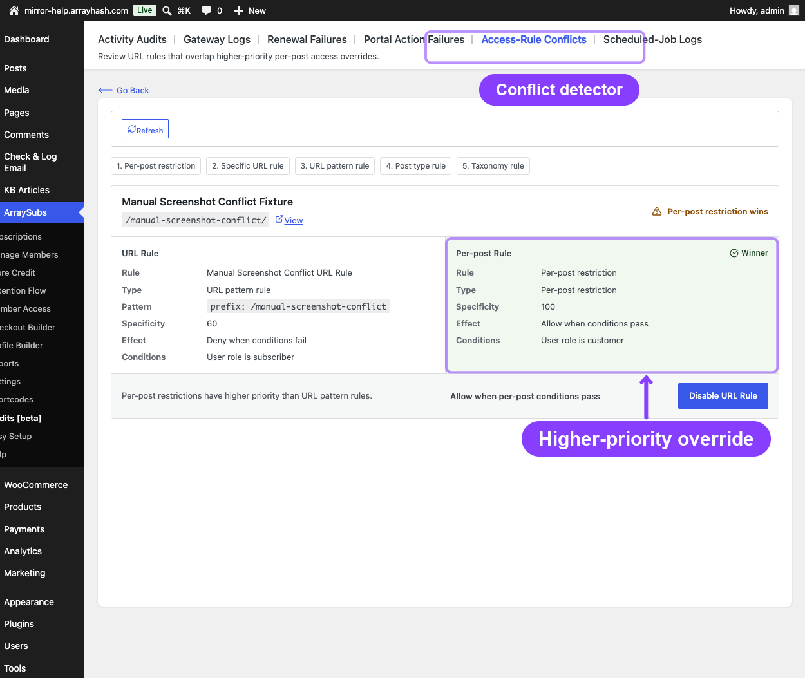
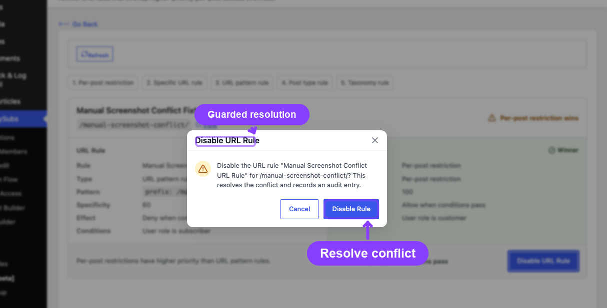

# Info
- Module: Conflicts
- Availability: Free + Pro
- Last updated: 2026-06-27

# Conflicts

> Review URL rules that overlap higher-priority per-post access overrides.

**Availability:** Free + Pro

## Page Navigation

- **Current guide:** Conflicts
- **Where to open it:** WordPress Admin -> ArraySubs -> Member Access -> Conflicts
- **Direct route:** `/wp-admin/admin.php?page=arraysubs-mainadmin#/members-access/conflicts`
- **Section overview:** [Member Access](./README.md)
- **Previous guide:** [Downloads](./downloads.md)
- **Next guide:** [Login Limit](./login-limit.md)
- **Troubleshooting:** [Audits, Logs, and Troubleshooting](../audits-and-logs/README.md)

## Overview

The **Conflicts** tab is the Member Access screen for reviewing rule overlaps that would otherwise create confusing access behavior. The current focus of this screen is URL rules that overlap more specific per-post overrides.

Inside the plugin, this page uses the title **Access-Rule Conflicts** while the Member Access tab label is **Conflicts**.

## What This Screen Helps You Resolve

- A broad URL rule protects a path, but one post inside that path has its own per-post access override.
- A page should follow its explicit post-level restriction, but a URL rule is also catching it.
- You need to confirm which rule is more specific before deciding what to disable or rewrite.

## How to Use the Conflicts Tab

1. Open **ArraySubs -> Member Access -> Conflicts**.
2. Review the target content listed by the screen.
3. Compare the **URL Rule** panel with the **Per-post Rule** panel.
4. Decide which rule should remain authoritative.
5. Disable the URL rule from this workflow if the per-post rule should win.

## Current Scope

This tab is not a full "all rule conflicts everywhere" debugger. It is specifically designed to surface:

- URL-rule overlap
- Higher-priority per-post overrides

For broader debugging of logic, AND/OR conditions, pause-state behavior, or non-URL access problems, use the longer troubleshooting guide below.

## Related Guides

- [Access-Rule Conflicts](../audits-and-logs/access-rule-conflicts.md) — Full troubleshooting guide for conflict scenarios and evaluation logic.
- [URL](url.md) — The rule type most commonly reviewed from this screen.
- [Post Types](post-types.md) — Broad content gating that can interact with more specific overrides.

## FAQ

### Does this page show every possible Member Access conflict?
No. Its current focus is URL-rule overlap with per-post overrides.

### Can I fix the conflict from this screen?
Yes, when the issue is an overlapping URL rule. The UI can disable that URL rule directly from the conflict workflow.
