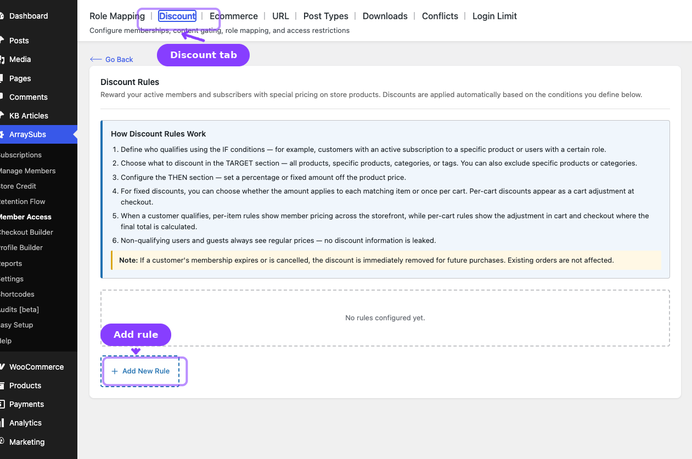
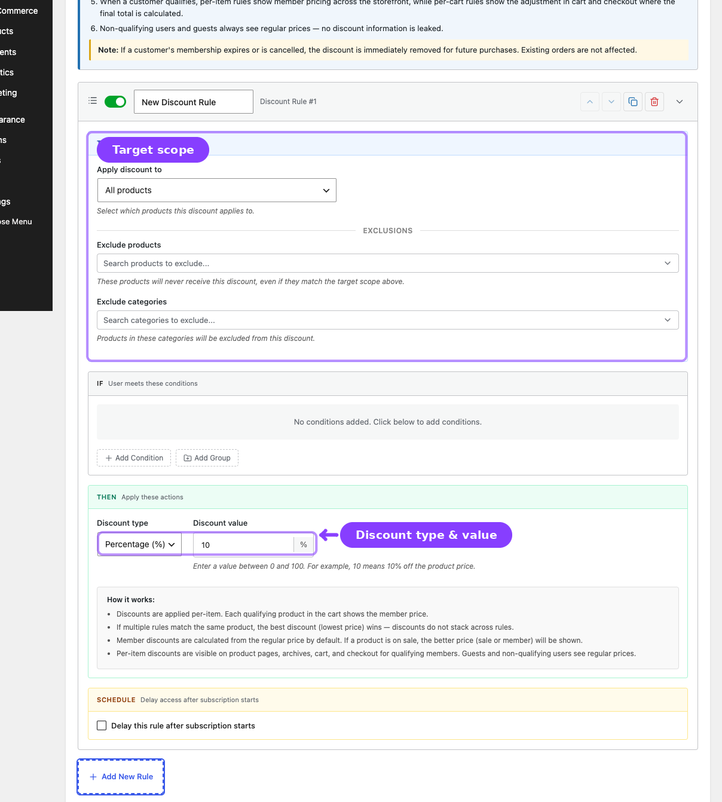
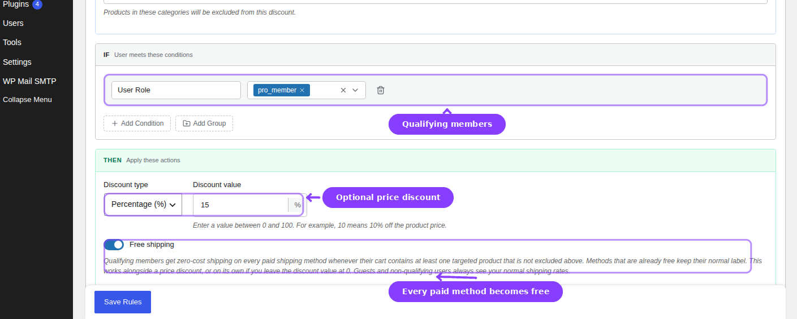

# Info
- Module: Discount
- Availability: Free
- Last updated: 2026-07-22

# Discount

> Offer member-only pricing and free shipping based on subscription conditions.

**Availability:** Free

## Page Navigation

- **Current guide:** Discount
- **Where to open it:** WordPress Admin -> ArraySubs -> Member Access -> Discount
- **Direct route:** `/wp-admin/admin.php?page=arraysubs-mainadmin#/members-access/discount-rules`
- **Section overview:** [Member Access](./README.md)
- **Previous guide:** [Content Gate](./content-gate.md)
- **Next guide:** [Shop Access](./ecommerce.md)
- **Troubleshooting:** [Audits, Logs, and Troubleshooting](../audits-and-logs/README.md)

## Overview



The **Discount** tab controls subscriber-only pricing and member shipping benefits. Inside the plugin, the screen heading is **Discount Rules** and the tab label is **Discount**.

Discount rules can:
- Apply a percentage or fixed discount
- Target all products or only selected products, categories, or tags
- Exclude products or categories from the discount
- Apply fixed discounts per item or per cart
- Make every paid shipping method free when a qualifying cart contains a targeted product
- Use the same condition builder as the rest of Member Access

## How Discount Rules Work

1. Define who qualifies in the **IF** section.
2. Choose the discount target in the **TARGET** section.
3. Configure the discount type, value, and optional free-shipping benefit in the **THEN** section.
4. If multiple per-item discount rules match, the best price wins.
5. If a customer no longer qualifies, the discount stops applying to future purchases.

## Configuring a Discount Rule



1. Go to **ArraySubs -> Member Access -> Discount**.
2. Click **Add New Rule**.
3. Set the **IF conditions**.
4. Configure the **TARGET** section:

| Field | What It Does |
|---|---|
| **Apply discount to** | All products, specific products, specific categories, or specific tags |
| **Exclude products** | Products that should not receive the discount |
| **Exclude categories** | Categories that should not receive the discount |

5. Configure the **THEN** section:

| Field | Values | What It Does |
|---|---|---|
| **Discount Type** | Percentage or Fixed amount | Selects how the discount is calculated |
| **Discount Value** | Number | The percentage or fixed amount |
| **Apply To** | Per item or Per cart | Available for fixed-amount discounts |
| **Free shipping** | On or off | Sets every paid method in the qualifying package to zero while leaving native free methods unchanged |

6. Optionally enable a schedule if access to the discount should unlock later.
7. Click **Save Rules**.

## Member-Only Free Shipping



Turn on **Free shipping** when the same audience and product target should remove shipping charges.

- ArraySubs sets the cost and shipping taxes of every paid method in the qualifying package to zero.
- Methods that are already free remain unchanged.
- Converted methods receive the suffix **(Free for members)** so the customer can see why the cost changed.
- The benefit works during storefront, cart/checkout AJAX, and WooCommerce Store API calculations.
- A package must contain at least one product matched by the rule's TARGET and exclusions.
- You can combine free shipping with a price discount or set the discount value to `0` when shipping is the only benefit.

```box class="info-box"
The toggle does not create a new WooCommerce shipping method. It converts the currently available paid choices to zero cost for the qualifying package, so the customer can keep the delivery method they prefer.
```

## Pricing Behavior

- **Per-item discounts** change the displayed storefront price and cart calculation price.
- **Per-cart discounts** appear during cart or checkout totals and do not stack on top of existing per-item savings.
- If multiple per-item rules match, the customer gets the **lowest final price**.
- Discounts do not overwrite the product's stored WooCommerce price for everyone else.

## Compatibility Notes

- Guests do not receive member pricing.
- Existing WooCommerce sale prices are not automatically stacked with member pricing.
- WooCommerce coupons can coexist with member discounts unless custom development changes that behavior.
- Variable products are supported at the variation level.
- Shipping rules are evaluated per package; a targeted product in one package does not automatically make unrelated packages free.

## Related Guides

- [Shop Access](ecommerce.md) — Restrict who can see or buy products, not just who gets special pricing.
- [Downloads](downloads.md) — Gate downloadable resources instead of product prices.
- [Coupons](../coupons/README.md) — Coupon-specific behavior outside Member Access discounts.

## FAQ

### Do multiple member discounts stack?
No. The best qualifying discount wins.

### Can I make the discount apply only to certain products?
Yes. Use the **TARGET** section to scope by product, category, or tag and then add exclusions when needed.

### Can I offer free shipping without reducing product prices?
Yes. Enable **Free shipping** and set the discount value to `0`.

### Does this replace WooCommerce's native Free shipping method?
No. Native free methods stay available unchanged. ArraySubs also makes each otherwise-paid method free when the rule qualifies.
