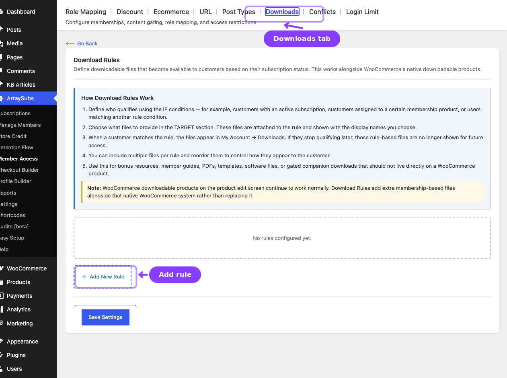
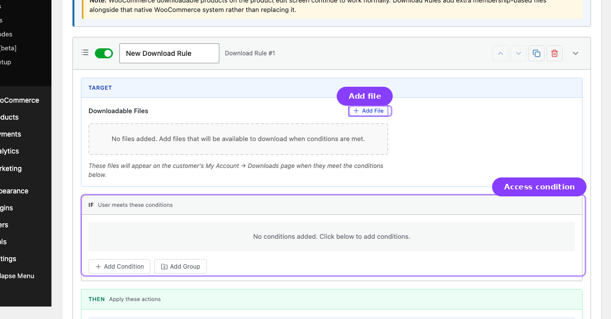

# Info
- Module: Downloads
- Availability: Free
- Last updated: 2026-06-27

# Downloads

> Provision gated downloadable files to qualifying customers through My Account.

**Availability:** Free

## Page Navigation

- **Current guide:** Downloads
- **Where to open it:** WordPress Admin -> ArraySubs -> Member Access -> Downloads
- **Direct route:** `/wp-admin/admin.php?page=arraysubs-mainadmin#/members-access/downloads-rules`
- **Section overview:** [Member Access](./README.md)
- **Previous guide:** [Post Types](./post-types.md)
- **Next guide:** [Conflicts](./conflicts.md)
- **Troubleshooting:** [Audits, Logs, and Troubleshooting](../audits-and-logs/README.md)

## Overview

The **Downloads** tab provisions membership-gated files. Inside the plugin, the content heading is **Download Rules** and the tab label is **Downloads**.

Files from these rules appear on **My Account -> Downloads** alongside normal WooCommerce downloadable product files.

## How Download Rules Work

1. Add one or more files to the rule.
2. Define who qualifies in the **IF** conditions.
3. Optionally delay availability with scheduling.
4. When the customer qualifies, the files appear in **My Account -> Downloads**.
5. If the customer stops qualifying later, those rule-based files disappear for future access.

## Configuring a Download Rule

1. Go to **ArraySubs -> Member Access -> Downloads**.
2. Click **Add New Rule**.
3. In the **TARGET** section:
   - Click **Add File**
   - Enter a display name
   - Choose the file from the Media Library
   - Repeat as needed
4. Set the **IF conditions**.
5. Optionally enable scheduling.
6. Click **Save Settings**.

## File Management

| Action | How |
|---|---|
| Add a file | Click **Add File** |
| Reorder files | Drag the handle or use the arrow buttons |
| Replace a file | Reopen the picker for that file row |
| Remove a file | Use the remove action on that row |

## Access Notes

- Downloads are served through signed or verified links rather than exposing the raw file location directly.
- External file URLs can still be used; ArraySubs redirects the qualified customer to the external asset.
- Rule-based downloads coexist with WooCommerce product downloads.

## Related Guides

- [Shop Access](ecommerce.md) — Restrict products themselves instead of provisioning extra files.
- [Customer Portal Pages](../customer-portal/portal-pages.md) — Where customers see the Downloads area.

## FAQ

### Are Download Rules the same as WooCommerce product downloads?
No. They are an additional membership-based layer that appears alongside native WooCommerce downloads.

### Can I drip-download files later in the subscription?
Yes. Use the schedule option on the rule.
