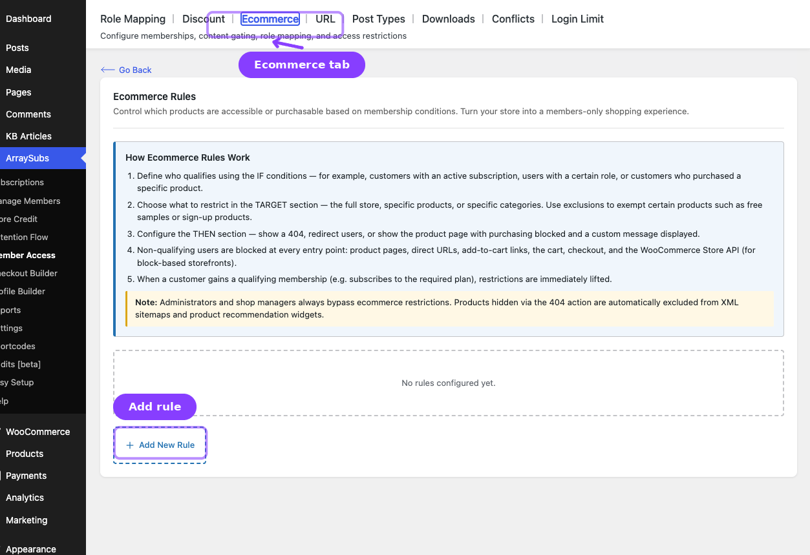
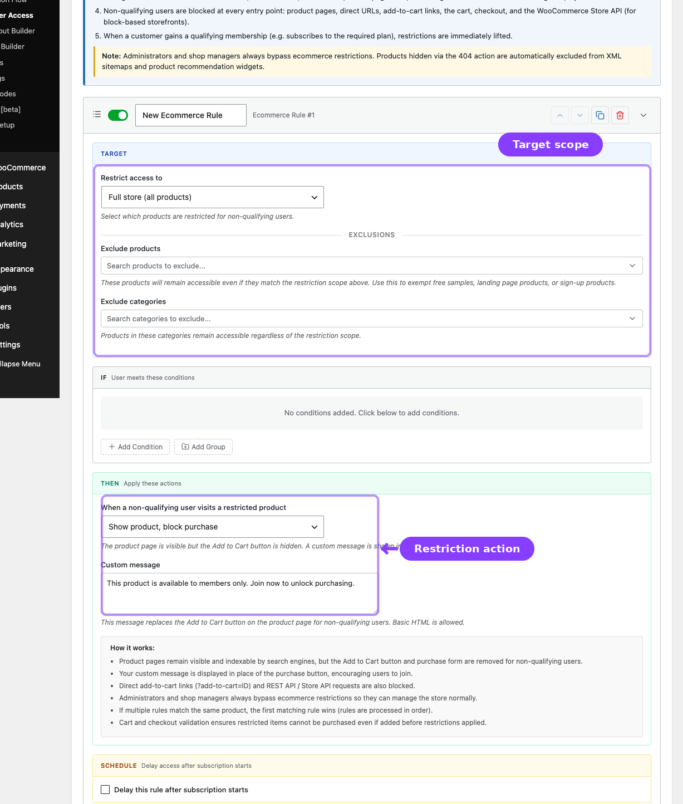

# Info
- Module: Shop Access
- Availability: Free
- Last updated: 2026-06-27

# Shop Access

> Restrict who can browse, view, or purchase products based on membership conditions.

**Availability:** Free

## Page Navigation

- **Current guide:** Shop Access
- **Where to open it:** WordPress Admin -> ArraySubs -> Member Access -> Shop Access
- **Direct route:** `/wp-admin/admin.php?page=arraysubs-mainadmin#/members-access/ecommerce-rules`
- **Section overview:** [Member Access](./README.md)
- **Previous guide:** [Discount](./discount.md)
- **Next guide:** [URL](./url.md)
- **Troubleshooting:** [Audits, Logs, and Troubleshooting](../audits-and-logs/README.md)

## Overview

The **Shop Access** tab controls storefront visibility and purchase restrictions. Inside the plugin, the screen heading is **Shop Access Rules** and the tab label is **Shop Access**.

Use this tab when:
- Only qualifying customers should see products
- Products should return 404 for non-members
- Products can be viewed but not purchased
- Non-qualifying users should be redirected to login or a pricing page

## How Shop Access Rules Work

1. Define who qualifies in the **IF** section.
2. Choose the product scope in the **TARGET** section.
3. Set the denial action in the **THEN** section.
4. ArraySubs applies the restriction across product pages, add-to-cart flows, cart validation, checkout, and supported Store API flows.
5. When the customer qualifies later, the restriction is lifted automatically.

## Configuring a Shop Access Rule

1. Go to **ArraySubs -> Member Access -> Shop Access**.
2. Click **Add New Rule**.
3. Set the **IF conditions**.
4. Configure the **TARGET** section:

| Field | What It Does |
|---|---|
| **Restrict access to** | Full store, specific products, or specific categories |
| **Exclude products** | Exceptions to the rule |
| **Exclude categories** | Category-level exceptions |

5. Set the **THEN** action:

| Action | What Happens |
|---|---|
| **Show product, block purchase** | Product remains visible but cannot be purchased |
| **Return 404 (product not found)** | Product is hidden and returns 404 |
| **Redirect to login page** | Visitor is sent to login |
| **Redirect to a specific page** | Visitor is sent to a chosen URL |

6. Add a custom message or redirect URL when required.
7. Optionally enable scheduling.
8. Click **Save Rules**.

## Action Behavior

- **Block purchase** keeps the product visible but disables or replaces the purchase action.
- **404** hides the product from direct visits, catalogs, search results, and supported sitemap outputs.
- **Redirect** sends non-qualifying visitors away on direct product access.
- ArraySubs also validates cart and checkout flows so restricted items cannot be purchased through alternate entry points.

## Related Guides

- [Discount](discount.md) — Keep products visible but offer special prices instead.
- [URL](url.md) — Restrict page paths instead of WooCommerce products.
- [Downloads](downloads.md) — Gate downloadable files shown in My Account.

## FAQ

### Should I use Shop Access or URL for products?
Use **Shop Access** for WooCommerce product behavior. It integrates more deeply with product queries, cart checks, checkout, and storefront behavior than [URL](url.md).

### Can a product stay visible but blocked from purchase?
Yes. Use **Show product, block purchase**.
