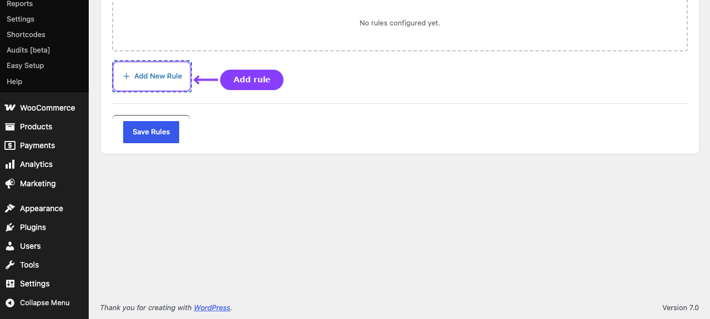
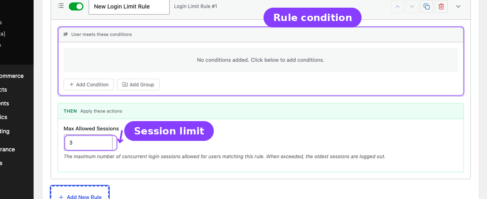

# Info
- Module: Login Limit
- Availability: Pro
- Last updated: 2026-06-27

# Login Limit

> Limit concurrent login sessions per account, set a global fallback, and create rule-based session overrides.

**Availability:** ArraySubs Pro

## Page Navigation

- **Current guide:** Login Limit
- **Where to open it:** WordPress Admin -> ArraySubs -> Member Access -> Login Limit
- **Direct route:** `/wp-admin/admin.php?page=arraysubs-mainadmin#/members-access/login-limit`
- **Section overview:** [Member Access](./README.md)
- **Previous guide:** [Conflicts](./conflicts.md)
- **Next guide:** [Checkout and Payments](../checkout-and-payments/README.md)
- **Troubleshooting:** [Audits, Logs, and Troubleshooting](../audits-and-logs/README.md)

## Overview



The **Login Limit** tab combines two layers:

1. A top settings card titled **Multi-Login Prevention**
2. A rule builder titled **Login Limit Rules**

Use this tab when different customers or plans should be allowed different numbers of concurrent sessions.

## Global Settings

The top card controls the default behavior for every user who does not match a more specific rule.

| Setting | What It Does |
|---|---|
| **Enable Multi-Login Prevention** | Turns concurrent-session enforcement on or off |
| **Default max sessions per user** | Fallback session cap |
| **Apply to administrators** | Includes admins in session enforcement |


## How Login Limit Rules Work

1. Turn on **Enable Multi-Login Prevention**.
2. Define the global fallback limit.
3. Add **Login Limit Rules** for plan-specific or condition-specific exceptions.
4. When a user matches multiple Login Limit rules, the **highest** session limit wins.
5. If a user exceeds their allowed session count, the **oldest session is destroyed** and the new login succeeds.

```box class="info-box"
Impersonated sessions from the Login as User feature are not counted and are never evicted by this system.
```

## Configuring a Login Limit Rule



1. Go to **ArraySubs -> Member Access -> Login Limit**.
2. Enable **Multi-Login Prevention**.
3. Set **Default max sessions per user**.
4. Click **Add New Rule**.
5. Set the **IF conditions**.
6. Set **Max Allowed Sessions** in the **THEN** section.
7. Click **Save Login Limits**.

## Rule Resolution

| Scenario | Effective Limit |
|---|---|
| No Login Limit rules match | Global default |
| One rule matches | That rule's limit |
| Multiple rules match | Highest matching limit |

## Customer Experience

When the account exceeds its limit:

1. The newest login succeeds.
2. The oldest session token is destroyed.
3. Older tabs or browsers are logged out on the next heartbeat or refresh.

There can be a short delay before the logged-out browser visibly redirects because WordPress heartbeat checks are periodic.

## Related Guides

- [Role Mapping](role-mapping.md) — Uses the same condition builder style for role automation.
- [Login as User](../login-as-user/README.md) — Impersonated sessions are intentionally excluded.

## FAQ

### If two rules match, which one wins?
The highest **Max Allowed Sessions** value wins.

### Does the current login fail when the limit is reached?
No. The new login succeeds and the oldest session is removed.
