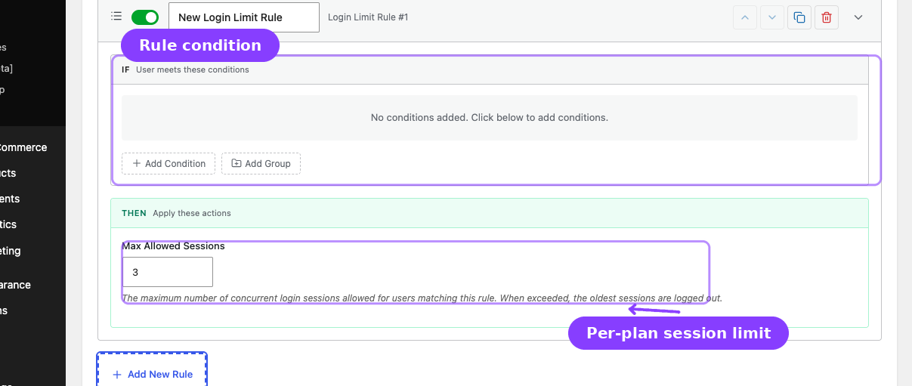

# Info
- Module: Multi-Login Prevention
- Availability: Pro
- Last updated: 2026-06-27

# Multi-Login Prevention

> Limit concurrent sessions per account, set a global fallback, and create plan-specific Login Limit rules from **Member Access -> Login Limit**.

**Availability:** ArraySubs Pro

## Page Navigation

- **Current guide:** Multi-Login Prevention
- **Where to open it:** WordPress Admin -> ArraySubs -> Member Access -> Login Limit
- **Direct route:** `/wp-admin/admin.php?page=arraysubs-mainadmin#/members-access/login-limit`
- **Section overview:** [Member Access and Restriction Rules](./README.md)
- **Previous guide:** [Session and Frontend Controls](./session-and-frontend-controls.md)
- **Next guide:** [Use Cases](./use-cases.md)
- **Troubleshooting:** [Audits, Logs, and Troubleshooting](../audits-and-logs/README.md)

## What This Tool Does

**Multi-Login Prevention** limits how many active WordPress login sessions a user account can keep at the same time. When a user logs in and the account already has the maximum allowed sessions, ArraySubs destroys the oldest session and keeps the new login active.

This discourages casual credential sharing without blocking legitimate customer logins. A customer who moves to a new browser or device can still log in; the older session is the one that gets removed.

## Where the Settings Live

The global Multi-Login Prevention settings now live at the top of **Member Access -> Login Limit**.



Use the top settings card for the global fallback:

1. Go to **ArraySubs -> Member Access -> Login Limit**.
2. Turn on **Enable Multi-Login Prevention**.
3. Set **Default max sessions per user**.
4. Decide whether to turn on **Apply to administrators**.
5. Add Login Limit rules below the settings card when specific subscription plans, roles, or customer groups need different limits.
6. Click **Save Login Limits**.

```box class="info-box"
The Login Limit tab appears when ArraySubs Pro's Multi-Login Prevention module is available. You do not need to enable the feature somewhere else first. Use this tab to turn it on, set the global default, and configure rule overrides.
```

## Settings Reference

| Setting | Default | Type | What It Does |
|---|---|---|---|
| **Enable Multi-Login Prevention** | Off | Toggle | Turns concurrent-session enforcement on or off. |
| **Default max sessions per user** | `1` | Number | The fallback limit for users who do not match any Login Limit rule. Minimum value is `1`. |
| **Apply to administrators** | Off | Toggle | Includes administrator accounts in session enforcement. Leave off unless you intentionally want admin sessions capped. |

## Global Default vs Login Limit Rules

The global setting is the fallback. Login Limit rules are targeted overrides.

| Need | Configure |
|---|---|
| Same limit for every customer | Enable Multi-Login Prevention and set **Default max sessions per user**. |
| Different limits by plan, role, product, or condition | Create Login Limit rules below the global settings card. |
| A higher team or enterprise limit | Create a rule whose IF conditions match the team or enterprise plan, then set a higher **Max Allowed Sessions** value. |
| Administrator session caps | Turn on **Apply to administrators**. |

## How Login Limit Rules Work

Login Limit rules use the same condition builder as the rest of Member Access. Each rule asks, "Who qualifies for this session limit?"

1. When a user logs in, the system checks whether Multi-Login Prevention is enabled.
2. It evaluates all enabled Login Limit rules against that user.
3. If one or more rules match, ArraySubs uses the highest **Max Allowed Sessions** value from the matching rules.
4. If no rules match, ArraySubs uses **Default max sessions per user**.
5. If the user now has more sessions than allowed, the oldest sessions are destroyed.
6. The current login always succeeds.

```box class="info-box"
When multiple Login Limit rules match, the highest session limit wins. This avoids accidentally reducing an enterprise or staff user to a lower plan's limit when they qualify for multiple conditions.
```

## Creating a Plan-Specific Session Limit

Use this when a Basic plan should allow 1 device, a Pro plan should allow 3 devices, and an Enterprise plan should allow more.

1. Open **ArraySubs -> Member Access -> Login Limit**.
2. Confirm **Enable Multi-Login Prevention** is on.
3. Set the global default to the lowest normal limit, such as `1`.
4. Click **Add New Rule**.
5. Name the rule, such as `Pro plan allows 3 sessions`.
6. In the IF section, choose a condition such as **Has Active Subscription** and select the qualifying subscription product.
7. In the THEN section, set **Max Allowed Sessions** to the number that plan should receive.
8. Repeat for other plan tiers.
9. Click **Save Login Limits**.

## Admin and Impersonation Behavior

- Administrators are exempt by default.
- Turn on **Apply to administrators** only if administrator accounts should follow the same session caps.
- Sessions created through **Login as User** impersonation are never counted toward the customer's limit.
- Impersonation sessions are also never evicted by Multi-Login Prevention.

```box class="warning-box"
Be careful when applying limits to administrators. If the default max is `1`, logging into the same admin account from a second browser or device will terminate the older admin session.
```

## What Customers Experience

When an account exceeds its session limit:

1. The new login succeeds.
2. ArraySubs removes the oldest session token for that user.
3. The older browser session becomes invalid.
4. The older browser sees the logged-out state on its next page load or heartbeat check.

There may be a short delay before the older browser visibly redirects because WordPress heartbeat checks run periodically.

## Testing Checklist

1. Open **Member Access -> Login Limit**.
2. Enable Multi-Login Prevention.
3. Set **Default max sessions per user** to `1`.
4. Save.
5. Log in as the same customer in Browser A.
6. Log in as that same customer in Browser B.
7. Return to Browser A and refresh.
8. Confirm Browser A is logged out.
9. Restore your intended production limit after testing.

## Important Notes

- The oldest session is terminated, not the newest.
- The current login always succeeds.
- Browser tabs in the same browser usually share one session token.
- WordPress "Remember Me" sessions count until they expire naturally or are evicted.
- If ArraySubs Pro is deactivated, enforcement stops. Saved Login Limit rules remain in settings and resume when Pro is active again.

## Troubleshooting

| Problem | Likely Cause | What to Do |
|---|---|---|
| Login Limit tab does not appear | ArraySubs Pro is not active or the Multi-Login Prevention module is unavailable | Install and activate ArraySubs Pro. |
| Session limits are not enforced | **Enable Multi-Login Prevention** is off | Open **Member Access -> Login Limit**, turn it on, and save. |
| Everyone receives the same limit | No Login Limit rule matches the user | Review the rule IF conditions and confirm the user qualifies. |
| A user gets a higher limit than expected | Multiple rules match and the highest value wins | Review overlapping rules and lower/remove the more permissive matching rule. |
| Admin sessions are not capped | **Apply to administrators** is off | Enable it only if admin accounts should be included. |
| Login as User sessions do not count | This is expected | Impersonated sessions are intentionally excluded from enforcement. |

## Related Guides

- [Session and Frontend Controls](session-and-frontend-controls.md) — Shortcodes, frontend visibility, and pause-state access behavior.
- [Access Rules](access-rules.md) — Condition builder concepts used by Login Limit rules.
- [Login as User](../login-as-user/README.md) — Impersonation sessions are excluded from session limits.
- [Use Cases](use-cases.md) — Real examples of plan-specific session limits.
