# Info
- Module: Per-Post Access Restriction
- Availability: Free (Plan Feature conditions require Pro)
- Last updated: 2026-09-02

# Per-Post Access Restriction

> Lock a single post, page, or custom post type entry from the editor itself — no rule builder, no URL pattern, no shortcode.

**Availability:** Free — **Plan Feature** conditions require **Pro** with Feature Manager.

## Page Navigation

- **Current guide:** Per-Post Access Restriction
- **Where to open it:** Any post, page, or CPT editor -> **Access Restriction**
- **Section overview:** [Member Access and Restriction Rules](./README.md)
- **Previous guide:** [Post Types](./post-types.md)
- **Next guide:** [Conflicts](./conflicts.md)
- **Troubleshooting:** [Audits, Logs, and Troubleshooting](../audits-and-logs/README.md)

## Overview

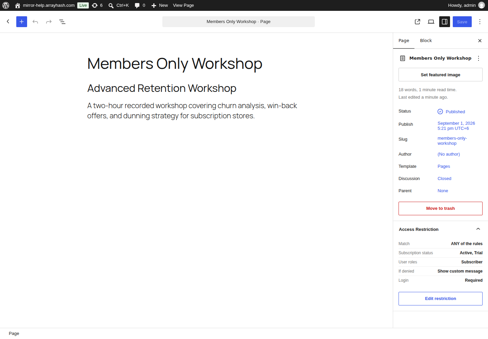

Member Access rules are designed for groups of content: an entire post type, a taxonomy, a URL pattern. **Per-Post Access Restriction** is the opposite — it protects exactly one piece of content, and you configure it while you are writing that content.

Every editable post type gets an **Access Restriction** control. The control itself only shows the current configuration as plain text plus a button. All of the fields live inside a modal, so the editor sidebar never fills up with rule inputs.

The rules are the same ones used by the **Restricted Content** Gutenberg block and the `[arraysubs_restrict]` shortcode, with one addition that only makes sense for a whole page: when a visitor is denied you can either replace the content with a message **or redirect them somewhere else**.

## When to Use This

- One page needs protecting and writing a site-wide rule for it would be overkill.
- A single post inside an otherwise public category should be members-only.
- A landing page must send non-members to your pricing page instead of showing a "denied" message.
- A specific page should exist for logged-out visitors only (for example, a signup page you do not want existing members to land on).
- You need one page to *escape* a broad Members Access rule and follow its own logic instead.

## Prerequisites

- WooCommerce installed and active
- ArraySubs installed and active
- **Member Access** enabled (it is on by default)
- Editor access to the post type you want to protect
- ArraySubs **Pro** with Feature Manager, only if you plan to use **Plan Feature** conditions

## Where the Control Appears

ArraySubs adds the control to every post type that is public and has an editing screen — posts, pages, products, and any custom post type your site registers. Where it appears depends on which editor that post type uses.

| Editor | Where to find it |
|---|---|
| **Block editor (Gutenberg)** | Right sidebar, **Post**/**Page** tab, in the **Access Restriction** panel below the standard document settings |
| **Classic editor** | Right sidebar, **ArraySubs Access Restriction** box at the bottom of the column, under the **Publish** box |

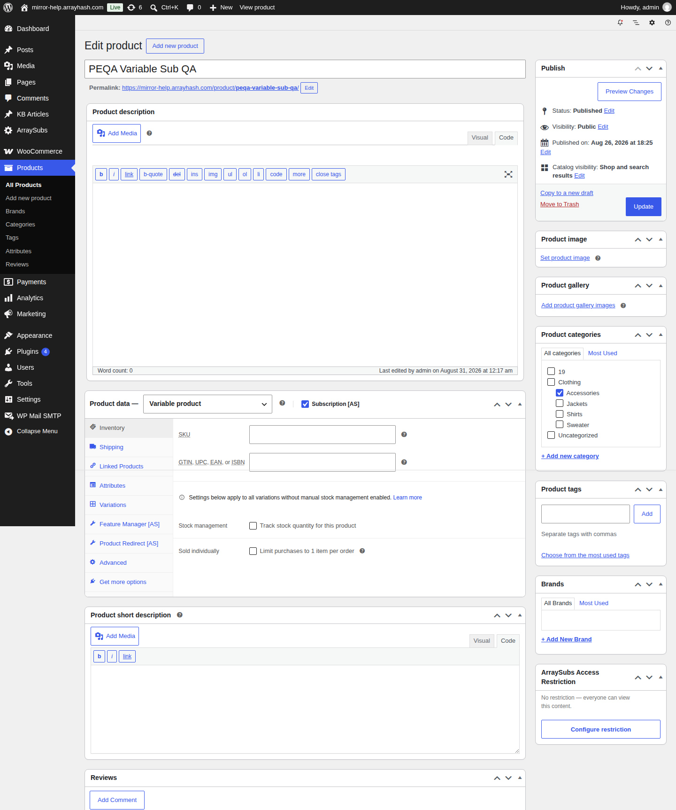

Both surfaces show the same summary and open the same configuration modal, so the instructions below apply to either editor.

```box class="info-box"
The configuration is saved with the post. In the block editor it is stored when you press **Save**/**Update**; in the classic editor it is stored when you press **Update**. Pressing **Apply** in the modal only stages the change — you still need to save the post.
```

## How It Works

1. A visitor opens the post, page, or CPT entry.
2. If **Always Show To Admins** is on and the visitor is an administrator, they see the content immediately.
3. If **Require Login** is on and the visitor is logged out, access is denied before any other rule is checked.
4. ArraySubs evaluates the access rules you configured, combining them with your chosen **Match Logic** (all rules, or any one rule).
5. If the visitor qualifies, the page renders normally.
6. If the visitor does not qualify, the denied action runs — either the content is replaced with your message, or the visitor is redirected.

A per-post restriction is evaluated **before** every Members Access rule. See [Priority Over Members Access Rules](#priority-over-members-access-rules) below.

## Steps / Configuration

1. Open the post, page, or CPT entry in the editor.
2. Find **Access Restriction** (block editor sidebar) or **ArraySubs Access Restriction** (classic sidebar).
3. Click **Configure restriction** — or **Edit restriction** if one already exists.
4. Turn on **Restrict access to this content**.
5. Choose the **Restriction Type**.
6. Choose what happens **When Access Is Denied**.
7. Configure the **Access Rules** or **Visibility** section shown for the selected restriction type.
8. Click **Apply**.
9. Save or update the post.
10. Test the published page as a logged-out visitor, a non-qualifying customer, and a qualifying member.

The modal keeps each configuration area in its own permanent section, with **When Access Is Denied** immediately after **Restriction Type**.

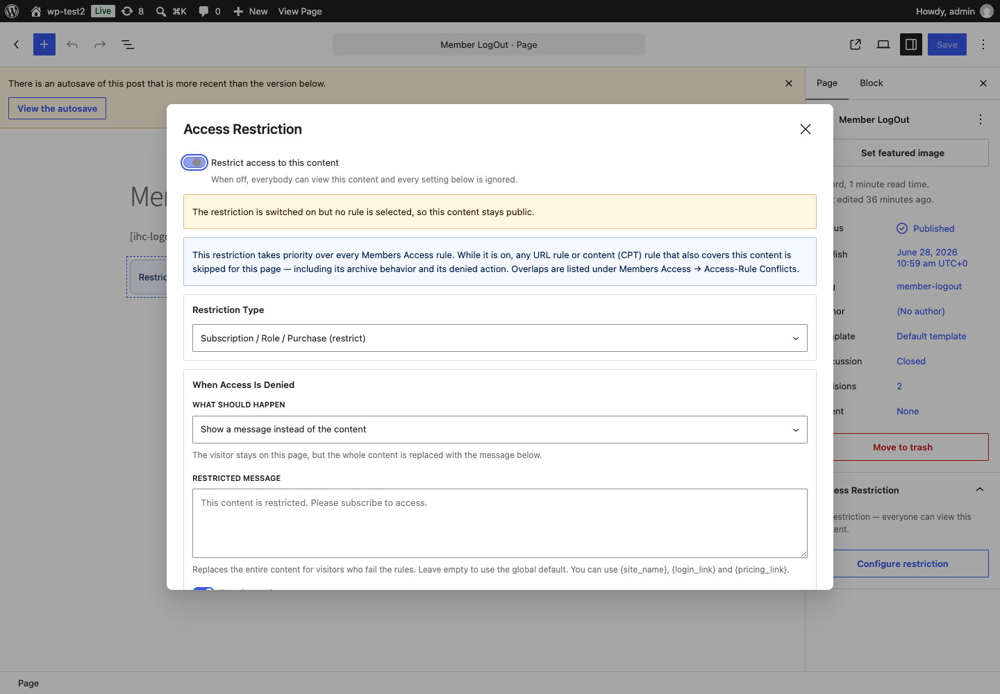

## Restriction Types

| Restriction Type | Use it for |
|---|---|
| **Subscription / Role / Purchase (restrict)** | Membership gating by subscription status, product, variation, past purchase, lifetime spend, role, or plan feature. |
| **Login state (visibility)** | Simple rules based only on whether the visitor is logged in or logged out. |

### Login State (Visibility)

Choosing **Login state (visibility)** replaces the rule inputs with a single **Show To** choice.

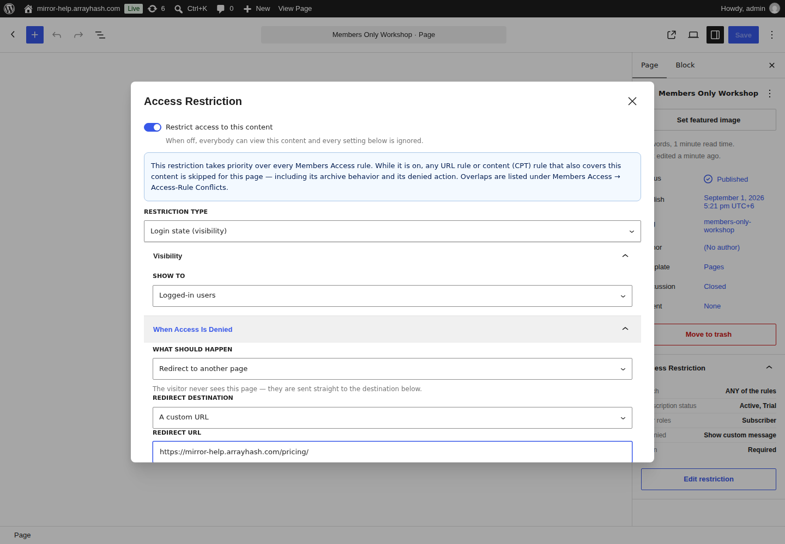

| Show To | Who sees the content |
|---|---|
| **Logged-in users** | Only signed-in visitors. Everyone else gets the denied action. |
| **Logged-out users** | Only signed-out visitors. Signed-in members get the denied action. |

**Require Login** is hidden in this mode, because the login state *is* the rule.

## Access Rules Reference

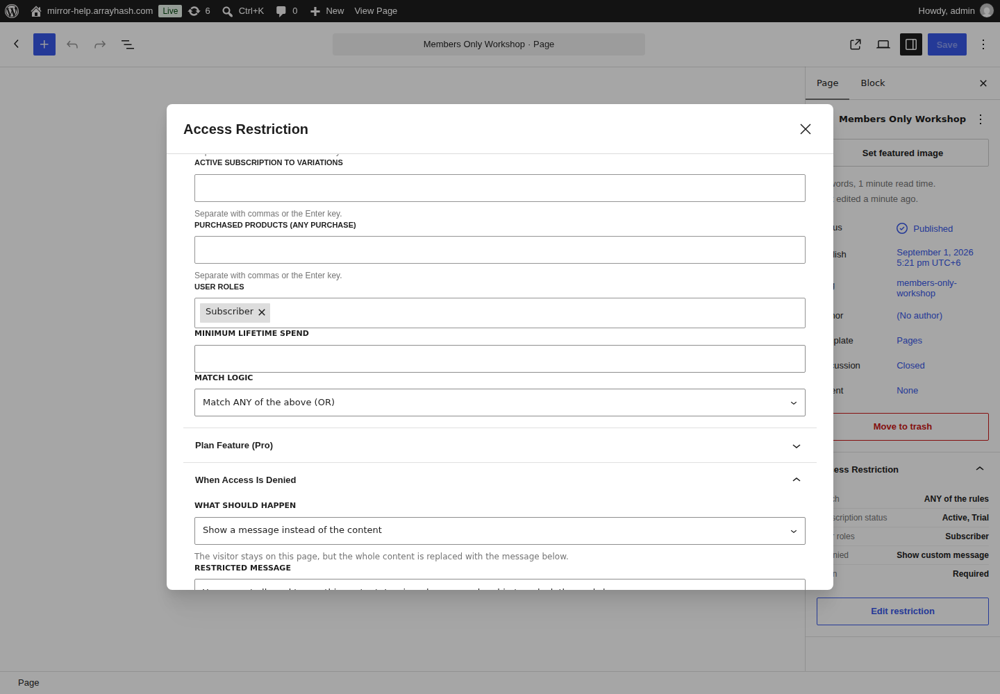

| Field | What It Checks |
|---|---|
| **Subscription Status** | The visitor holds a subscription in one of the selected statuses: Active, Trial, Paused, On Hold, Cancelled, Expired, Pending. |
| **Active Subscription To Products** | The visitor has an active or trial subscription to one of the selected subscription products. |
| **Active Subscription To Variations** | The visitor has an active or trial subscription to one of the selected subscription variations. |
| **Purchased Products (any purchase)** | The visitor has bought one of the selected products in any completed order, subscription or not. |
| **User Roles** | The visitor has one of the selected WordPress roles. |
| **Minimum Lifetime Spend** | The visitor's total completed spend reaches the amount you enter. |
| **Match Logic** | **Match ALL** requires every filled-in rule to pass. **Match ANY** grants access as soon as one rule passes. |

```box class="info-box"
The product, variation, role, and page pickers search on demand. Start typing to filter — the lists are not preloaded, so large catalogs stay fast.
```

Leave a field empty to skip that rule entirely. Only the fields you fill in are evaluated.

### Plan Feature *(Pro)*

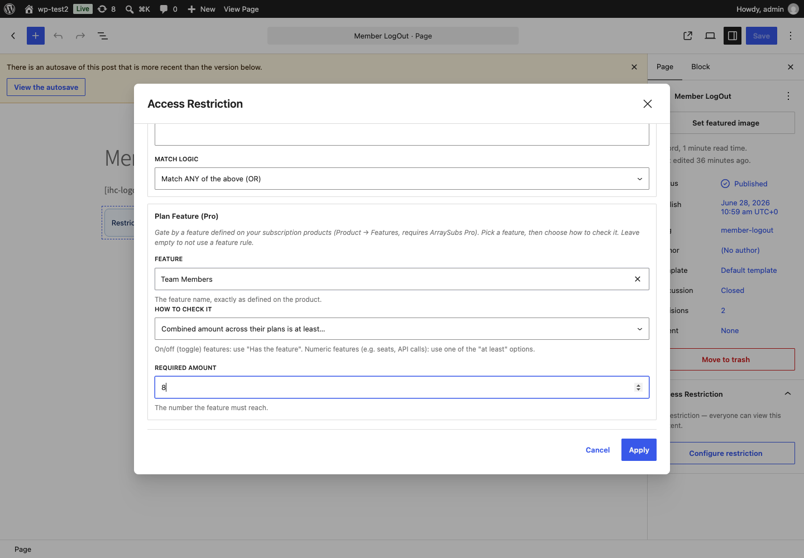

Feature gating checks entitlements defined with Feature Manager on your subscription products (**Product -> Features**). Use it when content should unlock because of what a plan *includes*, not because of which product was bought.

| How To Check It | Best for | Behavior |
|---|---|---|
| **Has the feature** | On/off toggle features | Grants access when any owned plan has the feature enabled. |
| **Combined amount across their plans is at least...** | Numeric allowances spread across several subscriptions | Adds the feature value across qualifying plans, then compares it to **Required Amount**. |
| **At least one plan provides at least...** | Numeric allowance where the strongest single plan should decide | Uses the highest single plan value. |
| **Custom comparison** | Advanced cases | Lets you pick the comparison operator and how multiple plans are combined. |

## When Access Is Denied

This is the part that per-post restrictions add on top of the block and shortcode gates. Pick one of two behaviors.

### Option 1 — Show a Message

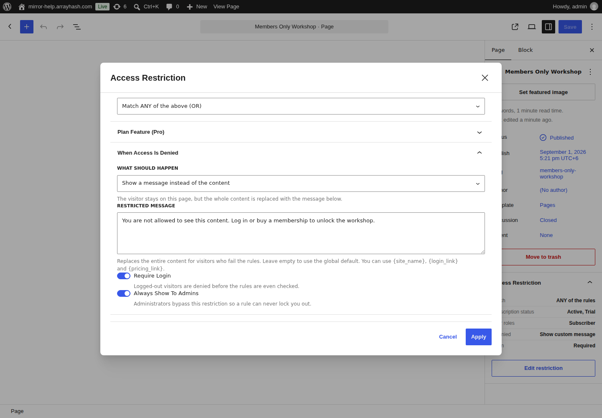

The visitor stays on the page. The title, header, footer, and comments still render, but **the whole content is replaced** with your message.

- Leave **Restricted Message** empty to fall back to the site-wide default from **Member Access** settings.
- You can use the merge tags `{site_name}`, `{login_link}`, and `{pricing_link}` inside the message.

This is what a denied visitor sees:

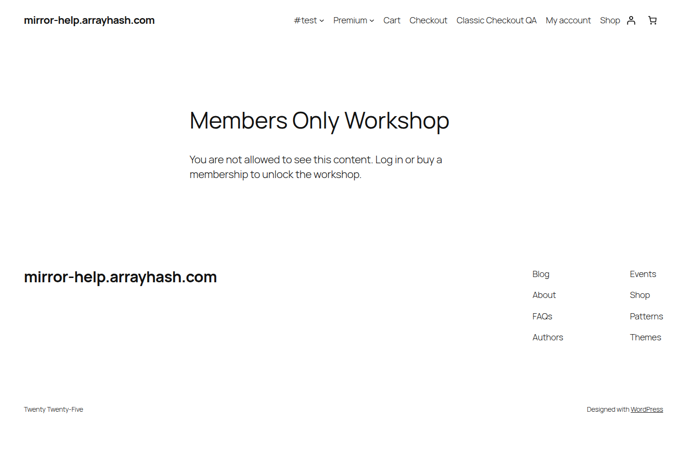

And this is the same page for a qualifying member:

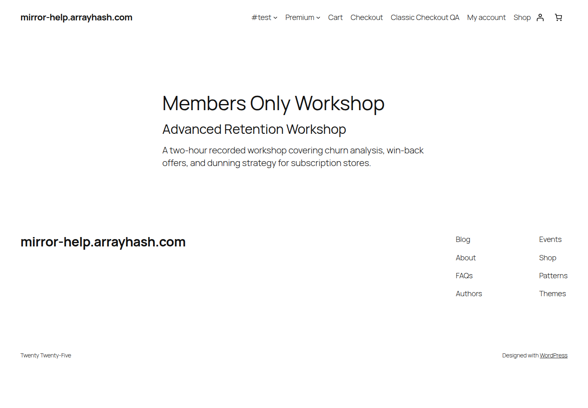

### Option 2 — Redirect to Another Page

The visitor never sees the page at all. They are sent straight to the destination before the page renders. Pick where they land:

**A page on this site** — search any published page by title and select it. Use this when the destination is part of your site, because the link keeps working even if you later change the page's slug.

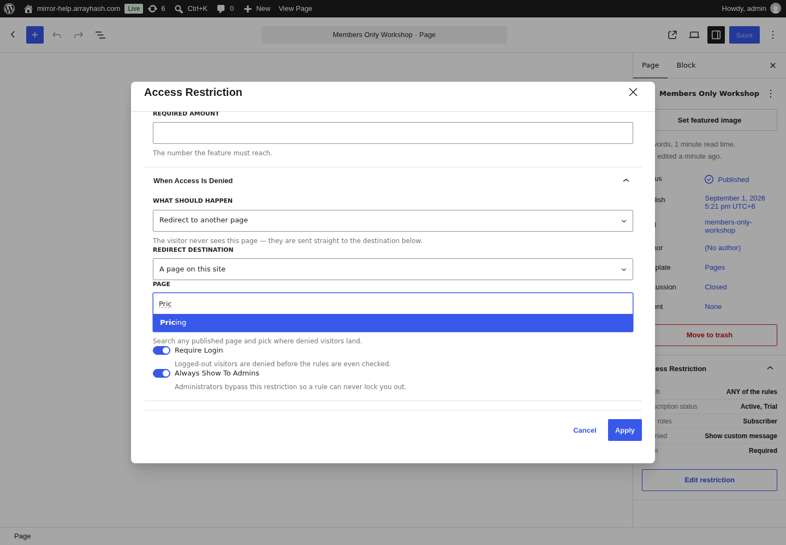

**A custom URL** — type a full address. Internal and external addresses both work. Use this for a checkout link with parameters, a marketing landing page, or a destination on another domain.

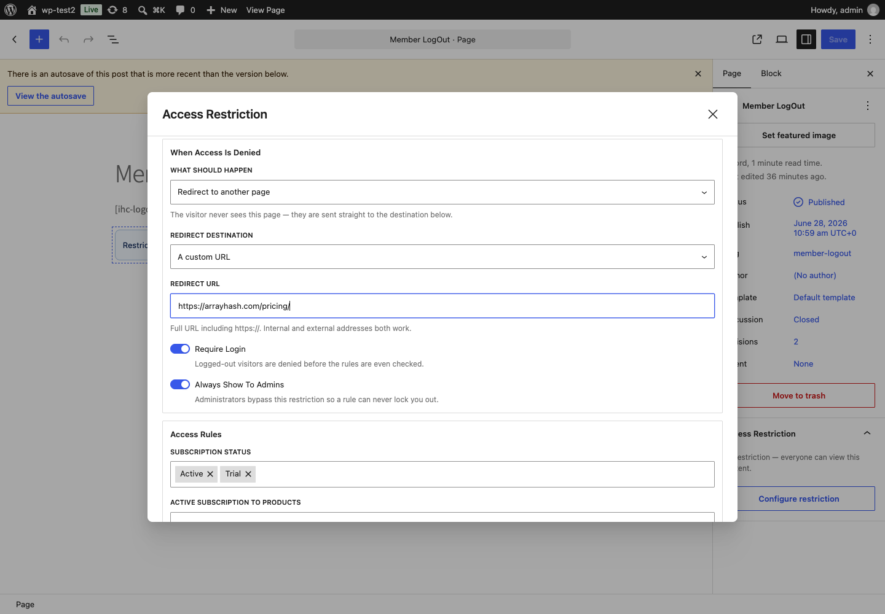

```box class="info-box"
If you choose **Redirect** but leave the destination empty, no redirect happens and the visitor sees the restricted message instead. The modal warns you when this is the case.
```

### Shared Options

| Option | What It Does |
|---|---|
| **Require Login** | Logged-out visitors are denied before the access rules are checked. Only shown in **Subscription / Role / Purchase** mode. |
| **Always Show To Admins** | Administrators bypass the restriction, so a mistaken rule can never lock you out of your own page. Turn it off when you want to test the denied experience while signed in as an administrator. |

## Reading the Summary

Once configured, the sidebar or metabox shows the whole rule in plain language — no need to open the modal to see what is protecting the page.

| Summary row | Meaning |
|---|---|
| **Match** | Whether all rules or any rule must pass. Only shown when more than one rule exists. |
| **Subscription status** / **Subscribed to** / **Purchased** / **User roles** / **Lifetime spend** / **Plan feature** | The rules currently configured. |
| **Visible to** | Shown instead of the rules when the restriction is in **Login state (visibility)** mode. |
| **If denied** | Whether the visitor gets a message or a redirect, and where the redirect points. |
| **Login** | Shown as `Required` when **Require Login** is on. |

When nothing is configured, the panel reads *"No restriction — everyone can view this content."*

## Priority Over Members Access Rules

A per-post restriction is the most specific rule on your site, so it always wins.

While a per-post restriction is switched on for a piece of content:

- Every **URL** rule that matches that content is skipped for it.
- Every **Post Types** (CPT) rule that covers that content is skipped for it — including that rule's **Archive Behavior** and its denied action.
- Only the per-post configuration decides whether the visitor gets in, and what happens if they do not.

This priority is stated directly in the editor and on both rule tabs.

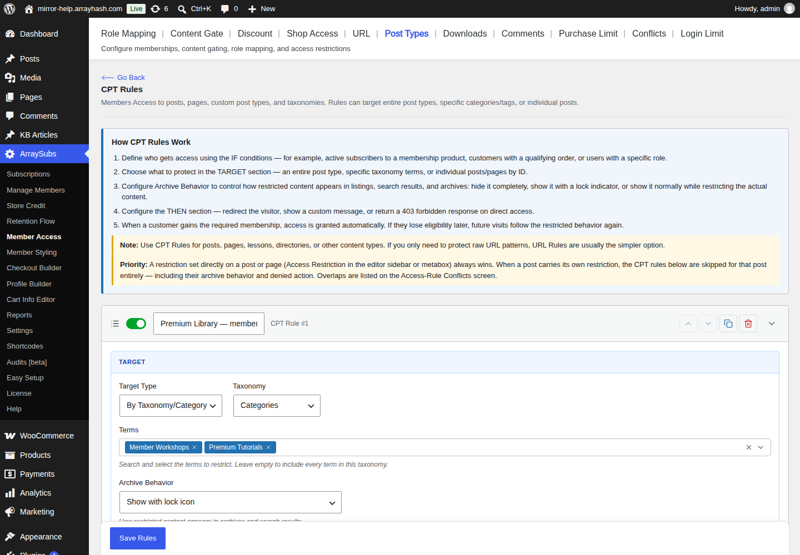

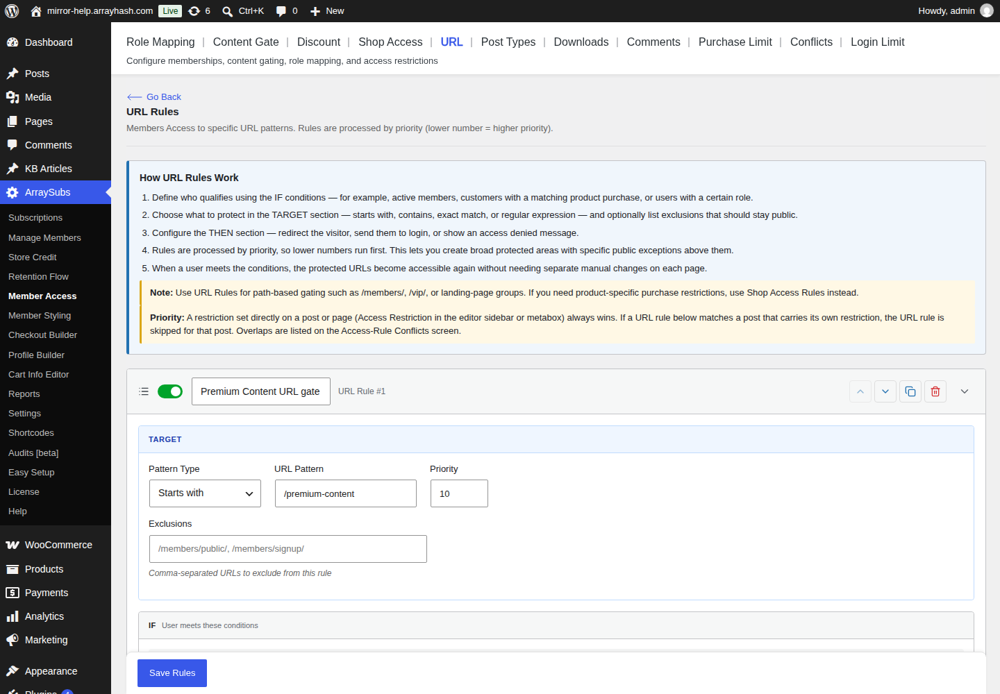

### Reviewing Overlaps

Whenever a Members Access rule covers a post that also carries its own restriction, the overlap is listed on **Member Access -> Conflicts**. Both rules are shown side by side so you can see exactly which one is being skipped.

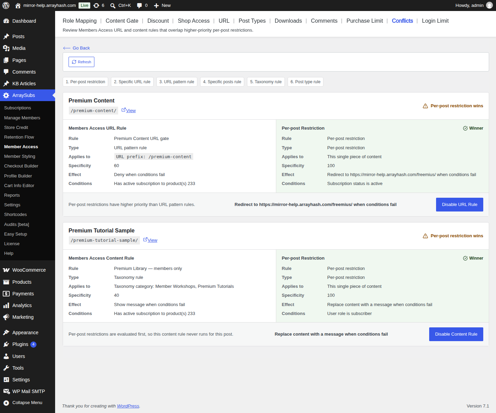

If the site-wide rule is no longer needed, you can switch it off directly from that screen. ArraySubs asks for confirmation and records an audit entry.

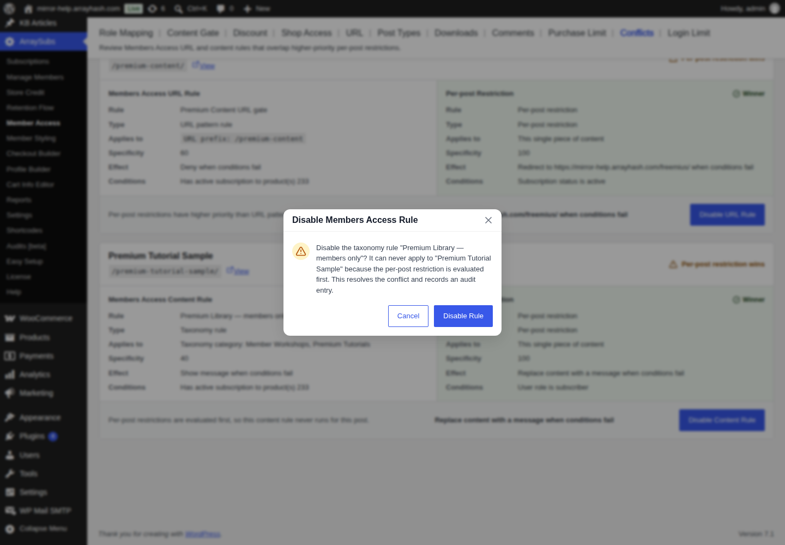

See [Conflicts](conflicts.md) for the full walkthrough.

## Real-Life Use Cases

### Use Case 1: One Members-Only Workshop Page

A course site publishes most lessons publicly but keeps one advanced workshop for members. Instead of building a taxonomy rule, the author opens the workshop page, enables the restriction, sets **Subscription Status** to Active and Trial, and writes a message inviting non-members to subscribe. Nothing else on the site changes.

### Use Case 2: Send Non-Members Straight to Pricing

A store found that a "you cannot see this" message on their flagship landing page lost sales. They switch the denied action to **Redirect**, pick their **Pricing** page, and non-qualifying visitors now land on an offer instead of a dead end.

### Use Case 3: A Signup Page for Logged-Out Visitors Only

A membership site has a signup page that confuses existing members. The author sets the page to **Login state (visibility)**, chooses **Logged-out users**, and redirects everyone else to the account dashboard.

### Use Case 4: One Exception Inside a Protected Section

A whole `/premium/` URL pattern is gated by a URL rule, but one page in that section should be open to a wider audience — for example anyone who has ever purchased, not just active subscribers. The author sets a per-post restriction on that single page. It takes priority, the URL rule stops applying there, and the overlap is listed under **Conflicts** so the team can see why.

## What Happens After Saving

- The restriction applies immediately to the published page.
- Existing subscribers who qualify keep seeing the content with no further action.
- Visitors who lose eligibility later (a cancelled subscription, a removed role) start seeing the denied behavior on their next visit.
- The **Conflicts** screen picks up any new overlap with a URL or content rule the next time it is loaded or refreshed.

## Edge Cases / Important Notes

- **Restriction enabled but no rule selected** means the content stays public. The modal shows a warning when this happens, so an accidental toggle cannot lock a page by itself.

  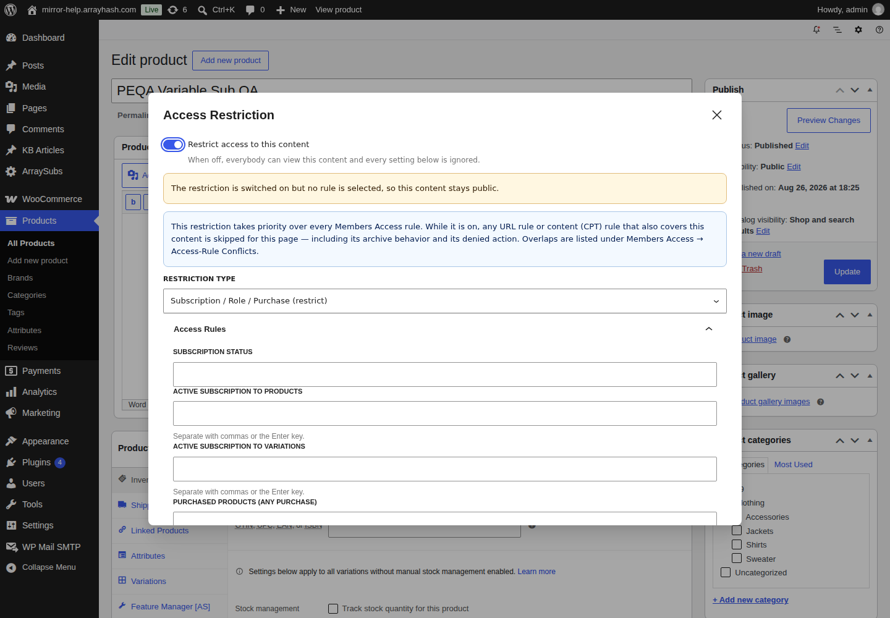

- **Redirects apply to the single view only.** A restricted page is not hidden from archives, menus, search results, or sitemaps. Use a **Post Types** rule with an archive behavior when you also need the content hidden from listings.
- **The message replaces the content, not the page.** Titles, navigation, sidebars, footers, and comments still render. Use the redirect option when the visitor should not see the page frame at all.
- **Administrators bypass the gate by default.** Turn **Always Show To Admins** off, or test in a private window, before concluding a rule does not work.
- **A redirect pointing at the same page is ignored.** ArraySubs detects the loop and falls back to showing the restricted message.
- **Full-page caching can serve one visitor's version to another.** Exclude restricted pages from full-page caching, or configure the cache to vary by login state.
- **Products can be restricted too**, but purchasing rules belong in **Shop Access**. Use a per-post restriction on a product only when you want to gate the product page itself.

## Troubleshooting

| Problem | Likely Cause | What to Do |
|---|---|---|
| Everyone can still see the page | The restriction is on but no rule is selected, or you are testing as an administrator | Add at least one rule; turn off **Always Show To Admins** or test in a private window |
| The panel or metabox is missing | The post type is not public, or Member Access is disabled | Confirm the post type is public and has an editing screen, and that Member Access is enabled |
| Changes in the modal did not stick | **Apply** was pressed but the post was never saved | Press **Apply**, then **Save**/**Update** on the post itself |
| The redirect does nothing | No destination is set, or the destination resolves to this same page | Pick a page or enter a full URL, and make sure it points somewhere else |
| A denied visitor sees the default message instead of the redirect | The redirect destination is empty | Set a destination; the modal warns you when one is missing |
| A Members Access rule seems to be ignored on one page | That page has its own per-post restriction, which wins | Open **Member Access -> Conflicts** to confirm the overlap, then keep whichever rule should be authoritative |
| Product/role/page pickers show no results | Nothing matches the search yet, or Pro is inactive for feature checks | Type part of the name to search; confirm Pro and Feature Manager are active for **Plan Feature** |
| A logged-out visitor sees stale content | Full-page cache is serving a cached copy | Exclude the page from full-page cache or vary the cache by login state |

## Related Guides

- [Post Types](post-types.md) — Gate whole post types, taxonomies, or lists of posts with archive behavior control.
- [URL](url.md) — Protect page paths and URL patterns with priority-based rules.
- [Conflicts](conflicts.md) — Review overlaps between Members Access rules and per-post restrictions.
- [Content Gate](content-gate.md) — Gate part of a page instead of the whole page, using the Gutenberg block, Elementor, a shortcode, or PHP.
- [Content Gating Shortcodes](../shortcodes/content-gating.md) — Inline gating with `[arraysubs_restrict]`.
- [Feature Manager](../feature-manager/README.md) — Define the plan features used by **Plan Feature** conditions.

## FAQ

### How is this different from the Restricted Content block?
The block protects the blocks nested inside it, so the rest of the page stays public. A per-post restriction protects the whole content of the page and can redirect the visitor away entirely. Use the block for partial gating, and a per-post restriction for whole-page gating.

### How is this different from a Post Types rule?
A Post Types rule targets many items at once — a post type, a taxonomy, or a list of posts — and can also control how those items appear in archives. A per-post restriction targets exactly one item and is configured while you edit it. When both cover the same post, the per-post restriction wins.

### Does it work on custom post types?
Yes. Every public post type with an editing screen gets the control, whether it uses the block editor or the classic editor.

### Which editor do I get — the sidebar panel or the metabox?
Whichever matches the post type. Post types that use the block editor get the sidebar panel; post types that still use the classic editor get the metabox at the bottom of the sidebar. The settings are identical.

### Does the restriction hide the page from menus, search, and archives?
No. It gates the single view. To also hide the content from listings, add a **Post Types** rule with the matching archive behavior.

### Can I redirect to a page on another site?
Yes. Choose **A custom URL** and enter the full address, including `https://`.

### What do visitors see if I set a redirect but forget the destination?
They stay on the page and see the restricted message. The modal shows a warning while the destination is empty.

### Will an administrator ever be locked out?
Not while **Always Show To Admins** is on, which is the default. Turn it off only when you want to preview the denied experience yourself.

### Do I have to save the post after configuring?
Yes. **Apply** closes the modal and updates the summary, but the configuration is stored with the post when you press **Save** or **Update**.
