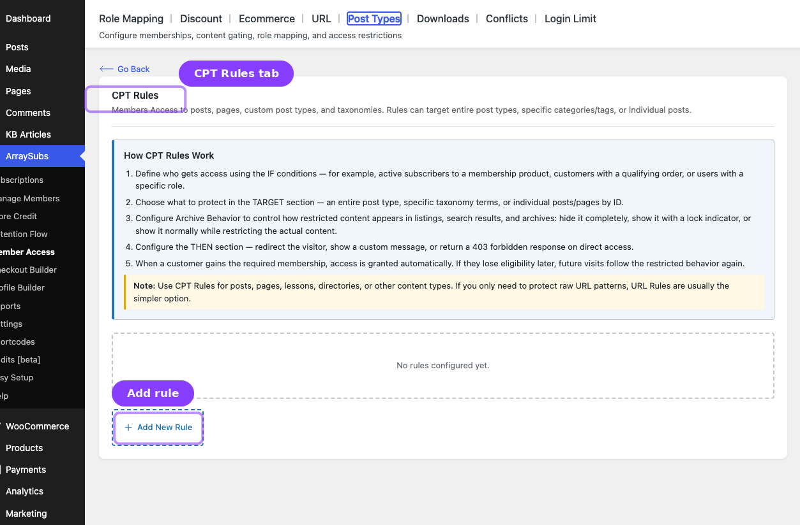
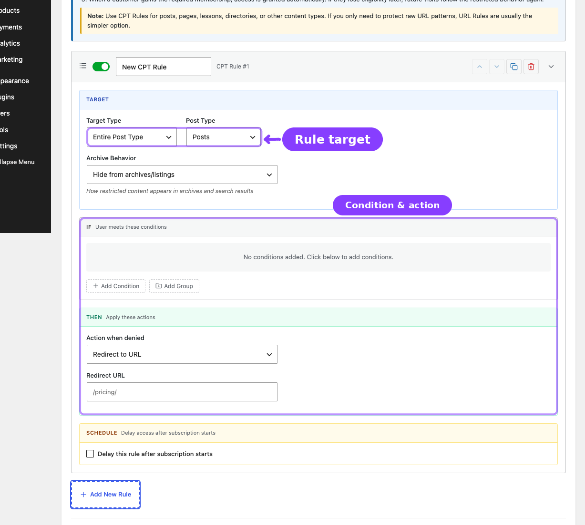

# Info
- Module: Post Types
- Availability: Free
- Last updated: 2026-06-27

# Post Types

> Gate posts, pages, and custom post types with archive behavior and per-target access control.

**Availability:** Free

## Page Navigation

- **Current guide:** Post Types
- **Where to open it:** WordPress Admin -> ArraySubs -> Member Access -> Post Types
- **Direct route:** `/wp-admin/admin.php?page=arraysubs-mainadmin#/members-access/cpt-rules`
- **Section overview:** [Member Access](./README.md)
- **Previous guide:** [URL](./url.md)
- **Next guide:** [Downloads](./downloads.md)
- **Troubleshooting:** [Audits, Logs, and Troubleshooting](../audits-and-logs/README.md)

## Overview

The **Post Types** tab protects posts, pages, and custom post types. Inside the plugin, the content heading is **CPT Rules**, but the tab label shown in the Member Access UI is **Post Types**.

Use this tab when:
- Entire content types should be restricted
- Only certain taxonomy terms should be protected
- Specific posts or pages need direct targeting
- Archive/listing behavior should be controlled separately from single-item access

## How Post Types Rules Work

When a visitor loads content, ArraySubs evaluates the matching Post Types rules and any higher-priority per-post restriction meta on that content.

Supported target modes:

| Target Type | What It Restricts |
|---|---|
| **Entire Post Type** | Every item in a post type |
| **By Taxonomy/Category** | Items in selected terms |
| **Specific Posts/Pages** | Hand-picked items by ID |

## Configuring a Post Types Rule

1. Go to **ArraySubs -> Member Access -> Post Types**.
2. Click **Add New Rule**.
3. Configure the **TARGET** section:

| Field | What It Does |
|---|---|
| **Target Type** | Entire Post Type, By Taxonomy/Category, or Specific Posts/Pages |
| **Post Type** | Which post type is affected |
| **Taxonomy** | Which taxonomy to filter by |
| **Terms** | Which terms are protected |
| **Posts/Pages** | Specific posts or pages to target |

4. Set the **IF conditions**.
5. Set the **THEN** action.
6. Configure **Archive Behavior**.
7. Optionally enable scheduling.
8. Click **Save Rules**.

## Archive Behavior

| Behavior | Effect |
|---|---|
| **Hide from archives/listings** | Restricted items disappear from archives and search-style listings |
| **Show with lock icon** | Items stay visible in listings but signal that access is restricted |
| **Show normally (restrict content only)** | Listings stay normal; restriction happens on the single content view |

## Per-Post Restrictions

Per-post restriction meta has higher priority than broad Post Types rules. If a single post has its own restriction enabled, that per-post rule wins for that post. That includes the per-post enabled flag, custom conditions, and custom denied message stored directly on the content.

## Related Guides

- [URL](url.md) — Protect path patterns instead of post content structures.
- [Content Gate](content-gate.md) — Use when only part of the page should be protected instead of the whole post.
- [Conflicts](conflicts.md) — Review overlaps between URL rules and more specific post-level overrides.

## FAQ

### What is the difference between Post Types and Content Gate?
Use **Post Types** when the whole content object should be governed by ArraySubs rules. Use [Content Gate](content-gate.md) when only part of the page should be protected.

### Can I keep posts visible in archives but restrict the content?
Yes. Use **Show normally (restrict content only)**.
