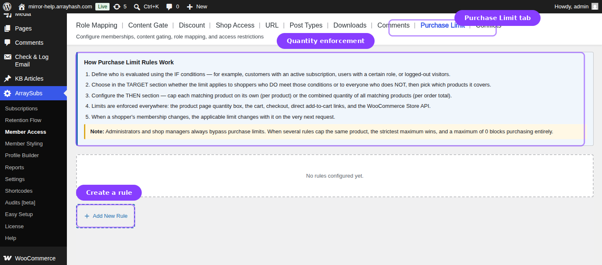
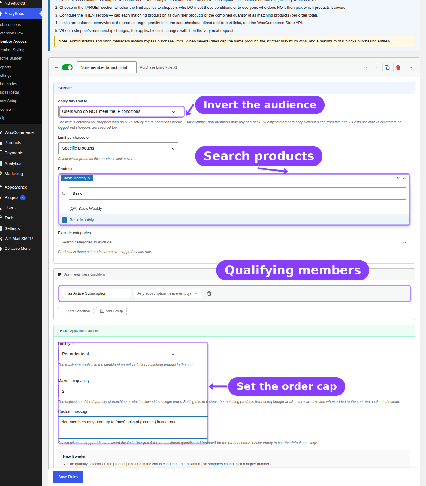

# Info
- Module: Member Access
- Submodule: Purchase Limit
- Availability: Free
- Last updated: 2026-07-22

# Purchase Limits

> Set maximum product quantities for matching members or for everyone who does not meet a membership rule.

**Availability:** Free / ArraySubs core.

## Page Navigation

- **Current guide:** Purchase Limit
- **Where to open it:** WordPress Admin -> ArraySubs -> Member Access -> Purchase Limit
- **Direct route:** `/wp-admin/admin.php?page=arraysubs-mainadmin#/members-access/purchase-limit-rules`
- **Previous guide:** [Comments](comments.md)
- **Next guide:** [Conflicts](conflicts.md)
- **Parent guide:** [Member Access](README.md)

## Overview



Purchase Limit rules cap quantities before an order can be placed. A rule can limit each targeted product independently or limit the combined quantity of all targeted products in the order. Limits are enforced across product pages, add-to-cart requests, cart updates, checkout, direct URLs, and the WooCommerce Store API.

Common uses include:

- Give members a higher per-product allowance than guests.
- Limit a scarce product to one unit per order.
- Cap the combined quantity from a product category.
- Set a limit of `0` to prevent an audience from purchasing matched items.
- Apply a restriction to qualifying members or invert it for non-qualifying visitors.

## How Rules Are Evaluated

1. ArraySubs determines whether the current visitor meets each enabled rule's IF conditions.
2. **Users who meet IF** applies the limit to the qualifying audience; **Users who do NOT meet IF** applies it to everyone else.
3. The product is compared with the rule target and exclusions.
4. If several per-product rules apply, the lowest maximum is enforced.
5. Per-order rules count all targeted cart lines together.
6. Administrators and shop managers bypass purchase limits while managing the store.

Variable-product targeting uses the parent product for scope checks, while variation quantities still contribute to the enforced cart total.

## Create a Purchase Limit Rule



1. Open **ArraySubs -> Member Access -> Purchase Limit**.
2. Confirm **Enable purchase limits** is on.
3. Click **Add New Rule** and enter a descriptive internal name.
4. Choose whether the rule applies to users who **meet** or **do not meet** the IF conditions.
5. Configure **TARGET** and any exclusions.
6. Build the audience in **IF** with conditions or nested groups.
7. Select **Per product** or **Per order total**.
8. Enter the maximum allowed quantity. Use `0` to block purchasing the matched scope.
9. Optionally write a custom message using the placeholders below.
10. Optionally configure a subscription-based schedule delay.
11. Click **Save Rules**.

## Audience Direction

| Option | Who Receives the Limit |
|---|---|
| **Users who DO meet the IF conditions** | The members, roles, shoppers, or guests described by IF |
| **Users who do NOT meet the IF conditions** | Everyone outside the audience described by IF |

This inversion avoids maintaining separate rules for members and non-members. For example, use **Has Active Subscription** with **Users who do NOT meet IF** to restrict guests and expired members while leaving active subscribers unrestricted.

## Target Options

| Target | Additional Controls | Result |
|---|---|---|
| **All products** | Optional product and category exclusions | Every purchasable product except exclusions |
| **Specific products** | Searchable product selector; optional exclusions | Only selected products |
| **Product categories** | Searchable category selector; optional exclusions | Products assigned to selected categories |
| **Product tags** | Searchable tag selector; optional exclusions | Products assigned to selected tags |

### Exclusions

- **Exclude products** always removes specific products from the rule.
- **Exclude categories** removes every product in those categories.
- A product matching both a target and an exclusion is excluded.
- Search fields load matching products or terms on demand rather than preloading the catalog.

## Audience Conditions

Purchase Limits uses the shared Member Access builder: lifetime purchase amount, purchased product/variation, purchased category/tag, active subscription, subscription variation, login status, has-not-subscription checks, Feature Value *(Pro)*, and role.

An empty IF section matches everyone. Its result still passes through the selected audience direction: **Users who meet IF** affects everyone, while **Users who do NOT meet IF** affects no one.

## Limit Types

### Per Product

The maximum applies independently to each matched product. If the maximum is `2`, a shopper may buy two units of Product A and two units of Product B when both are targeted.

When several per-product rules match, ArraySubs applies the strictest (lowest) maximum for that product.

### Per Order Total

The maximum applies to the sum of all targeted cart quantities. If the maximum is `2`, two units of Product A leave no allowance for Product B under the same rule.

Per-order checks are re-evaluated whenever the cart changes and again during checkout.

## Custom Messages

Write the message that shoppers see when a quantity is reduced or blocked. These placeholders are available:

| Placeholder | Replaced With |
|---|---|
| `{max}` | The maximum quantity allowed by the active rule |
| `{product}` | The affected product name |

Example:

```text
Members may purchase up to {max} units of {product} per order.
```

## Enforcement Coverage

Purchase Limits adjusts or blocks the same quantity across:

- Product-page quantity and purchasability controls.
- Standard and direct-URL add-to-cart requests.
- Cart quantity updates.
- Checkout validation.
- WooCommerce Store API and block-based cart requests.

Because validation also runs server-side, hiding or changing a browser field does not bypass a limit.

## Scheduling

Enable the schedule when a limit should begin only after a qualifying subscription has been active for a specified number of days, weeks, or months. The IF audience must provide a usable subscription start date. A scheduled rule without qualifying subscription timing does not activate.

## Rule Management

- Put important rules in a clear order with **Move up / Move down**.
- Use **Duplicate** for a second audience direction, target, or maximum.
- Toggle a rule off to test or pause it without losing its configuration.
- Delete a rule and save to remove it permanently.

## Practical Examples

### One launch item per non-member

Choose **Users who do NOT meet IF**, add **Has Active Subscription**, target the launch product, select **Per product**, and set the maximum to `1`.

### Three items across a limited category

Choose the intended audience, target the category, select **Per order total**, and set the maximum to `3`. All matching cart lines share that allowance.

### Members cannot purchase a restricted product

Choose **Users who DO meet IF**, define the member audience, target the product, and set the maximum to `0`.

## Troubleshooting

| Symptom | Check |
|---|---|
| Limit affects the wrong visitors | Verify the **DO meet / do NOT meet** audience direction before changing the IF conditions |
| Product is not limited | Check its parent product, target term assignments, and product/category exclusions |
| Limit is lower than expected | Look for another matching per-product rule; the strictest maximum wins |
| Individual items look valid but checkout is blocked | Review per-order total rules that combine several cart lines |
| Scheduled limit never activates | Verify the condition has a qualifying subscription and start date |
| Admin testing does not reproduce the limit | Administrators and shop managers bypass enforcement; test with a customer or guest session |

## Related Guides

- [Member Access](README.md) — Shared audience conditions and all rule tabs.
- [Discount](discount.md) — Adjust prices or grant member-only free shipping.
- [Shop Access](ecommerce.md) — Restrict catalog and purchasing access more broadly.

## FAQ

### Can I completely block a product for an audience?
Yes. Set the maximum quantity to `0` for the targeted products and audience.

### Do variations count separately?
Variations use their parent product for target matching. Their quantities are included in the active product or order limit.

### What if two per-product rules set different maxima?
The lowest applicable maximum wins.

### Are block-based carts covered?
Yes. The WooCommerce Store API path is validated as well as classic cart and checkout requests.
