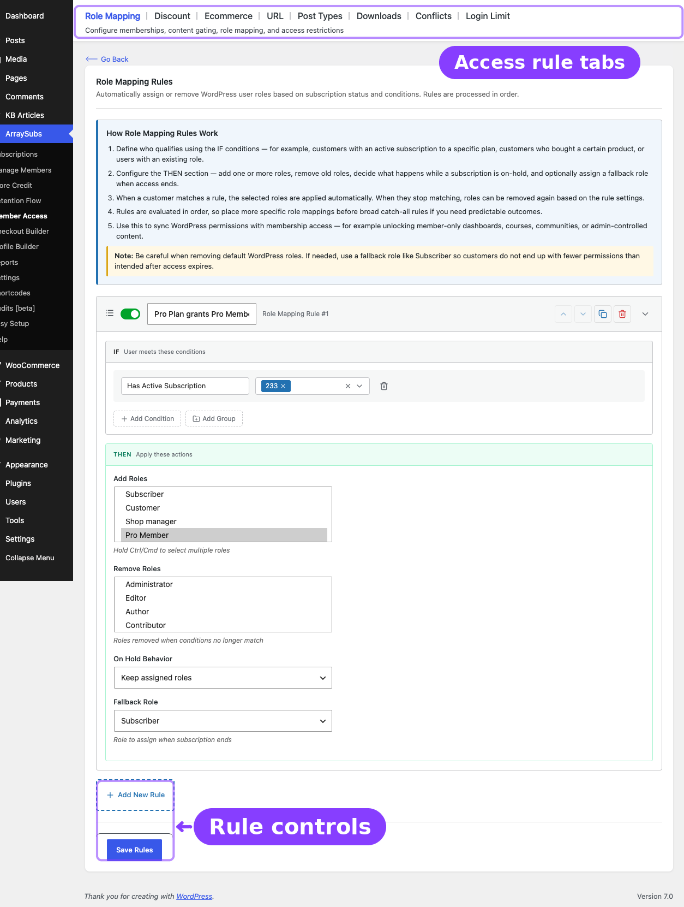

# Info
- Module: Role Mapping
- Availability: Free
- Last updated: 2026-06-27

# Role Mapping

> Automatically assign or remove WordPress user roles based on subscription status and conditions.

**Availability:** Free

## Page Navigation

- **Current guide:** Role Mapping
- **Where to open it:** WordPress Admin -> ArraySubs -> Member Access -> Role Mapping
- **Direct route:** `/wp-admin/admin.php?page=arraysubs-mainadmin#/members-access`
- **Section overview:** [Member Access](./README.md)
- **Previous guide:** [Member Access](./README.md)
- **Next guide:** [Content Gate](./content-gate.md)
- **Troubleshooting:** [Audits, Logs, and Troubleshooting](../audits-and-logs/README.md)

## Overview



The **Role Mapping** tab is where you connect subscription state to native WordPress roles. This is how a subscription can automatically grant access to role-based plugins, dashboards, courses, communities, or any other feature that checks WordPress roles.

The actual screen heading inside the plugin is **Role Mapping Rules**. The tab label is **Role Mapping**.

## How Role Mapping Rules Work

1. Define who qualifies using the **IF** conditions.
2. Configure the **THEN** section to add roles, remove roles, decide what happens on hold, and optionally apply a fallback role.
3. When the customer matches the rule, ArraySubs updates their roles automatically.
4. When they stop matching the rule, roles can be removed again based on the rule settings.
5. Rules are processed in order, so more specific mappings should be placed above broad catch-all rules.

```box class="info-box"
Role Mapping is the bridge between ArraySubs subscriptions and the rest of WordPress. If another plugin checks a user role, Role Mapping is usually the cleanest way to integrate it with subscriptions.
```

## Configuring a Role Mapping Rule

1. Go to **ArraySubs -> Member Access -> Role Mapping**.
2. Click **Add New Rule**.
3. Name the rule.
4. Set the **IF conditions** such as:
   - Has Active Subscription
   - Has Subscription Variation
   - Purchased Product
   - User Role
   - Lifetime Purchase Amount
5. Configure the **THEN** fields:

| Field | What It Does | Example |
|---|---|---|
| **Add Roles** | Roles assigned when the rule matches | `editor`, `premium_member` |
| **Remove Roles** | Roles removed when the rule matches | `subscriber` |
| **On Hold Behavior** | Keeps or removes assigned roles while a subscription is on hold | `Keep roles` |
| **Fallback Role** | Role assigned when the user's last qualifying subscription ends and no other role remains | `subscriber` |

6. Click **Save Rules**.

## Status Handling

| Subscription Status | Role Mapping Behavior |
|---|---|
| `active` | Applies `Add Roles` and `Remove Roles` from the matching rule |
| `trial` | Treated like active for role assignment |
| `on-hold` | Follows the rule's **On Hold Behavior** |
| `pending` | Follows the same hold-style behavior as on-hold |
| `cancelled` | Removes subscription roles if no other active/trial subscription still qualifies |
| `expired` | Same as cancelled |
| `paused` | No dedicated role-removal flow; previously granted roles remain unless another rule removes them |

## Practical Notes

- If two different rules grant the same role, that role stays until the user no longer qualifies for either rule.
- Manual edits in the WordPress user profile are possible, but the next subscription state change can resync the user back to the rule-defined roles.
- For safer downgrades, use a **Fallback Role** so users do not end up with no usable role after access ends.

## Related Guides

- [URL](url.md) — Restrict path-based frontend URLs with priority and exclusions.
- [Post Types](post-types.md) — Gate posts, pages, and CPT content instead of only changing roles.
- [Login Limit](login-limit.md) *(Pro)* — Uses the same condition builder for concurrent-session limits.
- [Lifecycle Management](../manage-subscriptions/lifecycle-management.md) — How status transitions affect role changes.

## FAQ

### Can one rule add multiple roles?
Yes. **Add Roles** and **Remove Roles** both support multiple values.

### When does the fallback role apply?
Only when the user's last qualifying subscription ends and no other WordPress role remains after rule-based removals.

### Should I use Role Mapping or Post Types for member-only content?
Use **Role Mapping** when another plugin or theme already checks WordPress roles. Use [Post Types](post-types.md) when ArraySubs itself should gate the content directly.
