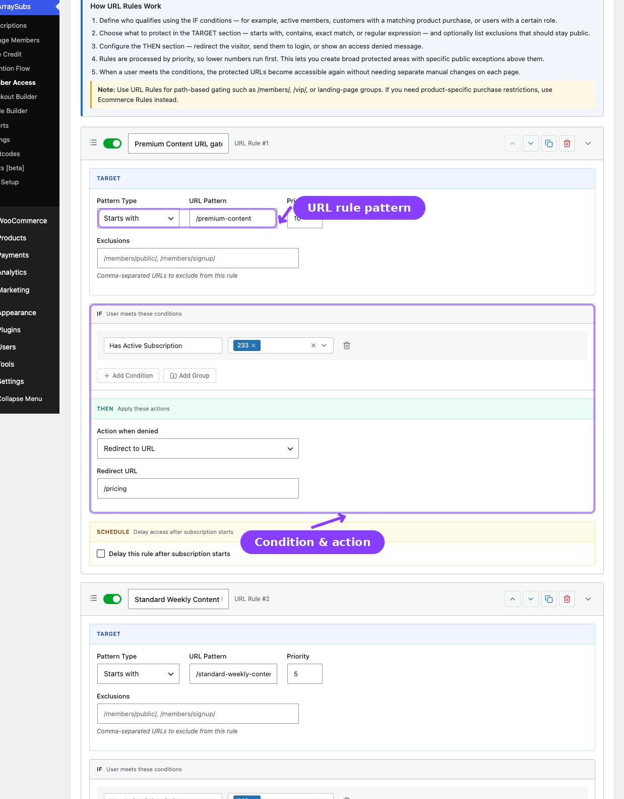

# Info
- Module: URL
- Availability: Free
- Last updated: 2026-06-27

# URL

> Protect frontend page paths and URL patterns with priority-based access rules.

**Availability:** Free

## Page Navigation

- **Current guide:** URL
- **Where to open it:** WordPress Admin -> ArraySubs -> Member Access -> URL
- **Direct route:** `/wp-admin/admin.php?page=arraysubs-mainadmin#/members-access/url-rules`
- **Section overview:** [Member Access](./README.md)
- **Previous guide:** [Shop Access](./ecommerce.md)
- **Next guide:** [Post Types](./post-types.md)
- **Troubleshooting:** [Audits, Logs, and Troubleshooting](../audits-and-logs/README.md)

## Overview

The **URL** tab protects paths and URL patterns across the frontend. Inside the plugin, the screen heading is **URL Rules** and the tab label is **URL**.

Use this tab for:
- `/members/` or `/vip/` sections
- Exact page-level URLs
- Pattern groups that should redirect or deny access
- Broad protected areas with public exceptions

## How URL Rules Work

1. Define who qualifies using **IF** conditions.
2. Choose how to match the path in the **TARGET** section.
3. Configure the denial behavior in the **THEN** section.
4. Lower priority numbers run first.
5. The first failing matching rule decides what happens.

## Pattern Types

| Pattern Type | Matches | Example |
|---|---|---|
| **Starts with** | The path begins with the pattern | `/members/` |
| **Contains** | The path contains the pattern anywhere | `premium` |
| **Exact match** | Only one exact path matches | `/members/secret-page` |
| **Regular expression** | A regex pattern is evaluated | `^/courses/level-[0-9]+$` |

## Configuring a URL Rule

1. Go to **ArraySubs -> Member Access -> URL**.
2. Click **Add New Rule**.
3. Configure the **TARGET** section:

| Field | What It Does |
|---|---|
| **Pattern Type** | Controls how the path is matched |
| **URL Pattern** | The path or regex to protect |
| **Priority** | Lower number = evaluated earlier |
| **Exclusions** | Paths that should stay public even if the pattern matches |

4. Set the **IF conditions**.
5. Set the **THEN** action:

| Action | What Happens |
|---|---|
| **Redirect to URL** | Sends the visitor to a chosen URL |
| **Show message** | Shows a denied-access message |
| **Show 403 forbidden** | Returns 403 |
| **Redirect to login** | Sends the visitor to the login page |

6. Optionally enable scheduling.
7. Click **Save Rules**.

## Practical Notes

- URL rules affect frontend paths, not wp-admin or REST requests.
- Query strings are not the main matching surface; the path is what matters.
- Use exclusions to carve out public pages from a broad protected path.
- If the protected resource is really WooCommerce product access, use [Shop Access](ecommerce.md) instead.

## Related Guides

- [Post Types](post-types.md) — Restrict posts and pages by content type instead of raw URL pattern.
- [Conflicts](conflicts.md) — Review URL rules that overlap higher-priority per-post overrides.
- [Access-Rule Conflicts](../audits-and-logs/access-rule-conflicts.md) — Deeper troubleshooting guide.

## FAQ

### Can I use regex?
Yes. Choose the regex pattern type and enter a standard expression.

### Do URL rules affect REST API endpoints?
No. They are designed for frontend path access, not wp-admin or REST API traffic.
