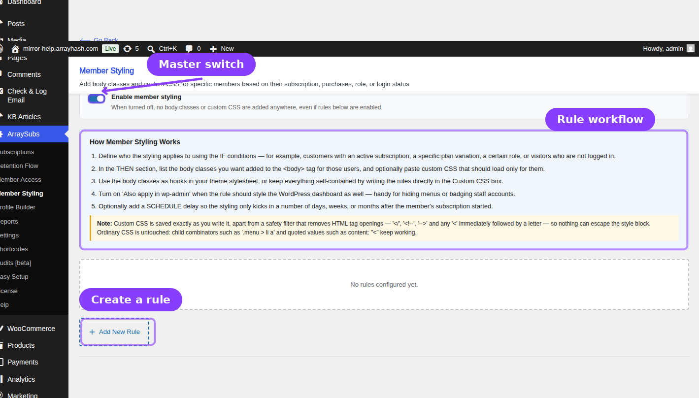
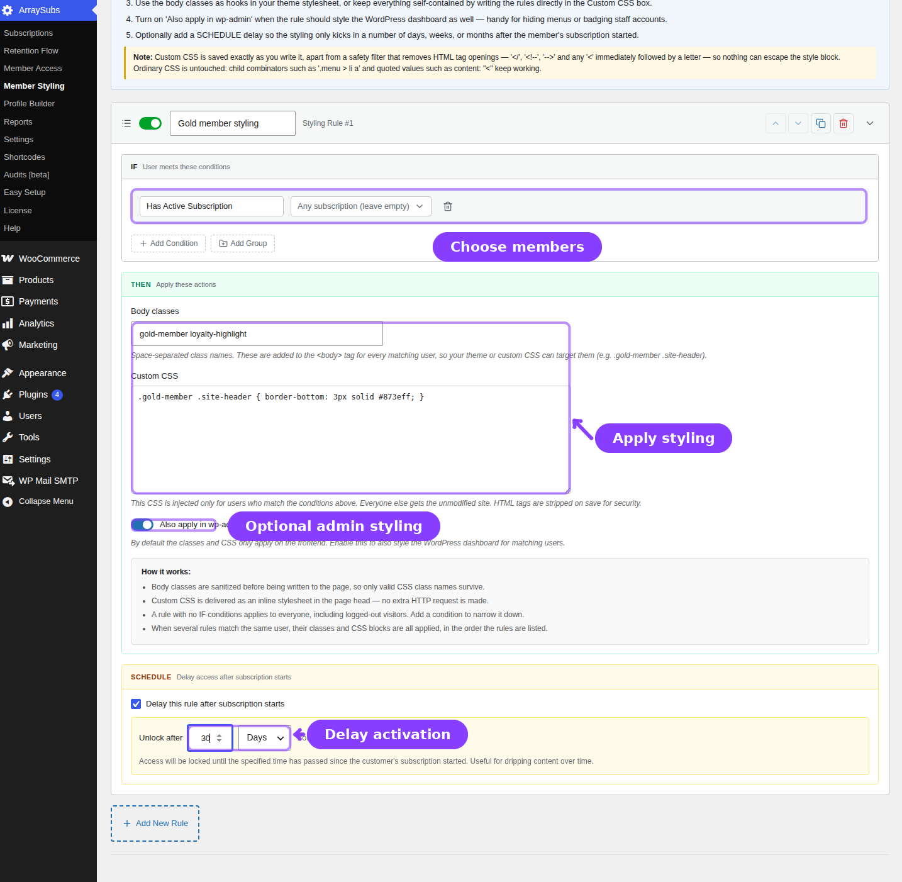

# Info
- Module: Member Styling
- Availability: Free (Feature Value conditions require Pro)
- Last updated: 2026-07-22

# Member Styling

> Give members, guests, plans, roles, and customer segments a different presentation with conditional body classes and custom CSS.

**Availability:** Free. The shared **Feature Value** condition requires ArraySubs Pro and Feature Manager.

## Page Navigation

- **Current guide:** Member Styling
- **Where to open it:** WordPress Admin -> ArraySubs -> Member Styling
- **Direct route:** `/wp-admin/admin.php?page=arraysubs-mainadmin#/member-styling`
- **Previous guide:** [Member Access](../member-access/README.md)
- **Next guide:** [Profile Builder](../profile-builder/README.md)
- **Related conditions:** [Member Access condition system](../member-access/README.md#condition-types)

## Overview



Member Styling applies presentation rules after ArraySubs evaluates the current visitor. Each matching rule can add sanitized classes to the page `<body>` and inject a custom CSS block. Frontend styling is the default; each rule can separately opt into the WordPress dashboard.

Use it when you want to:

- Add plan-specific classes such as `gold-member` or `trial-member` for your theme to target.
- Show a different visual treatment to logged-out visitors, members, staff roles, or customers with particular purchase histories.
- Apply a small self-contained CSS override without editing the active theme.
- Style wp-admin for matching staff or member roles.
- Delay a visual change until a member has been subscribed for a set number of days, weeks, or months.

## How Rule Evaluation Works

1. **Enable member styling** is the master switch. When it is off, no rule adds classes or CSS anywhere.
2. ArraySubs evaluates enabled rules from top to bottom for the current visitor.
3. A rule with no IF conditions applies to everyone, including logged-out visitors.
4. If the IF conditions match, ArraySubs checks the optional schedule delay.
5. Every qualifying rule contributes its classes and CSS. Matching does not stop after the first rule.
6. Duplicate class names are removed, while CSS blocks remain in rule order.

```box class="warning-box"
An empty IF section means everyone. Add at least one condition before saving a rule unless the styling is intentionally global.
```

## Create a Styling Rule



1. Open **ArraySubs -> Member Styling**.
2. Confirm **Enable member styling** is on.
3. Click **Add New Rule**.
4. Give the rule a descriptive internal name.
5. Build the **IF** section with **Add Condition** and, when needed, **Add Group** for nested AND/OR logic.
6. Configure the **THEN** fields described below.
7. Optionally enable **Delay this rule after subscription starts** and choose a value in days, weeks, or months.
8. Click **Save Rules**.

## Condition Types

Member Styling uses the shared ArraySubs condition builder.

| Condition | What It Matches |
|---|---|
| **Lifetime Purchase Amount** | Customers whose total spend meets the selected comparison |
| **Purchased Product** | Customers who purchased any selected product |
| **Purchased Variation** | Customers who purchased any selected variation |
| **Purchased from Category/Tag** | Customers whose purchase history includes a selected product term |
| **Has Active Subscription** | Customers with an active or trial subscription, optionally for selected products |
| **Has Subscription Variation** | Customers with an active or trial subscription to a selected variation |
| **User Login Status** | Either logged-in visitors or visitors who are not logged in |
| **Has NOT Subscription** | Visitors without an active or trial subscription, optionally excluding selected products only |
| **Has NOT Subscription Variation** | Visitors without an active or trial subscription to the selected variations |
| **Feature Value** *(Pro)* | Customers whose Feature Manager entitlement meets the configured comparison |
| **User Role** | Logged-in users with any selected WordPress role |

Conditions can be combined with top-level AND/OR logic and nested groups. For example, you could match **User Login Status = Logged in AND (User Role = customer OR Has Active Subscription = Gold Plan)**.

## Styling Actions

| Field | What It Does |
|---|---|
| **Body classes** | Adds space- or comma-separated class names to `<body>` for matching visitors |
| **Custom CSS** | Adds a matching-user-only inline stylesheet to the page head |
| **Also apply in wp-admin** | Extends this rule from the frontend into the WordPress dashboard |

### Body Classes

Enter reusable class hooks such as:

```text
gold-member premium-user
```

ArraySubs splits the value on whitespace or commas, sanitizes each class with WordPress, removes empty values, and de-duplicates the result. You can then target the class in your theme or another stylesheet:

```css
.gold-member .site-header {
  border-bottom-color: #873eff;
}
```

### Custom CSS

Custom CSS is delivered inline only when the rule qualifies, so it does not add another network request. Multiple qualifying blocks are concatenated in rule order and include the internal rule name as a developer-facing comment.

On save, ArraySubs strips sequences that could open or close HTML markup outside the style block. Normal CSS combinators and quoted values remain available. Administrators should still restrict access to this screen because saved CSS can materially change the site presentation.

### Also Apply in wp-admin

Leave this off for normal member-facing styling. Turn it on when the same body classes and CSS should affect the matching user's WordPress dashboard. Frontend rules never automatically cross into wp-admin.

## Scheduling

The schedule uses the qualifying subscription start date and supports **Days**, **Weeks**, and **Months**. The IF conditions must pass before the delay is evaluated. If no qualifying subscription timing can satisfy a scheduled rule, the styling does not activate.

## Rule Management

- Use **Move up** and **Move down** to control CSS order when several rules match.
- Use **Duplicate** to copy a rule before changing its audience or presentation.
- Use the per-rule toggle to pause one rule without deleting it.
- Use **Delete** to remove a rule from the current draft, then save the page to persist the change.

## Practical Examples

### Style guests differently

Set **User Login Status** to **Not logged in**, add `arraysubs-guest` as a body class, and use it to emphasize a login or membership call to action.

### Add plan-specific theme hooks

Use **Has Active Subscription** for the Gold plan and add `gold-member`. Theme developers can then customize headers, navigation, dashboards, or account cards without duplicating templates.

### Badge staff inside wp-admin

Use **User Role** for the relevant staff role, add an admin-safe class and CSS, then enable **Also apply in wp-admin**.

## Troubleshooting

| Symptom | Check |
|---|---|
| No styling appears | Confirm the master switch and the individual rule are enabled, then verify the current visitor matches the IF conditions |
| Styling starts too late | Review the schedule value, unit, and qualifying subscription start date |
| Frontend works but wp-admin does not | Enable **Also apply in wp-admin** for that rule |
| One rule overrides another | Move the rules to change CSS order or make the selectors more specific |
| A class name changes | Use CSS-safe class names; WordPress sanitizes invalid characters |

## Related Guides

- [Member Access](../member-access/README.md) — The shared rule model and condition reference.
- [Profile Builder](../profile-builder/README.md) — Change profile and My Account structure rather than conditional presentation.
- [Feature Manager](../feature-manager/README.md) *(Pro)* — Define entitlements used by Feature Value conditions.

## FAQ

### Does Member Styling replace my theme?
No. It adds conditional class hooks and CSS on top of the active theme.

### Can one visitor match several rules?
Yes. All qualifying rules contribute their unique body classes and CSS in the order shown in the admin.

### Does an empty rule apply to guests?
Yes. A rule with no IF conditions qualifies everyone, including visitors who are not logged in.

### Does Member Styling run during REST or AJAX requests?
No visual output is needed in those contexts. Frontend classes and CSS are applied to normal rendered pages; admin output is handled separately when **Also apply in wp-admin** is enabled.
