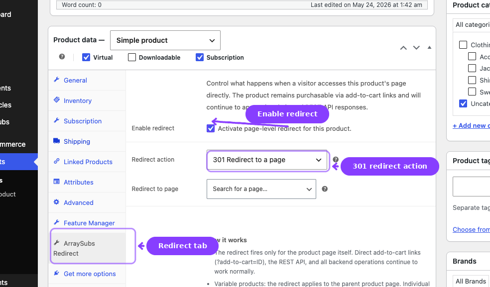
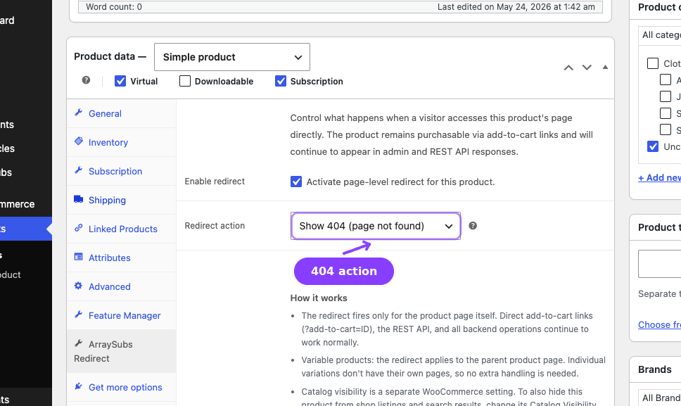
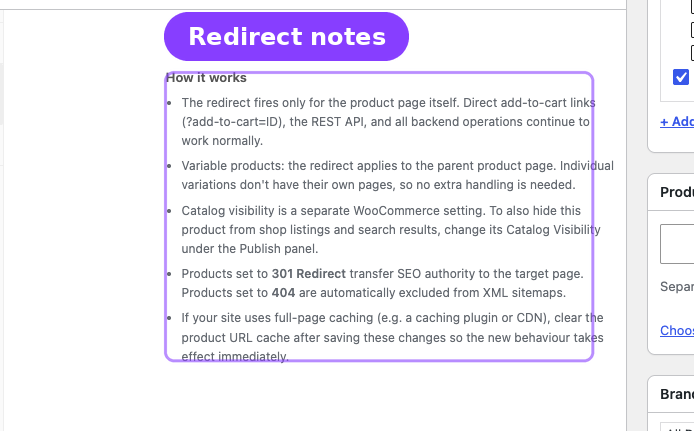

# Info
- Module: Redirect Product Page
- Availability: Pro
- Last updated: 2026-06-08

# Redirect Product Page

> Send direct subscription product URLs to a custom sales page or return a 404 while keeping checkout links and backend product management working.

**Availability:** Pro

## Page Navigation

- **Current guide:** Redirect Product Page
- **Where to open it:** WordPress Admin -> Products -> Edit Product -> Product data -> ArraySubs Redirect
- **Section overview:** [Open overview](../README.md)
- **Previous guide:** [Subscription Products](../subscription-products/README.md)
- **Next guide:** [Subscription Shipping](../subscription-shipping/README.md)
- **Troubleshooting:** [Audits, Logs, and Troubleshooting](../audits-and-logs/README.md)

## Overview

Redirect Product Page is a Pro product-experience module. It controls what happens when somebody opens the direct WooCommerce product page for a subscription product.

Use it when the product is sold through a custom landing page, sales funnel, membership page, or direct checkout button, and the default WooCommerce product page should not be public.

## What It Controls

| Setting | Purpose |
|---|---|
| Enable redirect | Turns product-page handling on for this product |
| Redirect action | Chooses between a permanent redirect and a 404 response |
| Redirect to page | Selects the destination page when using the redirect action |

## Behavior

### 301 Redirect

A visitor who opens the product URL is sent to the selected page with a permanent redirect. This is useful when the custom sales page is the canonical page for the subscription offer.

### 404 Not Found

A visitor who opens the product URL receives a not-found response. This is useful when the product exists only for checkout and should not be discoverable as a product page.

## What Is Not Affected

Redirect Product Page does not block:

- Direct add-to-cart links such as `?add-to-cart=123`
- Checkout URLs
- REST API operations
- Product editing in wp-admin
- Admin users with backend permissions

## SEO Handling

When a product is redirected or hidden with a 404, ArraySubs Pro also keeps sitemap behavior aligned:

| Integration | Behavior |
|---|---|
| WordPress core sitemaps | Excludes redirected or hidden products |
| Yoast SEO | Adds redirected products to the exclusion list |
| Rank Math | Filters redirected products from sitemap entries |

## Real-Life Use Cases

### Custom Sales Page

You build `/join-pro/` with testimonials, pricing, FAQs, and a checkout button. The WooCommerce product exists only to power the subscription purchase. Enable Redirect Product Page and send `/product/pro-membership/` to `/join-pro/`.

### Hidden Checkout Product

You sell a subscription through a private onboarding flow. Set the product page action to 404 so visitors cannot browse the product URL directly, while your approved checkout link still works.

## Related Guides

- [Create and Configure Subscription Products](../subscription-products/create-and-configure.md) — Subscription product setup.
- [Product Experience and Display](../subscription-products/product-experience.md) — General product display behavior.
- [Subscription Shipping](../subscription-shipping/README.md) — Shipping controls on physical subscription products.

## FAQ

### Does this stop customers from buying the product?
No. It only controls the direct product page URL. Add-to-cart links and checkout flows still work.

### Does this apply to variable products?
Yes. The redirect applies to the parent product page. Variations do not have separate public product URLs.

### Do administrators get redirected?
No. Admin users with backend permissions can still view the product page for testing.
