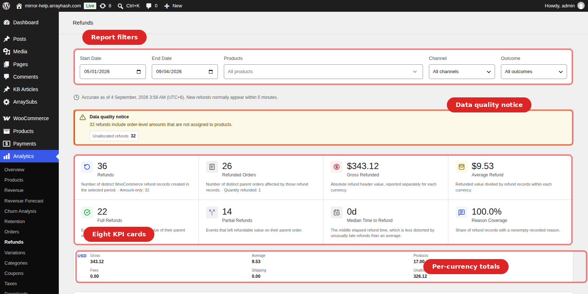
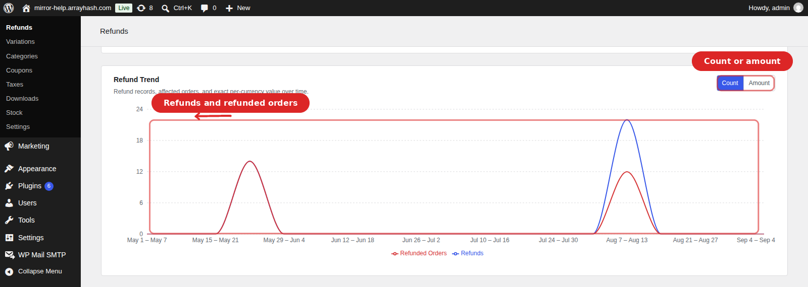
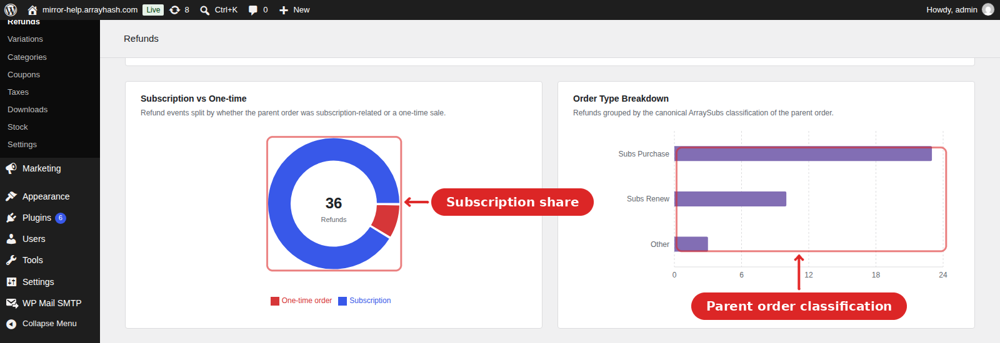
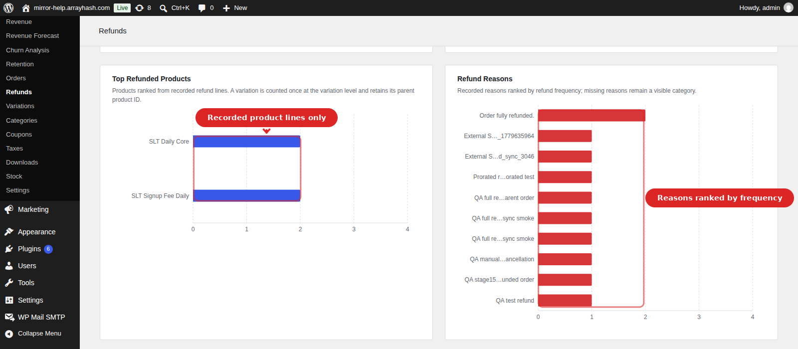
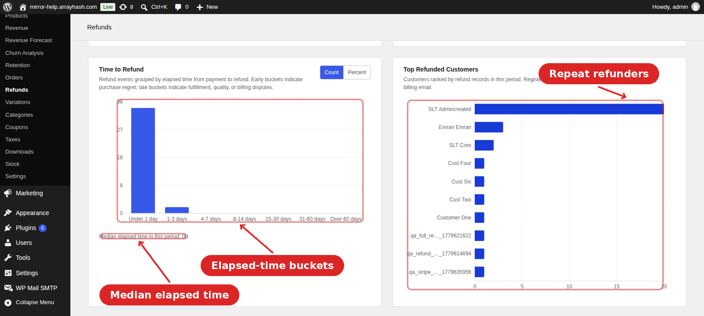
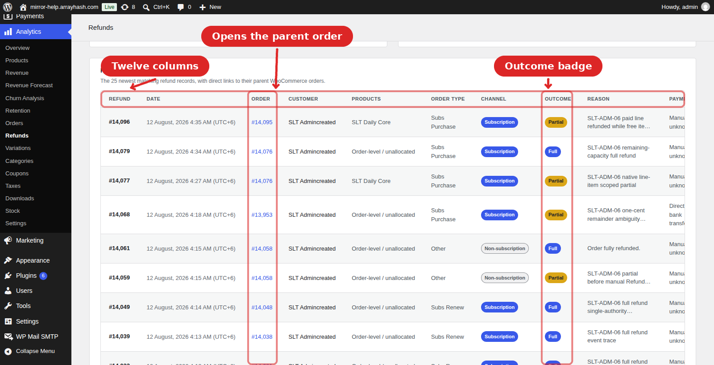

# Info
- Module: Refund Analytics
- Availability: Pro
- Last updated: 2026-09-04

# Refund Analytics

> See how much money leaves the store through refunds, which products, reasons and customers drive it, and how long customers wait before asking — from a dedicated report inside WooCommerce Analytics.

**Availability:** Pro

## Page Navigation

- **Current guide:** Refund Analytics
- **Where to open it:** WordPress Admin -> WooCommerce -> Analytics -> Refunds
- **Direct route:** `/wp-admin/admin.php?page=wc-admin&path=/analytics/arraysubs-refunds`
- **Configure refund policy in:** [Refund Management](../retention-and-refunds/refund-management.md)
- **Section overview:** [Analytics](../analytics/README.md)
- **Previous guide:** [Retention Analytics](../retention-analytics/README.md)
- **Next guide:** [Emails](../emails/README.md)
- **Troubleshooting:** [Audits, Logs, and Troubleshooting](../audits-and-logs/README.md)

## Overview

Refund Analytics reads WooCommerce's own refund records and turns them into one consistent report: eight KPI cards, a per-currency totals strip, eight report cards, and a table of the newest refunds with links straight to their parent orders.

The report is built directly from `shop_order_refund` objects, not from a separate log table. That makes every number traceable to a refund you can open in WooCommerce — and it means refunds created in the admin, by a gateway webhook, by a subscription cancellation, or by the [refund-to-store-credit](../store-credit/refund-to-credit.md) flow all appear here without extra setup.

Navigate to **WooCommerce → Analytics → Refunds** to open the page.

The page helps you answer questions like:

- How much money did we refund this period, and in which currencies?
- Are refunds coming from subscriptions or from one-time orders?
- Which products, reasons, and customers drive refunds?
- Do customers refund within hours (purchase regret) or weeks later (fulfillment or billing problems)?
- How much refunded value was never attributed to a product?

## When to Use This

- Review refund exposure after a product launch, price change, or gateway switch.
- Investigate a spike flagged in the [Subscription Performance Dashboard](../analytics/subscription-performance.md) or in WooCommerce Analytics.
- Find the products or reasons behind a rising refund bill before it becomes a churn problem.
- Spot repeat refunders before the pattern turns into a chargeback.
- Audit refund bookkeeping — unallocated amounts, missing reasons, unknown outcomes — as part of a month-end close.

```box class="info-box"
Refund Analytics looks at **money already returned**. To see why customers cancel and whether retention offers save them, open [Retention Analytics](../retention-analytics/README.md). The two reports are complementary: a subscription that churns often leaves a refund record behind.
```

## Prerequisites

- ArraySubs core plugin activated
- **ArraySubs Pro installed and active**
- WooCommerce 8.0+ with WooCommerce Admin (included by default)
- A user with the `manage_woocommerce` or `manage_options` capability (Administrator or Shop Manager)
- At least one WooCommerce refund in the selected date range

## How It Works

Every time the page loads, ArraySubs queries WooCommerce for refund records created inside the selected date range, then builds one **atomic snapshot** — every card on the page is calculated from the same set of records, so no two cards can disagree with each other.

For each refund the report records:

| Fact | Where it comes from |
|---|---|
| Refund amount | The absolute refund **header** total — the cash actually returned |
| Currency | The refund's currency, falling back to the parent order's currency |
| Product / shipping / fee split | The line items WooCommerce actually recorded on the refund |
| Outcome (full or partial) | The event-time outcome stored on the refund, or reconstructed from the parent order's refund chronology |
| Order type and channel | The ArraySubs classification of the parent order (subscription purchase, trial, renewal, upgrade, or a one-time sale) |
| Reason | The refund reason text typed at refund time |
| Payment method | The gateway stored on the parent order |
| Time to refund | Elapsed time from payment (or order creation) to refund creation |

### Two Grains, Never Mixed

The report deliberately keeps two levels apart:

- The **header** is the cash truth. Gross Refunded, Average Refund, and the trend all use it.
- The **components** are the recorded refund line items. Product attribution uses only these.

A refund entered as a flat amount with no line items still counts fully in the cash totals, but it cannot be assigned to a product. That gap is reported honestly as **Unallocated** rather than being spread across products by guesswork.

### Currencies Are Never Added Together

Money totals are held separately per currency and are never converted or summed. In a multi-currency store the KPI cards show a currency count instead of a single total, charts open in count mode, and amount mode draws one line per currency. Refunds with no reliable currency evidence are isolated under `UNKNOWN`.

### Freshness and Caching

Results are cached for **5 minutes**. The line under the filters tells you exactly how fresh the snapshot is — either "Accurate as of \<time\>. New refunds normally appear within 5 minutes." when the range ends today, or "Report includes refunds through \<date\>." for a historical range.

---

## Filters



Five filters control every card on the page at once. Changing any of them rebuilds the whole snapshot.

| Filter | Options | Notes |
|---|---|---|
| **Start Date** | Any date | Defaults to the first day of the month 11 months ago |
| **End Date** | Any date | Defaults to today; future dates are rejected |
| **Products** | Searchable multi-select | Selecting a variable product includes all its variations |
| **Channel** | All channels / Subscription / Non-subscription | Uses the parent order's ArraySubs classification |
| **Outcome** | All outcomes / Full / Partial / Unknown | Uses the event-time refund outcome |

If the start date is after the end date, or either date is in the future, the report stops and shows **Check the report dates** instead of loading partial data.

```box class="info-box"
The product filter is exact. When you filter by product, the report includes only refunds with matching **recorded** product lines, and reports only the matching product value — an order-level refund with no line items will not appear.
```

---

## Summary Cards

The top strip shows **8 KPI cards**, followed by a per-currency totals row. Both appear in the screenshot above.

| Card | Format | What it measures |
|---|---|---|
| **Refunds** | Number | Distinct WooCommerce refund records created in the period. The detail line adds the amount-only count |
| **Refunded Orders** | Number | Distinct parent orders affected by those refunds. The detail line adds total quantity refunded |
| **Gross Refunded** | Currency | Absolute refund header value, per currency |
| **Average Refund** | Currency | Gross refunded ÷ refund records, within each currency |
| **Full Refunds** | Number | Events that completed the refundable value of their parent order |
| **Partial Refunds** | Number | Events that left refundable value on their parent order |
| **Median Time to Refund** | Days | The middle elapsed refund time — less distorted by rare late refunds than an average |
| **Reason Coverage** | Percent | Share of refund records with a nonempty recorded reason |

### Per-Currency Totals

Below the cards, one row per currency breaks the gross into **Gross**, **Average**, **Products**, **Fees**, **Shipping**, and **Unallocated**. This row is the fastest way to see where the refunded cash actually went, and how much of your refund bill was never attributed to a product.

```box class="info-box"
**Full** is decided at event time. If a customer receives three partial refunds and the third one completes the order, only the third is counted as Full. Earlier events stay Partial even though the order ends up fully refunded.
```

---

## Refund Trend



A line chart of refund activity over time, with a **Count / Amount** toggle in the card header.

- **Count** plots two lines: refund records and unique refunded orders. When they diverge, one order is being refunded repeatedly.
- **Amount** plots exact refunded value with one line per currency. Currencies are never combined.

The chart picks its own grain from the length of your date range:

| Date range | Grain |
|---|---|
| 45 days or fewer | Daily |
| 46–180 days | Weekly |
| More than 180 days | Monthly |

Periods with no refunds are still drawn, so a quiet month reads as a real gap rather than a missing point.

---

## Subscription vs One-time and Order Types



**Subscription vs One-time** splits refund records by whether the parent order was subscription-related. The number in the middle of the donut is the total refund count for the period. A store where subscription refunds dominate should read this card next to [Retention Analytics](../retention-analytics/README.md) — the two usually describe the same unhappy customers from different sides.

**Order Type Breakdown** goes one level deeper on the same records, ranking them by the ArraySubs classification of the parent order — Subs Purchase, Subs Renew, Subs Trial, Subs Upgrade, Credit Purchase, or Other. Refunds concentrated in **Subs Renew** mean customers are cancelling *after* being billed again, which is usually a renewal-notice problem rather than a product one.

Hover any segment or bar for its refund count, affected orders, share, and exact per-currency value.

---

## Products and Reasons



**Top Refunded Products** ranks up to 10 products by the number of refund records attributed to them. A variation is counted once at the variation level and keeps its parent product ID, so a variable product does not double-count. Products deleted since the refund still appear, using the name stored on the order.

Only refunds with **recorded product lines** appear here. If this card looks emptier than your Gross Refunded suggests, check the **Unallocated** figure in the per-currency row — that value belongs to refunds entered as flat amounts.

**Refund Reasons** ranks up to 10 recorded reasons by frequency. Blank reasons stay visible as **No reason recorded** rather than being dropped — that category is the honest measure of your bookkeeping discipline, and it is what the Reason Coverage KPI counts.

```box class="info-box"
Reasons are free text typed at refund time, so they only group well if your team writes them consistently. Agreeing on a short list of reason phrases turns this chart from noise into a product-fix backlog.
```

---

## Time to Refund and Top Refunded Customers



**Time to Refund** is a histogram of elapsed time from payment to refund, in fixed chronological buckets — **Under 1 day**, **1-3**, **4-7**, **8-14**, **15-30**, **31-60**, and **Over 60 days**. Buckets keep their order and empty buckets stay on the chart, because the shape of the distribution is the message. A **Count / Percent** toggle switches the axis, and the median for the period is printed underneath.

How to read the shape:

| Concentration | Usual meaning |
|---|---|
| Under 1 day and 1-3 days | Purchase regret, wrong-item orders, duplicate charges |
| 4-14 days | A normal returns window working as designed |
| 15-60 days | Fulfillment, quality, or expectation problems surfacing late |
| Over 60 days | Billing disputes, forgotten subscriptions, goodwill refunds |

A subscription store that suddenly grows an **Over 60 days** tail is usually refunding renewals customers forgot they had — a signal to review [renewal communication](../billing-and-renewals/renewal-communication.md) rather than product quality.

Refunds whose parent order is missing land in an **Unknown timing** bucket, which only appears when it is non-empty.

**Top Refunded Customers** ranks up to 10 customers by refund records in the period. Registered customers group by their account; guests group by billing email, so a guest who ordered several times still resolves to one bar. Hover a bar for refund count, affected orders, share, and exact per-currency value.

Use this card to separate two very different situations: one customer with a large refund is a support case, while one customer with many refunds across months is a policy problem worth investigating before it becomes a chargeback.

---

## Recent Refunds



The newest **25** matching refund records, with a direct link from each row to its parent WooCommerce order.

| Column | What it shows |
|---|---|
| Refund | The WooCommerce refund ID |
| Date | Refund creation date and time in store-local time |
| Order | Parent order number, linked to the order edit screen |
| Customer | Billing name, account display name, or "Guest" |
| Products | Up to two recorded product names, or "Order-level / unallocated" |
| Order Type | ArraySubs classification of the parent order |
| Channel | Subscription or Non-subscription badge |
| Outcome | Full, Partial, or Unknown badge |
| Reason | The recorded refund reason |
| Payment | Gateway on the parent order |
| Time to Refund | Elapsed days from payment to refund |
| Amount | Exact refunded value in the refund's own currency |

The table respects every filter, so narrowing to one product, channel, or outcome turns it into a focused audit list.

---

## Data Quality Notices

The report never silently hides a problem. When evidence is incomplete, a notice appears above the cards with a count for each issue:

| Notice | What it means | What to do |
|---|---|---|
| **Unallocated refunds** | Refund header value exceeds the recorded line items | Open the orders; enter future refunds against line items |
| **Overallocated refunds** | Recorded lines exceed the refund header | Review the orders — the refund lines and header disagree |
| **Inferred outcomes** | Full/partial reconstructed from chronology, not stored at event time | Normal for historical refunds; no action needed |
| **Unknown outcomes** | Full/partial could not be determined at all | Open the orders and confirm the refund state |
| **Missing parent orders** | The refund's parent order no longer exists | Investigate deleted orders |
| **Invalid refunds** | The refund had no readable creation date | Investigate the record directly in the database |
| **Orphan refund items** | A refund line points at an order item that is gone | Expected after item edits; treat product totals with care |
| **Deleted-product lines** | The refunded product no longer exists | Expected; the name stored on the order is used |
| **Unknown currencies** | No reliable currency evidence | Those refunds are isolated under `UNKNOWN` |

Notices are colour-coded: grey for information, amber for a warning, red when the report itself could not validate the data.

---

## Real-Life Use Cases

### Post-Launch Refund Review

A store launches a new subscription box. Two weeks later the merchant sets the date range to the launch date and filters **Channel** to Subscription. **Full Refunds** far outnumber **Partial Refunds**, and **Time to Refund** clusters under 1 day. The product page is over-promising, not under-delivering — they rewrite the description instead of changing the product.

### Finding the Cost of a Bad Batch

A merchant notices refunds rising. **Top Refunded Products** points at one variation, **Refund Reasons** shows "damaged in transit" leading, and **Time to Refund** clusters at 4-7 days — the delivery window. They switch packaging for that variation and watch the next period's histogram.

### Renewal Refunds vs Purchase Refunds

**Subscription vs One-time** shows subscriptions carrying most of the refund volume, and **Order Type Breakdown** puts the bulk in **Subs Renew**. Customers are not unhappy with the product; they are being surprised by the charge. The merchant turns on renewal reminder emails and rechecks next month.

### Catching a Repeat Refunder

**Top Refunded Customers** shows one account with 20 refunds while everyone else has one or two. The merchant filters **Recent Refunds** and finds the same product refunded monthly. They apply a [purchase limit](../member-access/purchase-limit.md) to that account instead of blocking the product for everyone.

### Month-End Bookkeeping

Before closing the books, the accountant sets the range to the month and reads the **per-currency totals** row. The **Unallocated** figure and the data quality notice show which refunds still need annotating; those orders are opened and fixed, and only then is Gross Refunded copied into the ledger.

---

## Edge Cases and Important Notes

- **Reports are capped for safety.** A range containing more than 25,000 refunds returns "This report contains too many refunds to calculate safely. Narrow the date range and retry."
- **A concurrent refund can invalidate a snapshot.** If refund data changes while the report is being built, you will be asked to retry shortly. This protects the atomic guarantee — it is never a data loss.
- **Amount-only refunds are complete cash, incomplete attribution.** They count fully in Gross Refunded and in every count-based card, but never appear in Top Refunded Products.
- **Breakdown cards show the top 10.** Order types, products, reasons, and customers are each capped at 10 rows, ranked by refund count.
- **Time to refund uses the payment date** when the parent order has one, and falls back to order creation when it does not.
- **The page lives inside WooCommerce Analytics.** It replaces the WooCommerce layout while active and restores it when you navigate away.
- **Deleting a refund clears the cache.** Refund creation, update, and deletion all bump the report revision, so a stale snapshot is never served after a change.

---

## Troubleshooting

| Problem | Likely Cause | What to Do |
|---|---|---|
| Every card is empty | No refunds exist in the selected range | Widen the date range; the default is the trailing 12 months |
| Gross Refunded looks right but Top Refunded Products is empty | Refunds were entered as flat amounts with no line items | Check the **Unallocated** figure in the per-currency row; refund against line items in future |
| KPI cards show a currency count instead of a total | The period contains more than one currency | Read the per-currency totals row, which lists each currency separately |
| "This report contains too many refunds to calculate safely" | More than 25,000 refunds in range | Narrow the date range, or filter by product or channel |
| "Refund data changed while this report was being generated" | A refund was created or edited mid-build | Retry — the next build will include it |
| Reason Coverage is low | Reasons are not being typed at refund time | Agree on a short reason list with your team and review recent refunded orders |
| Many outcomes show as Unknown | Historical refunds with no stored outcome and an ambiguous chronology | Expected on old data; new refunds record their outcome at event time |
| The Refunds menu item is missing | ArraySubs Pro inactive, or the user lacks `manage_woocommerce` | Activate Pro and check the user's role |

---

## Related Guides

- [Refund Management](../retention-and-refunds/refund-management.md) — Configure the refund policy, proration, and gateway routing behind these numbers.
- [Refund to Store Credit](../store-credit/refund-to-credit.md) — Issue refunds as store credit instead of cash, keeping revenue in the store.
- [Retention Analytics](../retention-analytics/README.md) — Why customers cancel, and whether retention offers save them.
- [AI Churn Analysis](../analytics/ai-churn-analysis.md) — Which live subscribers are at risk next.
- [Reports Hub](../analytics/reports-hub.md) — Central directory of all analytics and reports.
- [Subscription Performance Dashboard](../analytics/subscription-performance.md) — KPI cards and leaderboards on the WC Analytics Overview.
- [Order List Enhancements](../analytics/order-list-enhancements.md) — Order-type classification used by the Order Type Breakdown card.
- [Activity Audits](../audits-and-logs/activity-audits.md) — Who performed a refund action and when.

---

## FAQ

### Where do I find Refund Analytics?
Navigate to **WooCommerce → Analytics → Refunds** in the WordPress admin sidebar. It appears as a submenu item under the Analytics section.

### Is this a free or Pro feature?
Refund Analytics requires **ArraySubs Pro**. The report page and its REST endpoints are part of the Pro addon.

### Does it need a backfill before it shows history?
No. The report reads WooCommerce refund objects directly, so your full refund history is available from the first page load.

### Why does Gross Refunded not equal Products + Shipping + Fees?
Because WooCommerce refunds can be entered as a flat order-level amount with no line items. The difference appears as **Unallocated** in the per-currency row instead of being guessed onto a product.

### Why are my currencies not added together?
Adding unlike currencies produces a meaningless number. The report keeps each currency separate everywhere, including in charts and tooltips.

### A refund shows as Partial but the order is fully refunded. Why?
Outcome is recorded per event. If that refund left refundable value at the moment it was created, it is Partial forever — the later event that completed the order is the one marked Full.

### Does the product filter include variations?
Yes. Selecting a variable parent product includes all of its variations. You can also select a single variation to filter to it alone.

### Do refunds issued as store credit appear here?
Yes. Store-credit refunds create WooCommerce refund records, so they appear in every card. See [Refund to Store Credit](../store-credit/refund-to-credit.md).

### Can I export this report?
There is no built-in export button on this page. Use **WooCommerce → Analytics → Orders** for CSV export of the underlying orders, or the [Subscription Data Export](../manage-subscriptions/subscription-data-export.md) for subscription records.

### How fresh are the numbers?
Results are cached for 5 minutes, and the freshness line under the filters always states the exact snapshot time.
