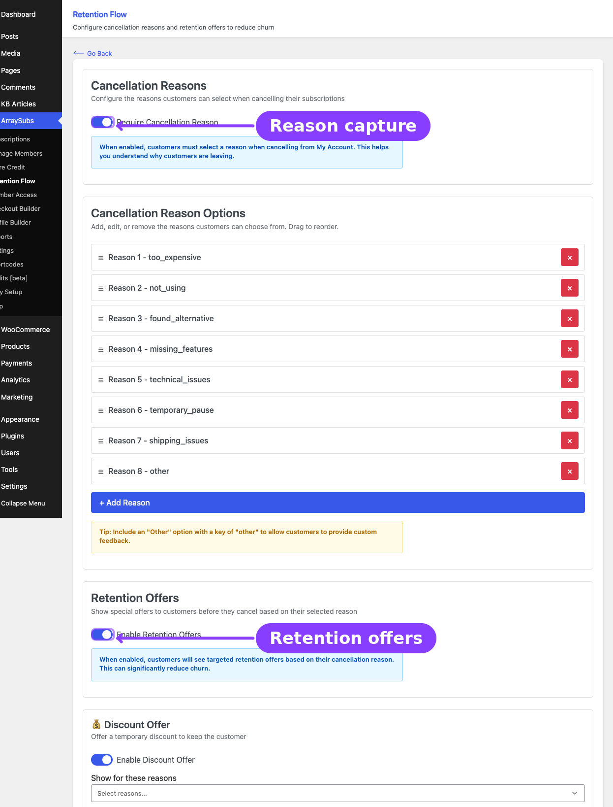
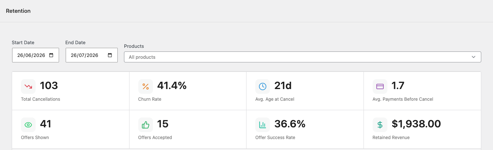
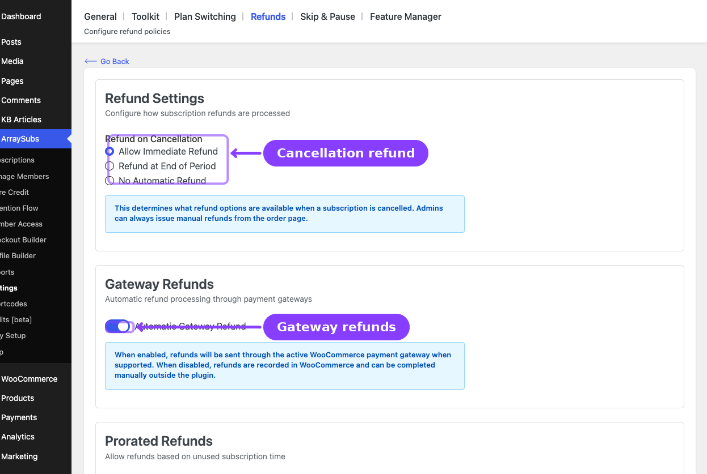

# Info
- Module: Retention and Refunds
- Availability: Mixed — cancellation timing and core refund processing are Free; cancellation reasons editor, retention offers, and retention analytics require Pro; refund-to-store-credit also requires Pro
- Last updated: 2026-06-04

# Retention, Cancellation, and Refunds

> Reduce churn, capture cancellation insights, win back leaving customers with targeted offers, and manage refunds — all from one unified toolkit.

**Availability:** Free (cancellation timing, undo cancellation, core refund processing), Pro (cancellation reasons editor, retention offers, retention analytics, refund-to-store-credit)

## Page Navigation

- **Current guide:** Retention, Cancellation, and Refunds
- **Where to open it:** WordPress Admin -> ArraySubs -> Retention Flow
- **Section overview:** [Open overview](../README.md)
- **Previous guide:** [cancellation-setup](./cancellation-setup.md)
- **Next guide:** [refund-management](./refund-management.md)
- **Troubleshooting:** [Audits, Logs, and Troubleshooting](../audits-and-logs/README.md)

## Overview

Losing subscribers is the single most impactful threat to recurring revenue. ArraySubs provides a complete retention and cancellation management system that goes far beyond a simple "Cancel" button. The core cancel/undo-cancel flow and refund processing ship free; **ArraySubs Pro** adds the tools to configure cancellation reasons, present targeted retention offers at the exact moment a customer is about to cancel, and track the results with a dedicated analytics dashboard.

This section covers the full lifecycle of a cancellation — from the moment a customer clicks **Cancel Subscription** to the final refund decision — and the admin tools you use to configure, monitor, and improve the process.

## What this section covers



| Topic | What you will learn |
|---|---|
| [Cancellation Setup](cancellation-setup.md) | How to configure cancellation timing (Free), and manage cancellation reasons + the Retention Flow admin page **(Pro)** |
| [Retention Offers](retention-offers.md) **(Pro)** | How to configure and trigger Discount, Pause, Downgrade, and Contact Support offers — including eligibility conditions, trigger reasons, and the customer-facing modal flow |
| [Retention Use Cases](retention-use-cases.md) **(Pro)** | 15+ real-life scenarios showing how subscription businesses use the retention system to reduce churn, increase lifetime value, and recover revenue |
| [Retention Analytics](../retention-analytics/README.md) **(Pro)** | How to read the retention analytics dashboard — summary cards, churn reasons chart, offer performance, trend data, and the activity log |
| [Refund Management](refund-management.md) | How to configure refund policies, process prorated and full refunds, understand refund-driven cancellation behavior, and use store credit refunds **(Pro)** |

## How the retention system works

The retention system activates when a customer initiates a cancellation from their account portal. Instead of silently processing the cancellation, ArraySubs inserts a multi-step flow between the customer's intent to cancel and the actual status change.

```
┌──────────────┐    ┌──────────────┐    ┌──────────────┐    ┌──────────────┐
│  Customer     │    │  Reason      │    │  Retention   │    │  Cancellation│
│  clicks       │ →  │  capture     │ →  │  offers      │ →  │  or retained │
│  Cancel       │    │  modal       │    │  modal       │    │  outcome     │
└──────────────┘    └──────────────┘    └──────────────┘    └──────────────┘
```

1. **Reason capture** (Free — runtime; **Pro** to edit the reason list) — The customer selects why they want to cancel from a configurable list of reasons. This data feeds the analytics dashboard.
2. **Retention offers** *(Pro)* — Based on the selected reason and the subscription's eligibility, ArraySubs presents targeted offers (discount, pause, downgrade, or contact support). Without Pro, customers go straight from reason capture to cancellation.
3. **Outcome** — The customer either accepts an offer (subscription is retained) or declines all offers and proceeds with cancellation.
4. **Analytics** *(Pro)* — Every step is logged: reason selected, offers shown, offers accepted or declined, cancellation completed. This gives you a clear picture of churn drivers and retention effectiveness.
5. **Refund policy** (Free core) — After cancellation, your configured refund policy determines whether refunds are issued automatically, at end of period, or manually.

## Key concepts

**Cancellation timing** — Controls whether subscriptions are cancelled immediately or at the end of the current billing period. End-of-period cancellation keeps the customer active until their paid time runs out.

**Cancellation reasons** — A configurable list of reasons customers must (or may) select when cancelling. The reason-select step itself still runs on the free plugin using the last-saved (or default) list; **editing** that list, and requiring/optional-toggling it, is done from the Retention Flow admin page, which requires **ArraySubs Pro**. These reasons drive retention offer targeting and analytics.

**Retention offers** *(Pro)* — Special offers shown to cancelling customers to encourage them to stay. Each offer type targets different reasons for leaving: discounts for price-sensitive customers, pausing for those taking a break, downgrading for those who need less, and contact support for those with problems to solve.

**Retention analytics** *(Pro)* — A dedicated dashboard under WooCommerce Analytics that tracks cancellations, offer performance, churn rate, and retained revenue over time.



**Refund policy** — Configurable rules that control what happens when a subscription is cancelled — whether refunds are processed automatically, after the billing period ends, or only when an admin manually issues them.



**Prorated refunds** — An optional refund type that calculates the unused portion of a billing cycle and refunds only that amount, rather than refunding the full payment.
