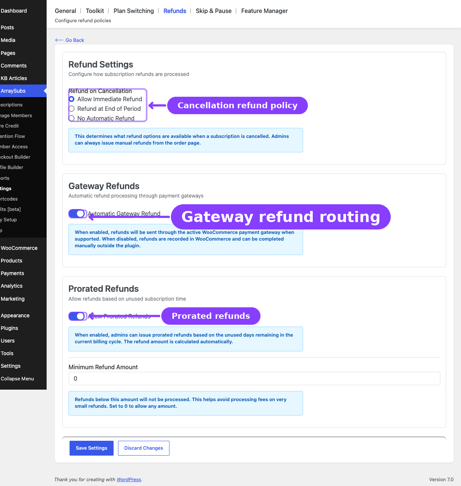
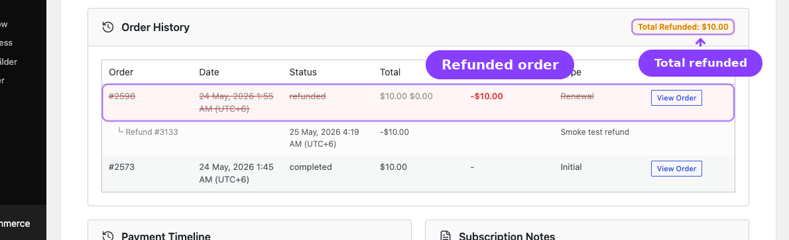
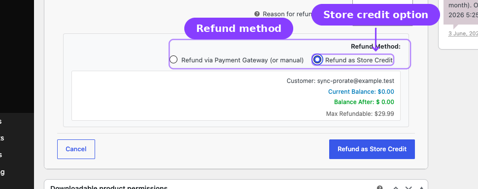

# Info
- Module: Refund Management
- Availability: Shared (Free core + Pro store credit)
- Last updated: 2026-04-02

# Refund Management

> Configure refund policies for cancelled subscriptions, issue prorated and full refunds, and optionally convert refunds to store credit to keep the revenue in your store.

**Availability:** Free (core refund processing), Pro (refund-to-store-credit)

## Page Navigation

- **Current guide:** Refund Management
- **Where to open it:** WordPress Admin -> ArraySubs -> Settings -> Refunds
- **Direct route:** `/wp-admin/admin.php?page=arraysubs-mainadmin#/settings/refunds`
- **Process prorated refunds from:** WordPress Admin -> ArraySubs -> Subscriptions -> open a subscription -> **Prorated Refund**
- **Related customer cancellation setup:** [Cancellation Setup](cancellation-setup.md)
- **Section overview:** [Open overview](./README.md)
- **Previous guide:** [README](./README.md)
- **Next guide:** [Retention Analytics](../retention-analytics/README.md)
- **Troubleshooting:** [Audits, Logs, and Troubleshooting](../audits-and-logs/README.md)

## Overview

Refund management controls what happens financially after a subscription is cancelled. ArraySubs integrates directly with WooCommerce's native refund system, adding subscription-aware logic on top: configurable cancellation behavior, prorated refund calculations based on unused billing cycle days, minimum refund thresholds, and automatic payment gateway refund routing.

For stores running ArraySubs Pro, refunds can also be issued as **store credit** — keeping the money in the store ecosystem while still making the customer whole.

## When to Use This

- You need to define your refund policy for subscription cancellations (immediate, end-of-period, or no automatic refund).
- You want to offer prorated refunds for customers who cancel mid-cycle.
- You want to configure whether refunds are automatically sent through the payment gateway.
- You need to process a one-time refund for a specific subscription order.
- You want to convert a refund to store credit instead of a gateway refund **(Pro)**.

## Prerequisites

- ArraySubs core plugin installed and active
- WooCommerce installed and active
- At least one subscription with an associated paid order
- Admin or Shop Manager access for refund processing
- For gateway refunds: a payment gateway that supports the WooCommerce refund API
- For store credit refunds **(Pro)**: ArraySubs Pro active, Store Credit feature enabled

---

## Refund Settings



Navigate to **ArraySubs → Settings → Refunds** to configure your refund policies.

### Refund on Cancellation

This setting controls the refund policy used by cancellation workflows. It does not control what happens after a WooCommerce order is fully refunded — full refunds of linked subscription orders are handled by the refund hooks and cancel the linked subscription immediately.

| Option | Behavior |
|---|---|
| **Allow Immediate Refund** | Selects the immediate refund policy for cancellation workflows. Admins can still issue manual or prorated refunds from the subscription or order screens when a refundable order exists. |
| **Refund at End of Period** | Stores the policy with scheduled end-of-period cancellations. When the scheduled cancellation runs, ArraySubs attempts a prorated refund if prorated refunds are enabled and a refundable order exists. |
| **No Automatic Refund** | Stores a no-refund policy for cancellation workflows. For scheduled end-of-period cancellations, ArraySubs records an audit note instead of issuing an automatic prorated refund. |

```box class="info-box"
You can always issue refunds from the WooCommerce order page regardless of this setting. The setting is about ArraySubs cancellation-driven refund behavior, not whether WooCommerce is allowed to create a refund.
```

### Automatic Gateway Refund

When enabled, refunds processed through ArraySubs will be sent through the WooCommerce payment gateway's refund API. If the gateway supports automatic refunds (Stripe, PayPal, Paddle), the money is returned to the customer's original payment method.

When disabled, refunds are recorded in WooCommerce as "manual refunds" — the financial record is created, but you must manually transfer the money back to the customer through your payment processor's dashboard.

### Prorated Refunds

When enabled, admins can issue prorated refunds based on the unused portion of the current billing cycle. The refund amount is calculated automatically:

$$\text{Refund} = \frac{\text{Recurring Amount}}{\text{Days in Cycle}} \times \text{Unused Days}$$

For example, if a $30/month subscription is cancelled 10 days into a 30-day cycle:
- Daily rate: $30 ÷ 30 = $1.00
- Days used: 10
- Days unused: 20
- Prorated refund: $1.00 × 20 = **$20.00**

### Minimum Refund Amount

Sets the minimum threshold for processing a refund. Refunds below this amount will not be processed. This helps avoid payment gateway processing fees on very small refunds.

Set to `0` to allow refunds of any amount.

---

## Settings Reference

| Setting | Location | Default | What It Controls |
|---|---|---|---|
| **Refund on Cancellation** | Settings → Refunds | Allow Immediate Refund | The refund policy used by cancellation workflows |
| **Automatic Gateway Refund** | Settings → Refunds | Enabled | Whether refunds are sent through the payment gateway automatically |
| **Allow Prorated Refunds** | Settings → Refunds | Enabled | Whether admins can issue prorated refunds based on unused days |
| **Minimum Refund Amount** | Settings → Refunds | 0 | The minimum refund threshold shown in the Refunds settings |

---

## How Refund Processing Works

When a refund is initiated — whether through ArraySubs or the standard WooCommerce order screen — the system follows this flow:

### Step 1: Find the Refundable Order

The system searches for the best order to refund, in priority order:

1. **Pending renewal order** — an unpaid invoice from the most recent billing cycle
2. **Original order** — the order that created the subscription
3. **Latest paid renewal order** — the most recent completed renewal

### Step 2: Create the WooCommerce Refund

A native WooCommerce refund object is created with the specified amount and reason. If **Automatic Gateway Refund** is enabled and the payment gateway supports refunds, WooCommerce sends the refund request to the gateway API.

### Step 3: Update Subscription Records

- The refund is added to the subscription's `_refund_history` array
- The `_total_refunded` counter is incremented
- A subscription note records the refund amount, order, and reason

### Step 4: Check Full Refund Behavior

If the refund fully covers a linked subscription order's remaining balance, the system fires a "fully refunded" event. That full-refund event immediately cancels the linked subscription and removes future scheduled actions.

The **Refund on Cancellation** setting is used for cancellation-driven refund behavior. It does not delay or suppress the immediate cancellation that follows a full WooCommerce order refund.

### Step 5: Gateway Synchronization (Pro)

For subscriptions on automatic payment gateways (Stripe, PayPal, Paddle), a **Two-Way Sync Guard** prevents infinite loops between local refunds and gateway webhooks. When you issue a refund locally, the guard marks it so that when the gateway sends back a refund webhook, the system knows to skip it (already handled). This ensures each refund is processed exactly once.

---

## Refund Types

### Prorated Refund

Calculates the unused portion of the current billing cycle and refunds that amount.

**Available from:** The subscription detail page in the admin, via the REST API endpoint `POST /arraysubs/v1/subscriptions/{id}/prorated-refund`.

**Parameters:**
- `reason` — Optional text reason for the refund
- `cancel_after` — Whether to cancel the subscription after the refund (default: true)

**Before issuing:** You can preview the prorated calculation via `GET /arraysubs/v1/subscriptions/{id}/prorated-refund-preview`, which returns the number of unused days, the daily rate, and the calculated refund amount without actually processing anything.

**Billing period day calculations:**

| Period | Days Used |
|---|---|
| Day | 1 |
| Week | 7 |
| Month | 30 (approximation) |
| Year | 365 |

### Full Order Refund

Refunds the entire remaining balance of a specific order.

**Available from:** The WooCommerce order edit page, or via the REST API endpoint `POST /arraysubs/v1/orders/{order_id}/full-refund`.

When the refunded order is linked to a subscription and the refund covers the remaining order balance, ArraySubs cancels the linked subscription immediately.

### Partial Order Refund

Refunds a specified amount from a specific order, up to the remaining refundable balance.

**Available from:** The WooCommerce order edit page, or via the REST API endpoint `POST /arraysubs/v1/orders/{order_id}/partial-refund`.

Partial refunds do not trigger automatic subscription cancellation — only full refunds of the latest order do.

---

## Refund History

Every refund associated with a subscription is tracked and visible in two places:

### Subscription Detail Page (Admin)



The **Related Orders** section on the subscription detail page shows all orders linked to the subscription, including refund information:

- **Refunded column** — shows the refund amount with a negative prefix (e.g., `-$20.00`)
- **Full refund highlighting** — fully refunded orders are visually distinguished with a different styling
- **Individual refund rows** — each refund appears as a sub-row showing the refund ID, date, amount, and reason
- **Total refunded badge** — a summary badge at the top shows the cumulative refunded amount across all orders

### Customer Portal (View Subscription)

The customer's subscription detail page shows a **Refund History** section listing all refunds with:

- Date
- Associated order
- Refund amount
- Reason

---

## Refund-to-Store-Credit Integration **(Pro)**



With ArraySubs Pro and the Store Credit feature enabled, admins can issue refunds as **store credit** instead of gateway refunds. This keeps the revenue within your store ecosystem while making the customer whole.

### How It Works

When processing a refund on a WooCommerce order page, the refund method selector includes:

- **Refund via Payment Gateway (or manual)** — standard WooCommerce refund handling
- **Refund as Store Credit** — converts the refund amount to store credit deposited in the customer's account

When **Refund as Store Credit** is selected:

1. The refund amount is added to the customer's store credit balance
2. The refund is recorded in the order's `_arraysubs_credit_refunds` meta
3. An order note documents the credit refund
4. The customer receives a "Credit Added" email notification (if enabled)

### When to Use Store Credit Refunds

- The customer is unhappy with a charge but you want to keep the revenue in-store
- You want to offer a "soft refund" that maintains the customer relationship
- You want to avoid gateway refund processing fees (some gateways do not return fees on refunds)
- You are issuing a goodwill credit rather than a dispute-driven refund

For the full guide, see [Refund to Credit](../store-credit/refund-to-credit.md) in the Store Credit section.

---

## Subscription Behavior After Full Refund

When a linked subscription order is fully refunded, ArraySubs cancels the subscription immediately:

### Immediate Cancellation

1. Subscription status changes to **Cancelled**
2. `_end_date` is set to the current time
3. `_cancellation_reason` is set to "Full refund processed"
4. All scheduled Action Scheduler jobs are removed (renewals, reminders, status transitions)
5. A subscription note records the cancellation and the triggering refund

End-of-period refund policy is separate: when a subscription is already scheduled for end-of-period cancellation, ArraySubs stores the selected **Refund on Cancellation** policy and applies it when the scheduled cancellation executes.

---

## Edge Cases and Important Notes

- **Only full refunds of linked subscription orders trigger subscription behavior changes.** Partial refunds and refunds for orders that are not linked to the subscription do not trigger automatic cancellation.
- **Prorated refund calculations use 30 days for monthly periods.** This is an approximation. Months with 28, 29, or 31 days will have slightly different daily rates in practice.
- **Minimum refund amount applies to all refund types.** If the prorated calculation results in an amount below the minimum, the refund will not be processed.
- **Gateway refunds require gateway support.** Not all WooCommerce payment gateways support the refund API. If the gateway doesn't support refunds, they must be processed manually through the gateway's dashboard.
- **Refund history is stored on the subscription.** Even if the associated WooCommerce order is deleted, the refund record remains in the subscription's `_refund_history` meta.
- **Store credit refunds and gateway refunds can be mixed.** On the same order, you could issue part as a gateway refund and part as store credit, as long as the total doesn't exceed the order's refundable balance.
- **The Two-Way Sync Guard prevents double-processing.** When you refund locally on a gateway-managed subscription, the webhook from the gateway will not create a duplicate refund. This works for Stripe, PayPal, and Paddle.

---

## Troubleshooting

| Problem | Likely Cause | What to Do |
|---|---|---|
| Refund was issued but subscription is still active | The refund was partial, the order was not linked to the subscription, or the refund did not cover the linked order's remaining balance | Confirm the order is linked to the subscription and fully refunded. Partial refunds do not trigger automatic cancellation |
| Prorated refund option is not available | **Allow Prorated Refunds** is disabled in settings | Enable it in **ArraySubs → Settings → Refunds** |
| Refund amount is below the minimum | The prorated calculation resulted in an amount below the **Minimum Refund Amount** threshold | Lower the minimum threshold or issue a full refund instead |
| Gateway did not process the refund | The gateway does not support the WooCommerce refund API, or **Automatic Gateway Refund** is disabled | Check gateway compatibility and the auto-refund toggle. Process manually through the gateway dashboard if needed |
| Refund appears twice in records | Rare edge case with gateway webhook timing | Check the Two-Way Sync Guard. The system should prevent duplicates, but review order notes for details |
| Store credit refund option is missing | ArraySubs Pro is not active or Store Credit is disabled | Activate Pro and enable Store Credit in **ArraySubs → Store Credit → Settings** |
| Customer does not see refund history | The subscription's `_refund_history` meta is empty | Verify that the refund was processed through ArraySubs or WooCommerce (not directly through the gateway dashboard) |

---

## Related Guides

- [Cancellation Setup](cancellation-setup.md) — Configure when and how subscriptions are cancelled
- [Retention Offers](retention-offers.md) — Reduce cancellations before they happen
- [Refund to Credit](../store-credit/refund-to-credit.md) — Full guide to processing refunds as store credit **(Pro)**
- [Store Credit Management](../store-credit/store-credit-management.md) — Customer credit balances and adjustments **(Pro)**
- [Recovery and Grace Flows](../billing-and-renewals/recovery-and-grace-flows.md) — How grace periods work for unpaid renewals
- [Lifecycle Management](../manage-subscriptions/lifecycle-management.md) — How subscription statuses transition

---

## FAQ

### Does refunding an order always cancel the subscription?
No. Only a **full refund** of a linked subscription order triggers automatic subscription cancellation. Partial refunds do not affect the subscription status.

### Can customers request refunds from their portal?
No. Refunds are admin-only operations. Customers can cancel their subscription from the portal, but refund processing is handled by the store admin from the WooCommerce order page or the subscription detail page.

### How is the prorated refund amount calculated?
The system divides the recurring amount by the number of days in the billing cycle to get a daily rate, then multiplies by the number of unused days. Monthly cycles use 30 days, weekly uses 7, and yearly uses 365.

### What happens if I refund an order manually through Stripe/PayPal?
If the gateway sends a refund webhook, ArraySubs will pick it up and process it locally (recording it in refund history and potentially triggering cancellation behavior). The Two-Way Sync Guard ensures refunds initiated locally don't get double-processed from webhooks.

### Can I issue a refund as store credit?
Yes, with ArraySubs Pro and Store Credit enabled. On the WooCommerce order edit screen, choose **Refund as Store Credit** as the refund method. The amount is deposited into the customer's store credit balance. See [Refund to Credit](../store-credit/refund-to-credit.md).

### Does the minimum refund amount apply to store credit refunds?
The minimum amount threshold applies to all refund types processed through ArraySubs, including store credit refunds.

### What happens if the subscription has no refundable orders?
The refund functionality will report that no refundable order was found. This can happen if all orders were already fully refunded, if the subscription was created manually without an order, or if the orders have been deleted.
