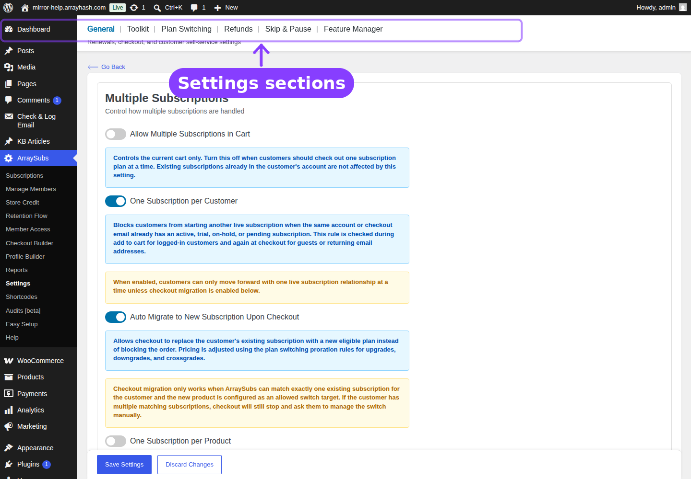

# Info
- Module: Settings
- Availability: Shared
- Last updated: 2026-04-01

# Settings

> Central configuration for subscription behavior, checkout rules, customer portal, renewal timing, and site administration tools.

## Overview

The **Settings** area in ArraySubs is split into two pages that control fundamentally different concerns:

| Page | What it covers | Navigation path |
|------|----------------|-----------------|
| **General Settings** | Subscription cart rules, checkout and trial behavior, button text, grace periods, email reminder timing, customer portal, customer self-service actions, cancellation timing, and automatic-payment controls | **ArraySubs → Settings → General** |
| **Toolkit Settings** | Field-by-field configuration for the dedicated Toolkit modules: admin bar visibility, wp-admin access restrictions, WordPress login page hiding, admin impersonation, and multi-login prevention | **ArraySubs → Settings → Toolkit** |

Other settings pages (Plan Switching, Refunds, Skip & Pause, Feature Manager, and Gateway Health) are documented inside their owning module topics — they are not part of the General or Toolkit screens.

## Guides

- [General Settings](general-settings.md) — Every setting on the General page, explained with defaults, options, and practical guidance.
- [Toolkit Settings](toolkit-settings.md) — Admin-facing security and convenience tools for controlling dashboard access, login flows, and session limits.
- [Toolkit Module](../toolkit/README.md) — Dedicated guide group for each Toolkit tool.

## Page Navigation

- **Current guide:** Settings
- **Where to open it:** WordPress Admin -> ArraySubs -> Settings
- **Section overview:** [Open overview](../README.md)
- **Previous guide:** [general-settings](./general-settings.md)
- **Next guide:** [toolkit-settings](./toolkit-settings.md)
- **Troubleshooting:** [Audits, Logs, and Troubleshooting](../audits-and-logs/README.md)

