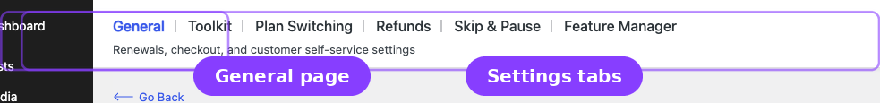
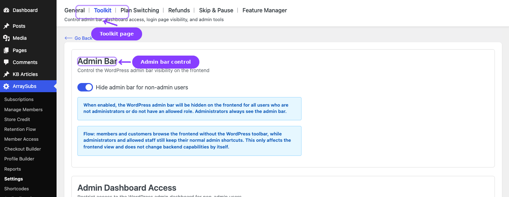

# Info
- Module: Settings
- Availability: Shared
- Last updated: 2026-06-27

# Settings

> Central configuration for subscription behavior, checkout rules, customer portal, renewal timing, and site administration tools.

## Overview

The **Settings** area in ArraySubs is organized into the main General and Toolkit pages plus module-specific settings tabs. Use General for shared subscription behavior, Toolkit for admin/security utilities, and the module tabs when a feature has its own dedicated settings screen.

| Page | What it covers | Navigation path |
|------|----------------|-----------------|
| **General Settings** | Subscription cart rules, checkout and trial behavior, button text, grace periods, email reminder timing, customer portal, customer self-service actions, cancellation timing, and automatic-payment controls | **ArraySubs → Settings → General** |
| **Toolkit Settings** | Field-by-field configuration for the dedicated Toolkit modules: admin bar visibility, wp-admin access restrictions, WordPress login page hiding, and admin impersonation | **ArraySubs → Settings → Toolkit** |
| **Plan Switching** | Upgrade, downgrade, and switching behavior for subscription products | **ArraySubs → Settings → Plan Switching** |
| **Refunds** | Refund policy, gateway refund routing, prorated refunds, and minimum refund settings | **ArraySubs → Settings → Refunds** |
| **Skip & Pause** | Customer skip-renewal and pause behavior | **ArraySubs → Settings → Skip & Pause** |
| **Feature Manager** | Feature entitlement and usage-limit configuration | **ArraySubs → Settings → Feature Manager** |

The module-specific settings pages are documented in their owning feature topics. This section focuses on the General and Toolkit guides and links out to those feature guides when needed.

## Guides

- [General Settings](general-settings.md) — Every setting on the General page, explained with defaults, options, and practical guidance.
- [Toolkit Settings](toolkit-settings.md) — Admin-facing security and convenience tools for controlling dashboard access, login flows, and session limits.
- [Admin Bar Visibility](../admin-bar-visibility/README.md) — Hide the WordPress frontend toolbar for customers.
- [Admin Dashboard Access](../admin-dashboard-access/README.md) — Redirect unauthorized users away from `/wp-admin`.
- [WordPress Login Page](../wordpress-login-page/README.md) — Route customer login traffic through WooCommerce My Account.
- [Login as User](../login-as-user/README.md) — Impersonate customers for support and verification.
- [Member Access — Multi-Login Prevention](../member-access/multi-login-prevention.md) *(Pro)* — Limit concurrent sessions per account from Member Access -> Login Limit.

## Page Navigation

- **Current guide:** Settings
- **Where to open it:** WordPress Admin -> ArraySubs -> Settings
- **Section overview:** [Open overview](../README.md)
- **Previous guide:** [general-settings](./general-settings.md)
- **Next guide:** [toolkit-settings](./toolkit-settings.md)
- **Troubleshooting:** [Audits, Logs, and Troubleshooting](../audits-and-logs/README.md)
