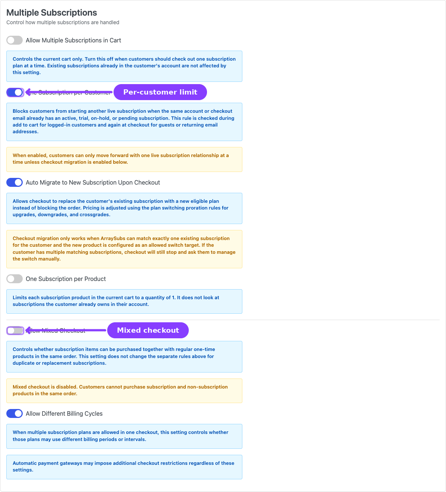
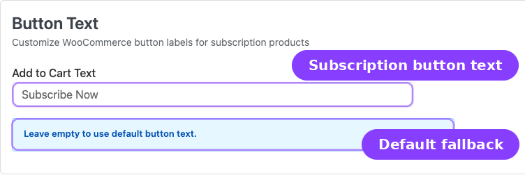
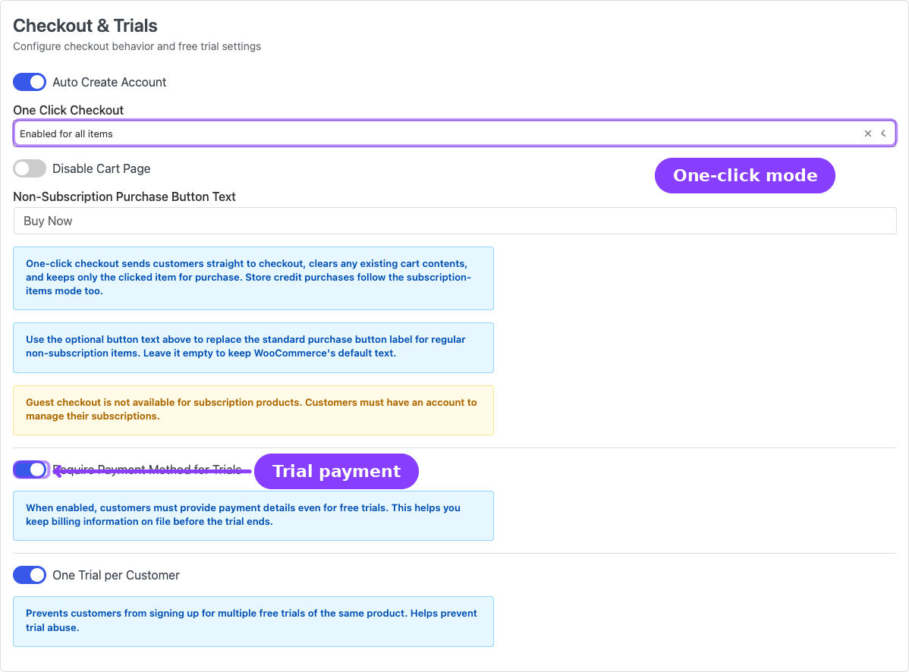
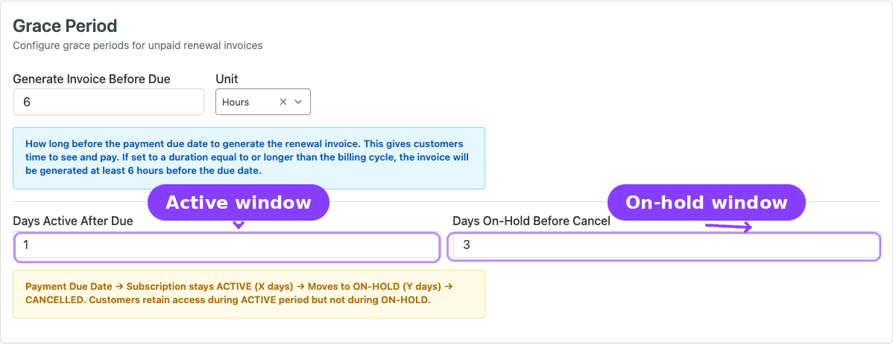
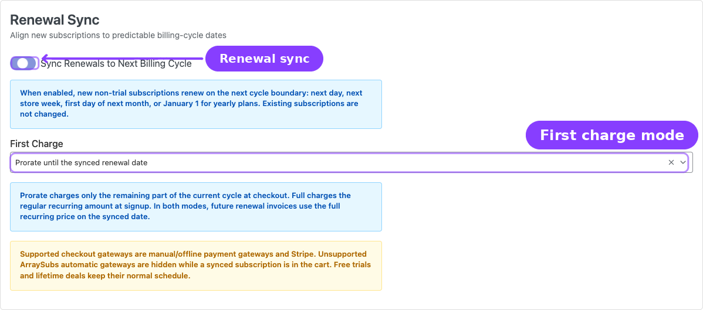
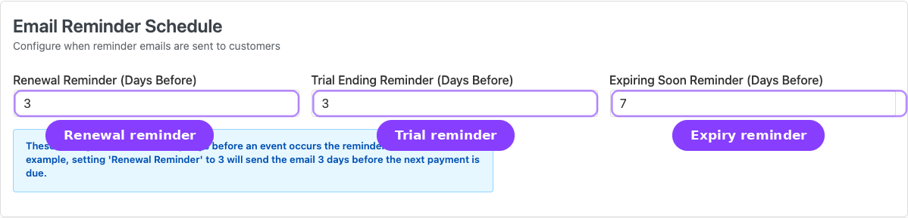
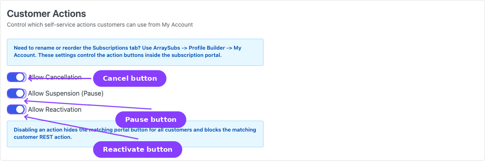
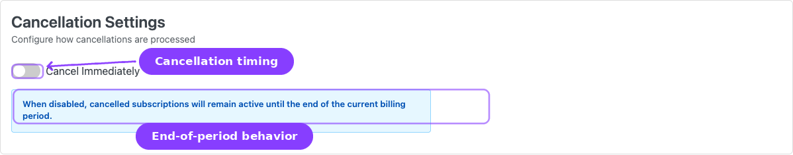
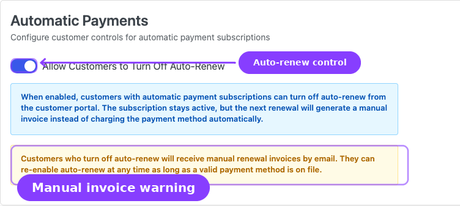

# Info
- Module: General Settings
- Availability: Shared (one section requires Pro)
- Last updated: 2026-06-03

# General Settings

> Configure subscription cart rules, checkout behavior, free trials, renewal sync, grace periods, email reminder timing, customer self-service actions, cancellation timing, and automatic-payment controls — all from a single page.

**Availability:** Free (the Automatic Payments section requires **Pro**)

## Page Navigation

- **Admin screen:** WordPress Admin → **ArraySubs → Settings → General**
- **Direct admin route:** `/wp-admin/admin.php?page=arraysubs-mainadmin#/settings/general`
- **Related setup page:** [Easy Setup Wizard](../getting-started/easy-setup-wizard.md)
- **Related product setup:** [Create and Configure Subscription Products](../subscription-products/create-and-configure.md)
- **Related checkout guide:** [Subscription Checkout](../checkout-and-payments/subscription-checkout.md)
- **Related renewal guide:** [Renewal Operations](../billing-and-renewals/renewal-operations.md)

## Overview


The General Settings page is the first place to visit after installing ArraySubs. It collects the store-wide rules that shape how subscriptions behave during checkout, renewal, and day-to-day management.

Navigate to **ArraySubs → Settings → General** to open the page. Every change takes effect after you click **Save Settings**. You can click **Discard Changes** at any time to revert unsaved edits.

The settings tabs at the top let you move from store-wide behavior into more specialized areas such as Toolkit, Plan Switching, Refunds, Skip & Pause, and Feature Manager. The fixed action bar at the bottom stays visible while you scroll, so save only after reviewing every changed section.

## When to Use This

- You are setting up ArraySubs for the first time and need to review the defaults.
- You want to change how many subscriptions a customer can buy at once.
- You want new subscriptions to renew on predictable calendar billing dates.
- You want to adjust grace period timing before unpaid subscriptions are cancelled.
- You need to enable or disable customer self-service actions like cancellation, pause, or reactivation.
- You are fine-tuning trial rules or checkout behavior.

## How It Works

General Settings are stored as a single configuration object. When you save, every section on the page is persisted together. The system merges your saved values with built-in defaults, so any setting you have not explicitly changed keeps its default behavior.

Settings apply **store-wide** — they affect all subscription products, all customers, and all future subscription actions unless a more specific per-product or per-subscription override exists.

---

## Multiple Subscriptions



This section controls how many subscriptions a single customer can hold and how subscription items interact with the rest of the cart during checkout.

### Allow Multiple Subscriptions in Cart

| | |
|---|---|
| **Type:** Toggle (on/off) | **Default:** On |

Controls whether a customer can add more than one subscription product to the cart at the same time. This affects the current cart only — it does not limit how many subscriptions a customer already owns in their account.

Turn this **off** when customers should check out one subscription plan at a time.

### One Subscription Per Customer

| | |
|---|---|
| **Type:** Toggle (on/off) | **Default:** Off |

When enabled, a customer who already has an active, trial, on-hold, or pending subscription is blocked from purchasing another one. The check runs at add-to-cart for logged-in users and again at checkout for guests or returning email addresses.

```box class="info-box"
When enabled, customers can only move forward with one live subscription relationship at a time — unless Auto Migrate is also enabled (see below).
```

### Auto Migrate to New Subscription Upon Checkout

| | |
|---|---|
| **Type:** Toggle (on/off) | **Default:** Off |
| **Visible when:** One Subscription Per Customer is **on** | |

Instead of blocking checkout, this option lets the system replace the customer's existing subscription with the new plan they are purchasing. Pricing is adjusted using the plan switching proration rules for upgrades, downgrades, and crossgrades.

```box class="warning-box"
Checkout migration only works when ArraySubs can match **exactly one** existing subscription for the customer and the new product is configured as an allowed switch target. If the customer has multiple matching subscriptions, checkout will stop and ask them to manage the switch manually.
```

### One Subscription Per Product

| | |
|---|---|
| **Type:** Toggle (on/off) | **Default:** Off |

Limits each subscription product in the current cart to a quantity of one. A customer can still buy different subscription plans in the same order, but each plan can only appear once. This does not look at subscriptions the customer already owns.

### Allow Mixed Checkout

| | |
|---|---|
| **Type:** Toggle (on/off) | **Default:** On |

Controls whether subscription items can be purchased together with regular one-time products in the same order. Turning this off forces separate checkouts for subscription and non-subscription items.

```box class="warning-box"
When mixed checkout is disabled, customers cannot purchase subscription and non-subscription products in the same order.
```

### Allow Different Billing Cycles

| | |
|---|---|
| **Type:** Toggle (on/off) | **Default:** On |

When multiple subscription plans are allowed in one checkout, this controls whether those plans may use different billing periods or intervals (for example, one monthly and one yearly plan in the same cart).

```box class="info-box"
Automatic payment gateways may impose additional checkout restrictions regardless of these settings.
```

---

## Button Text



### Add to Cart Text

| | |
|---|---|
| **Type:** Text field | **Default:** Empty (uses "Subscribe Now") |

Overrides the add-to-cart button label on subscription product pages. Leave empty to keep the default text.

---

## Checkout & Trials



This section combines checkout flow behavior and free trial rules.

### Auto Create Account

| | |
|---|---|
| **Type:** Toggle (on/off) | **Default:** On |

Automatically creates a WordPress/WooCommerce customer account when a guest purchases a subscription product. Subscriptions always require an account, so this setting avoids forcing the customer to register before checkout.

```box class="warning-box"
Guest checkout is not available for subscription products. Customers must have an account to manage their subscriptions.
```

### One Click Checkout

| | |
|---|---|
| **Type:** Dropdown | **Default:** Default |

Controls whether clicking the purchase button sends customers straight to the checkout page, skipping the cart.

| Option | Behavior |
|--------|----------|
| **Default** | Standard WooCommerce add-to-cart flow; items go to the cart page first |
| **Enabled for subscription items** | Subscription product buttons go directly to checkout. Cart is cleared and only the clicked item is kept. Store credit purchases follow this mode too |
| **Enabled for all items** | All product buttons (subscription and non-subscription) go directly to checkout |

### Disable Cart Page

| | |
|---|---|
| **Type:** Toggle (on/off) | **Default:** Off |
| **Visible when:** One Click Checkout is not set to **Default** | |

When enabled alongside a one-click mode, the cart page is completely bypassed and customers land directly on the checkout page.

### Non-Subscription Purchase Button Text

| | |
|---|---|
| **Type:** Text field | **Default:** Empty (uses WooCommerce default) |
| **Visible when:** One Click Checkout is set to **Enabled for all items** | |

Replaces the standard purchase button label for regular non-subscription items. Leave it empty to keep WooCommerce's default text.

### Require Payment Method for Trials

| | |
|---|---|
| **Type:** Toggle (on/off) | **Default:** On |

When enabled, customers must provide payment details even for free trials. This keeps billing information on file so the first paid renewal can happen smoothly when the trial ends.

When disabled, customers can start trials without entering payment information. You will need to collect payment details before the trial ends.

### One Trial Per Customer

| | |
|---|---|
| **Type:** Toggle (on/off) | **Default:** On |

Prevents customers from signing up for multiple free trials of the same product. Helps prevent trial abuse by blocking repeat trial sign-ups from the same account.

---

## Grace Period



The grace period system controls what happens when a renewal payment is not received by the due date. It uses a two-phase approach: the subscription stays active for a configurable number of days, then moves to on-hold, and is finally cancelled if payment is still not received.

For a detailed walkthrough of the grace period lifecycle, see [Getting Started — Before You Launch](../getting-started/before-you-launch.md).

### Generate Invoice Before Due

| | |
|---|---|
| **Type:** Number + Unit dropdown | **Default:** 6 Hours |

How far in advance of the payment due date the renewal invoice is created. This gives customers time to see and pay the invoice before the due date arrives.

The number field accepts values from 1 to 30. The unit can be **Hours** or **Days**.

```box class="info-box"
If set to a duration equal to or longer than the billing cycle, the invoice will be generated at least 6 hours before the due date.
```

### Days Active After Due

| | |
|---|---|
| **Type:** Number | **Default:** 3 |
| **Range:** 0–30 | |

The number of days the subscription stays **Active** after the payment due date passes without payment. During this window the customer retains full access.

### Days On-Hold Before Cancel

| | |
|---|---|
| **Type:** Number | **Default:** 7 |
| **Range:** 1–60 | |

The number of days the subscription stays **On-Hold** after the active grace period ends. If payment is still missing at the end of this window, the subscription is automatically cancelled.

```box class="warning-box"
## Grace Period Timeline

Payment Due Date → Subscription stays **Active** (X days) → Moves to **On-Hold** (Y days) → **Cancelled**.

Customers retain access during the Active period but not during On-Hold. Paying the outstanding invoice at any point during either phase restores the subscription to Active.
```

---

## Renewal Sync



Renewal Sync aligns new non-trial subscriptions to predictable billing-cycle dates instead of renewing exactly one interval after checkout.

### Sync Renewals to Next Billing Cycle

| | |
|---|---|
| **Type:** Toggle (on/off) | **Default:** Off |

When enabled, new eligible subscriptions set their first full renewal date to the next billing-cycle boundary:

| Product billing period | Synced first full renewal |
|---|---|
| Daily | Next day |
| Weekly | Next store week based on the WordPress **Week Starts On** setting |
| Monthly | First day of the next month |
| Yearly | January 1 of the next year |

The synced date is stored as the subscription's **Next Payment Date**, and later renewals continue from that date using the product's normal interval.

```box class="info-box"
Example: a customer buys a $30/month subscription on the 20th of a 30-day cycle. With sync enabled and first-charge prorating, checkout charges $10 for the remaining full billing days, the first full renewal is due on the 1st of the next month, and future renewals stay on the 1st at $30.
```

### First Charge

| | |
|---|---|
| **Type:** Dropdown | **Default:** Prorate until the synced renewal date |
| **Visible when:** Sync Renewals to Next Billing Cycle is **on** | |

| Option | Behavior |
|---|---|
| **Prorate until the synced renewal date** | Checkout charges only the remaining full site-local billing days in the current cycle. Future renewals charge the full recurring amount. |
| **Charge the full recurring amount** | Checkout charges the full recurring amount immediately, but the first full renewal still lands on the synced date. |

Signup fees are still charged normally. The recurring amount stored on the subscription remains the full product price so renewal orders are not prorated.

```box class="warning-box"
Renewal Sync applies to new non-trial recurring subscription checkouts paid by manual/offline payment gateways or Stripe. Unsupported ArraySubs automatic gateways such as PayPal and Paddle are hidden while a synced subscription is in the cart. Free trials and Lifetime Deal products keep their normal schedule.
```

```box class="info-box"
If Stripe is selected and the prorated first recurring charge would be below Stripe's minimum charge for the store currency, ArraySubs raises only that first recurring line enough to satisfy Stripe. Future renewal orders still use the full recurring amount.
```

---

## Email Reminder Schedule



Controls how many days before an event the system sends reminder emails to customers. Each value sets the timing for one email type.

| Setting | Default | Range | What it sends |
|---------|---------|-------|---------------|
| **Renewal Reminder (Days Before)** | 3 | 1–30 | Reminder that a renewal payment is coming |
| **Trial Ending Reminder (Days Before)** | 3 | 1–30 | Heads-up that the free trial is about to end |
| **Expiring Soon Reminder (Days Before)** | 7 | 1–60 | Notice that a fixed-length subscription is approaching its end date |

```box class="info-box"
For example, setting Renewal Reminder to `3` will send the email 3 days before the next payment is due. Individual email templates can be enabled or disabled separately in WooCommerce email settings; see [Emails and Notifications](../emails/README.md) for the complete email reference.
```

---

## Customer Actions



Controls which self-service action buttons appear on the customer's subscription management page in their account area.

```box class="info-box"
Need to rename or reorder the **Subscriptions** tab in WooCommerce My Account? Use **ArraySubs → Profile Builder → My Account**. General Settings now controls the cancellation, pause, and reactivation buttons inside the portal, not the navigation label or menu order. Payment-method update links are handled by compatible automatic payment gateways instead of a toggle on this page.
```

| Setting | Default | What it controls |
|---------|---------|------------------|
| **Allow Cancellation** | On | Shows or hides the **Cancel Subscription** button |
| **Allow Suspension (Pause)** | Off | Shows or hides the **Pause** button |
| **Allow Reactivation** | On | Shows or hides the **Reactivate** button for cancelled subscriptions |

```box class="info-box"
These settings control which action buttons appear on the customer's subscription management page. Disabling an action here hides the button for all customers on all subscriptions. Payment-method update links, when available, come from the active automatic gateway flow rather than a General Settings switch.
```

---

## Cancellation Settings



### Cancel Immediately

| | |
|---|---|
| **Type:** Toggle (on/off) | **Default:** On |

When **on**, cancelling a subscription takes effect immediately — the subscription status changes to Cancelled right away.

When **off**, cancelled subscriptions remain active until the end of the current billing period. The customer keeps access until the paid-through date, at which point the subscription transitions to Cancelled automatically.

```box class="info-box"
End-of-period cancellation is sometimes called "scheduled cancellation." Customers can undo a scheduled cancellation before the period ends by clicking **Undo Cancellation** on the subscription detail page.
```

---

## Automatic Payments **Pro**



This section is relevant when the **ArraySubs Pro** plugin is active and at least one automatic payment gateway (Stripe, PayPal, or Paddle) is configured.

### Allow Customers to Turn Off Auto-Renew

| | |
|---|---|
| **Type:** Toggle (on/off) | **Default:** Off |

When enabled, customers whose subscriptions are billed through an automatic payment gateway can turn off auto-renew from the customer portal. The subscription stays active, but the next renewal generates a manual invoice instead of charging the payment method automatically.

```box class="warning-box"
Customers who turn off auto-renew will receive manual renewal invoices by email. They can re-enable auto-renew at any time as long as a valid payment method is on file.
```

---

## Settings Reference

| Setting | Default | Type | Section |
|---------|---------|------|---------|
| Allow Multiple Subscriptions in Cart | On | Toggle | Multiple Subscriptions |
| One Subscription Per Customer | Off | Toggle | Multiple Subscriptions |
| Auto Migrate to New Subscription | Off | Toggle | Multiple Subscriptions |
| One Subscription Per Product | Off | Toggle | Multiple Subscriptions |
| Allow Mixed Checkout | On | Toggle | Multiple Subscriptions |
| Allow Different Billing Cycles | On | Toggle | Multiple Subscriptions |
| Add to Cart Text | Empty | Text | Button Text |
| Auto Create Account | On | Toggle | Checkout & Trials |
| One Click Checkout | Default | Dropdown | Checkout & Trials |
| Disable Cart Page | Off | Toggle | Checkout & Trials |
| Non-Subscription Purchase Button Text | Empty | Text | Checkout & Trials |
| Require Payment Method for Trials | On | Toggle | Checkout & Trials |
| One Trial Per Customer | On | Toggle | Checkout & Trials |
| Generate Invoice Before Due | 6 Hours | Number + Dropdown | Grace Period |
| Days Active After Due | 3 | Number | Grace Period |
| Days On-Hold Before Cancel | 7 | Number | Grace Period |
| Renewal Reminder (Days Before) | 3 | Number | Email Reminder Schedule |
| Trial Ending Reminder (Days Before) | 3 | Number | Email Reminder Schedule |
| Expiring Soon Reminder (Days Before) | 7 | Number | Email Reminder Schedule |
| Allow Cancellation | On | Toggle | Customer Actions |
| Allow Suspension (Pause) | Off | Toggle | Customer Actions |
| Allow Reactivation | On | Toggle | Customer Actions |
| Cancel Immediately | On | Toggle | Cancellation Settings |
| Allow Customers to Turn Off Auto-Renew | Off | Toggle | Automatic Payments *(Pro)* |

---

## Real-Life Use Cases

### Use Case 1: Single-Plan Membership Site

A coaching platform sells one membership plan at a time. The merchant enables **One Subscription Per Customer** and **Auto Migrate** so that when a member wants to upgrade, they simply purchase the higher-tier plan and checkout automatically replaces the old subscription.

### Use Case 2: Subscription Box with Generous Grace Period

A subscription box store wants to give customers plenty of time to resolve payment issues. They set **Days Active After Due** to `5` and **Days On-Hold Before Cancel** to `14`, giving a total 19-day window before automatic cancellation.

---

## Edge Cases / Important Notes

- **Auto Migrate requires exactly one match.** If a customer has multiple active subscriptions and tries to purchase a new plan, checkout migration will not kick in. The customer must manage the switch manually.
- **Guest checkout is never available for subscriptions.** Even when WooCommerce allows guest checkout, subscription purchases always require an account.
- **Disabling "Allow Cancellation" hides the button but does not remove admin's ability** to cancel subscriptions from the admin panel.
- **Grace period changes apply to future renewals only.** Subscriptions already in a grace phase use the timing values that were active when their grace period started.
- **Auto-renew toggle (Pro) does not cancel the subscription.** It only switches future renewals from automatic to manual invoice mode. The subscription remains active.

---

## Troubleshooting

| Problem | Likely Cause | What to Do |
|---------|-------------|------------|
| Customer cannot add a second subscription to the cart | **Allow Multiple Subscriptions in Cart** is off, or **One Subscription Per Customer** is on | Check both settings and adjust to match your store policy |
| Checkout blocks a returning customer | **One Subscription Per Customer** is on and the customer already has an active subscription | Enable **Auto Migrate** to allow automatic plan switching, or disable the per-customer limit |
| Subscription cancelled too quickly after missed payment | Grace period values are too short | Increase **Days Active After Due** and **Days On-Hold Before Cancel** |
| Renewal invoices arrive too late for customers to pay | **Generate Invoice Before Due** is set too low | Increase the advance notice window (e.g., from 6 hours to 2 days) |
| Customer cannot cancel from their account | **Allow Cancellation** is turned off | Re-enable it in Customer Actions |

---

## Related Guides

- [Toolkit Settings](toolkit-settings.md) — Admin bar, wp-admin access, login page, and multi-login controls.
- [My Account Editor](../profile-builder/my-account-editor.md) — Rename, reorder, and manage the Subscriptions tab in WooCommerce My Account.
- [Customer Portal](../customer-portal/README.md) — What customers see and can do in their account area, driven by the settings on this page.
- [Getting Started — First-Time Setup](../getting-started/first-time-setup.md) — Quick walkthrough of settings to review during initial setup.
- [Getting Started — Before You Launch](../getting-started/before-you-launch.md) — Grace period lifecycle and subscription status reference.
- [Advanced Analytics](../analytics/subscription-performance.md) *(Pro)* — How grace periods and renewal timing affect churn rate and revenue-at-risk metrics.

---

## FAQ

### Do General Settings apply to all subscription products?
Yes. These settings are store-wide defaults. Individual product configurations (like trial length or billing period) are set on the product edit screen, but cart rules, checkout behavior, grace periods, and customer actions are global.

### What happens if I change the grace period while subscriptions are in a grace phase?
Subscriptions already in a grace phase keep the values that were active when the phase started. New grace periods triggered after the change will use the updated values.

### Can I allow cancellation for some products but not others?
Not from this screen. The Customer Actions toggles apply globally to all subscription products. Per-product or per-plan action controls would need to be managed through the Retention Flow or conditional hooks.

### Does the "One Click Checkout" setting clear the customer's existing cart?
Yes. When a one-click mode is active, clicking the purchase button clears any existing cart items and adds only the clicked product before redirecting to checkout.

### Where do I rename or reorder the Subscriptions tab?
Use **ArraySubs → Profile Builder → My Account**. The My Account Editor is the built-in place to rename the **Subscriptions** menu item, move it higher or lower in the WooCommerce My Account sidebar, or hide/show other account tabs.

### Can customers re-enable auto-renew after turning it off?
Yes. Customers can toggle auto-renew back on at any time from the customer portal, as long as a valid payment method is still on file for the subscription.
